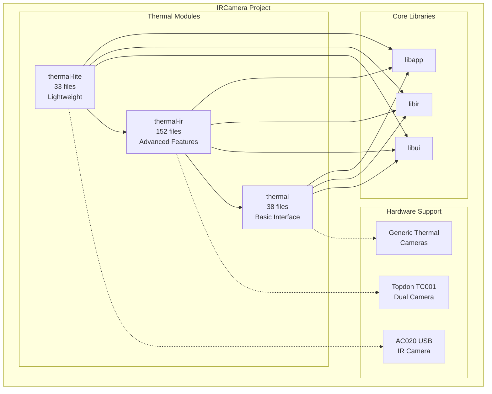
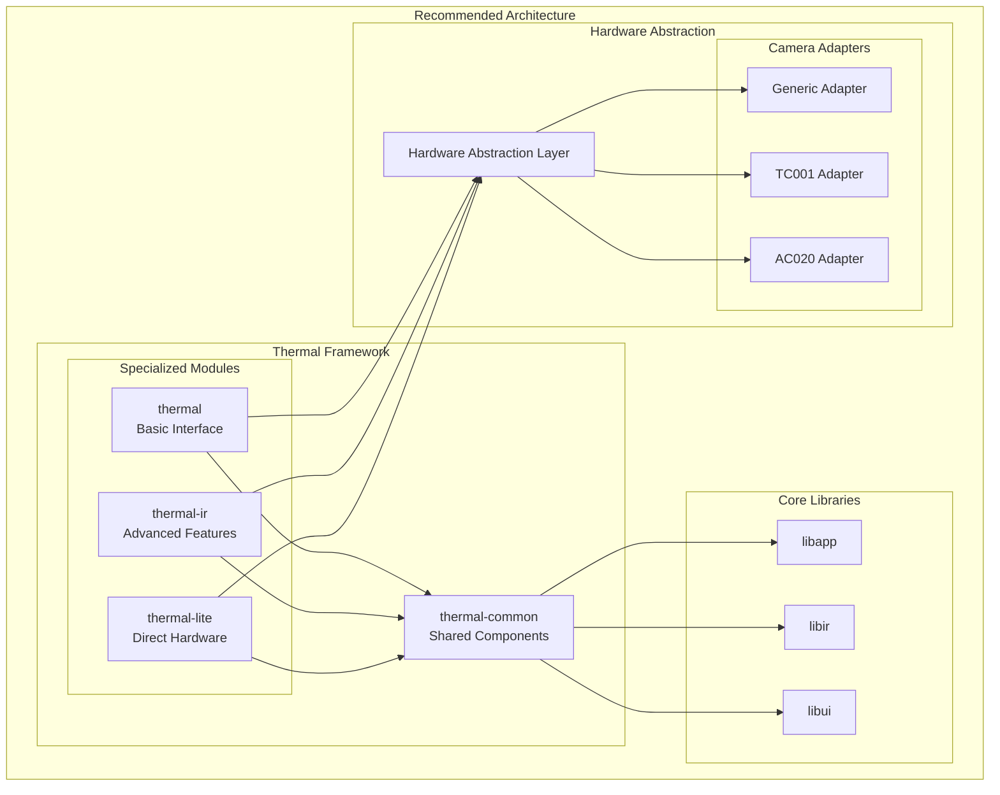
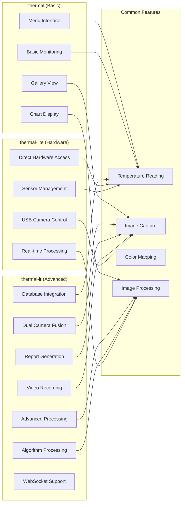
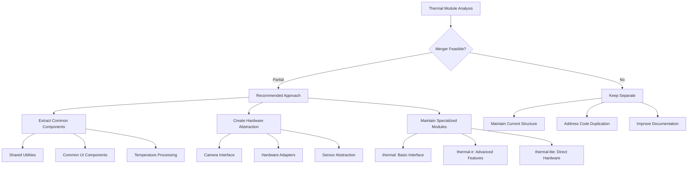
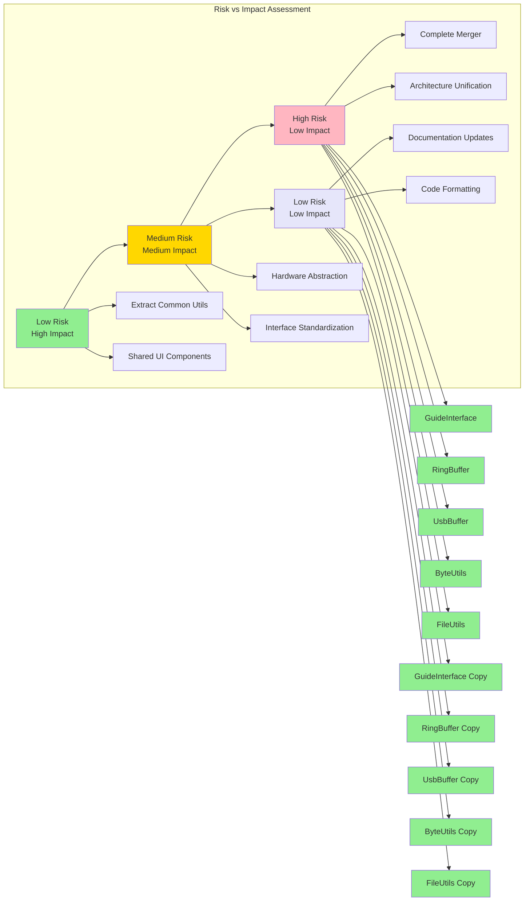

# Mermaid Diagrams - IRCamera Architecture

## Current Thermal Module Architecture



## Proposed Thermal Module Consolidation



## Thermal Module Functionality Comparison



## Merger Feasibility Assessment



## Component Dependency Flow

## Code Quality Improvements Flow

```mermaid
graph TD
    A[Kotlin Compilation Warnings] --> B[Type Safety Issues]
    A --> C[Null Safety Issues] 
    A --> D[Experimental API Usage]
    subgraph "Application Layer"
        APP[Main Application]
    end
    
    subgraph "Module Layer"
        T[thermal]
        TIR[thermal-ir]  
        TL[thermal-lite]
    end
    
    subgraph "Common Layer" 
        TC[thermal-common<br/>Proposed]
        
        subgraph "Shared Components"
            AU[ArrayUtils]
            TP[Temperature Processing]  
            CM[Color Mapping]
            IP[Image Processing]
        end
    end
    
    subgraph "Hardware Layer"
        HAL[Hardware Abstraction Layer<br/>Proposed]
        
        subgraph "Device Drivers"
            GD[Generic Driver]
            TD[TC001 Driver]
            AD[AC020 Driver]
        end
    end
    
    subgraph "Core Infrastructure"
        LA[libapp]
        LI[libir]
        LU[libui]
    end
    
    APP --> T
    APP --> TIR
    APP --> TL
    
    B --> E[GuideInterface.kt<br/>String? -> String]
    C --> F[RingBuffer.kt<br/>ByteArray? null checks]
    C --> G[UsbBuffer.kt<br/>Remove redundant checks]
    C --> H[FileUtils.kt<br/>Array<File>? safety]
    D --> I[ByteUtils.kt<br/>@OptIn annotation]
    T --> TC
    TIR --> TC
    TL --> TC
    
    E --> J[Fixed with !!]
    F --> K[Added null guard]
    G --> L[Removed always true/false]
    H --> M[Added null check]
    I --> N[Added @OptIn]
    TC --> AU
    TC --> TP
    TC --> CM
    TC --> IP
    
    J --> O[Zero Warnings]
    K --> O
    L --> O
    M --> O
    N --> O
    T --> HAL
    TIR --> HAL
    TL --> HAL
    
    O --> P[Successful Build]
    HAL --> GD
    HAL --> TD
    HAL --> AD
    
    TC --> LA
    TC --> LI
    TC --> LU
```

## Architecture Overview & Risk Assessment Matrix

