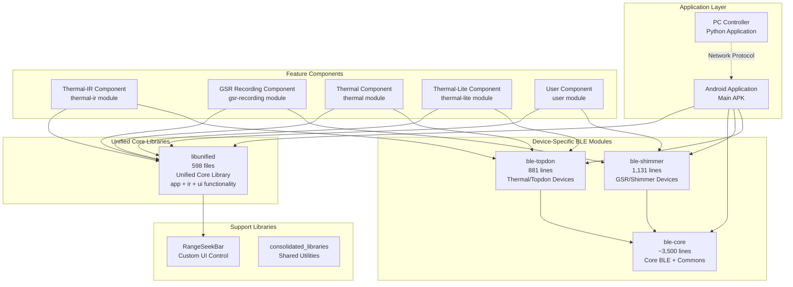
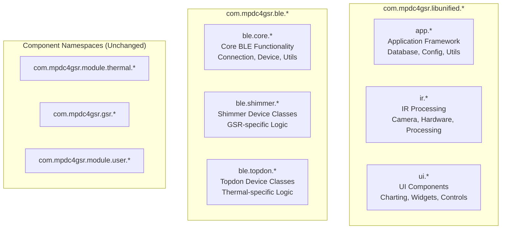
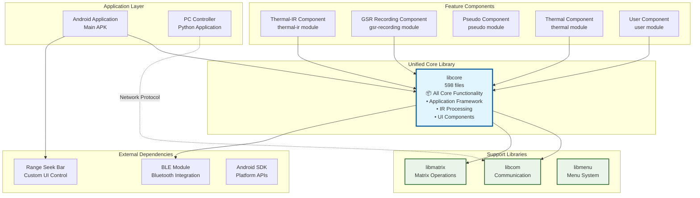
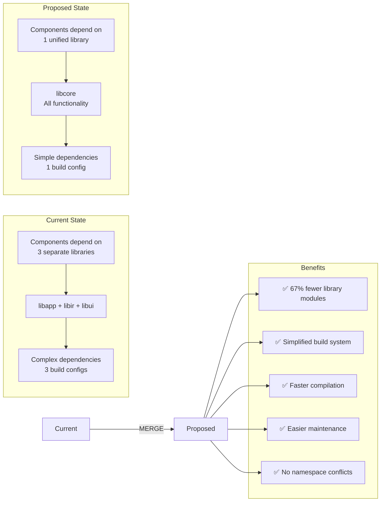
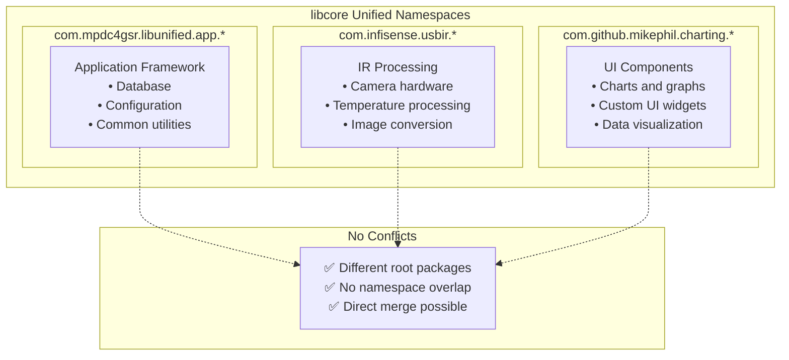
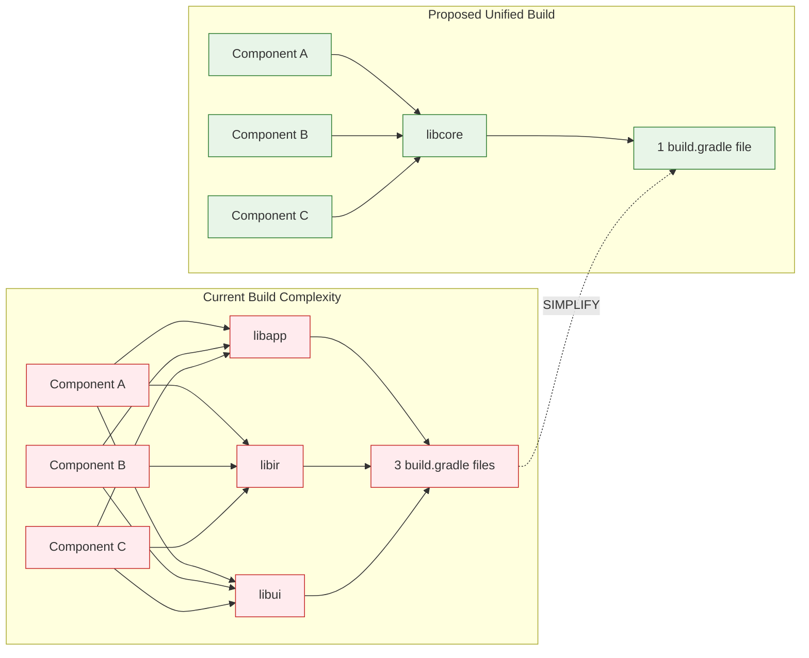
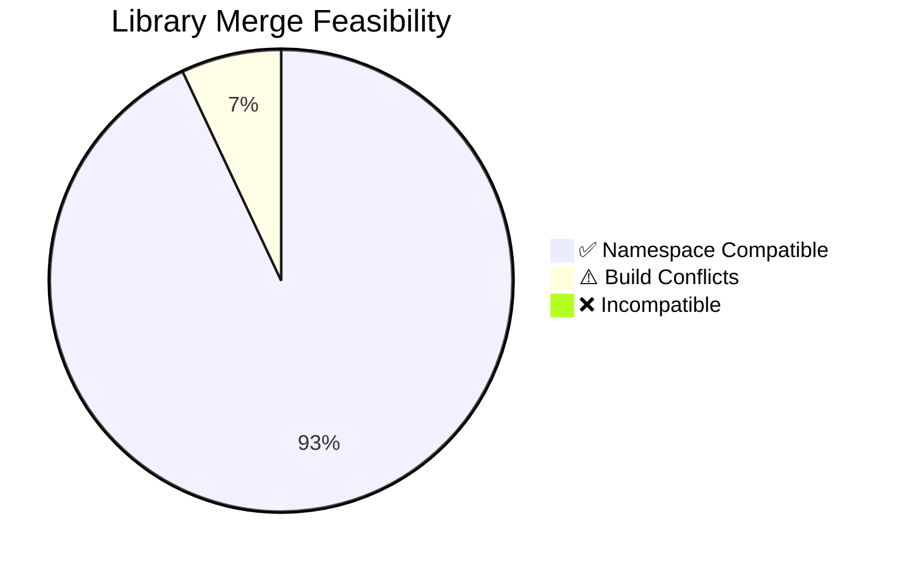

# IRCamera Architecture Diagrams

## Implemented Unified Architecture (Current State)

### Unified Library Structure + Device-Specific BLE Modules



### Namespace Structure (Implemented)


```

## Proposed Unified Architecture

### Single Unified Library Structure



## Library Unification Benefits Diagram



## Migration Phases Diagram

```mermaid
gantt
    title Library Unification Migration Plan
    dateFormat X
    axisFormat %s
    
    section Phase 1: Foundation
    Create working libcore           :p1, 0, 2
    Resolve build conflicts          :p2, 1, 2
    Test basic functionality         :p3, 2, 1
    
    section Phase 2: Component Migration
    Migrate thermal-lite (pilot)     :p4, 3, 2
    Migrate thermal component        :p5, 4, 2
    Migrate thermal-ir component     :p6, 5, 2
    Migrate gsr-recording            :p7, 6, 2
    Migrate user component           :p8, 7, 2
    Update main app                  :p9, 8, 2
    
    section Phase 3: Cleanup
    Remove old libraries             :p10, 9, 1
    Update build configs             :p11, 10, 1
    Verify functionality             :p12, 11, 1
    
    section Phase 4: Documentation
    Update architecture docs         :p13, 12, 1
    Update API reference             :p14, 12, 1
    Update diagrams                  :p15, 12, 1
```



## Namespace Organization Diagram



## Build System Comparison



## Implementation Status

### Feasibility Analysis Results



### File Distribution in Unified Library


## Current Status: READY FOR IMPLEMENTATION

The analysis confirms that merging libapp, libir, and libui into a unified libcore is **technically feasible** and **highly beneficial** for the project architecture.