# IRCamera Architecture Diagrams

## Current Timestamp Synchronization System (2024-12-23)

### Unified Timestamp Architecture

```mermaid
graph TB
    subgraph "Unified Timestamp System"
        subgraph "Core Timestamp Management"
            TimestampManager[TimestampManager<br/>✅ getCurrentTimestampNanos()<br/>✅ convertMonotonicToWallClock()<br/>✅ startSession()]
            
            TimeSyncService[TimeSynchronizationService<br/>✅ logSyncEvent()<br/>✅ logTimestampWithDriftAnalysis()<br/>✅ SessionStart events]
        end
        
        subgraph "Sensor Timestamp Sources - UNIFIED"
            RGBCamera[RGB Camera Recorder<br/>✅ TimestampManager.getCurrentTimestampNanos()<br/>✅ SessionSync marker logged<br/>⚠️ Previously: System.nanoTime()]
            
            ThermalRecorder[Thermal Recorder<br/>✅ TimestampManager.getCurrentTimestampNanos()<br/>✅ SessionSync marker logged<br/>⚠️ Previously: System.nanoTime()]
            
            GSRRecorder[GSR Sensor Recorder<br/>✅ TimestampManager.getCurrentTimestampNanos()<br/>✅ Unified timestamp system<br/>⚠️ Previously: System.nanoTime()]
        end
        
        subgraph "Cross-Device Synchronization"
            PCSync[PC-Phone NTP Handshake<br/>✅ Enhanced quality reporting<br/>✅ Drift monitoring<br/>✅ Network latency logging]
            
            TimeManager[TimeManager<br/>✅ synchronizeWithPC()<br/>✅ logSyncQualityInfo()<br/>✅ Drift analysis]
        end
    end
    
    subgraph "SessionSync Event Flow"
        SessionStart[Session Start] --> SessionSyncEvents[SessionSync Events Generated]
        SessionSyncEvents --> RGBSync[RGB_RECORDING_START]
        SessionSyncEvents --> ThermalSync[THERMAL_RECORDING_START] 
        SessionSyncEvents --> GSRSync[GSR_RECORDING_START]
        
        RGBSync --> AlignmentVerification[Post-hoc Alignment Verification<br/>Within 5ms tolerance]
        ThermalSync --> AlignmentVerification
        GSRSync --> AlignmentVerification
    end
    
    subgraph "Verification Tools"
        TestActivity[TimestampSyncVerificationActivity<br/>✅ Sharp event simulation (hand clap)<br/>✅ Multi-modal alignment testing<br/>✅ 5ms tolerance validation]
    end
    
    TimestampManager --> RGBCamera
    TimestampManager --> ThermalRecorder
    TimestampManager --> GSRRecorder
    
    TimeSyncService --> SessionSyncEvents
    TimeManager --> PCSync
    
    TestActivity --> AlignmentVerification
    
    classDef unified fill:#e8f5e8,stroke:#2e7d32,stroke-width:3px
    classDef fixed fill:#e1f5fe,stroke:#01579b,stroke-width:2px
    classDef warning fill:#fff3e0,stroke:#ef6c00,stroke-width:2px
    classDef verification fill:#f3e5f5,stroke:#7b1fa2,stroke-width:2px
    
    class TimestampManager,TimeSyncService unified
    class RGBCamera,ThermalRecorder,GSRRecorder,PCSync,TimeManager fixed
    class TestActivity,AlignmentVerification verification
```

### Timestamp Synchronization Flow

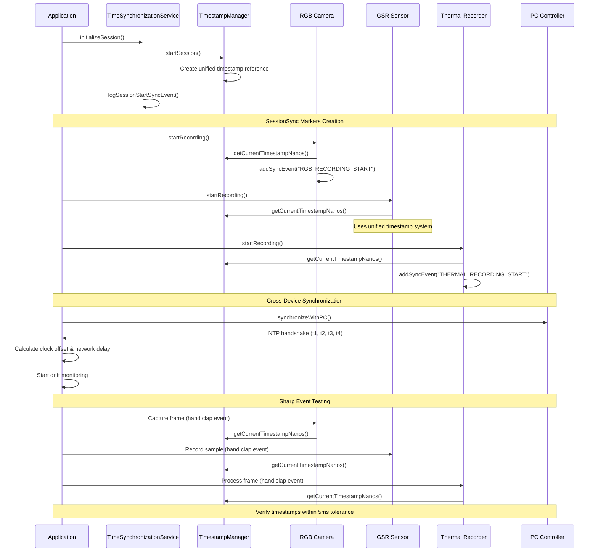

## Previous Update: Kotlin Compilation Status (2024-12-21)

### BLE Core Module Compilation Error Resolution

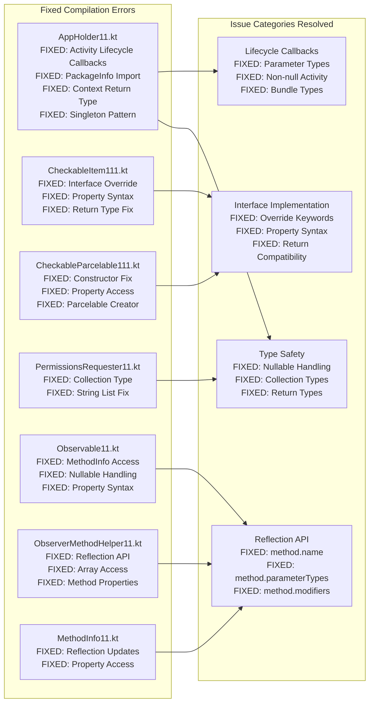

## BLE Core Module Structure (2024-12-21)

### BLE Core Callback Architecture

## BLE Core Module Interface Structure (2024-12-21)

### GenericRequest Class Hierarchy

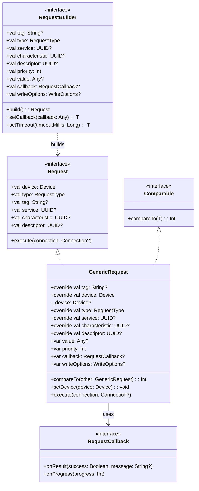

## BLE Core WriteOptions Fix (2024-12-21)

### WriteOptions Class Structure After Fix

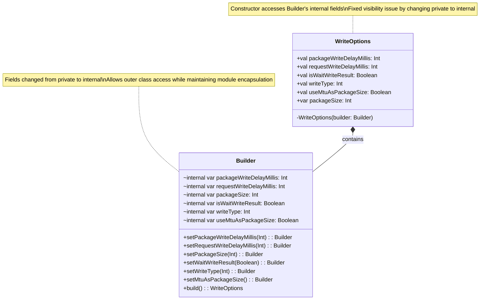

### Fix Details

- **Issue**: Private Builder fields could not be accessed from WriteOptions constructor
- **Solution**: Changed field visibility from `private var` to `internal var`
- **Impact**: Enables compilation while maintaining proper encapsulation within module
- **Files Changed**: `ble-core/src/main/java/com/mpdc4gsr/ble/core/WriteOptions.kt`

## BLE Core Module Structure (Updated 2024-12-21)

### BLE Core Module Class Dependencies

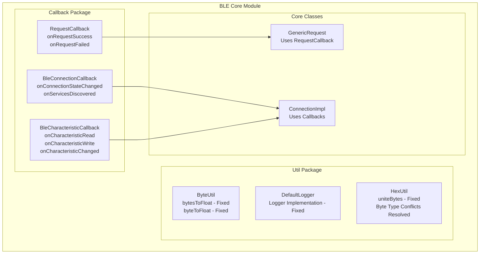


        Request[Request.kt<br/>Interface with UUID properties<br/>DONE: import java.util.UUID]
        GenericRequest[GenericRequest.kt<br/>Implements Request<br/>DONE: import java.util.UUID]
        Connection[Connection.kt<br/>BLE Connection Management<br/>DONE: import java.util.UUID]
        ConnectionImpl[ConnectionImpl.kt<br/>Connection Implementation<br/>DONE: import java.util.UUID]
        ConnectionConfig[ConnectionConfiguration.kt<br/>BLE Configuration<br/>DONE: import java.util.UUID]
    end
    
    Request --> GenericRequest
    Connection --> ConnectionImpl
    GenericRequest --> Connection
    ConnectionConfig --> Connection
```
## Current Standardized Build System (2024-12-21)

### Gradle Build System Structure

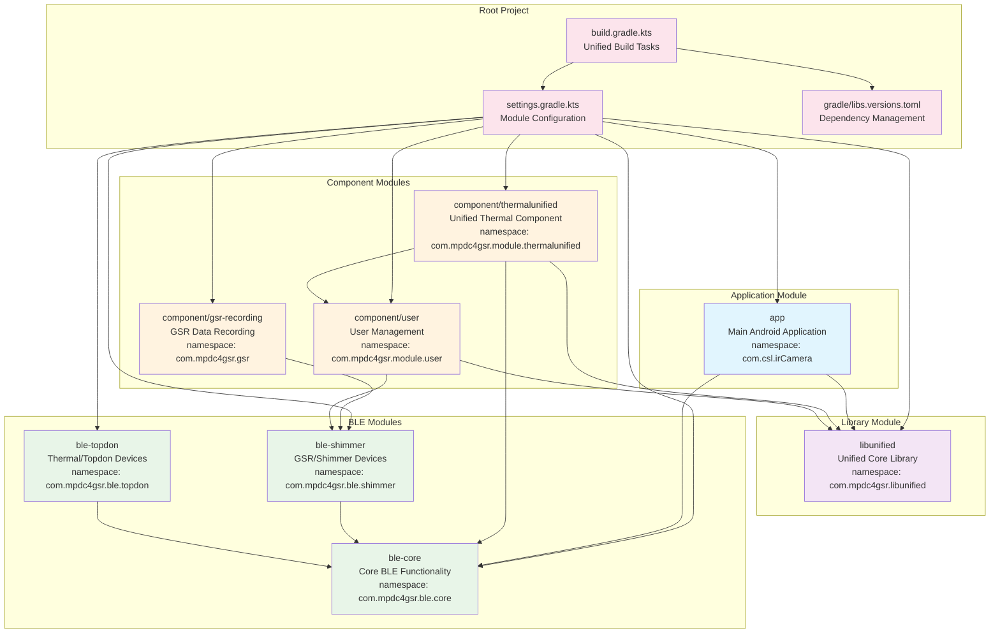

### Build Task Structure

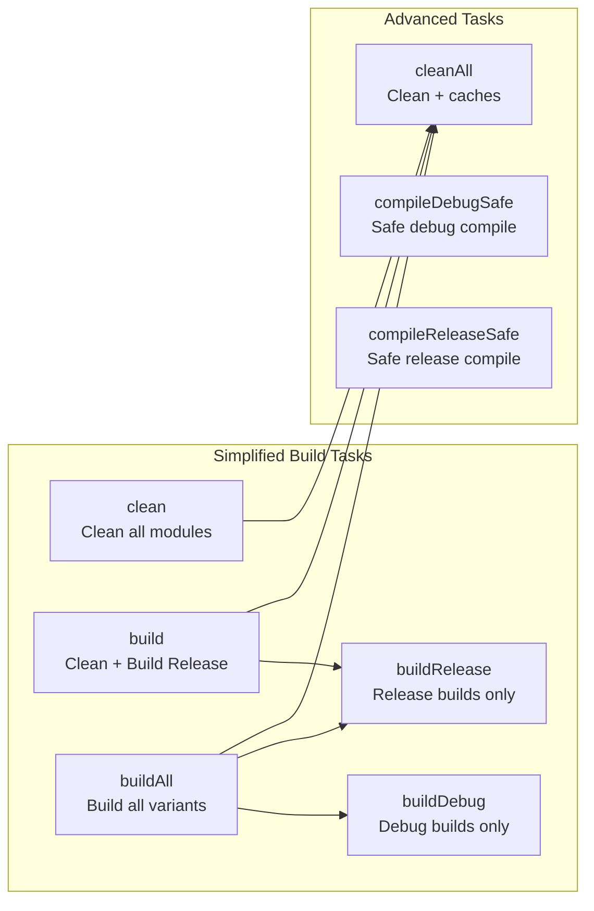

## Implemented Unified Architecture (Current State)

### Unified Library Structure + Device-Specific BLE Modules

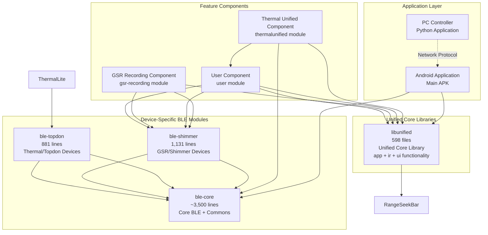

### Namespace Structure (Implemented)

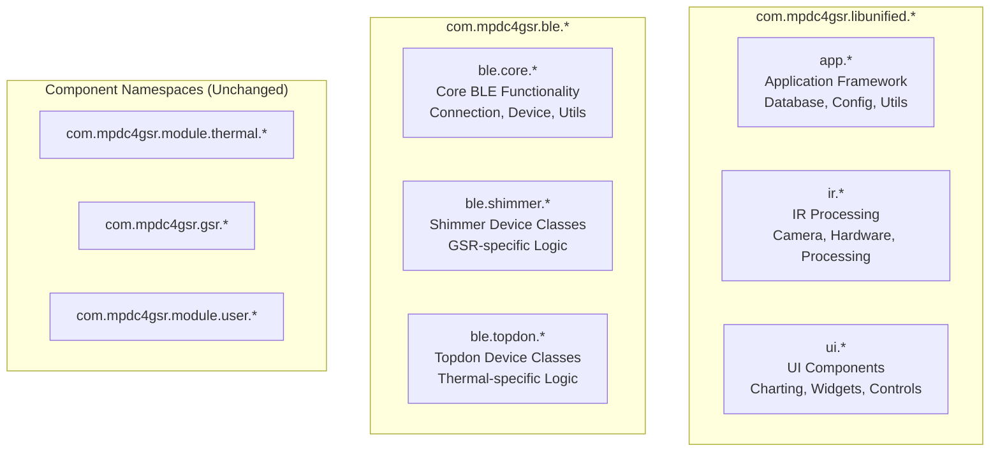

```

## Previous Architecture (Historical Reference)

### Multi-Library Structure (Before Unification)

```mermaid
graph TB
    subgraph "Application Layer"
        App[Android Application<br/>Main APK]
        PCController[PC Controller<br/>Python Application]
    end
    
    subgraph "Feature Components"
        ThermalIR[Thermal-IR Component<br/>thermal-ir module]
        GSRRecording[GSR Recording Component<br/>gsr-recording module]
        PseudoComponent[Pseudo Component<br/>pseudo module]
        ThermalComponent[Thermal Component<br/>thermal module]
        UserComponent[User Component<br/>user module]
    end
    
    subgraph "Previous Separate Libraries (DEPRECATED)"
        LibApp[libapp<br/>Application Framework]
        LibIR[libir<br/>IR Processing] 
        LibUI[libui<br/>UI Components]
    end
    
    subgraph "Support Libraries"
        LibCom[libcom<br/>Communication]
        LibMatrix[libmatrix<br/>Matrix Operations]
        LibMenu[libmenu<br/>Menu System]
    end
    
    subgraph "External Dependencies"
        BleModule[BLE Module<br/>Bluetooth Integration]
        RangeSeekBar[Range Seek Bar<br/>Custom UI Control]
        AndroidSDK[Android SDK<br/>Platform APIs]
    end
    
    %% Complex Dependencies - Multiple library dependencies
    App --> LibApp
    App --> LibUI
    App --> LibIR
    
    ThermalIR --> LibApp
    ThermalIR --> LibIR
    ThermalIR --> LibUI
    GSRRecording --> LibApp
    GSRRecording --> LibUI
    ThermalComponent --> LibApp
    ThermalComponent --> LibIR
    ThermalComponent --> LibUI
    UserComponent --> LibApp
    UserComponent --> LibUI
    
    %% Support library dependencies
    LibApp --> LibCom
    LibApp --> LibMatrix
    
    %% External dependencies
    App --> BleModule
    App --> RangeSeekBar
    
    PCController -.->|Network Protocol| LibCom
    
    %% Visual styling
    classDef deprecated fill:#ffebee,stroke:#c62828,stroke-width:2px,stroke-dasharray: 5 5
    classDef support fill:#e8f5e8,stroke:#1b5e20,stroke-width:2px
    
    class LibApp,LibIR,LibUI deprecated
    class LibCom,LibMatrix,LibMenu support
```

## Library Unification Benefits Diagram

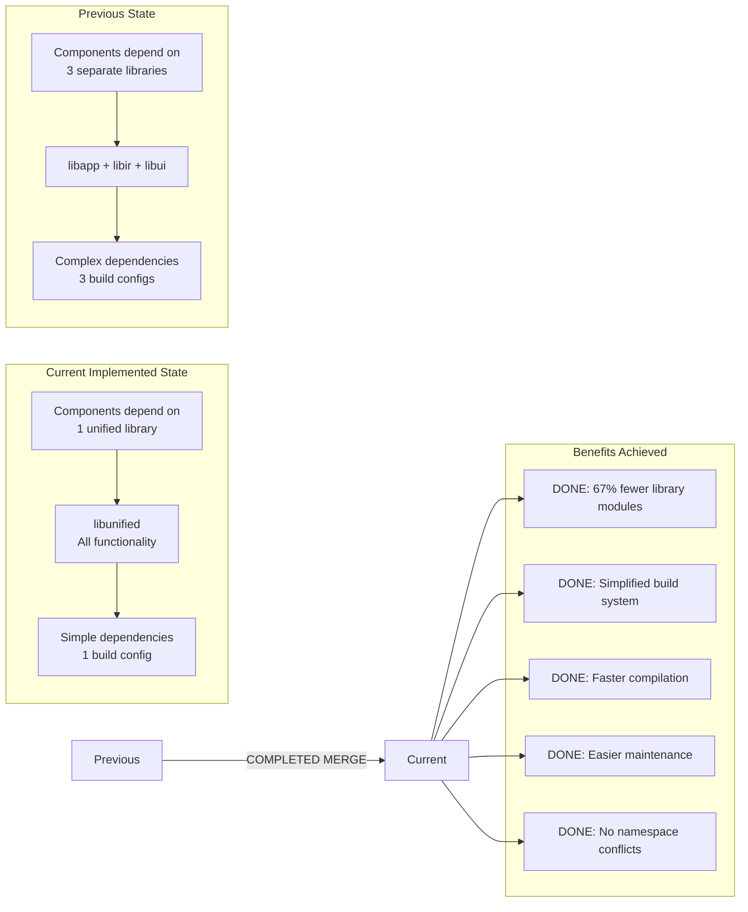

## Migration Phases Diagram

```mermaid
gantt
    title Library Unification Migration Plan (COMPLETED)
    dateFormat X
    axisFormat %s
    
    section Phase 1: Foundation (COMPLETED)
    Create working libunified        :done, p1, 0, 2
    Resolve build conflicts          :done, p2, 1, 2
    Test basic functionality         :done, p3, 2, 1
    
    section Phase 2: Component Migration (COMPLETED)
    Migrate thermal-lite (pilot)     :done, p4, 3, 2
    Migrate thermal component        :done, p5, 4, 2
    Migrate thermal-ir component     :done, p6, 5, 2
    Migrate gsr-recording            :done, p7, 6, 2
    Migrate user component           :done, p8, 7, 2
    Update main app                  :done, p9, 8, 2
    
    section Phase 3: Cleanup (COMPLETED)
    Remove old libraries             :done, p10, 9, 1
    Update build configs             :done, p11, 10, 1
    Verify functionality             :done, p12, 11, 1
    
    section Phase 4: Documentation (IN PROGRESS)
    Update architecture docs         :active, p13, 12, 1
    Update API reference             :active, p14, 12, 1
    Update diagrams                  :active, p15, 12, 1
```

## Namespace Organization Diagram

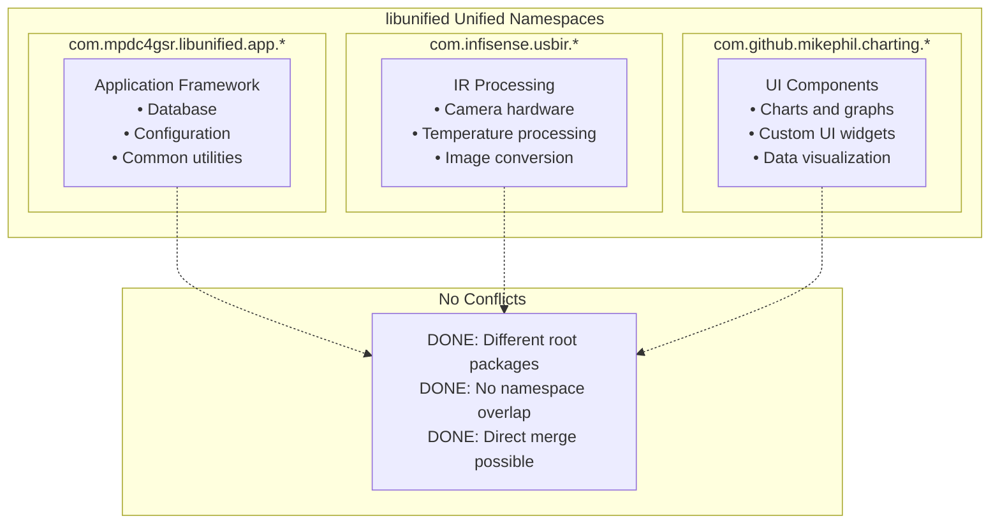

## Build System Comparison

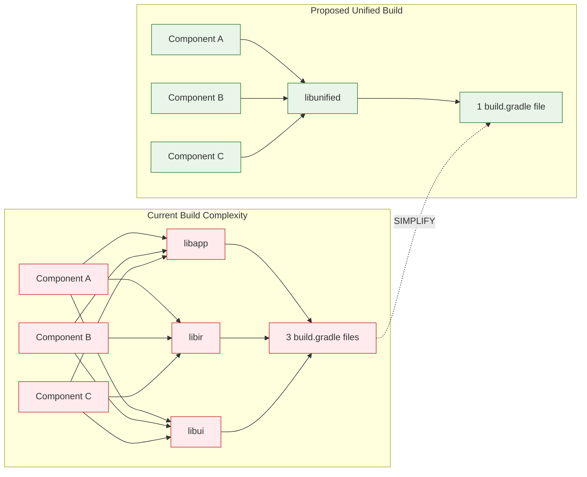

## Implementation Status

### Implementation Completion Results

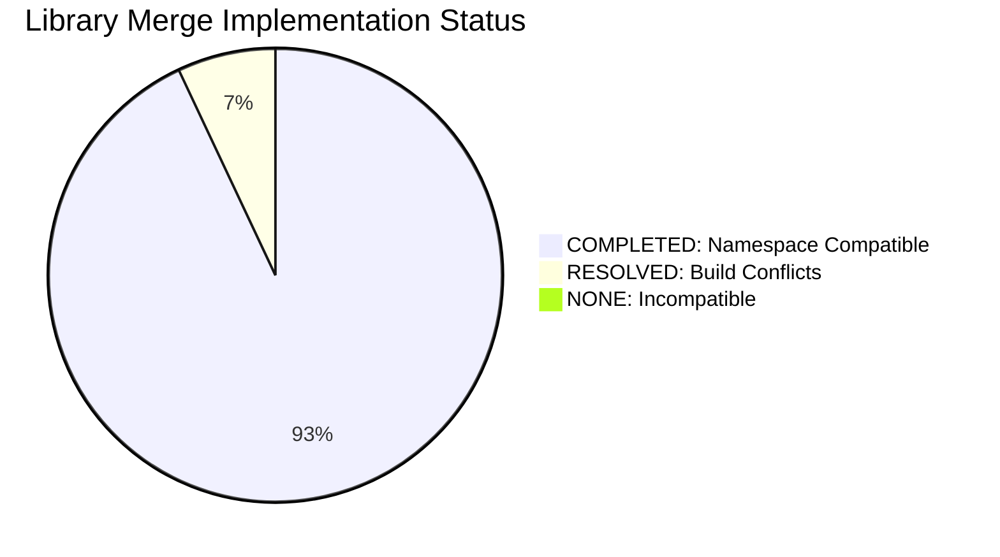

### File Distribution in Unified Library

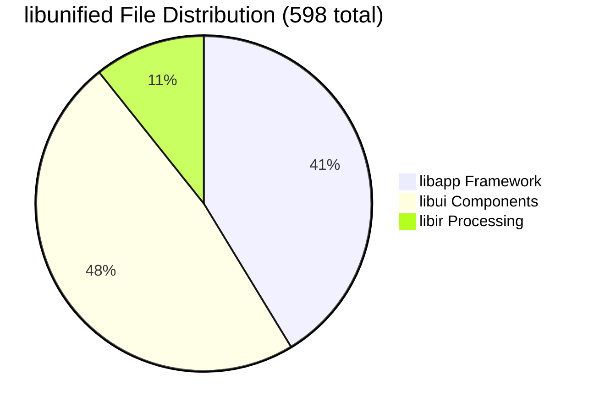

## Current Status: IMPLEMENTATION COMPLETED

The merging of libapp, libir, and libui into a unified libunified has been **successfully completed** and is **fully operational** in the current architecture.

---

## Documentation Update History

### 2024-12-22 - Commit c7769bc - ASCII Safety and True State Documentation
- Removed all emoji characters from architecture diagrams and documentation
- Updated all references from libcore to libunified (actual implementation name)
- Corrected migration status from "proposed" to "completed" throughout diagrams
- Updated BLE module references to reflect actual ble-core, ble-shimmer, ble-topdon structure
- Ensured all Mermaid diagrams reflect the true current state of the repository