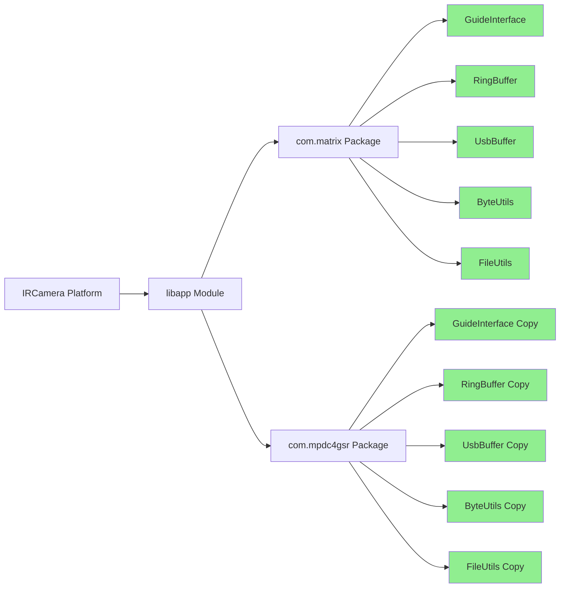

# Mermaid Diagrams

## Code Quality Improvements Flow

```mermaid
graph TD
    A[Kotlin Compilation Warnings] --> B[Type Safety Issues]
    A --> C[Null Safety Issues] 
    A --> D[Experimental API Usage]
    
    B --> E[GuideInterface.kt<br/>String? -> String]
    C --> F[RingBuffer.kt<br/>ByteArray? null checks]
    C --> G[UsbBuffer.kt<br/>Remove redundant checks]
    C --> H[FileUtils.kt<br/>Array<File>? safety]
    D --> I[ByteUtils.kt<br/>@OptIn annotation]
    
    E --> J[Fixed with !!]
    F --> K[Added null guard]
    G --> L[Removed always true/false]
    H --> M[Added null check]
    I --> N[Added @OptIn]
    
    J --> O[Zero Warnings]
    K --> O
    L --> O
    M --> O
    N --> O
    
    O --> P[Successful Build]
```

## Architecture Overview

