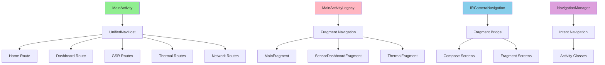

# Navigation Architecture Analysis & Anti-Pattern Detection

## Current Navigation Structure

### MainActivity Variants (ANTI-PATTERN: Multiple Main Activities)

```
MainActivity.kt (34 lines) - Primary Compose launcher
MainActivityLegacy.kt (394 lines) - Legacy fragment-based
MainActivityAlternative.kt (667 lines) - Experimental Compose features  
SimplifiedMainActivity.kt (195 lines) - Minimal implementation
SimplifiedMainActivityCompose.kt (571 lines) - Testing/debug version
```

**ISSUE**: Having 5 different MainActivity implementations creates confusion and maintenance overhead.

### Navigation Systems (ANTI-PATTERN: Multiple Navigation Paradigms)

```
1. UnifiedNavigation.kt - Compose Navigation with sealed class routes
2. IRCameraNavigation.kt - Fragment integration navigation  
3. NavigationManager.kt (2 duplicates!) - Legacy intent-based navigation
4. DemoNavigationScreen.kt - Demo-only navigation
```

**ISSUE**: 4 different navigation systems with overlapping responsibilities.

### Route Definitions (ANTI-PATTERN: Inconsistent Route Naming)

```
UnifiedRoute:
- "home", "dashboard", "gsr_settings" 
- "gsr_plot/{sessionId}", "session_detail/{sessionId}"
- "thermal_main", "thermal_gallery", "thermal_camera"

IRCameraScreen: 
- "main", "main_compose", "main_fragment"
- "thermal_camera", "thermal_camera_compose"
- "sensor_dashboard", "sensor_dashboard_compose"
```

**ISSUE**: Inconsistent naming conventions and duplicate screen concepts.

## Critical Anti-Patterns Identified

### 1. **Duplicate NavigationManager Classes**

- `libunified/app/comm/navigation/NavigationManager.kt`
- `libunified/app/navigation/NavigationManager.kt`
- Nearly identical with minor differences (withFloat/withLong methods)

### 2. **Circular Dependencies**

Multiple activities import `MainActivityViewModel`:

- SettingsComposeActivity
- SensorDashboardComposeActivity
- MainActivityAlternative
- MainActivityLegacy

### 3. **Inconsistent Activity Naming**

```
GOOD: DevicePairingComposeActivity
BAD:  MainActivityAlternative (should be MainComposeActivity)
BAD:  SimplifiedMainActivityCompose (should be SimplifiedMainComposeActivity)
```

### 4. **Mixed Navigation Paradigms**

- Compose Navigation (modern)
- Fragment Navigation (legacy)
- Intent-based Navigation (legacy)
- Manual Activity launching

### 5. **Launcher Activity Confusion**

Multiple activities could potentially be launchers:

- MainActivity (current)
- MainActivityLegacy
- MainActivityAlternative
- UnifiedNavigationDemoActivity

### 6. **Route Parameter Inconsistencies**

```
GOOD: gsr_plot/{sessionId} with createRoute(sessionId)
BAD:  gsr_data_view/{filePath} - file paths shouldn't be URL parameters
```

## Navigation Graph Analysis



## Issues in Current Implementation

### 1. **Logical Mismatches**

- UnifiedNavigation uses modern Compose patterns but falls back to launching separate activities
- IRCameraNavigation mixes Compose and Fragment paradigms inconsistently
- NavigationManager uses string-based routing but activities use type-safe routes

### 2. **Memory Leaks Potential**

- Multiple MainActivity instances could exist simultaneously
- Fragment-to-Compose transitions may retain fragment references
- Static references in NavigationManager singleton

### 3. **Testing Complexity**

- 5 different MainActivity variants make testing complex
- Multiple navigation systems require different test approaches
- Route conflicts between systems

### 4. **Performance Issues**

- Unnecessary activity launches instead of in-app navigation
- Fragment overhead when Compose could handle screens directly
- Multiple navigation graphs loaded simultaneously

## Recommended Fixes

### Phase 1: Consolidation

1. **Merge NavigationManager duplicates**
2. **Reduce MainActivity variants to 2 maximum**
3. **Standardize route naming conventions**
4. **Remove circular dependencies**

### Phase 2: Architecture Cleanup

1. **Single navigation paradigm (Compose Navigation)**
2. **Consistent activity naming**
3. **Proper parameter passing (no file paths in URLs)**
4. **Clear separation of concerns**

### Phase 3: Testing & Validation

1. **Comprehensive navigation testing**
2. **Performance benchmarking**
3. **Memory leak detection**
4. **User flow validation**