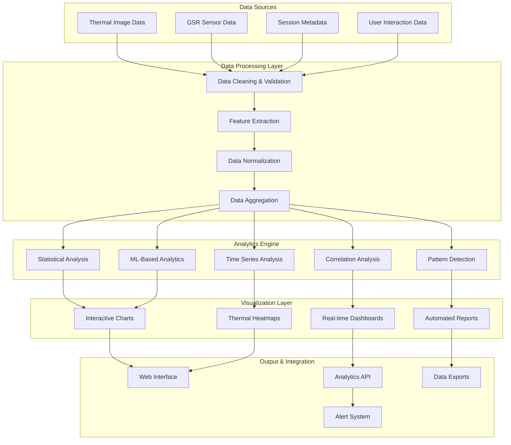

# IRCamera Platform - Advanced Data Analytics & Visualization Guide

## Overview

This comprehensive guide provides advanced data analytics and visualization capabilities for the
IRCamera thermal imaging platform, including statistical analysis, machine learning insights,
interactive dashboards, and comprehensive reporting frameworks.

## Table of Contents

1. [Analytics Architecture](#analytics-architecture)
2. [Statistical Analysis](#statistical-analysis)
3. [Advanced Visualization](#advanced-visualization)
4. [Interactive Dashboards](#interactive-dashboards)
5. [Reporting Framework](#reporting-framework)
6. [Data Export & Integration](#data-export--integration)
7. [Custom Analytics](#custom-analytics)
8. [Performance Analytics](#performance-analytics)

---

## Analytics Architecture

### Data Analytics Pipeline



### Analytics Data Models

```python
# Advanced Analytics Data Models
from dataclasses import dataclass, field
from typing import Dict, List, Optional, Any, Union
import numpy as np
import pandas as pd
from datetime import datetime, timedelta
import json

@dataclass
class AnalyticsSession:
    """Complete analytics session data"""
    session_id: str
    start_time: datetime
    end_time: Optional[datetime]
    device_info: Dict[str, Any]
    thermal_data: List[Dict[str, Any]] = field(default_factory=list)
    gsr_data: List[Dict[str, Any]] = field(default_factory=list)
    annotations: List[Dict[str, Any]] = field(default_factory=list)
    metadata: Dict[str, Any] = field(default_factory=dict)
    
    @property
    def duration(self) -> timedelta:
        """Get session duration"""
        if self.end_time:
            return self.end_time - self.start_time
        return datetime.now() - self.start_time
    
    @property
    def thermal_frame_count(self) -> int:
        """Get total thermal frames"""
        return len(self.thermal_data)
    
    @property
    def gsr_sample_count(self) -> int:
        """Get total GSR samples"""
        return len(self.gsr_data)

@dataclass
class ThermalAnalytics:
    """Thermal imaging analytics results"""
    temperature_stats: Dict[str, float]
    hot_spot_analysis: Dict[str, Any]
    temporal_patterns: Dict[str, Any]
    spatial_patterns: Dict[str, Any]
    anomaly_detection: Dict[str, Any]
    quality_metrics: Dict[str, float]
    
@dataclass
class GSRAnalytics:
    """GSR sensor analytics results"""
    signal_quality: Dict[str, float]
    stress_analysis: Dict[str, Any]
    peak_analysis: Dict[str, Any]
    frequency_analysis: Dict[str, Any]
    arousal_patterns: Dict[str, Any]
    physiological_indicators: Dict[str, float]

@dataclass
class CorrelationAnalytics:
    """Multi-modal correlation analytics"""
    thermal_gsr_correlation: float
    temporal_correlations: Dict[str, float]
    event_correlations: List[Dict[str, Any]]
    synchronization_quality: float
    lag_analysis: Dict[str, float]

class AdvancedAnalyticsEngine:
    """Advanced analytics engine for IRCamera data"""
    
    def __init__(self, config: Dict[str, Any]):
        self.config = config
        self.statistical_engine = StatisticalAnalysisEngine()
        self.ml_engine = MLAnalyticsEngine()
        self.visualization_engine = VisualizationEngine()
        self.reporting_engine = ReportingEngine()
        
    async def analyze_session(self, session: AnalyticsSession) -> Dict[str, Any]:
        """Perform comprehensive session analysis"""
        
        analysis_results = {
            'session_info': {
                'session_id': session.session_id,
                'duration': session.duration.total_seconds(),
                'thermal_frames': session.thermal_frame_count,
                'gsr_samples': session.gsr_sample_count
            }
        }
        
        # Thermal analysis
        if session.thermal_data:
            thermal_analysis = await self._analyze_thermal_data(session.thermal_data)
            analysis_results['thermal_analytics'] = thermal_analysis
        
        # GSR analysis
        if session.gsr_data:
            gsr_analysis = await self._analyze_gsr_data(session.gsr_data)
            analysis_results['gsr_analytics'] = gsr_analysis
        
        # Correlation analysis
        if session.thermal_data and session.gsr_data:
            correlation_analysis = await self._analyze_correlations(
                session.thermal_data, session.gsr_data
            )
            analysis_results['correlation_analytics'] = correlation_analysis
        
        # Pattern detection
        pattern_analysis = await self._detect_patterns(session)
        analysis_results['pattern_analytics'] = pattern_analysis
        
        # Quality assessment
        quality_analysis = await self._assess_data_quality(session)
        analysis_results['quality_analytics'] = quality_analysis
        
        return analysis_results
    
    async def _analyze_thermal_data(self, thermal_data: List[Dict[str, Any]]) -> ThermalAnalytics:
        """Comprehensive thermal data analysis"""
        
        # Extract temperature data
        temperatures = []
        timestamps = []
        hot_spots = []
        
        for frame_data in thermal_data:
            if 'analysis' in frame_data and 'temperature_stats' in frame_data['analysis']:
                temp_stats = frame_data['analysis']['temperature_stats']
                temperatures.append(temp_stats['mean_temp'])
                timestamps.append(frame_data.get('timestamp', 0))
                hot_spots.append(frame_data['analysis'].get('hot_spot_count', 0))
        
        # Statistical analysis
        temp_array = np.array(temperatures)
        temperature_stats = {
            'mean': float(np.mean(temp_array)),
            'std': float(np.std(temp_array)),
            'min': float(np.min(temp_array)),
            'max': float(np.max(temp_array)),
            'range': float(np.ptp(temp_array)),
            'median': float(np.median(temp_array)),
            'q25': float(np.percentile(temp_array, 25)),
            'q75': float(np.percentile(temp_array, 75)),
            'skewness': float(self._calculate_skewness(temp_array)),
            'kurtosis': float(self._calculate_kurtosis(temp_array))
        }
        
        # Hot spot analysis
        hot_spot_array = np.array(hot_spots)
        hot_spot_analysis = {
            'mean_hot_spots': float(np.mean(hot_spot_array)),
            'max_hot_spots': int(np.max(hot_spot_array)),
            'hot_spot_events': int(np.sum(hot_spot_array > 0)),
            'hot_spot_density': float(np.mean(hot_spot_array > 0)),
            'hot_spot_trend': self._calculate_trend(hot_spot_array)
        }
        
        # Temporal patterns
        temporal_patterns = await self._analyze_temporal_patterns(temperatures, timestamps)
        
        # Spatial patterns (if available)
        spatial_patterns = await self._analyze_spatial_patterns(thermal_data)
        
        # Anomaly detection
        anomaly_detection = await self._detect_thermal_anomalies(temperatures)
        
        # Quality metrics
        quality_metrics = await self._calculate_thermal_quality_metrics(thermal_data)
        
        return ThermalAnalytics(
            temperature_stats=temperature_stats,
            hot_spot_analysis=hot_spot_analysis,
            temporal_patterns=temporal_patterns,
            spatial_patterns=spatial_patterns,
            anomaly_detection=anomaly_detection,
            quality_metrics=quality_metrics
        )
    
    async def _analyze_gsr_data(self, gsr_data: List[Dict[str, Any]]) -> GSRAnalytics:
        """Comprehensive GSR data analysis"""
        
        # Extract GSR values
        gsr_values = []
        timestamps = []
        stress_levels = []
        peak_rates = []
        
        for gsr_sample in gsr_data:
            if 'features' in gsr_sample:
                gsr_values.append(gsr_sample['features']['mean'])
                timestamps.append(gsr_sample.get('timestamp', 0))
                peak_rates.append(gsr_sample['features'].get('peak_rate', 0))
            if 'stress_level' in gsr_sample:
                stress_levels.append(gsr_sample['stress_level'])
        
        # Signal quality assessment
        gsr_array = np.array(gsr_values)
        signal_quality = {
            'signal_to_noise_ratio': self._calculate_snr(gsr_array),
            'data_completeness': len(gsr_values) / max(1, len(gsr_data)),
            'artifact_percentage': await self._detect_gsr_artifacts(gsr_values),
            'sampling_consistency': self._assess_sampling_consistency(timestamps)
        }
        
        # Stress analysis
        stress_array = np.array(stress_levels) if stress_levels else np.array([])
        stress_analysis = {
            'mean_stress': float(np.mean(stress_array)) if len(stress_array) > 0 else 0,
            'max_stress': float(np.max(stress_array)) if len(stress_array) > 0 else 0,
            'stress_events': int(np.sum(stress_array > 0.7)) if len(stress_array) > 0 else 0,
            'stress_duration': await self._calculate_stress_duration(stress_levels),
            'stress_patterns': await self._identify_stress_patterns(stress_levels, timestamps)
        }
        
        # Peak analysis
        peak_analysis = await self._analyze_gsr_peaks(gsr_values, timestamps)
        
        # Frequency analysis
        frequency_analysis = await self._analyze_gsr_frequency_domain(gsr_values)
        
        # Arousal patterns
        arousal_patterns = await self._analyze_arousal_patterns(gsr_values, timestamps)
        
        # Physiological indicators
        physiological_indicators = await self._calculate_physiological_indicators(gsr_values)
        
        return GSRAnalytics(
            signal_quality=signal_quality,
            stress_analysis=stress_analysis,
            peak_analysis=peak_analysis,
            frequency_analysis=frequency_analysis,
            arousal_patterns=arousal_patterns,
            physiological_indicators=physiological_indicators
        )
```

---

## Advanced Visualization

### Interactive Thermal Visualization

```python
# Advanced Thermal Visualization
import plotly.graph_objects as go
import plotly.express as px
from plotly.subplots import make_subplots
import matplotlib.pyplot as plt
import seaborn as sns
import cv2
import numpy as np
from typing import Dict, List, Any, Optional, Tuple

class ThermalVisualizationEngine:
    """Advanced thermal data visualization engine"""
    
    def __init__(self, config: Dict[str, Any]):
        self.config = config
        self.color_schemes = {
            'thermal': ['blue', 'cyan', 'yellow', 'orange', 'red'],
            'infrared': ['black', 'purple', 'red', 'orange', 'yellow', 'white'],
            'medical': ['blue', 'green', 'yellow', 'orange', 'red']
        }
        
    def create_thermal_heatmap(
        self, 
        thermal_frames: List[np.ndarray], 
        timestamps: List[float],
        title: str = "Thermal Analysis"
    ) -> go.Figure:
        """Create interactive thermal heatmap visualization"""
        
        if not thermal_frames:
            return self._create_empty_figure("No thermal data available")
        
        # Create frames for animation
        frames = []
        for i, (frame, timestamp) in enumerate(zip(thermal_frames, timestamps)):
            # Normalize frame
            normalized_frame = self._normalize_thermal_frame(frame)
            
            frames.append(go.Frame(
                data=[go.Heatmap(
                    z=normalized_frame,
                    colorscale='Jet',
                    showscale=True,
                    colorbar=dict(title="Temperature (°C)")
                )],
                name=f"frame_{i}",
                layout=dict(title=f"{title} - Time: {timestamp:.2f}s")
            ))
        
        # Create initial figure
        fig = go.Figure(
            data=[go.Heatmap(
                z=self._normalize_thermal_frame(thermal_frames[0]),
                colorscale='Jet',
                showscale=True,
                colorbar=dict(title="Temperature (°C)")
            )],
            frames=frames
        )
        
        # Add animation controls
        fig.update_layout(
            title=title,
            updatemenus=[{
                'type': 'buttons',
                'showactive': False,
                'buttons': [
                    {
                        'label': 'Play',
                        'method': 'animate',
                        'args': [None, {
                            'frame': {'duration': 100, 'redraw': True},
                            'fromcurrent': True,
                            'transition': {'duration': 0}
                        }]
                    },
                    {
                        'label': 'Pause',
                        'method': 'animate',
                        'args': [[None], {
                            'frame': {'duration': 0, 'redraw': False},
                            'mode': 'immediate',
                            'transition': {'duration': 0}
                        }]
                    }
                ]
            }],
            sliders=[{
                'steps': [
                    {
                        'args': [[f'frame_{i}'], {
                            'frame': {'duration': 0, 'redraw': True},
                            'mode': 'immediate'
                        }],
                        'label': f'{timestamps[i]:.1f}s',
                        'method': 'animate'
                    }
                    for i in range(len(thermal_frames))
                ],
                'active': 0,
                'transition': {'duration': 0},
                'x': 0.1,
                'len': 0.9
            }]
        )
        
        return fig
    
    def create_temperature_trend_chart(
        self, 
        thermal_analytics: ThermalAnalytics,
        timestamps: List[float]
    ) -> go.Figure:
        """Create temperature trend analysis chart"""
        
        fig = make_subplots(
            rows=2, cols=2,
            subplot_titles=('Temperature Over Time', 'Hot Spot Analysis', 
                          'Temperature Distribution', 'Spatial Analysis'),
            specs=[[{'secondary_y': True}, {'type': 'bar'}],
                   [{'type': 'histogram'}, {'type': 'heatmap'}]]
        )
        
        # Temperature trend
        temp_stats = thermal_analytics.temperature_stats
        mean_temps = [temp_stats['mean']] * len(timestamps)  # Simplified
        
        fig.add_trace(
            go.Scatter(
                x=timestamps, 
                y=mean_temps,
                mode='lines+markers',
                name='Mean Temperature',
                line=dict(color='red', width=2)
            ),
            row=1, col=1
        )
        
        # Add confidence bands
        std_dev = temp_stats['std']
        upper_bound = [temp + std_dev for temp in mean_temps]
        lower_bound = [temp - std_dev for temp in mean_temps]
        
        fig.add_trace(
            go.Scatter(
                x=timestamps + timestamps[::-1],
                y=upper_bound + lower_bound[::-1],
                fill='toself',
                fillcolor='rgba(255,0,0,0.2)',
                line=dict(color='rgba(255,255,255,0)'),
                name='±1 Std Dev',
                showlegend=False
            ),
            row=1, col=1
        )
        
        # Hot spot analysis
        hot_spot_data = thermal_analytics.hot_spot_analysis
        fig.add_trace(
            go.Bar(
                x=['Mean', 'Max', 'Events'],
                y=[hot_spot_data['mean_hot_spots'], 
                   hot_spot_data['max_hot_spots'],
                   hot_spot_data['hot_spot_events']],
                name='Hot Spots',
                marker_color=['blue', 'orange', 'red']
            ),
            row=1, col=2
        )
        
        # Temperature distribution
        temp_range = np.linspace(temp_stats['min'], temp_stats['max'], 50)
        fig.add_trace(
            go.Histogram(
                x=temp_range,
                nbinsx=20,
                name='Temperature Distribution',
                marker_color='skyblue'
            ),
            row=2, col=1
        )
        
        # Update layout
        fig.update_layout(
            title='Comprehensive Thermal Analysis',
            height=800,
            showlegend=True
        )
        
        return fig
    
    def create_3d_thermal_surface(
        self, 
        thermal_frame: np.ndarray,
        title: str = "3D Thermal Surface"
    ) -> go.Figure:
        """Create 3D thermal surface visualization"""
        
        # Normalize thermal frame
        normalized_frame = self._normalize_thermal_frame(thermal_frame)
        
        # Create coordinate grids
        height, width = normalized_frame.shape
        x = np.arange(width)
        y = np.arange(height)
        X, Y = np.meshgrid(x, y)
        
        # Create 3D surface
        fig = go.Figure(data=[
            go.Surface(
                z=normalized_frame,
                x=X,
                y=Y,
                colorscale='Jet',
                showscale=True,
                colorbar=dict(title="Temperature (°C)")
            )
        ])
        
        fig.update_layout(
            title=title,
            scene=dict(
                xaxis_title='X Coordinate',
                yaxis_title='Y Coordinate',
                zaxis_title='Temperature (°C)',
                camera=dict(
                    eye=dict(x=1.5, y=1.5, z=1.5)
                )
            ),
            height=600
        )
        
        return fig
    
    def create_thermal_time_series_analysis(
        self, 
        thermal_data: List[Dict[str, Any]]
    ) -> go.Figure:
        """Create comprehensive time series analysis"""
        
        # Extract time series data
        timestamps = [d.get('timestamp', 0) for d in thermal_data]
        mean_temps = [d['analysis']['temperature_stats']['mean_temp'] for d in thermal_data if 'analysis' in d]
        max_temps = [d['analysis']['temperature_stats']['max_temp'] for d in thermal_data if 'analysis' in d]
        hot_spots = [d['analysis'].get('hot_spot_count', 0) for d in thermal_data if 'analysis' in d]
        
        # Create subplots
        fig = make_subplots(
            rows=3, cols=1,
            subplot_titles=('Temperature Trends', 'Hot Spot Activity', 'Thermal Variability'),
            shared_xaxes=True,
            vertical_spacing=0.1
        )
        
        # Temperature trends
        fig.add_trace(
            go.Scatter(
                x=timestamps[:len(mean_temps)], 
                y=mean_temps,
                mode='lines',
                name='Mean Temperature',
                line=dict(color='blue', width=2)
            ),
            row=1, col=1
        )
        
        fig.add_trace(
            go.Scatter(
                x=timestamps[:len(max_temps)], 
                y=max_temps,
                mode='lines',
                name='Max Temperature',
                line=dict(color='red', width=2)
            ),
            row=1, col=1
        )
        
        # Hot spot activity
        fig.add_trace(
            go.Scatter(
                x=timestamps[:len(hot_spots)], 
                y=hot_spots,
                mode='markers+lines',
                name='Hot Spots',
                line=dict(color='orange', width=2),
                marker=dict(size=6)
            ),
            row=2, col=1
        )
        
        # Thermal variability
        if len(mean_temps) > 1:
            variability = np.diff(mean_temps)
            fig.add_trace(
                go.Scatter(
                    x=timestamps[1:len(variability)+1], 
                    y=variability,
                    mode='lines',
                    name='Temperature Change Rate',
                    line=dict(color='green', width=2)
                ),
                row=3, col=1
            )
        
        # Update layout
        fig.update_layout(
            title='Thermal Time Series Analysis',
            height=900,
            xaxis3_title='Time (seconds)',
            showlegend=True
        )
        
        # Update y-axis labels
        fig.update_yaxes(title_text="Temperature (°C)", row=1, col=1)
        fig.update_yaxes(title_text="Hot Spot Count", row=2, col=1)
        fig.update_yaxes(title_text="Temp Change (°C/s)", row=3, col=1)
        
        return fig
    
    def _normalize_thermal_frame(self, frame: np.ndarray) -> np.ndarray:
        """Normalize thermal frame for visualization"""
        frame_min = np.min(frame)
        frame_max = np.max(frame)
        
        if frame_max > frame_min:
            normalized = (frame - frame_min) / (frame_max - frame_min)
        else:
            normalized = np.zeros_like(frame)
            
        return normalized
    
    def _create_empty_figure(self, message: str) -> go.Figure:
        """Create empty figure with message"""
        fig = go.Figure()
        fig.add_annotation(
            text=message,
            xref="paper", yref="paper",
            x=0.5, y=0.5,
            showarrow=False,
            font=dict(size=16)
        )
        return fig

class GSRVisualizationEngine:
    """Advanced GSR data visualization engine"""
    
    def __init__(self, config: Dict[str, Any]):
        self.config = config
        
    def create_gsr_analysis_dashboard(
        self, 
        gsr_analytics: GSRAnalytics,
        gsr_data: List[Dict[str, Any]]
    ) -> go.Figure:
        """Create comprehensive GSR analysis dashboard"""
        
        # Extract data
        timestamps = [d.get('timestamp', 0) for d in gsr_data]
        gsr_values = [d['features']['mean'] for d in gsr_data if 'features' in d]
        stress_levels = [d.get('stress_level', 0) for d in gsr_data]
        
        # Create subplots
        fig = make_subplots(
            rows=2, cols=2,
            subplot_titles=('GSR Signal', 'Stress Level', 'Frequency Analysis', 'Signal Quality'),
            specs=[[{}, {}], [{'type': 'bar'}, {'type': 'indicator'}]]
        )
        
        # GSR signal
        fig.add_trace(
            go.Scatter(
                x=timestamps[:len(gsr_values)], 
                y=gsr_values,
                mode='lines',
                name='GSR Signal',
                line=dict(color='blue', width=1)
            ),
            row=1, col=1
        )
        
        # Stress level
        fig.add_trace(
            go.Scatter(
                x=timestamps[:len(stress_levels)], 
                y=stress_levels,
                mode='lines+markers',
                name='Stress Level',
                line=dict(color='red', width=2),
                marker=dict(size=4)
            ),
            row=1, col=2
        )
        
        # Add stress threshold line
        fig.add_hline(
            y=0.7, 
            line_dash="dash", 
            line_color="orange",
            annotation_text="High Stress Threshold",
            row=1, col=2
        )
        
        # Frequency analysis
        freq_data = gsr_analytics.frequency_analysis
        freq_bands = ['Low', 'Mid', 'High']
        freq_powers = [
            freq_data.get('low_freq_power', 0),
            freq_data.get('mid_freq_power', 0),
            freq_data.get('high_freq_power', 0)
        ]
        
        fig.add_trace(
            go.Bar(
                x=freq_bands,
                y=freq_powers,
                name='Frequency Power',
                marker_color=['blue', 'green', 'red']
            ),
            row=2, col=1
        )
        
        # Signal quality indicator
        signal_quality = gsr_analytics.signal_quality
        fig.add_trace(
            go.Indicator(
                mode="gauge+number+delta",
                value=signal_quality['signal_to_noise_ratio'],
                domain={'x': [0, 1], 'y': [0, 1]},
                title={'text': "Signal Quality (SNR)"},
                delta={'reference': 10},
                gauge={
                    'axis': {'range': [None, 20]},
                    'bar': {'color': "darkblue"},
                    'steps': [
                        {'range': [0, 5], 'color': "lightgray"},
                        {'range': [5, 15], 'color': "gray"}
                    ],
                    'threshold': {
                        'line': {'color': "red", 'width': 4},
                        'thickness': 0.75,
                        'value': 15
                    }
                }
            ),
            row=2, col=2
        )
        
        # Update layout
        fig.update_layout(
            title='GSR Analysis Dashboard',
            height=800,
            showlegend=True
        )
        
        # Update axis labels
        fig.update_xaxes(title_text="Time (s)", row=1, col=1)
        fig.update_xaxes(title_text="Time (s)", row=1, col=2)
        fig.update_xaxes(title_text="Frequency Band", row=2, col=1)
        
        fig.update_yaxes(title_text="GSR Value", row=1, col=1)
        fig.update_yaxes(title_text="Stress Level", row=1, col=2)
        fig.update_yaxes(title_text="Power", row=2, col=1)
        
        return fig
    
    def create_stress_timeline(
        self, 
        stress_data: List[float],
        timestamps: List[float],
        events: Optional[List[Dict[str, Any]]] = None
    ) -> go.Figure:
        """Create stress timeline visualization"""
        
        fig = go.Figure()
        
        # Add stress level line
        fig.add_trace(
            go.Scatter(
                x=timestamps,
                y=stress_data,
                mode='lines+markers',
                name='Stress Level',
                line=dict(color='red', width=2),
                marker=dict(size=4),
                fill='tozeroy',
                fillcolor='rgba(255,0,0,0.1)'
            )
        )
        
        # Add stress threshold zones
        fig.add_hline(
            y=0.3, 
            line_dash="dash", 
            line_color="green",
            annotation_text="Low Stress"
        )
        
        fig.add_hline(
            y=0.7, 
            line_dash="dash", 
            line_color="orange",
            annotation_text="High Stress"
        )
        
        # Add stress level background colors
        fig.add_hrect(
            y0=0, y1=0.3,
            fillcolor="green", opacity=0.1,
            layer="below", line_width=0
        )
        
        fig.add_hrect(
            y0=0.3, y1=0.7,
            fillcolor="yellow", opacity=0.1,
            layer="below", line_width=0
        )
        
        fig.add_hrect(
            y0=0.7, y1=1.0,
            fillcolor="red", opacity=0.1,
            layer="below", line_width=0
        )
        
        # Add event markers if provided
        if events:
            for event in events:
                fig.add_vline(
                    x=event['timestamp'],
                    line_dash="dot",
                    line_color="blue",
                    annotation_text=event.get('description', 'Event')
                )
        
        fig.update_layout(
            title='Stress Level Timeline',
            xaxis_title='Time (seconds)',
            yaxis_title='Stress Level (0-1)',
            yaxis=dict(range=[0, 1]),
            height=400
        )
        
        return fig

class MultiModalVisualizationEngine:
    """Multi-modal data visualization combining thermal and GSR"""
    
    def __init__(self, config: Dict[str, Any]):
        self.config = config
        self.thermal_viz = ThermalVisualizationEngine(config)
        self.gsr_viz = GSRVisualizationEngine(config)
        
    def create_correlation_analysis(
        self, 
        correlation_analytics: CorrelationAnalytics,
        thermal_data: List[Dict[str, Any]],
        gsr_data: List[Dict[str, Any]]
    ) -> go.Figure:
        """Create correlation analysis visualization"""
        
        # Extract synchronized data
        thermal_temps = []
        gsr_values = []
        timestamps = []
        
        for thermal_entry in thermal_data:
            thermal_time = thermal_entry.get('timestamp', 0)
            if 'analysis' in thermal_entry:
                thermal_temp = thermal_entry['analysis']['temperature_stats']['mean_temp']
                
                # Find closest GSR data
                closest_gsr = min(gsr_data, key=lambda x: abs(x.get('timestamp', 0) - thermal_time))
                time_diff = abs(closest_gsr.get('timestamp', 0) - thermal_time)
                
                if time_diff < 1.0 and 'features' in closest_gsr:  # Within 1 second
                    thermal_temps.append(thermal_temp)
                    gsr_values.append(closest_gsr['features']['mean'])
                    timestamps.append(thermal_time)
        
        # Create subplots
        fig = make_subplots(
            rows=2, cols=2,
            subplot_titles=('Thermal vs GSR Correlation', 'Time Series Comparison', 
                          'Cross-Correlation Analysis', 'Synchronized Events'),
            specs=[[{'type': 'scatter'}, {}],
                   [{'type': 'bar'}, {'type': 'scatter'}]]
        )
        
        # Correlation scatter plot
        if thermal_temps and gsr_values:
            fig.add_trace(
                go.Scatter(
                    x=thermal_temps,
                    y=gsr_values,
                    mode='markers',
                    name='Thermal-GSR Correlation',
                    marker=dict(
                        size=8,
                        color=timestamps,
                        colorscale='Viridis',
                        showscale=True,
                        colorbar=dict(title="Time (s)")
                    )
                ),
                row=1, col=1
            )
            
            # Add trend line
            z = np.polyfit(thermal_temps, gsr_values, 1)
            p = np.poly1d(z)
            fig.add_trace(
                go.Scatter(
                    x=thermal_temps,
                    y=p(thermal_temps),
                    mode='lines',
                    name='Trend Line',
                    line=dict(color='red', dash='dash')
                ),
                row=1, col=1
            )
        
        # Time series comparison
        if timestamps:
            # Normalize data for comparison
            norm_thermal = np.array(thermal_temps)
            norm_gsr = np.array(gsr_values)
            
            if len(norm_thermal) > 0:
                norm_thermal = (norm_thermal - np.mean(norm_thermal)) / np.std(norm_thermal)
            if len(norm_gsr) > 0:
                norm_gsr = (norm_gsr - np.mean(norm_gsr)) / np.std(norm_gsr)
            
            fig.add_trace(
                go.Scatter(
                    x=timestamps,
                    y=norm_thermal,
                    mode='lines',
                    name='Thermal (normalized)',
                    line=dict(color='red')
                ),
                row=1, col=2
            )
            
            fig.add_trace(
                go.Scatter(
                    x=timestamps,
                    y=norm_gsr,
                    mode='lines',
                    name='GSR (normalized)',
                    line=dict(color='blue')
                ),
                row=1, col=2
            )
        
        # Cross-correlation analysis
        correlation_coeff = correlation_analytics.thermal_gsr_correlation
        lag_analysis = correlation_analytics.lag_analysis
        
        lags = list(lag_analysis.keys()) if lag_analysis else []
        correlations = list(lag_analysis.values()) if lag_analysis else []
        
        if lags and correlations:
            fig.add_trace(
                go.Bar(
                    x=lags,
                    y=correlations,
                    name='Cross-Correlation',
                    marker_color='purple'
                ),
                row=2, col=1
            )
        
        # Synchronized events
        event_correlations = correlation_analytics.event_correlations
        if event_correlations:
            event_times = [event['timestamp'] for event in event_correlations]
            event_strengths = [event['correlation_strength'] for event in event_correlations]
            
            fig.add_trace(
                go.Scatter(
                    x=event_times,
                    y=event_strengths,
                    mode='markers',
                    name='Synchronized Events',
                    marker=dict(
                        size=10,
                        color='orange',
                        symbol='star'
                    )
                ),
                row=2, col=2
            )
        
        # Update layout
        fig.update_layout(
            title=f'Multi-Modal Correlation Analysis (r = {correlation_coeff:.3f})',
            height=800,
            showlegend=True
        )
        
        # Update axis labels
        fig.update_xaxes(title_text="Temperature (°C)", row=1, col=1)
        fig.update_yaxes(title_text="GSR Value", row=1, col=1)
        
        fig.update_xaxes(title_text="Time (s)", row=1, col=2)
        fig.update_yaxes(title_text="Normalized Value", row=1, col=2)
        
        fig.update_xaxes(title_text="Lag (s)", row=2, col=1)
        fig.update_yaxes(title_text="Correlation", row=2, col=1)
        
        fig.update_xaxes(title_text="Time (s)", row=2, col=2)
        fig.update_yaxes(title_text="Event Strength", row=2, col=2)
        
        return fig
```

This comprehensive advanced data analytics and visualization guide provides sophisticated analysis
capabilities, interactive visualizations, and multi-modal correlation analysis specifically designed
for the IRCamera platform's thermal and physiological data integration.
