# IRCamera App Layout Architecture

This document provides a comprehensive overview of the layout structure and UI components used throughout the IRCamera
Android application. Following a major consolidation effort, the app now contains **220 layout files** with a
streamlined and efficient architecture.

## Layout Overview by Type - CORRECTED

From our comprehensive analysis, the app contains:

- **App Module**: 30 layout files - Main application layouts
- **Component Module**: 121 layout files - Thermal and user module layouts
- **LibUnified Module**: 69 layout files - Base templates and utility layouts
- **10 Consolidated layouts** - New unified layout templates replacing multiple specialized layouts
- **51 Backup layouts** - Legacy layouts moved to backup/layouts/ directory

**Total: 220 layouts** (corrected from previous 219 count)

## Module-Specific Breakdown

### App Module Layouts (30)

- Core application interfaces
- GSR sensor layouts
- Testing and development layouts
- 10 new consolidated layouts

### Component Module Layouts (121) - PREVIOUSLY UNDERDOCUMENTED

- **Thermal Unified Module**: ~80 layouts
- **User Module**: ~25 layouts
- **Report Module**: ~16 layouts
- This represents the largest portion of layouts and was severely underdocumented

### LibUnified Module Layouts (69) - PREVIOUSLY UNDERDOCUMENTED

- Base activity templates
- Common dialog layouts
- Utility UI components
- Framework layouts

## Major Architecture Consolidation

**Recent Update**: The app underwent significant layout consolidation:

- **35 legacy activity layouts** moved to `backup/layouts/` directory
- **10 new consolidated layouts** created to replace multiple specialized layouts
- **Improved maintainability** through unified design patterns
- **Enhanced data binding** integration across consolidated layouts

## Complete Layout Architecture Diagram

```mermaid
graph TB
    %% Main Application Structure
    subgraph "Main App Entry"
        MainActivity_Layout[activity_main.xml<br/>🏠 Main App Container]
        MainConsolidated_Layout[activity_main_consolidated.xml<br/>🏠 Consolidated Main Interface]
        SimplifiedMain_Layout[activity_simplified_main.xml<br/>📱 Simplified Interface]
    end
    
    %% Consolidated Layout Architecture
    subgraph "New Consolidated Layouts"
        MultiModalConsolidated_Layout[activity_multi_modal_consolidated.xml<br/>🎭 Multi-Modal Recording Hub]
        CameraTestConsolidated_Layout[activity_camera_test_consolidated.xml<br/>📷 Camera Testing Suite]
        SessionConsolidated_Layout[activity_session_consolidated.xml<br/>📝 Session Management Hub]
        InfoConsolidated_Layout[activity_info_consolidated.xml<br/>ℹ️ Information Display Hub]
        DeviceConsolidated_Item[item_device_consolidated.xml<br/>📱 Unified Device Item]
        MediaConsolidated_Item[item_media_consolidated.xml<br/>🎬 Unified Media Item]
        SensorDataConsolidated_Item[item_sensor_data_consolidated.xml<br/>📊 Unified Sensor Data Item]
        MultiModalConsolidated_Fragment[fragment_multi_modal_consolidated.xml<br/>🎭 Multi-Modal Fragment]
        CameraModeSelector_Layout[camera_mode_selector_consolidated.xml<br/>📹 Camera Mode Selector]
    end
    
    %% Legacy Layouts (Moved to Backup)
    subgraph "Legacy Layouts (backup/layouts/)"
        BackupActivityLayouts[35 Activity Layouts<br/>📦 Moved to backup/layouts/]
        BackupFragmentLayouts[16 Fragment Layouts<br/>📦 Legacy fragments backed up]
    end
    
    %% Core Fragment Layouts
    subgraph "Core UI Fragments"
        MainFragment_Layout[fragment_main.xml<br/>🏠 Main Dashboard Fragment]
        SensorDashboard_Layout[fragment_sensor_dashboard.xml<br/>📊 Sensor Status Dashboard]
        GSRSession_Layout[fragment_gsr_session.xml<br/>📈 GSR Session View]
        GSRData_Layout[fragment_gsr_data.xml<br/>📋 GSR Data Display]
        GSRVideo_Layout[fragment_gsr_video.xml<br/>🎥 GSR Video Playback]
        GSRRawImage_Layout[fragment_gsr_raw_image.xml<br/>🖼️ Raw Image Display]
    end
    
    %% Thermal Camera Module Layouts
    subgraph "Thermal Camera Layouts"
        IRMain_Layout[activity_ir_main.xml<br/>🌡️ Thermal Hub Interface]
        IRThermal_Layout[fragment_ir_thermal.xml<br/>🔥 Thermal Camera Controls]
        IRMonitor_Layout[activity_ir_monitor.xml<br/>📹 Live Thermal Monitor]
        IRConfig_Layout[activity_ir_config.xml<br/>⚙️ Camera Configuration]
        IRGallery_Layout[fragment_gallery.xml<br/>🖼️ Thermal Image Gallery]
        IRCorrection_Layout[activity_ir_correction.xml<br/>🔧 Image Correction]
        IRMonitorChart_Layout[activity_ir_monitor_chart.xml<br/>📊 Thermal Data Charts]
        IRCaptureFragment_Layout[fragment_ir_monitor_capture.xml<br/>📸 Capture Interface]
    end
    
    %% GSR Sensor Module Layouts (Updated)
    subgraph "GSR Sensor Layouts - Streamlined"
        GSRSettings_Layout[activity_gsr_settings.xml<br/>⚙️ GSR Configuration]
        GSRPlot_Layout[activity_gsr_plot.xml<br/>📈 GSR Data Visualization]
        GSRGallery_Layout[activity_gsr_gallery.xml<br/>🖼️ GSR Media Gallery]
        GSRVideoPlayer_Layout[activity_gsr_video_player.xml<br/>🎥 GSR Video Playback]
        GSRDataView_Layout[activity_gsr_data_view.xml<br/>📋 GSR Data Analysis]
        GSRDeviceManagement_Layout[activity_gsr_device_management.xml<br/>📱 Device Management]
        SessionManager_Layout[activity_session_manager.xml<br/>📝 Session Management]
        GSRQuickRecording_Layout[activity_gsr_quick_recording.xml<br/>⚡ Quick Recording]
    end
    
    %% Testing & Development Layouts
    subgraph "Testing & Development"
        SensorDashboardTest_Layout[activity_sensor_dashboard_test.xml<br/>🧪 Sensor Testing]
        NetworkTest_Layout[activity_network_client_test.xml<br/>🌐 Network Testing]
        NetworkConfig_Layout[activity_network_config.xml<br/>⚙️ Network Configuration]
        RGBCameraTest_Layout[activity_rgb_camera_test.xml<br/>📷 RGB Camera Testing]
        ShimmerIntegration_Layout[activity_shimmer_integration.xml<br/>🔗 Shimmer Integration Test]
        Phase2Validation_Layout[activity_phase2_validation.xml<br/>✅ Phase 2 Validation]
    end
    
    %% User Interface & Settings
    subgraph "User Management Layouts"
        Policy_Layout[activity_policy.xml<br/>📋 Privacy Policy]
        Version_Layout[activity_version.xml<br/>ℹ️ Version Information]
        PDF_Layout[activity_pdf.xml<br/>📄 PDF Viewer]
        WebView_Layout[activity_web_view.xml<br/>🌐 Web Content]
    end
    
    %% Item Templates & Adapters - Streamlined
    subgraph "RecyclerView Item Templates - Consolidated"
        DeviceConsolidated_Item[item_device_consolidated.xml<br/>📱 Unified Device Item]
        MediaConsolidated_Item[item_media_consolidated.xml<br/>🎬 Unified Media Item] 
        SensorDataConsolidated_Item[item_sensor_data_consolidated.xml<br/>📊 Unified Sensor Data Item]
        DeviceConnect_Item[item_device_connect.xml<br/>🔗 Device Connection Item]
        DeviceType_Item[item_device_type.xml<br/>📱 Device Type Selection]
        PCController_Item[item_pc_controller.xml<br/>💻 PC Controller Item]
        ControllerDevice_Item[item_controller_device.xml<br/>🎮 Controller Device Item]
    end
    
    %% Dialog Layouts
    subgraph "Modal Dialogs & Popups"
        TipDialog_Layout[dialog_tip_*.xml<br/>💡 Various Tip Dialogs]
        ConfigGuide_Layout[dialog_config_guide.xml<br/>📖 Configuration Guide]
        MsgDialog_Layout[dialog_msg.xml<br/>💬 Message Dialog]
        FirmwareDialog_Layout[dialog_firmware_up.xml<br/>🔄 Firmware Update]
    end
    
    %% UI Components & Widgets
    subgraph "Custom UI Components"
        ConnectionGuide_Layout[ui_main_connection_guide.xml<br/>🔗 Connection Guide UI]
        ReportInfo_Layout[view_report_info.xml<br/>📊 Report Information View]
        ReportInput_Layout[view_report_ir_input.xml<br/>✏️ Report Input View]
        NewVersion_Layout[item_new_version.xml<br/>🆕 Version Update Item]
    end
    
    %% Layout Relationships and Flow - Updated
    MainActivity_Layout --> MainFragment_Layout
    MainActivity_Layout --> SensorDashboard_Layout
    MainConsolidated_Layout --> MultiModalConsolidated_Fragment
    
    MainFragment_Layout --> IRMain_Layout
    MainFragment_Layout --> MultiModalConsolidated_Layout
    
    %% Consolidated Layout Usage
    MultiModalConsolidated_Layout --> GSRSession_Layout
    MultiModalConsolidated_Layout --> GSRData_Layout
    MultiModalConsolidated_Layout --> GSRVideo_Layout
    
    CameraTestConsolidated_Layout --> IRThermal_Layout
    CameraTestConsolidated_Layout --> IRMonitor_Layout
    
    SessionConsolidated_Layout --> SessionManager_Layout
    SessionConsolidated_Layout --> GSRDeviceManagement_Layout
    
    %% Legacy Layout Migration
    BackupActivityLayouts -.-> MultiModalConsolidated_Layout
    BackupActivityLayouts -.-> CameraTestConsolidated_Layout
    BackupActivityLayouts -.-> SessionConsolidated_Layout
    
    %% Consolidated Item Templates Usage
    DeviceConsolidated_Item -.-> GSRDeviceManagement_Layout
    MediaConsolidated_Item -.-> GSRGallery_Layout
    SensorDataConsolidated_Item -.-> MultiModalConsolidated_Layout
    
    %% Dialog Usage
    TipDialog_Layout -.-> IRThermal_Layout
    ConfigGuide_Layout -.-> IRConfig_Layout
    MsgDialog_Layout -.-> MainActivity_Layout
    
    %% Testing Layouts
    SensorDashboardTest_Layout --> SensorDashboard_Layout
    NetworkTest_Layout --> NetworkConfig_Layout
    
    %% Styling
    classDef mainLayout fill:#ff6b6b,stroke:#333,stroke-width:3px,color:#fff
    classDef consolidatedLayout fill:#28a745,stroke:#333,stroke-width:3px,color:#fff
    classDef fragmentLayout fill:#4ecdc4,stroke:#333,stroke-width:2px,color:#fff
    classDef thermalLayout fill:#ffbe0b,stroke:#333,stroke-width:2px,color:#333
    classDef gsrLayout fill:#8ecae6,stroke:#333,stroke-width:2px,color:#333
    classDef testLayout fill:#fb8500,stroke:#333,stroke-width:2px,color:#fff
    classDef userLayout fill:#219ebc,stroke:#333,stroke-width:2px,color:#fff
    classDef itemLayout fill:#023047,stroke:#333,stroke-width:1px,color:#fff
    classDef dialogLayout fill:#ffb3c6,stroke:#333,stroke-width:1px,color:#333
    classDef componentLayout fill:#ffc9b9,stroke:#333,stroke-width:1px,color:#333
    classDef backupLayout fill:#6c757d,stroke:#333,stroke-width:1px,color:#fff
    
    class MainActivity_Layout,SimplifiedMain_Layout mainLayout
    class MainConsolidated_Layout,MultiModalConsolidated_Layout,CameraTestConsolidated_Layout,SessionConsolidated_Layout,InfoConsolidated_Layout,DeviceConsolidated_Item,MediaConsolidated_Item,SensorDataConsolidated_Item,MultiModalConsolidated_Fragment,CameraModeSelector_Layout consolidatedLayout
    class MainFragment_Layout,SensorDashboard_Layout,GSRSession_Layout,GSRData_Layout,GSRVideo_Layout,GSRRawImage_Layout fragmentLayout
    class IRMain_Layout,IRThermal_Layout,IRMonitor_Layout,IRConfig_Layout,IRGallery_Layout,IRCorrection_Layout,IRMonitorChart_Layout,IRCaptureFragment_Layout thermalLayout
    class GSRSettings_Layout,GSRPlot_Layout,GSRGallery_Layout,GSRVideoPlayer_Layout,GSRDataView_Layout,GSRDeviceManagement_Layout,SessionManager_Layout,GSRQuickRecording_Layout gsrLayout
    class SensorDashboardTest_Layout,NetworkTest_Layout,NetworkConfig_Layout,RGBCameraTest_Layout,ShimmerIntegration_Layout,Phase2Validation_Layout testLayout
    class Policy_Layout,Version_Layout,PDF_Layout,WebView_Layout userLayout
    class DeviceConsolidated_Item,MediaConsolidated_Item,SensorDataConsolidated_Item,DeviceConnect_Item,DeviceType_Item,PCController_Item,ControllerDevice_Item itemLayout
    class TipDialog_Layout,ConfigGuide_Layout,MsgDialog_Layout,FirmwareDialog_Layout dialogLayout
    class ConnectionGuide_Layout,ReportInfo_Layout,ReportInput_Layout,NewVersion_Layout componentLayout
    class BackupActivityLayouts,BackupFragmentLayouts backupLayout
```



## Layout Function Categories - Updated Architecture

### 1. **Consolidated Layout Architecture (New)**

The app now features a streamlined layout architecture with consolidated templates:

- **`activity_main_consolidated.xml`** - Enhanced main container with unified data binding
    - Supports multi-modal recording modes through data binding variables
    - Integrated sensor status monitoring and recording controls
    - Simplified network status bar with essential connectivity information

- **`activity_multi_modal_consolidated.xml`** - Unified multi-modal recording interface
    - Replaces multiple GSR recording activities with single flexible layout
    - Supports multiple sensor types through data binding
    - Includes RGB camera integration and preview capabilities
    - ScrollView-based design for responsive content display

- **`activity_session_consolidated.xml`** - Centralized session management
    - Combines session creation, management, and export functionality
    - Unified interface for different session types (GSR, thermal, multi-modal)

- **`activity_camera_test_consolidated.xml`** - Comprehensive camera testing suite
    - Consolidates multiple camera testing layouts into single interface
    - Supports thermal, RGB, and combined camera testing scenarios

### 2. **Legacy Layout Migration**

- **35 activity layouts** moved to `backup/layouts/` directory
- **16 fragment layouts** archived for reference
- **Gradual migration strategy** maintains backward compatibility
- **Improved maintainability** through reduced layout proliferation
- **`activity_main.xml`** - Primary app container with ViewPager2 and bottom navigation
    - Contains network status bar, sensor controls container, and 4-tab navigation
    - Includes quick access buttons for thermal camera and fault-tolerant recording
    - Implements constraint-based responsive layout design

- **`activity_simplified_main.xml`** - Streamlined interface for specific use cases
    - Reduced complexity version of main interface
    - Focus on core functionality without advanced features

### 2. **Fragment-Based UI Components**

- **`fragment_main.xml`** - Main dashboard fragment displaying device connections and controls
- **`fragment_sensor_dashboard.xml`** - Real-time sensor status monitoring with scrollable interface
- **`fragment_gsr_*.xml`** - GSR-specific UI components for session management, data display, and video playback

### 3. **Thermal Camera Interface Layouts**

- **`activity_ir_main.xml`** - Thermal camera hub with 5-tab structure
- **`fragment_ir_thermal.xml`** - Live thermal camera controls and preview
- **`activity_ir_monitor.xml`** - Full-screen thermal monitoring interface
- **`activity_ir_config.xml`** - Camera configuration and calibration settings
- **`fragment_gallery.xml`** - Thermal image and video gallery browser

### 4. **GSR Sensor Management Layouts**

- **`activity_multi_modal_recording.xml`** - Synchronized thermal+GSR recording interface
- **`activity_gsr_settings.xml`** - GSR sensor configuration and calibration
- **`activity_gsr_plot.xml`** - Real-time and historical GSR data visualization
- **`activity_shimmer_config.xml`** - Shimmer3 device specific configuration
- **`activity_session_manager.xml`** - Research session management and organization

### 5. **RecyclerView Item Templates**

- **`item_shimmer_device*.xml`** - Shimmer device list items with connection status
- **`item_gsr_*.xml`** - Various GSR data and session display templates
- **`item_session.xml`** - Session list item with metadata and controls
- **`item_template.xml`** - Generic reusable item template structure

### 6. **Modal Dialogs and Popups**

- **`dialog_tip_*.xml`** - Contextual help and guidance dialogs
- **`dialog_config_guide.xml`** - Step-by-step configuration assistance
- **`dialog_msg.xml`** - General message and confirmation dialogs
- **`dialog_firmware_up.xml`** - Firmware update progress and instructions

### 7. **Testing and Development Interfaces**

- **`activity_sensor_dashboard_test.xml`** - Sensor testing and validation interface
- **`activity_network_*_test.xml`** - Network connectivity testing tools
- **`activity_phase2_validation.xml`** - Phase 2 system validation interface
- **`activity_shimmer_integration.xml`** - Shimmer device integration testing

## Layout Design Patterns

### 1. **Constraint-Based Responsive Design**

- Extensive use of `ConstraintLayout` for flexible, responsive layouts
- Dimension ratios and percentage-based sizing for multi-device support
- Proper constraint chains for element alignment and distribution

### 2. **ViewPager2 Tab Architecture**

- Main app uses 4-tab structure: Gallery, Main, Settings, Profile
- Thermal module uses 5-tab structure: Thermal, Gallery, Abilities, Reports, Profile
- Fragment-based tab content for memory efficiency and lifecycle management

### 3. **Scrollable Container Pattern**

- Critical interfaces like sensor dashboard use `ScrollView` containers
- `fillViewport` and `minHeight` attributes ensure proper scrolling behavior
- Overscroll indicators provide user feedback on scroll boundaries

### 4. **Data Binding Integration**

- Many layouts include `<data>` sections for ViewModel binding
- Two-way data binding for real-time sensor data updates
- Observable field binding for automatic UI state updates

### 5. **Material Design Components**

- Consistent use of Material Design guidelines and components
- Proper color schemes and typography scaling
- Touch target sizing and accessibility considerations

## Key Layout Relationships

### Navigation Flow

```
activity_main.xml 
├── Gallery Tab → fragment_gallery.xml
├── Main Tab → fragment_main.xml (Dashboard)
│    └── fragment_sensor_dashboard.xml (Status)
├── Settings Tab → fragment_settings.xml
└── Profile Tab → fragment_profile.xml
```

### Component Hierarchy

```
Main Container
├── Status Bar Components
├── ViewPager2 Content Area
├── Bottom Navigation Tabs
└── Modal Dialog Overlays
```

### Data Flow Layouts

```
Sensor Input → Dashboard Fragment → Activity Container → Navigation Destination
```

This comprehensive layout architecture enables the IRCamera app to provide a sophisticated multi-modal physiological
sensing interface while maintaining usability and performance across different Android devices and screen sizes.