# IRCamera App Layout Architecture

This document provides a comprehensive overview of the layout structure and UI components used throughout the IRCamera Android application. With 258 different layout files, this diagram organizes them by function and purpose.

## Layout Overview by Type

From our analysis, the app contains:
- **99 Activity layouts** - Full-screen application views
- **42 Item layouts** - RecyclerView and list item templates  
- **37 Dialog layouts** - Modal dialogs and popups
- **24 Fragment layouts** - Reusable UI components
- **15 Layout templates** - Base layout structures
- **13 UI components** - Custom UI widgets
- **Other specialized layouts** - Various utility layouts

## Complete Layout Architecture Diagram

```mermaid
graph TB
    %% Main Application Structure
    subgraph "Main App Entry"
        MainActivity_Layout[activity_main.xml<br/>🏠 Main App Container]
        SimplifiedMain_Layout[activity_simplified_main.xml<br/>📱 Simplified Interface]
    end
    
    %% Core Fragment Layouts
    subgraph "Core UI Fragments"
        MainFragment_Layout[fragment_main.xml<br/>🏠 Main Dashboard Fragment]
        SensorDashboard_Layout[fragment_sensor_dashboard.xml<br/>📊 Sensor Status Dashboard]
        GSRSession_Layout[fragment_gsr_session.xml<br/>📈 GSR Session View]
        GSRData_Layout[fragment_gsr_data.xml<br/>📋 GSR Data Display]
        GSRVideo_Layout[fragment_gsr_video.xml<br/>🎥 GSR Video Playback]
        GSRRawImage_Layout[fragment_gsr_raw_image.xml<br/>🖼️ Raw Image Display]
    end
    
    %% Thermal Camera Module Layouts
    subgraph "Thermal Camera Layouts"
        IRMain_Layout[activity_ir_main.xml<br/>🌡️ Thermal Hub Interface]
        IRThermal_Layout[fragment_ir_thermal.xml<br/>🔥 Thermal Camera Controls]
        IRMonitor_Layout[activity_ir_monitor.xml<br/>📹 Live Thermal Monitor]
        IRConfig_Layout[activity_ir_config.xml<br/>⚙️ Camera Configuration]
        IRGallery_Layout[fragment_gallery.xml<br/>🖼️ Thermal Image Gallery]
        IRCorrection_Layout[activity_ir_correction.xml<br/>🔧 Image Correction]
        IRMonitorChart_Layout[activity_ir_monitor_chart.xml<br/>📊 Thermal Data Charts]
        IRCaptureFragment_Layout[fragment_ir_monitor_capture.xml<br/>📸 Capture Interface]
    end
    
    %% GSR Sensor Module Layouts
    subgraph "GSR Sensor Layouts"
        GSRMultiModal_Layout[activity_multi_modal_recording.xml<br/>🎭 Multi-Modal Recording]
        GSRSettings_Layout[activity_gsr_settings.xml<br/>⚙️ GSR Configuration]
        GSRPlot_Layout[activity_gsr_plot.xml<br/>📈 GSR Data Visualization]
        GSRGallery_Layout[activity_gsr_gallery.xml<br/>🖼️ GSR Media Gallery]
        ShimmerConfig_Layout[activity_shimmer_config.xml<br/>📡 Shimmer Device Config]
        GSRDeviceManagement_Layout[activity_gsr_device_management.xml<br/>📱 Device Management]
        SessionManager_Layout[activity_session_manager.xml<br/>📝 Session Management]
        GSRQuickRecording_Layout[activity_gsr_quick_recording.xml<br/>⚡ Quick Recording]
    end
    
    %% Testing & Development Layouts
    subgraph "Testing & Development"
        SensorDashboardTest_Layout[activity_sensor_dashboard_test.xml<br/>🧪 Sensor Testing]
        NetworkTest_Layout[activity_network_client_test.xml<br/>🌐 Network Testing]
        NetworkConfig_Layout[activity_network_config.xml<br/>⚙️ Network Configuration]
        RGBCameraTest_Layout[activity_rgb_camera_test.xml<br/>📷 RGB Camera Testing]
        ShimmerIntegration_Layout[activity_shimmer_integration.xml<br/>🔗 Shimmer Integration Test]
        Phase2Validation_Layout[activity_phase2_validation.xml<br/>✅ Phase 2 Validation]
    end
    
    %% User Interface & Settings
    subgraph "User Management Layouts"
        Policy_Layout[activity_policy.xml<br/>📋 Privacy Policy]
        Version_Layout[activity_version.xml<br/>ℹ️ Version Information]
        PDF_Layout[activity_pdf.xml<br/>📄 PDF Viewer]
        WebView_Layout[activity_web_view.xml<br/>🌐 Web Content]
    end
    
    %% Item Templates & Adapters
    subgraph "RecyclerView Item Templates"
        ShimmerDeviceItem_Layout[item_shimmer_device.xml<br/>📡 Shimmer Device Item]
        ShimmerDetailedItem_Layout[item_shimmer_device_detailed.xml<br/>📡 Detailed Device Item]
        GSRDeviceItem_Layout[item_gsr_device.xml<br/>📊 GSR Device Item]
        GSRSessionItem_Layout[item_gsr_session.xml<br/>📈 GSR Session Item]
        SessionItem_Layout[item_session.xml<br/>📝 Session Item]
        TemplateItem_Layout[item_template.xml<br/>📋 Generic Template]
        DeviceTypeItem_Layout[item_device_type.xml<br/>📱 Device Type Selection]
        GSRRawImageItem_Layout[item_gsr_raw_image_file.xml<br/>🖼️ Raw Image File Item]
    end
    
    %% Dialog Layouts
    subgraph "Modal Dialogs & Popups"
        TipDialog_Layout[dialog_tip_*.xml<br/>💡 Various Tip Dialogs]
        ConfigGuide_Layout[dialog_config_guide.xml<br/>📖 Configuration Guide]
        MsgDialog_Layout[dialog_msg.xml<br/>💬 Message Dialog]
        FirmwareDialog_Layout[dialog_firmware_up.xml<br/>🔄 Firmware Update]
    end
    
    %% UI Components & Widgets
    subgraph "Custom UI Components"
        ConnectionGuide_Layout[ui_main_connection_guide.xml<br/>🔗 Connection Guide UI]
        ReportInfo_Layout[view_report_info.xml<br/>📊 Report Information View]
        ReportInput_Layout[view_report_ir_input.xml<br/>✏️ Report Input View]
        NewVersion_Layout[item_new_version.xml<br/>🆕 Version Update Item]
    end
    
    %% Layout Relationships and Flow
    MainActivity_Layout --> MainFragment_Layout
    MainActivity_Layout --> SensorDashboard_Layout
    
    MainFragment_Layout --> IRMain_Layout
    MainFragment_Layout --> GSRMultiModal_Layout
    
    IRMain_Layout --> IRThermal_Layout
    IRMain_Layout --> IRGallery_Layout
    IRThermal_Layout --> IRMonitor_Layout
    IRMonitor_Layout --> IRMonitorChart_Layout
    IRMonitor_Layout --> IRCaptureFragment_Layout
    
    GSRMultiModal_Layout --> GSRSession_Layout
    GSRMultiModal_Layout --> GSRData_Layout
    GSRMultiModal_Layout --> GSRVideo_Layout
    GSRMultiModal_Layout --> GSRSettings_Layout
    
    %% Item Templates Usage
    ShimmerDeviceItem_Layout -.-> GSRDeviceManagement_Layout
    GSRDeviceItem_Layout -.-> GSRDeviceManagement_Layout
    GSRSessionItem_Layout -.-> SessionManager_Layout
    SessionItem_Layout -.-> SessionManager_Layout
    
    %% Dialog Usage
    TipDialog_Layout -.-> IRThermal_Layout
    ConfigGuide_Layout -.-> IRConfig_Layout
    MsgDialog_Layout -.-> MainActivity_Layout
    
    %% Testing Layouts
    SensorDashboardTest_Layout --> SensorDashboard_Layout
    NetworkTest_Layout --> NetworkConfig_Layout
    
    %% Styling
    classDef mainLayout fill:#ff6b6b,stroke:#333,stroke-width:3px,color:#fff
    classDef fragmentLayout fill:#4ecdc4,stroke:#333,stroke-width:2px,color:#fff
    classDef thermalLayout fill:#ffbe0b,stroke:#333,stroke-width:2px,color:#333
    classDef gsrLayout fill:#8ecae6,stroke:#333,stroke-width:2px,color:#333
    classDef testLayout fill:#fb8500,stroke:#333,stroke-width:2px,color:#fff
    classDef userLayout fill:#219ebc,stroke:#333,stroke-width:2px,color:#fff
    classDef itemLayout fill:#023047,stroke:#333,stroke-width:1px,color:#fff
    classDef dialogLayout fill:#ffb3c6,stroke:#333,stroke-width:1px,color:#333
    classDef componentLayout fill:#ffc9b9,stroke:#333,stroke-width:1px,color:#333
    
    class MainActivity_Layout,SimplifiedMain_Layout mainLayout
    class MainFragment_Layout,SensorDashboard_Layout,GSRSession_Layout,GSRData_Layout,GSRVideo_Layout,GSRRawImage_Layout fragmentLayout
    class IRMain_Layout,IRThermal_Layout,IRMonitor_Layout,IRConfig_Layout,IRGallery_Layout,IRCorrection_Layout,IRMonitorChart_Layout,IRCaptureFragment_Layout thermalLayout
    class GSRMultiModal_Layout,GSRSettings_Layout,GSRPlot_Layout,GSRGallery_Layout,ShimmerConfig_Layout,GSRDeviceManagement_Layout,SessionManager_Layout,GSRQuickRecording_Layout gsrLayout
    class SensorDashboardTest_Layout,NetworkTest_Layout,NetworkConfig_Layout,RGBCameraTest_Layout,ShimmerIntegration_Layout,Phase2Validation_Layout testLayout
    class Policy_Layout,Version_Layout,PDF_Layout,WebView_Layout userLayout
    class ShimmerDeviceItem_Layout,ShimmerDetailedItem_Layout,GSRDeviceItem_Layout,GSRSessionItem_Layout,SessionItem_Layout,TemplateItem_Layout,DeviceTypeItem_Layout,GSRRawImageItem_Layout itemLayout
    class TipDialog_Layout,ConfigGuide_Layout,MsgDialog_Layout,FirmwareDialog_Layout dialogLayout
    class ConnectionGuide_Layout,ReportInfo_Layout,ReportInput_Layout,NewVersion_Layout componentLayout
```



## Layout Function Categories

### 1. **Main Application Structure**
- **`activity_main.xml`** - Primary app container with ViewPager2 and bottom navigation
  - Contains network status bar, sensor controls container, and 4-tab navigation
  - Includes quick access buttons for thermal camera and fault-tolerant recording
  - Implements constraint-based responsive layout design

- **`activity_simplified_main.xml`** - Streamlined interface for specific use cases
  - Reduced complexity version of main interface
  - Focus on core functionality without advanced features

### 2. **Fragment-Based UI Components**
- **`fragment_main.xml`** - Main dashboard fragment displaying device connections and controls
- **`fragment_sensor_dashboard.xml`** - Real-time sensor status monitoring with scrollable interface
- **`fragment_gsr_*.xml`** - GSR-specific UI components for session management, data display, and video playback

### 3. **Thermal Camera Interface Layouts**
- **`activity_ir_main.xml`** - Thermal camera hub with 5-tab structure
- **`fragment_ir_thermal.xml`** - Live thermal camera controls and preview
- **`activity_ir_monitor.xml`** - Full-screen thermal monitoring interface
- **`activity_ir_config.xml`** - Camera configuration and calibration settings
- **`fragment_gallery.xml`** - Thermal image and video gallery browser

### 4. **GSR Sensor Management Layouts**
- **`activity_multi_modal_recording.xml`** - Synchronized thermal+GSR recording interface
- **`activity_gsr_settings.xml`** - GSR sensor configuration and calibration
- **`activity_gsr_plot.xml`** - Real-time and historical GSR data visualization
- **`activity_shimmer_config.xml`** - Shimmer3 device specific configuration
- **`activity_session_manager.xml`** - Research session management and organization

### 5. **RecyclerView Item Templates**
- **`item_shimmer_device*.xml`** - Shimmer device list items with connection status
- **`item_gsr_*.xml`** - Various GSR data and session display templates
- **`item_session.xml`** - Session list item with metadata and controls
- **`item_template.xml`** - Generic reusable item template structure

### 6. **Modal Dialogs and Popups**
- **`dialog_tip_*.xml`** - Contextual help and guidance dialogs
- **`dialog_config_guide.xml`** - Step-by-step configuration assistance
- **`dialog_msg.xml`** - General message and confirmation dialogs
- **`dialog_firmware_up.xml`** - Firmware update progress and instructions

### 7. **Testing and Development Interfaces**
- **`activity_sensor_dashboard_test.xml`** - Sensor testing and validation interface
- **`activity_network_*_test.xml`** - Network connectivity testing tools
- **`activity_phase2_validation.xml`** - Phase 2 system validation interface
- **`activity_shimmer_integration.xml`** - Shimmer device integration testing

## Layout Design Patterns

### 1. **Constraint-Based Responsive Design**
- Extensive use of `ConstraintLayout` for flexible, responsive layouts
- Dimension ratios and percentage-based sizing for multi-device support
- Proper constraint chains for element alignment and distribution

### 2. **ViewPager2 Tab Architecture**
- Main app uses 4-tab structure: Gallery, Main, Settings, Profile
- Thermal module uses 5-tab structure: Thermal, Gallery, Abilities, Reports, Profile
- Fragment-based tab content for memory efficiency and lifecycle management

### 3. **Scrollable Container Pattern**
- Critical interfaces like sensor dashboard use `ScrollView` containers
- `fillViewport` and `minHeight` attributes ensure proper scrolling behavior
- Overscroll indicators provide user feedback on scroll boundaries

### 4. **Data Binding Integration**
- Many layouts include `<data>` sections for ViewModel binding
- Two-way data binding for real-time sensor data updates
- Observable field binding for automatic UI state updates

### 5. **Material Design Components**
- Consistent use of Material Design guidelines and components
- Proper color schemes and typography scaling
- Touch target sizing and accessibility considerations

## Key Layout Relationships

### Navigation Flow
```
activity_main.xml 
├── Gallery Tab → fragment_gallery.xml
├── Main Tab → fragment_main.xml (Dashboard)
│    └── fragment_sensor_dashboard.xml (Status)
├── Settings Tab → fragment_settings.xml
└── Profile Tab → fragment_profile.xml
```

### Component Hierarchy
```
Main Container
├── Status Bar Components
├── ViewPager2 Content Area
├── Bottom Navigation Tabs
└── Modal Dialog Overlays
```

### Data Flow Layouts
```
Sensor Input → Dashboard Fragment → Activity Container → Navigation Destination
```

This comprehensive layout architecture enables the IRCamera app to provide a sophisticated multi-modal physiological sensing interface while maintaining usability and performance across different Android devices and screen sizes.