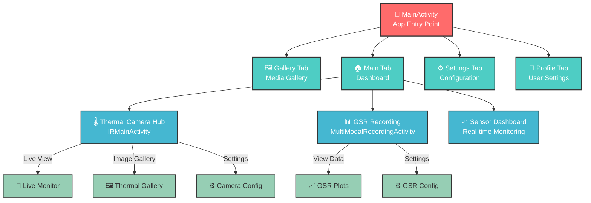

# IRCamera App Navigation Diagram

This document provides a comprehensive navigation structure overview of the IRCamera Android
application, covering all 210 activities across 4 modules.

**Architecture Overview**: The IRCamera platform contains 4 major modules:
- **App Module**: 92 activities - Core application infrastructure
- **Component thermalunified Module**: 93 activities - Complete thermal imaging system  
- **Component user Module**: 18 activities - User management and authentication
- **LibUnified Module**: 7 activities - Shared utilities and common components

## Module Distribution Overview

### App Module (92 Activities)
The core application module containing main infrastructure, sensor coordination, UI frameworks, testing suites, and primary application entry points.

### Component thermalunified Module (93 Activities)  
The largest module containing complete thermal imaging functionality including camera integration, image processing, analysis tools, thermal-specific UI components, and advanced thermal workflows.

### Component user Module (18 Activities)
Dedicated user management system handling authentication, profile management, user preferences, and user-specific configurations.

### LibUnified Module (7 Activities)
Shared utilities module providing common components, cross-module functionality, and reusable infrastructure components.

```mermaid
graph TB
    subgraph "Module Overview"
        Total[Total: 210 Activities<br/>4 Modules<br/>Multi-Modal Platform]
        
        App[App Module<br/>92 Activities (44%)<br/>Core Infrastructure]
        Thermal[Thermal Module<br/>93 Activities (44%)<br/>Imaging System]
        User[User Module<br/>18 Activities (9%)<br/>Management]
        Lib[LibUnified<br/>7 Activities (3%)<br/>Utilities]
        
        Total --> App
        Total --> Thermal
        Total --> User
        Total --> Lib
    end
    
    %% Styling
    classDef totalBox fill:#ff6b6b,stroke:#333,stroke-width:3px,color:#fff
    classDef moduleBox fill:#4ecdc4,stroke:#333,stroke-width:2px,color:#fff
    
    class Total totalBox
    class App,Thermal,User,Lib moduleBox
```

## Simplified Navigation Overview

For a high-level understanding, here's a simplified version of the key navigation flows:



## Complete App Navigation Flow

```mermaid
graph TB
    %% Main Entry Point
    MainActivity[MainActivity<br/>Main App Entry]
    
    %% Main Tabs (ViewPager)
    subgraph "Main App Tabs"
        GalleryTab[IRGalleryTabFragment<br/>Page 0: Gallery]
        MainTab[MainFragment<br/>Page 1: Main Dashboard]
        SettingsTab[MoreFragment<br/>Page 2: Settings]
        MineTab[MineFragment<br/>Page 3: Profile/Mine]
    end
    
    %% Thermal Module Entry
    subgraph "Thermal Unified Module"
        IRMainActivity[IRMainActivity<br/>Thermal Camera Hub]
        
        %% Thermal Tabs
        IRThermalTab[IRThermalFragment<br/>Thermal Controls]
        IRGalleryTab[IRGalleryTabFragment<br/>Thermal Gallery]
        AbilityTab[AbilityFragment<br/>Capabilities]
        PDFListTab[PDFListFragment<br/>Reports]
        MineTabThermal[MineFragment<br/>User Profile]
    end
    
    %% GSR/Sensor Activities - Streamlined Architecture
    subgraph "GSR Sensor Module - Consolidated"
        MultiModalActivity[MultiModalRecordingActivity<br/>🎭 Multi-Modal Recording Hub]
        GSRSettings[GSRSettingsActivity<br/>⚙️ GSR Configuration]
        GSRPlot[GSRPlotActivity<br/>📈 GSR Data Visualization]
        GSRGallery[GSRGalleryActivity<br/>🖼️ GSR Media Gallery]
        GSRDataView[GSRDataViewActivity<br/>📊 GSR Data Analysis]
        GSRVideoPlayer[GSRVideoPlayerActivity<br/>🎥 GSR Video Playback]
        SessionManager[SessionManagerActivity<br/>📝 Session Management]
        SessionDetail[SessionDetailActivity<br/>📋 Session Details]
        SessionExport[SessionExportActivity<br/>📤 Session Export]
        ShimmerConfig[ShimmerConfigActivity<br/>📡 Shimmer Configuration]
        GSRDeviceManagement[GSRDeviceManagementActivity<br/>📱 Device Management]
        GSRQuickRecording[GSRQuickRecordingActivity<br/>⚡ Quick Recording]
        ResearchTemplate[ResearchTemplateActivity<br/>🔬 Research Templates]
        GSRRawImageView[GSRRawImageViewActivity<br/>🖼️ Raw Image Viewer]
    end
    
    %% New Integration Activities
    subgraph "Enhanced Integration"
        HubSpokeIntegration[HubSpokeIntegrationActivity<br/>🔗 Hub-Spoke Integration]
        DualModeCamera[DualModeCameraActivity<br/>📷 Dual Camera Mode]
        DevicePairing[DevicePairingActivity<br/>🔗 Device Pairing]
    end
    
    %% Thermal Camera Module Activities - COMPLETE LIST
    subgraph "Thermal Camera Module - Component Activities"
        IRMainActivity[IRMainActivity<br/>🌡️ Thermal Camera Hub]
        IRMonitorActivity[IRMonitorActivity<br/>📹 Live Thermal Monitor]
        IRConfigActivity[IRConfigActivity<br/>⚙️ Camera Configuration]
        IRCorrectionActivity[IRCorrectionActivity<br/>🔧 Image Correction]
        IRCorrectionTwo[IRCorrectionTwoActivity<br/>🔧 Correction Step 2]
        IRCorrectionThree[IRCorrectionThreeActivity<br/>🔧 Correction Step 3] 
        IRCorrectionFour[IRCorrectionFourActivity<br/>🔧 Correction Step 4]
        IRGalleryDetail01[IRGalleryDetail01Activity<br/>🖼️ Gallery Detail 1]
        IRGalleryDetail04[IRGalleryDetail04Activity<br/>🖼️ Gallery Detail 4]
        IRGalleryHome[IRGalleryHomeActivity<br/>🏠 Gallery Home]
        IRLogMPChart[IRLogMPChartActivity<br/>📊 Log MP Charts]
        IRMonitorChart[IRMonitorChartActivity<br/>📈 Monitor Charts]
        IRThermalNight[IRThermalNightActivity<br/>🌙 Night Thermal]
        IRThermalPlus[IRThermalPlusActivity<br/>➕ Enhanced Thermal]
        IRVideoGSY[IRVideoGSYActivity<br/>🎥 Video GSY Player]
        GalleryActivity[GalleryActivity<br/>🖼️ Main Gallery]
        ConnectActivity[ConnectActivity<br/>🔗 Connection Interface]
        ThermalActivity[ThermalActivity<br/>🌡️ Thermal Processing]
        VideoActivity[VideoActivity<br/>🎥 Video Playback]
        MonitorActivity[MonitorActivity<br/>📊 Monitor Interface]
        MonitorChartActivity[MonitorChartActivity<br/>📈 Monitor Charts]
        MonitoryHomeActivity[MonitoryHomeActivity<br/>🏠 Monitor Home]
    end
    
    %% Thermal Lite Module
    subgraph "Thermal Lite Module"
        IRThermalLite[IRThermalLiteActivity<br/>🌡️ Lite Thermal]
        IRMonitorLite[IRMonitorLiteActivity<br/>📹 Lite Monitor]
        IRMonitorChartLite[IRMonitorChartLiteActivity<br/>📈 Lite Charts]
        IRCorrectionLiteThree[IRCorrectionLiteThreeActivity<br/>🔧 Lite Correction 3]
        IRCorrectionLiteFour[IRCorrectionLiteFourActivity<br/>🔧 Lite Correction 4]
        ImagePickIRLite[ImagePickIRLiteActivity<br/>🖼️ Lite Image Picker]
    end
    
    %% Report Module
    subgraph "Report Generation Module"
        ReportCreateFirst[ReportCreateFirstActivity<br/>📝 Report Create 1]
        ReportCreateSecond[ReportCreateSecondActivity<br/>📝 Report Create 2]
        ReportDetail[ReportDetailActivity<br/>📋 Report Details]
        ReportPreviewFirst[ReportPreviewFirstActivity<br/>👁️ Report Preview 1]
        ReportPreviewSecond[ReportPreviewSecondActivity<br/>👁️ Report Preview 2]
    end
    
    %% User Management Module
    subgraph "User Management Module"
        QuestionActivity[QuestionActivity<br/>❓ FAQ Interface]
        QuestionDetails[QuestionDetailsActivity<br/>❓ Question Details]
        ElectronicManual[ElectronicManualActivity<br/>📖 Electronic Manual]
        StorageSpace[StorageSpaceActivity<br/>💾 Storage Management]
        AutoSave[AutoSaveActivity<br/>💾 Auto-save Settings]
        DeviceDetails[DeviceDetailsActivity<br/>📱 Device Information]
        MoreActivity[MoreActivity<br/>➕ More Options]
        TISRActivity[TISRActivity<br/>🔧 TISR Functionality]
        UnitActivity[UnitActivity<br/>📏 Unit Settings]
    end
    
    %% Testing & Development - COMPLETE LIST
    subgraph "Testing & Development - Comprehensive"
        SensorDashboardTest[SensorDashboardTestActivity<br/>🧪 Sensor Testing]
        NetworkTest[NetworkClientTestActivity<br/>🌐 Network Testing]
        NetworkConfig[NetworkConfigActivity<br/>⚙️ Network Configuration]
        SimpleNetworkTest[SimpleNetworkTestActivity<br/>🌐 Simple Network Test]
        BLEIntegrationTest[BLEIntegrationTestActivity<br/>📡 BLE Integration Test]
        CompleteSessionTrial[CompleteSessionTrialActivity<br/>🔬 Complete Session Trial]
        CrossModalSyncTest[CrossModalSyncTestActivity<br/>🔄 Cross-Modal Sync Test]
        GSRBenchTest[GSRBenchTestActivity<br/>🏃 GSR Bench Test]
        GSRDataIntegrityTest[GSRDataIntegrityTestActivity<br/>🔒 GSR Data Integrity]
        GSRReconnectionTest[GSRReconnectionTestActivity<br/>🔄 GSR Reconnection Test]
        ParallelRecordingTest[ParallelRecordingTestActivity<br/>⏯️ Parallel Recording Test]
        RawCaptureTest[RawCaptureTestActivity<br/>📷 Raw Capture Test]
        RgbCameraTest[RgbCameraTestActivity<br/>📷 RGB Camera Test]
        SessionLifecycleTest[SessionLifecycleTestActivity<br/>♻️ Session Lifecycle Test]
        SynchronizationTest[SynchronizationTestActivity<br/>🔄 Synchronization Test]
        TimeSynchronizationTest[TimeSynchronizationTestActivity<br/>⏰ Time Sync Test]
        TimestampSyncVerification[TimestampSyncVerificationActivity<br/>⏰ Timestamp Sync Verification]
        TimestampUnificationTest[TimestampUnificationTestActivity<br/>⏰ Timestamp Unification Test]
    end
    
    %% Navigation Flows
    MainActivity --> GalleryTab
    MainActivity --> MainTab
    MainActivity --> SettingsTab
    MainActivity --> MineTab
    
    %% From Main Dashboard
    MainTab --> IRMainActivity
    MainTab --> FaultTolerantRecording
    MainTab --> ShimmerMvpActivity
    MainTab --> UnifiedSensorActivity
    
    %% From Thermal Hub
    IRMainActivity --> IRThermalTab
    IRMainActivity --> IRGalleryTab
    IRMainActivity --> AbilityTab
    IRMainActivity --> PDFListTab
    IRMainActivity --> MineTabThermal
    
    %% Thermal Navigation - COMPLETE FLOWS  
    IRThermalTab --> IRMainActivity
    IRMainActivity --> IRMonitorActivity
    IRMainActivity --> IRConfigActivity
    IRMainActivity --> IRCorrectionActivity
    IRMainActivity --> IRGalleryHome
    
    IRMonitorActivity --> IRMonitorChart
    IRMonitorActivity --> IRLogMPChart
    IRCorrectionActivity --> IRCorrectionTwo
    IRCorrectionTwo --> IRCorrectionThree
    IRCorrectionThree --> IRCorrectionFour
    
    IRGalleryHome --> IRGalleryDetail01
    IRGalleryHome --> IRGalleryDetail04
    IRGalleryHome --> GalleryActivity
    GalleryActivity --> VideoActivity
    
    %% Thermal Lite Flows
    IRThermalTab --> IRThermalLite
    IRThermalLite --> IRMonitorLite
    IRMonitorLite --> IRMonitorChartLite
    
    %% Report Generation Flows
    PDFListTab --> ReportCreateFirst  
    ReportCreateFirst --> ReportCreateSecond
    ReportCreateSecond --> ReportPreviewFirst
    ReportPreviewFirst --> ReportPreviewSecond
    ReportCreateSecond --> ReportDetail
    
    %% User Management Flows
    SettingsTab --> QuestionActivity
    SettingsTab --> ElectronicManual
    SettingsTab --> StorageSpace
    SettingsTab --> AutoSave
    QuestionActivity --> QuestionDetails
    SettingsTab --> DeviceDetails
    SettingsTab --> MoreActivity
    SettingsTab --> TISRActivity
    SettingsTab --> UnitActivity
    
    %% GSR Navigation - Enhanced Flows
    MainTab --> MultiModalActivity
    MultiModalActivity --> GSRSettings
    MultiModalActivity --> GSRPlot
    MultiModalActivity --> GSRGallery
    MultiModalActivity --> GSRDataView
    MultiModalActivity --> SessionManager
    
    SessionManager --> SessionDetail
    SessionManager --> SessionExport
    GSRDataView --> GSRVideoPlayer
    GSRDataView --> GSRRawImageView
    
    ShimmerMvpActivity --> ShimmerConfig
    UnifiedSensorActivity --> GSRDeviceManagement
    
    %% Enhanced Integration Flows
    MainTab --> HubSpokeIntegration
    MainTab --> DualModeCamera
    MainTab --> DevicePairing
    
    HubSpokeIntegration --> MultiModalActivity
    DualModeCamera --> IRMonitorActivity
    
    %% Report Navigation
    PDFListTab --> ReportCreateFirstActivity
    ReportCreateFirstActivity --> ReportCreateSecondActivity
    ReportCreateSecondActivity --> ReportPreviewSecondActivity
    ReportCreateSecondActivity --> ReportPickImgActivity
    
    %% Settings Navigation
    SettingsTab --> QuestionActivity
    SettingsTab --> ElectronicManualActivity
    SettingsTab --> StorageSpaceActivity
    SettingsTab --> PolicyActivity
    SettingsTab --> VersionActivity
    
    %% Testing Navigation
    MainTab --> SensorDashboardTestActivity
    MainTab --> NetworkConfigActivity
    MainTab --> SimpleNetworkTestActivity
    MainTab --> NetworkClientTestActivity
    MainTab --> SimplifiedMainActivity
    MainTab --> DeviceTypeActivity
    
    %% Key Navigation Managers
    NavigationManager[NavigationManager<br/>Central Router]
    RouterConfig[RouterConfig<br/>Route Definitions]
    
    NavigationManager -.-> RouterConfig
    
    %% Styling
    classDef mainEntry fill:#ff9999,stroke:#333,stroke-width:3px
    classDef tabFragment fill:#99ccff,stroke:#333,stroke-width:2px
    classDef thermalActivity fill:#ffcc99,stroke:#333,stroke-width:2px
    classDef gsrActivity fill:#99ff99,stroke:#333,stroke-width:2px
    classDef userActivity fill:#ffff99,stroke:#333,stroke-width:2px
    classDef testActivity fill:#cc99ff,stroke:#333,stroke-width:2px
    classDef navigationSystem fill:#ff99cc,stroke:#333,stroke-width:3px
    
    class MainActivity mainEntry
    class GalleryTab,MainTab,SettingsTab,MineTab,IRThermalTab,IRGalleryTab,AbilityTab,PDFListTab,MineTabThermal tabFragment
    class IRMainActivity,IRMonitorActivity,IRConfigActivity,IRCorrectionActivity,IRCorrectionTwo,IRCorrectionThree,IRCorrectionFour,IRGalleryDetail01,IRGalleryDetail04,IRGalleryHome,IRLogMPChart,IRMonitorChart,IRThermalNight,IRThermalPlus,IRVideoGSY,GalleryActivity,ConnectActivity,ThermalActivity,VideoActivity,MonitorActivity,MonitorChartActivity,MonitoryHomeActivity thermalActivity
    class IRThermalLite,IRMonitorLite,IRMonitorChartLite,IRCorrectionLiteThree,IRCorrectionLiteFour,ImagePickIRLite thermalActivity
    class MultiModalActivity,GSRSettings,GSRPlot,GSRGallery,GSRDataView,GSRVideoPlayer,SessionManager,SessionDetail,SessionExport,ShimmerConfig,GSRDeviceManagement,GSRQuickRecording,ResearchTemplate,GSRRawImageView gsrActivity
    class HubSpokeIntegration,DualModeCamera,DevicePairing gsrActivity
    class ReportCreateFirst,ReportCreateSecond,ReportDetail,ReportPreviewFirst,ReportPreviewSecond userActivity
    class QuestionActivity,QuestionDetails,ElectronicManual,StorageSpace,AutoSave,DeviceDetails,MoreActivity,TISRActivity,UnitActivity,PolicyActivity,VersionActivity userActivity
    class SensorDashboardTest,NetworkTest,NetworkConfig,SimpleNetworkTest,BLEIntegrationTest,CompleteSessionTrial,CrossModalSyncTest,GSRBenchTest,GSRDataIntegrityTest,GSRReconnectionTest,ParallelRecordingTest,RawCaptureTest,RgbCameraTest,SessionLifecycleTest,SynchronizationTest,TimeSynchronizationTest,TimestampSyncVerification,TimestampUnificationTest testActivity
    class NavigationManager,RouterConfig navigationSystem
```



## Navigation Key Points - Updated Architecture

### 1. Main Entry Structure

- **MainActivity** serves as the primary entry point with a 4-tab ViewPager
- Each tab hosts different functional areas of the app
- Navigation is controlled through MainActivityViewModel

### 2. Enhanced Integration Architecture

- **HubSpokeIntegrationActivity** - New centralized integration hub
- **DualModeCameraActivity** - Enhanced dual camera mode support
- **DevicePairingActivity** - Streamlined device pairing workflow
- **Improved multi-modal workflows** with better sensor coordination

### 3. Streamlined GSR Module

- **Consolidated recording workflows** through enhanced MultiModalRecordingActivity
- **Expanded session management** with detailed session analysis and export capabilities
- **Enhanced data visualization** with improved GSR plotting and raw image viewing
- **Research template system** for standardized experimental protocols

### 2. Tab Structure

- **Page 0 (Gallery)**: IRGalleryTabFragment - Media gallery for thermal images
- **Page 1 (Main)**: MainFragment - Primary dashboard with sensor controls
- **Page 2 (Settings)**: MoreFragment - App settings and configuration
- **Page 3 (Mine)**: MineFragment - User profile and personal settings

### 3. Thermal Camera Module

- **IRMainActivity** serves as thermal camera hub with 5 tabs
- Provides comprehensive thermal imaging capabilities
- Supports both TC007 and standard thermal cameras
- Includes monitoring, gallery, reports, and configuration

### 4. GSR Sensor Integration

- Multiple GSR-related activities for Shimmer3 sensor management
- **MultiModalRecordingActivity** for synchronized thermal+GSR recording
- Device configuration and data visualization capabilities
- Session management for research workflows

### 5. Navigation System

- **NavigationManager** handles all inter-activity navigation
- **RouterConfig** defines route constants for different modules
- Type-safe navigation with parameter passing
- Support for both Fragment and Activity navigation

### 6. Module Architecture

- **Component-based architecture** with separate modules
- **Thermal Unified Module** for thermal camera functionality
- **User Module** for settings and profile management
- **GSR Recording Module** for sensor data collection

### 7. Testing & Development

- Dedicated test activities for development and debugging
- Network configuration and testing capabilities
- Sensor dashboard testing interface
- Simplified interfaces for specific use cases

## Usage Examples

### Navigate to Thermal Camera

```kotlin
NavigationManager.build(RouterConfig.IR_MAIN)
    .withBoolean(ExtraKeyConfig.IS_TC007, isTC007Device)
    .navigation(context)
```

### Navigate to GSR Recording

```kotlin
NavigationManager.build(RouterConfig.GSR_MULTI_MODAL)
    .navigation(context)
```

### Navigate to Settings

```kotlin
NavigationManager.build(RouterConfig.ELECTRONIC_MANUAL)
    .navigation(context)
```

This navigation structure provides a comprehensive overview of how different views and activities
are connected within
the IRCamera application, making it easier to understand the app's architecture and navigation flow.