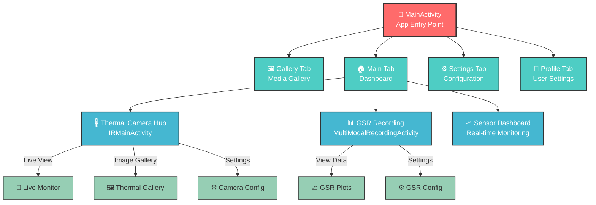

# IRCamera App Navigation Diagram

This document provides a comprehensive mermaid graph showing the navigation structure of the IRCamera Android application.

## Simplified Navigation Overview

For a high-level understanding, here's a simplified version of the key navigation flows:



## Complete App Navigation Flow

```mermaid
graph TB
    %% Main Entry Point
    MainActivity[MainActivity<br/>Main App Entry]
    
    %% Main Tabs (ViewPager)
    subgraph "Main App Tabs"
        GalleryTab[IRGalleryTabFragment<br/>Page 0: Gallery]
        MainTab[MainFragment<br/>Page 1: Main Dashboard]
        SettingsTab[MoreFragment<br/>Page 2: Settings]
        MineTab[MineFragment<br/>Page 3: Profile/Mine]
    end
    
    %% Thermal Module Entry
    subgraph "Thermal Unified Module"
        IRMainActivity[IRMainActivity<br/>Thermal Camera Hub]
        
        %% Thermal Tabs
        IRThermalTab[IRThermalFragment<br/>Thermal Controls]
        IRGalleryTab[IRGalleryTabFragment<br/>Thermal Gallery]
        AbilityTab[AbilityFragment<br/>Capabilities]
        PDFListTab[PDFListFragment<br/>Reports]
        MineTabThermal[MineFragment<br/>User Profile]
    end
    
    %% GSR/Sensor Activities
    subgraph "GSR Sensor Module"
        MultiModalActivity[MultiModalRecordingActivity<br/>Multi-Modal Recording]
        GSRSettingsActivity[GSRSettingsActivity<br/>GSR Configuration]
        GSRPlotActivity[GSRPlotActivity<br/>GSR Data Visualization]
        GSRGalleryActivity[GSRGalleryActivity<br/>GSR Media Gallery]
        ShimmerMvpActivity[ShimmerMvpActivity<br/>Shimmer MVP Interface]
        UnifiedSensorActivity[UnifiedSensorActivity<br/>Unified Sensor Platform]
        SessionManagerActivity[SessionManagerActivity<br/>Session Management]
        ShimmerConfigActivity[ShimmerConfigActivity<br/>Shimmer Configuration]
        GSRDeviceManagementActivity[GSRDeviceManagementActivity<br/>Device Management]
        FaultTolerantRecording[FaultTolerantRecordingActivity<br/>Enhanced Recording]
    end
    
    %% Thermal Camera Activities
    subgraph "Thermal Camera Activities"
        IRMonitorActivity[IRMonitorActivity<br/>Live Monitoring]
        IRConfigActivity[IRConfigActivity<br/>Camera Settings]
        IRMonitorChartActivity[IRMonitorChartActivity<br/>Data Charts]
        IRCorrectionActivity[IRCorrectionActivity<br/>Image Correction]
        IRThermalPlusActivity[IRThermalPlusActivity<br/>Advanced Thermal]
        IRThermalNightActivity[IRThermalNightActivity<br/>Night Vision]
        GalleryActivity[GalleryActivity<br/>Image Gallery]
        VideoActivity[VideoActivity<br/>Video Playback]
    end
    
    %% Lite Thermal Activities
    subgraph "Thermal Lite Module"
        IRThermalLiteActivity[IRThermalLiteActivity<br/>Lite Interface]
        IRMonitorLiteActivity[IRMonitorLiteActivity<br/>Lite Monitoring]
        IRMonitorChartLiteActivity[IRMonitorChartLiteActivity<br/>Lite Charts]
    end
    
    %% Report Activities
    subgraph "Report Module"
        ReportCreateFirstActivity[ReportCreateFirstActivity<br/>Report Creation Step 1]
        ReportCreateSecondActivity[ReportCreateSecondActivity<br/>Report Creation Step 2]
        ReportPreviewSecondActivity[ReportPreviewSecondActivity<br/>Report Preview]
        ReportPickImgActivity[ReportPickImgActivity<br/>Image Selection]
    end
    
    %% User Module Activities
    subgraph "User Management"
        QuestionActivity[QuestionActivity<br/>FAQ/Questions]
        ElectronicManualActivity[ElectronicManualActivity<br/>User Manual]
        StorageSpaceActivity[StorageSpaceActivity<br/>Storage Management]
        PolicyActivity[PolicyActivity<br/>Privacy Policy]
        VersionActivity[VersionActivity<br/>App Version Info]
    end
    
    %% Testing & Development
    subgraph "Testing & Development"
        SensorDashboardTestActivity[SensorDashboardTestActivity<br/>Sensor Testing]
        NetworkConfigActivity[NetworkConfigActivity<br/>Network Configuration]
        SimpleNetworkTestActivity[SimpleNetworkTestActivity<br/>Network Testing]
        NetworkClientTestActivity[NetworkClientTestActivity<br/>Client Testing]
        SimplifiedMainActivity[SimplifiedMainActivity<br/>Simplified Interface]
        DeviceTypeActivity[DeviceTypeActivity<br/>Device Selection]
    end
    
    %% Navigation Flows
    MainActivity --> GalleryTab
    MainActivity --> MainTab
    MainActivity --> SettingsTab
    MainActivity --> MineTab
    
    %% From Main Dashboard
    MainTab --> IRMainActivity
    MainTab --> FaultTolerantRecording
    MainTab --> ShimmerMvpActivity
    MainTab --> UnifiedSensorActivity
    
    %% From Thermal Hub
    IRMainActivity --> IRThermalTab
    IRMainActivity --> IRGalleryTab
    IRMainActivity --> AbilityTab
    IRMainActivity --> PDFListTab
    IRMainActivity --> MineTabThermal
    
    %% Thermal Navigation
    IRThermalTab --> IRMonitorActivity
    IRThermalTab --> IRThermalPlusActivity
    IRThermalTab --> IRThermalLiteActivity
    IRThermalTab --> IRThermalNightActivity
    
    IRGalleryTab --> GalleryActivity
    IRGalleryTab --> VideoActivity
    
    %% Monitoring Flow
    IRMonitorActivity --> IRMonitorChartActivity
    IRMonitorActivity --> IRConfigActivity
    IRMonitorActivity --> IRCorrectionActivity
    
    %% Lite Module Flow
    IRThermalLiteActivity --> IRMonitorLiteActivity
    IRMonitorLiteActivity --> IRMonitorChartLiteActivity
    
    %% GSR Navigation
    MainTab --> MultiModalActivity
    MultiModalActivity --> GSRSettingsActivity
    MultiModalActivity --> GSRPlotActivity
    MultiModalActivity --> GSRGalleryActivity
    MultiModalActivity --> SessionManagerActivity
    
    ShimmerMvpActivity --> ShimmerConfigActivity
    UnifiedSensorActivity --> GSRDeviceManagementActivity
    
    %% Report Navigation
    PDFListTab --> ReportCreateFirstActivity
    ReportCreateFirstActivity --> ReportCreateSecondActivity
    ReportCreateSecondActivity --> ReportPreviewSecondActivity
    ReportCreateSecondActivity --> ReportPickImgActivity
    
    %% Settings Navigation
    SettingsTab --> QuestionActivity
    SettingsTab --> ElectronicManualActivity
    SettingsTab --> StorageSpaceActivity
    SettingsTab --> PolicyActivity
    SettingsTab --> VersionActivity
    
    %% Testing Navigation
    MainTab --> SensorDashboardTestActivity
    MainTab --> NetworkConfigActivity
    MainTab --> SimpleNetworkTestActivity
    MainTab --> NetworkClientTestActivity
    MainTab --> SimplifiedMainActivity
    MainTab --> DeviceTypeActivity
    
    %% Key Navigation Managers
    NavigationManager[NavigationManager<br/>Central Router]
    RouterConfig[RouterConfig<br/>Route Definitions]
    
    NavigationManager -.-> RouterConfig
    
    %% Styling
    classDef mainEntry fill:#ff9999,stroke:#333,stroke-width:3px
    classDef tabFragment fill:#99ccff,stroke:#333,stroke-width:2px
    classDef thermalActivity fill:#ffcc99,stroke:#333,stroke-width:2px
    classDef gsrActivity fill:#99ff99,stroke:#333,stroke-width:2px
    classDef userActivity fill:#ffff99,stroke:#333,stroke-width:2px
    classDef testActivity fill:#cc99ff,stroke:#333,stroke-width:2px
    classDef navigationSystem fill:#ff99cc,stroke:#333,stroke-width:3px
    
    class MainActivity mainEntry
    class GalleryTab,MainTab,SettingsTab,MineTab,IRThermalTab,IRGalleryTab,AbilityTab,PDFListTab,MineTabThermal tabFragment
    class IRMainActivity,IRMonitorActivity,IRConfigActivity,IRMonitorChartActivity,IRCorrectionActivity,IRThermalPlusActivity,IRThermalNightActivity,GalleryActivity,VideoActivity,IRThermalLiteActivity,IRMonitorLiteActivity,IRMonitorChartLiteActivity thermalActivity
    class MultiModalActivity,GSRSettingsActivity,GSRPlotActivity,GSRGalleryActivity,ShimmerMvpActivity,UnifiedSensorActivity,SessionManagerActivity,ShimmerConfigActivity,GSRDeviceManagementActivity,FaultTolerantRecording gsrActivity
    class QuestionActivity,ElectronicManualActivity,StorageSpaceActivity,PolicyActivity,VersionActivity,ReportCreateFirstActivity,ReportCreateSecondActivity,ReportPreviewSecondActivity,ReportPickImgActivity userActivity
    class SensorDashboardTestActivity,NetworkConfigActivity,SimpleNetworkTestActivity,NetworkClientTestActivity,SimplifiedMainActivity,DeviceTypeActivity testActivity
    class NavigationManager,RouterConfig navigationSystem
```



## Navigation Key Points

### 1. Main Entry Structure
- **MainActivity** serves as the primary entry point with a 4-tab ViewPager
- Each tab hosts different functional areas of the app
- Navigation is controlled through MainActivityViewModel

### 2. Tab Structure
- **Page 0 (Gallery)**: IRGalleryTabFragment - Media gallery for thermal images
- **Page 1 (Main)**: MainFragment - Primary dashboard with sensor controls
- **Page 2 (Settings)**: MoreFragment - App settings and configuration
- **Page 3 (Mine)**: MineFragment - User profile and personal settings

### 3. Thermal Camera Module
- **IRMainActivity** serves as thermal camera hub with 5 tabs
- Provides comprehensive thermal imaging capabilities
- Supports both TC007 and standard thermal cameras
- Includes monitoring, gallery, reports, and configuration

### 4. GSR Sensor Integration
- Multiple GSR-related activities for Shimmer3 sensor management
- **MultiModalRecordingActivity** for synchronized thermal+GSR recording
- Device configuration and data visualization capabilities
- Session management for research workflows

### 5. Navigation System
- **NavigationManager** handles all inter-activity navigation
- **RouterConfig** defines route constants for different modules
- Type-safe navigation with parameter passing
- Support for both Fragment and Activity navigation

### 6. Module Architecture
- **Component-based architecture** with separate modules
- **Thermal Unified Module** for thermal camera functionality
- **User Module** for settings and profile management
- **GSR Recording Module** for sensor data collection

### 7. Testing & Development
- Dedicated test activities for development and debugging
- Network configuration and testing capabilities
- Sensor dashboard testing interface
- Simplified interfaces for specific use cases

## Usage Examples

### Navigate to Thermal Camera
```kotlin
NavigationManager.build(RouterConfig.IR_MAIN)
    .withBoolean(ExtraKeyConfig.IS_TC007, isTC007Device)
    .navigation(context)
```

### Navigate to GSR Recording
```kotlin
NavigationManager.build(RouterConfig.GSR_MULTI_MODAL)
    .navigation(context)
```

### Navigate to Settings
```kotlin
NavigationManager.build(RouterConfig.ELECTRONIC_MANUAL)
    .navigation(context)
```

This navigation structure provides a comprehensive overview of how different views and activities are connected within the IRCamera application, making it easier to understand the app's architecture and navigation flow.