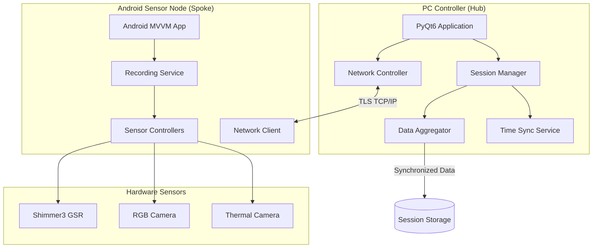
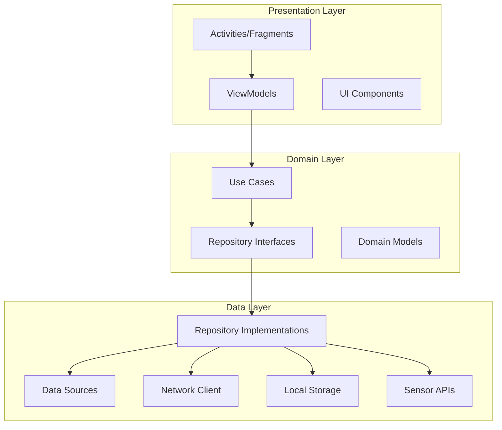
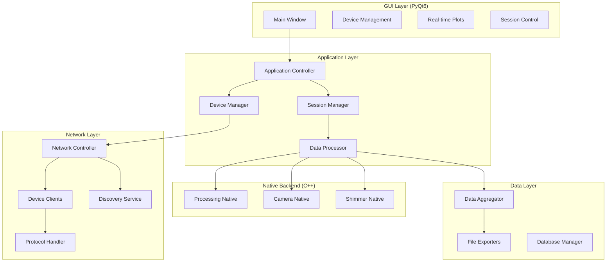
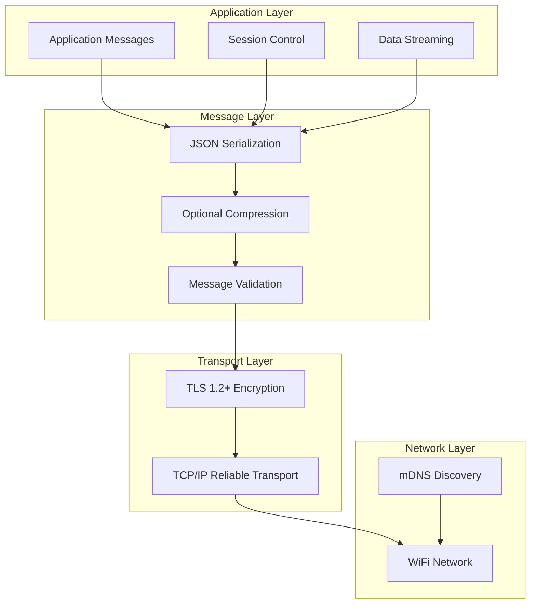
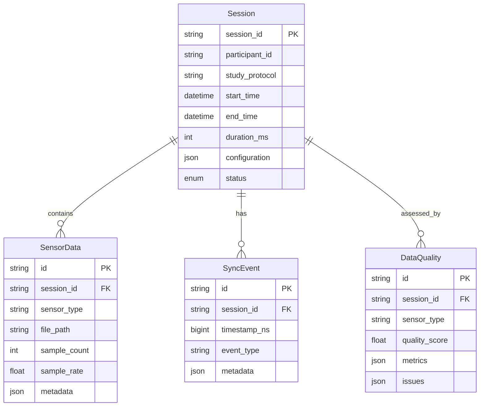
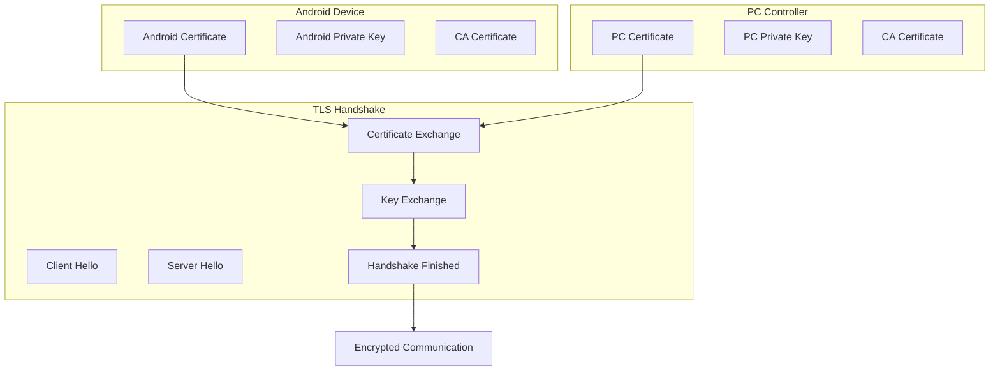
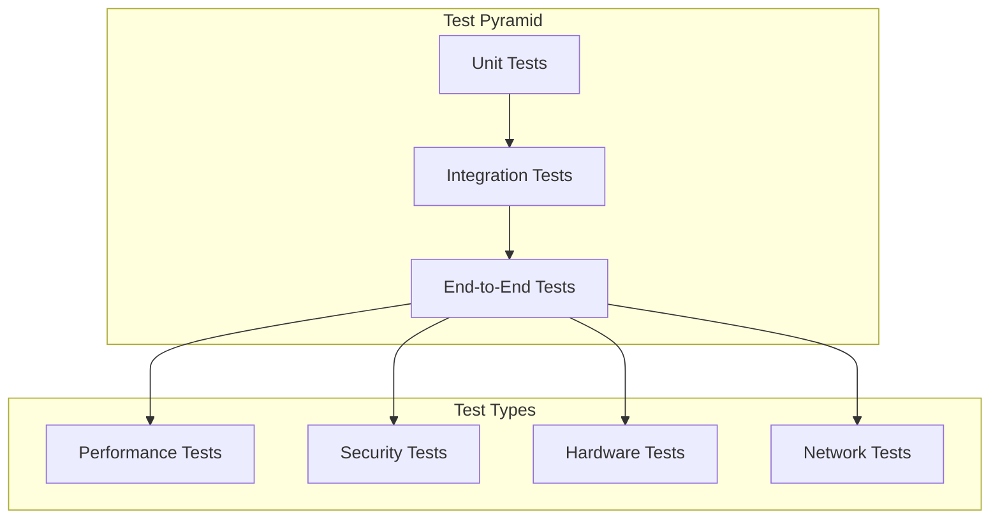

# Architecture Guide - MPDC4GSR Platform

Comprehensive system architecture documentation for the Multi-Modal Physiological Sensing Platform.

## 🏛️ System Overview

### High-Level Architecture

The MPDC4GSR platform implements a **Hub-and-Spoke** distributed architecture optimized for
synchronized multi-modal data collection:



### Design Principles

#### 1. Distributed Processing

- **Hub (PC)**: Central coordination, data aggregation, real-time analysis
- **Spoke (Android)**: Local sensor management, data capture, preprocessing

#### 2. Fault Tolerance

- **Graceful degradation**: System continues with available sensors
- **Automatic recovery**: Reconnection handling for network/sensor failures
- **Data preservation**: Local storage with sync-on-reconnect

#### 3. Scalability

- **Multiple devices**: Hub can manage multiple Android nodes simultaneously
- **Sensor modularity**: New sensors integrate via common interfaces
- **Performance isolation**: C++ backend for high-throughput operations

## 📱 Android Architecture (Sensor Node)

### MVVM Architecture Pattern



### Package Architecture

```
com.topdon.irCamera/
├── ui/                           # Presentation Layer
│   ├── activities/
│   │   ├── MainActivity.kt       # Main entry point
│   │   ├── MultiModalRecordingActivity.kt  # Recording interface
│   │   └── SettingsActivity.kt   # Configuration
│   ├── fragments/
│   │   ├── RecordingFragment.kt  # Recording controls
│   │   ├── DeviceFragment.kt     # Device management
│   │   └── DataFragment.kt       # Data visualization
│   ├── viewmodels/
│   │   ├── RecordingViewModel.kt # Recording state management
│   │   ├── DeviceViewModel.kt    # Device connection state
│   │   └── DataViewModel.kt      # Data stream management
│   └── adapters/
│       ├── DeviceListAdapter.kt  # Device selection
│       └── SessionListAdapter.kt # Session history
├── domain/                       # Business Logic Layer
│   ├── usecases/
│   │   ├── StartRecordingUseCase.kt    # Recording orchestration
│   │   ├── SyncDevicesUseCase.kt       # Time synchronization
│   │   └── ManageSessionUseCase.kt     # Session lifecycle
│   ├── repositories/
│   │   ├── RecordingRepository.kt      # Recording data interface
│   │   ├── DeviceRepository.kt         # Device management interface
│   │   └── SessionRepository.kt        # Session data interface
│   └── models/
│       ├── Session.kt            # Session domain model
│       ├── RecordingConfig.kt    # Configuration model
│       └── SensorData.kt         # Sensor data models
├── data/                         # Data Access Layer
│   ├── repositories/
│   │   ├── RecordingRepositoryImpl.kt  # Recording implementation
│   │   ├── DeviceRepositoryImpl.kt     # Device implementation
│   │   └── SessionRepositoryImpl.kt    # Session implementation
│   ├── datasources/
│   │   ├── local/
│   │   │   ├── SessionDatabase.kt      # Room database
│   │   │   ├── FileManager.kt          # File operations
│   │   │   └── PreferencesManager.kt   # Settings storage
│   │   ├── remote/
│   │   │   ├── NetworkClient.kt        # PC communication
│   │   │   └── ProtocolHandler.kt      # Message parsing
│   │   └── sensors/
│   │       ├── ShimmerDataSource.kt    # GSR sensor interface
│   │       ├── CameraDataSource.kt     # Camera interface
│   │       └── ThermalDataSource.kt    # Thermal interface
├── sensors/                      # Sensor Integration Layer
│   ├── interfaces/
│   │   └── SensorRecorder.kt     # Common sensor interface
│   ├── gsr/
│   │   ├── GSRRecorder.kt        # Shimmer3 integration
│   │   ├── ShimmerManager.kt     # Bluetooth management
│   │   └── GSRDataProcessor.kt   # Signal processing
│   ├── camera/
│   │   ├── RgbCameraRecorder.kt  # RGB video recording
│   │   ├── RawImageRecorder.kt   # DNG capture
│   │   └── CameraManager.kt      # Camera lifecycle
│   └── thermal/
│       ├── ThermalRecorder.kt    # Thermal recording
│       └── ThermalProcessor.kt   # IR data processing
├── network/                      # Network Communication Layer
│   ├── NetworkClient.kt          # TCP client implementation
│   ├── MessageHandler.kt         # Protocol message handling
│   ├── DiscoveryService.kt       # PC Controller discovery
│   └── SecurityManager.kt        # TLS encryption
├── service/                      # Background Services
│   ├── RecordingService.kt       # Foreground recording service
│   ├── NetworkService.kt         # Background connectivity
│   └── SyncService.kt            # Time synchronization
└── utils/                        # Utility Classes
    ├── TimeManager.kt            # Time utilities
    ├── FileUtils.kt              # File operations
    ├── SecurityUtils.kt          # Encryption utilities
    └── Extensions.kt             # Kotlin extensions
```

### Key Android Components

#### Recording Service Architecture

```kotlin
@HiltAndroidApp
class RecordingService : Service() {
    
    @Inject lateinit var recordingController: RecordingController
    @Inject lateinit var networkClient: NetworkClient
    @Inject lateinit var timeManager: TimeManager
    
    private val serviceScope = CoroutineScope(
        SupervisorJob() + Dispatchers.Default
    )
    
    override fun onStartCommand(intent: Intent?, flags: Int, startId: Int): Int {
        when (intent?.action) {
            ACTION_START_RECORDING -> startRecording(intent)
            ACTION_STOP_RECORDING -> stopRecording()
            ACTION_SYNC_FLASH -> triggerSyncFlash()
        }
        return START_STICKY
    }
    
    private fun startRecording(intent: Intent) {
        serviceScope.launch {
            try {
                val config = intent.getParcelableExtra<SessionConfig>("config")
                val session = recordingController.startRecording(config!!)

                networkClient.sendMessage(RecordingStartedMessage(session.id))

                startForeground(NOTIFICATION_ID, createNotification(session))
                
            } catch (e: Exception) {
                Log.e(TAG, "Failed to start recording", e)
                stopSelf()
            }
        }
    }
}
```

#### Sensor Recorder Interface

```kotlin
interface SensorRecorder {
    suspend fun initialize(): Result<Unit>
    suspend fun startRecording(session: Session, syncTime: Long): Result<Unit>
    suspend fun stopRecording(): Result<SessionData>
    suspend fun addSyncMarker(type: String, metadata: Map<String, Any>)
    
    fun isRecording(): Boolean
    fun getRecordingDuration(): Duration
    fun getCurrentSampleRate(): Float
    fun getDataQuality(): DataQuality

    fun observeData(): Flow<SensorSample>
    fun observeStatus(): Flow<SensorStatus>
}
```

## 🖥️ PC Controller Architecture (Hub)

### Modular Architecture



### Core Components

#### Session Manager

```python
class SessionManager:
    """Central coordinator for multi-device recording sessions"""
    
    def __init__(self):
        self.devices: Dict[str, Device] = {}
        self.current_session: Optional[Session] = None
        self.data_aggregator = DataAggregator()
        self.time_sync_service = TimeSyncService()
        
    async def start_session(self, config: SessionConfig) -> Session:
        """Start synchronized recording across all connected devices"""
        
        # Validate device readiness
        ready_devices = await self._check_device_readiness()
        if not ready_devices:
            raise NoDevicesAvailableError()
            
        # Calculate time synchronization offsets
        sync_offsets = await self._calculate_sync_offsets(ready_devices)
        
        # Create session
        session = Session.create(config)
        
        # Send start commands to all devices
        start_tasks = [
            device.send_start_command(session.id, offset)
            for device, offset in zip(ready_devices, sync_offsets)
        ]
        
        results = await asyncio.gather(*start_tasks, return_exceptions=True)
        
        # Handle partial failures
        successful_devices = [
            device for device, result in zip(ready_devices, results)
            if not isinstance(result, Exception)
        ]
        
        if not successful_devices:
            raise SessionStartError("No devices successfully started")
            
        self.current_session = session
        self._start_data_collection(session, successful_devices)
        
        return session
        
    async def _calculate_sync_offsets(self, devices: List[Device]) -> List[int]:
        """Calculate time synchronization offsets for each device"""
        offsets = []
        
        for device in devices:
            # Perform NTP-like time sync handshake
            t1 = time.time_ns()
            response = await device.send_time_sync_request(t1)
            t4 = time.time_ns()
            
            t2 = response.device_receive_time
            t3 = response.device_send_time
            
            # Calculate offset and round-trip delay
            offset = ((t2 - t1) + (t3 - t4)) // 2
            delay = (t4 - t1) - (t3 - t2)
            
            offsets.append(offset)
            
            logger.info(f"Device {device.id}: offset={offset}ns, delay={delay}ns")
            
        return offsets
```

#### Network Controller

```python
class NetworkController(QThread):
    """Manages network communication with Android devices"""
    
    device_discovered = pyqtSignal(Device)
    device_connected = pyqtSignal(Device)
    device_disconnected = pyqtSignal(Device)
    data_received = pyqtSignal(Device, dict)
    
    def __init__(self):
        super().__init__()
        self.discovery_service = DiscoveryService()
        self.server_socket: Optional[socket.socket] = None
        self.client_handlers: Dict[str, ClientHandler] = {}
        self.running = False
        
    def run(self):
        """Main network thread"""
        asyncio.run(self._async_main())
        
    async def _async_main(self):
        """Async main loop for network operations"""
        # Start discovery service
        discovery_task = asyncio.create_task(
            self.discovery_service.start_discovery()
        )
        
        # Start TCP server
        server_task = asyncio.create_task(
            self._start_tcp_server()
        )
        
        # Handle discovery results
        discovery_handler = asyncio.create_task(
            self._handle_discovery_results()
        )
        
        try:
            await asyncio.gather(
                discovery_task, 
                server_task, 
                discovery_handler
            )
        except Exception as e:
            logger.error(f"Network controller error: {e}")
        finally:
            await self._cleanup()
            
    async def _start_tcp_server(self):
        """Start TCP server for device connections"""
        server = await asyncio.start_server(
            self._handle_client_connection,
            host='0.0.0.0',
            port=8080,
            ssl=self._create_ssl_context()
        )
        
        self.server_socket = server
        logger.info("TCP server started on port 8080")
        
        async with server:
            await server.serve_forever()
            
    async def _handle_client_connection(self, reader, writer):
        """Handle new client connection"""
        client_addr = writer.get_extra_info('peername')
        logger.info(f"New client connection from {client_addr}")
        
        try:
            # Perform authentication handshake
            device = await self._authenticate_device(reader, writer)
            
            # Create client handler
            handler = ClientHandler(device, reader, writer)
            self.client_handlers[device.id] = handler
            
            # Signal device connection
            self.device_connected.emit(device)
            
            # Start message handling
            await handler.start_message_loop()
            
        except Exception as e:
            logger.error(f"Client connection error: {e}")
        finally:
            writer.close()
            await writer.wait_closed()
```

#### Native Backend Integration

```cpp

class NativeShimmer {
public:
    NativeShimmer(const std::string& port, int baud_rate = 115200) 
        : port_(port), baud_rate_(baud_rate) {

        sample_queue_ = std::make_unique<lockfree::spsc_queue<GSRSample>>(4096);

        sample_buffer_.reserve(1000);
    }
    
    bool connect() {
        try {

            serial_port_ = std::make_unique<boost::asio::serial_port>(io_context_);
            serial_port_->open(port_);

            serial_port_->set_option(boost::asio::serial_port_base::baud_rate(baud_rate_));
            serial_port_->set_option(boost::asio::serial_port_base::character_size(8));
            serial_port_->set_option(boost::asio::serial_port_base::parity(
                boost::asio::serial_port_base::parity::none));
            serial_port_->set_option(boost::asio::serial_port_base::stop_bits(
                boost::asio::serial_port_base::stop_bits::one));

            acquisition_thread_ = std::thread(&NativeShimmer::acquisition_loop, this);
            
            return true;
            
        } catch (const std::exception& e) {
            std::cerr << "Connection failed: " << e.what() << std::endl;
            return false;
        }
    }
    
    std::vector<GSRSample> get_samples() {
        std::vector<GSRSample> samples;
        samples.reserve(sample_queue_->read_available());
        
        GSRSample sample;
        while (sample_queue_->pop(sample)) {
            samples.push_back(sample);
        }
        
        return samples;
    }
    
private:
    void acquisition_loop() {
        std::array<uint8_t, 256> read_buffer;
        PacketParser parser;
        
        while (running_.load()) {
            try {

                size_t bytes_read = boost::asio::read(
                    *serial_port_,
                    boost::asio::buffer(read_buffer),
                    boost::asio::transfer_at_least(1)
                );

                auto packets = parser.parse_buffer(read_buffer.data(), bytes_read);
                
                for (const auto& packet : packets) {
                    if (auto gsr_sample = parse_gsr_packet(packet)) {

                        if (!sample_queue_->push(*gsr_sample)) {

                            std::cerr << "Sample queue overflow" << std::endl;
                        }
                    }
                }
                
            } catch (const std::exception& e) {
                std::cerr << "Acquisition error: " << e.what() << std::endl;

                if (!reconnect()) {
                    break;
                }
            }
        }
    }
    
    std::unique_ptr<lockfree::spsc_queue<GSRSample>> sample_queue_;
    std::unique_ptr<boost::asio::serial_port> serial_port_;
    boost::asio::io_context io_context_;
    std::thread acquisition_thread_;
    std::atomic<bool> running_{false};
    std::string port_;
    int baud_rate_;
};

PYBIND11_MODULE(native_backend, m) {
    py::class_<GSRSample>(m, "GSRSample")
        .def_readonly("timestamp", &GSRSample::timestamp)
        .def_readonly("conductance", &GSRSample::conductance)
        .def_readonly("resistance", &GSRSample::resistance)
        .def_readonly("sample_index", &GSRSample::sample_index);
        
    py::class_<NativeShimmer>(m, "NativeShimmer")
        .def(py::init<const std::string&, int>())
        .def("connect", &NativeShimmer::connect)
        .def("disconnect", &NativeShimmer::disconnect)
        .def("start_acquisition", &NativeShimmer::start_acquisition)
        .def("stop_acquisition", &NativeShimmer::stop_acquisition)
        .def("get_samples", &NativeShimmer::get_samples)
        .def("is_connected", &NativeShimmer::is_connected)
        .def("get_sample_rate", &NativeShimmer::get_sample_rate);
}
```

## 🌐 Communication Protocol

### Protocol Stack



### Message Format Specification

#### Base Message Structure

```json
{
    "message_id": "uuid-v4-string",
    "timestamp": "2024-01-15T14:30:22.123456Z",
    "sender_id": "device-identifier",
    "recipient_id": "target-device-id",
    "message_type": "command|response|data|heartbeat|error",
    "sequence_number": 12345,
    "payload": {

    },
    "checksum": "sha256-hash"
}
```

#### Command Messages

```json

{
    "message_type": "command",
    "payload": {
        "action": "start_recording",
        "session_id": "session_20240115_143022",
        "participant_id": "P001",
        "study_protocol": "StressTest_V2",
        "sync_offset_ns": 1503425,
        "configuration": {
            "recording_duration_ms": 300000,
            "rgb_video": {
                "resolution": "4K",
                "frame_rate": 60,
                "codec": "H.264",
                "bitrate_mbps": 25
            },
            "raw_capture": {
                "enabled": true,
                "frame_rate": 30,
                "format": "DNG"
            },
            "gsr_sampling": {
                "rate_hz": 128,
                "filters": ["lowpass_5hz"],
                "calibration": "auto"
            },
            "thermal_recording": {
                "enabled": true,
                "frame_rate": 30,
                "temperature_range": "0-50C"
            }
        }
    }
}

{
    "message_type": "command",
    "payload": {
        "action": "sync_flash",
        "flash_duration_ms": 100,
        "flash_intensity": 1.0,
        "trigger_timestamp": 1705328525000
    }
}

{
    "message_type": "command",
    "payload": {
        "action": "stop_recording",
        "session_id": "session_20240115_143022",
        "emergency_stop": false
    }
}
```

#### Data Streaming Messages

```json

{
    "message_type": "data",
    "payload": {
        "data_type": "gsr_sample",
        "session_id": "session_20240115_143022",
        "device_timestamp": 1705328522123456789,
        "sync_timestamp": 1705328522125960214,
        "samples": [
            {
                "conductance_us": 12.347,
                "resistance_kohms": 80.923,
                "sample_index": 12345,
                "quality_score": 0.95
            }
        ]
    }
}

{
    "message_type": "data",
    "payload": {
        "data_type": "video_metadata",
        "session_id": "session_20240115_143022",
        "frame_number": 1800,
        "timestamp": 1705328522123456789,
        "resolution": "3840x2160",
        "exposure_time_ms": 16.67,
        "iso": 100
    }
}
```

#### Response Messages

```json

{
    "message_type": "response",
    "payload": {
        "response_to": "start_recording",
        "status": "success|error",
        "message": "Recording started successfully",
        "session_id": "session_20240115_143022",
        "estimated_duration_ms": 300000,
        "active_sensors": ["rgb_camera", "gsr_sensor", "thermal_camera"],
        "data_quality": {
            "gsr_signal_quality": 0.92,
            "camera_focus_quality": 0.88,
            "network_latency_ms": 15
        }
    }
}

{
    "message_type": "error",
    "payload": {
        "error_code": "SENSOR_UNAVAILABLE",
        "error_message": "Shimmer3 GSR sensor not connected",
        "suggested_action": "Check Bluetooth pairing and retry",
        "error_details": {
            "sensor_type": "gsr",
            "last_known_status": "disconnected",
            "retry_possible": true
        }
    }
}
```

### Time Synchronization Protocol

#### NTP-like Handshake

```python
async def calculate_time_offset(device: Device) -> int:
    """Calculate time offset using NTP-like 4-timestamp method"""
    
    # T1: PC sends time sync request
    t1 = time.time_ns()
    request = {
        "message_type": "command",
        "payload": {
            "action": "time_sync",
            "pc_timestamp": t1
        }
    }
    
    # Send request and wait for response
    response = await device.send_request(request)
    
    # T4: PC receives response
    t4 = time.time_ns()
    
    # Extract Android timestamps
    t2 = response.payload["android_receive_timestamp"]  # Android received request
    t3 = response.payload["android_send_timestamp"]     # Android sent response
    
    # Calculate offset and round-trip delay
    offset = ((t2 - t1) + (t3 - t4)) // 2
    delay = (t4 - t1) - (t3 - t2)
    
    # Validate synchronization quality
    if delay > 50_000_000:  # 50ms threshold
        raise TimeSyncError(f"Excessive network delay: {delay}ns")
        
    return offset
```

## 💾 Data Architecture

### Session Data Model



### File System Organization

```
IRCamera_Sessions/
└── session_{timestamp}_{study}_{participant}/
    ├── session_metadata.json          # Session configuration and metadata
    ├── data_quality_report.json       # Quality assessment
    ├── sync_events.csv                # Synchronization markers
    ├── rgb_video/
    │   ├── main_video.mp4             # Primary video recording
    │   ├── video_metadata.json        # Video parameters and quality
    │   └── frame_timestamps.csv       # Frame-level timing data
    ├── raw_images/
    │   ├── frame_000001.dng           # RAW image captures
    │   ├── frame_000002.dng
    │   ├── ...
    │   └── capture_metadata.csv       # Image capture parameters
    ├── gsr_data/
    │   ├── gsr_samples.csv           # GSR measurements
    │   ├── gsr_metadata.json        # Sensor configuration
    │   └── signal_quality.csv       # Quality metrics per sample
    ├── thermal_data/
    │   ├── thermal_video.mp4         # Thermal recording
    │   ├── temperature_data.csv      # Per-pixel temperature values
    │   └── thermal_metadata.json    # Thermal sensor parameters
    └── analysis/
        ├── aligned_timestamps.csv    # Cross-modal timestamp alignment
        ├── data_validation.json     # Automated quality checks
        └── processing_log.txt       # Processing history
```

### Data Export Formats

#### HDF5 Scientific Format

```python
import h5py
import numpy as np

def export_to_hdf5(session_path: str, output_path: str):
    """Export session data to HDF5 scientific format"""
    
    with h5py.File(output_path, 'w') as f:
        # Session metadata group
        session_group = f.create_group('session')
        session_group.attrs['session_id'] = session.id
        session_group.attrs['start_time'] = session.start_time.isoformat()
        session_group.attrs['duration_ms'] = session.duration_ms
        
        # GSR data group
        gsr_group = f.create_group('gsr')
        gsr_data = load_gsr_data(session_path)
        
        gsr_group.create_dataset('timestamps', data=gsr_data['timestamps'])
        gsr_group.create_dataset('conductance', data=gsr_data['conductance'])
        gsr_group.create_dataset('resistance', data=gsr_data['resistance'])
        gsr_group.attrs['sample_rate'] = 128.0
        gsr_group.attrs['units'] = 'microsiemens'
        
        # Sync events group
        sync_group = f.create_group('sync_events')
        sync_data = load_sync_events(session_path)
        
        sync_group.create_dataset('timestamps', data=sync_data['timestamps'])
        sync_group.create_dataset('event_types', data=sync_data['types'])
        
        # Video metadata group
        video_group = f.create_group('video')
        video_meta = load_video_metadata(session_path)
        
        video_group.attrs['resolution'] = video_meta['resolution']
        video_group.attrs['frame_rate'] = video_meta['frame_rate']
        video_group.attrs['codec'] = video_meta['codec']
        video_group.create_dataset('frame_timestamps', data=video_meta['timestamps'])
```

## 🔒 Security Architecture

### Encryption and Authentication



### Certificate Management

```python
class SecurityManager:
    """Manages TLS certificates and encryption"""
    
    def __init__(self, cert_dir: str):
        self.cert_dir = Path(cert_dir)
        self.ca_cert_path = self.cert_dir / "ca.crt"
        self.server_cert_path = self.cert_dir / "server.crt"
        self.server_key_path = self.cert_dir / "server.key"
        
    def create_ssl_context(self) -> ssl.SSLContext:
        """Create SSL context for secure connections"""
        context = ssl.create_default_context(ssl.Purpose.CLIENT_AUTH)
        
        # Load server certificate and key
        context.load_cert_chain(
            certfile=str(self.server_cert_path),
            keyfile=str(self.server_key_path)
        )
        
        # Require client certificates
        context.verify_mode = ssl.CERT_REQUIRED
        context.load_verify_locations(cafile=str(self.ca_cert_path))
        
        # Configure cipher suites for strong encryption
        context.set_ciphers('ECDHE+AESGCM:ECDHE+CHACHA20:DHE+AESGCM:DHE+CHACHA20:!aNULL:!MD5:!DSS')
        
        return context
        
    def generate_device_certificate(self, device_id: str) -> Tuple[str, str]:
        """Generate certificate for new device"""
        # Implementation for certificate generation
        pass
```

## 📈 Performance Architecture

### Performance Requirements

| Component          | Requirement       | Target Performance |
|--------------------|-------------------|--------------------|
| GSR Sampling       | 128 Hz continuous | <1ms jitter        |
| Video Recording    | 4K60FPS           | <5% frame drops    |
| RAW Capture        | 30 FPS DNG        | <100ms per frame   |
| Network Latency    | PC ↔ Android      | <20ms average      |
| Time Sync Accuracy | Cross-device      | <5ms offset        |
| Data Throughput    | Multi-stream      | >50 MB/min         |

### Optimization Strategies

#### Android Optimizations

```kotlin

class OptimizedRecordingController {
    private val gsrExecutor = Executors.newSingleThreadExecutor { r ->
        Thread(r, "GSR-Recorder").apply {
            priority = Thread.MAX_PRIORITY  // High priority for timing-critical GSR
        }
    }
    
    private val videoExecutor = Executors.newSingleThreadExecutor { r ->
        Thread(r, "Video-Recorder").apply {
            priority = Thread.NORM_PRIORITY + 1
        }
    }
    
    fun startRecording(config: SessionConfig) {

        gsrExecutor.execute {
            gsrRecorder.startRecording(config)
        }

        videoExecutor.execute {
            videoRecorder.startRecording(config)
        }
    }
}

class MemoryOptimizedDataBuffer<T> {
    private val ringBuffer = RingBuffer<T>(capacity = 1000)
    private val writeThread = Executors.newSingleThreadExecutor()
    
    fun addSample(sample: T) {
        if (ringBuffer.isFull()) {

            writeThread.execute {
                flushToDisk(ringBuffer.drain())
            }
        }
        ringBuffer.add(sample)
    }
}
```

#### PC Controller Optimizations

```python
# Use asyncio for concurrent device management
class OptimizedNetworkController:
    def __init__(self):
        self.device_pools = {}
        self.data_queues = {}
        
    async def handle_multiple_devices(self, devices: List[Device]):
        """Handle multiple devices with connection pooling"""
        
        # Create connection pools for each device
        for device in devices:
            self.device_pools[device.id] = asyncio.Queue(maxsize=10)
            self.data_queues[device.id] = asyncio.Queue(maxsize=1000)
            
        # Start concurrent data handlers
        handlers = [
            asyncio.create_task(self._handle_device_data(device))
            for device in devices
        ]
        
        await asyncio.gather(*handlers)
        
    async def _handle_device_data(self, device: Device):
        """Optimized data handling per device"""
        batch_size = 50
        batch_timeout = 0.1  # 100ms
        
        batch = []
        last_flush = time.time()
        
        async for data in device.data_stream():
            batch.append(data)
            
            # Flush batch if full or timeout reached
            if len(batch) >= batch_size or (time.time() - last_flush) > batch_timeout:
                await self._process_data_batch(device.id, batch)
                batch.clear()
                last_flush = time.time()
```

#### C++ Native Backend Optimizations

```cpp

template<typename T, size_t N>
class LockFreeRingBuffer {
private:
    std::array<T, N> buffer_;
    std::atomic<size_t> write_pos_{0};
    std::atomic<size_t> read_pos_{0};
    
public:
    bool push(const T& item) {
        size_t current_write = write_pos_.load(std::memory_order_relaxed);
        size_t next_write = (current_write + 1) % N;
        
        if (next_write == read_pos_.load(std::memory_order_acquire)) {
            return false; // Buffer full
        }
        
        buffer_[current_write] = item;
        write_pos_.store(next_write, std::memory_order_release);
        return true;
    }
    
    bool pop(T& item) {
        size_t current_read = read_pos_.load(std::memory_order_relaxed);
        
        if (current_read == write_pos_.load(std::memory_order_acquire)) {
            return false; // Buffer empty
        }
        
        item = buffer_[current_read];
        read_pos_.store((current_read + 1) % N, std::memory_order_release);
        return true;
    }
};

class OptimizedSignalProcessor {
public:
    void filter_gsr_samples(const float* input, float* output, size_t count) {

        const __m256 filter_coeff = _mm256_set1_ps(0.9f);
        
        for (size_t i = 0; i < count; i += 8) {
            __m256 samples = _mm256_loadu_ps(&input[i]);
            __m256 filtered = _mm256_mul_ps(samples, filter_coeff);
            _mm256_storeu_ps(&output[i], filtered);
        }
    }
};
```

## 🧪 Testing Architecture

### Test Strategy Pyramid



### Automated Testing Framework

```kotlin

@LargeTest
class RecordingIntegrationTest {
    
    @get:Rule
    val activityRule = ActivityScenarioRule(MultiModalRecordingActivity::class.java)
    
    @Test
    fun testFullRecordingSession() = runTest {

        val mockGsrRecorder = MockGSRRecorder()
        val mockCameraRecorder = MockCameraRecorder()

        hiltRule.inject()

        activityRule.scenario.onActivity { activity ->
            activity.startRecording(testSessionConfig)
        }

        delay(1000)
        onView(withId(R.id.recording_status))
            .check(matches(withText("Recording")))

        onView(withId(R.id.stop_button)).perform(click())

        val sessionData = verifySessionData()
        assertThat(sessionData.gsrSamples).isNotEmpty()
        assertThat(sessionData.videoFiles).hasSize(1)
    }
}
```

```python
# PC Controller integration tests
class TestSessionManagement:
    
    @pytest.fixture
    async def session_manager(self):
        manager = SessionManager()
        yield manager
        await manager.cleanup()
    
    @pytest.mark.asyncio
    async def test_multi_device_session(self, session_manager):
        # Setup mock devices
        devices = [MockDevice(f"device_{i}") for i in range(3)]
        
        for device in devices:
            await session_manager.add_device(device)
        
        # Start session
        config = SessionConfig(
            duration_ms=5000,
            participant_id="test_participant"
        )
        
        session = await session_manager.start_session(config)
        
        # Verify all devices started
        assert len(session.active_devices) == 3
        
        # Wait for recording
        await asyncio.sleep(5.1)
        
        # Stop session
        data = await session_manager.stop_session()
        
        # Verify synchronized data
        assert data.total_duration_ms >= 5000
        assert len(data.device_data) == 3
        
        # Check time synchronization
        timestamps = [d.first_timestamp for d in data.device_data.values()]
        max_offset = max(timestamps) - min(timestamps)
        assert max_offset < 5_000_000  # 5ms in nanoseconds
```

---

**This architecture guide provides the foundational design principles and implementation patterns
for the MPDC4GSR platform. For specific implementation details, refer to the source code and API
documentation.**
