# IRCamera Architecture Guide

## System Overview

The IRCamera Multi-Modal Thermal Sensing Platform implements a sophisticated **Hub-and-Spoke architecture** designed for distributed multi-modal physiological sensing. This document provides comprehensive technical details about the system design, component interactions, and architectural decisions.

## High-Level Architecture

### Hub-and-Spoke Model

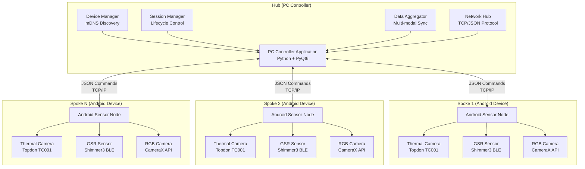

### Design Principles

1. **Distributed Processing**: Multiple Android devices operate as autonomous sensor nodes
2. **Centralized Coordination**: PC Controller manages session lifecycle and synchronization
3. **Fault Tolerance**: System continues operation if individual devices fail
4. **Scalability**: Architecture supports dynamic addition/removal of sensor nodes
5. **Modularity**: Clear separation of concerns across components
6. **Real-time Communication**: Low-latency command/response protocol

## PC Controller Hub Architecture

### Component Structure

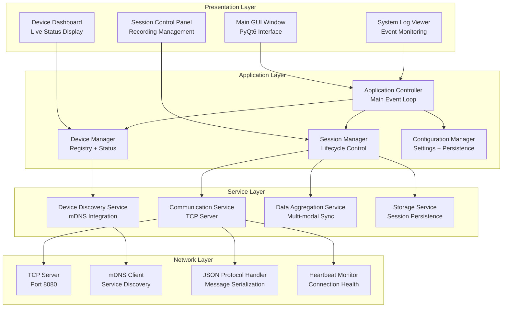

### Key Components

#### Device Manager
- **Purpose**: Central registry for all discovered and connected devices
- **Responsibilities**: 
  - Device discovery coordination
  - Status monitoring and health checks
  - Capability tracking and validation
  - Connection lifecycle management

#### Session Manager
- **Purpose**: Complete session lifecycle control from creation to finalization
- **Responsibilities**:
  - Session creation and metadata management
  - Synchronized recording start/stop coordination
  - Device acknowledgment and error handling
  - Session finalization and data validation

#### Communication Service
- **Purpose**: Reliable message exchange with Android sensor nodes
- **Responsibilities**:
  - TCP server management
  - JSON message serialization/deserialization
  - Command routing and response handling
  - Connection health monitoring

## Android Sensor Node Architecture

### Application Structure

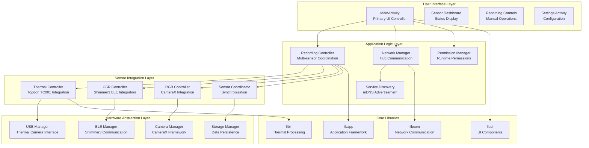

### Sensor Integration Details

#### Thermal Camera Integration
- **Hardware**: Topdon TC001 USB thermal camera
- **Interface**: USB OTG connection with custom driver
- **Capabilities**: 256x192 resolution, 10 FPS capture rate
- **Processing**: Real-time temperature matrix generation
- **Fallback**: Simulation mode when hardware unavailable

#### GSR Sensor Integration  
- **Hardware**: Shimmer3 GSR+ device via Bluetooth Low Energy
- **Protocol**: Custom BLE communication protocol
- **Sampling**: 128 Hz continuous data streaming
- **Features**: Automatic reconnection, data quality monitoring
- **Fallback**: Simulation mode with synthetic data

#### RGB Camera Integration
- **Framework**: Android CameraX API for modern camera handling
- **Capabilities**: 4K@60fps recording with concurrent frame capture
- **Dual Output**: Video files (.mp4) + individual frames for analysis
- **Quality**: High-quality encoding optimized for analysis

## Communication Protocol Architecture

### Protocol Stack

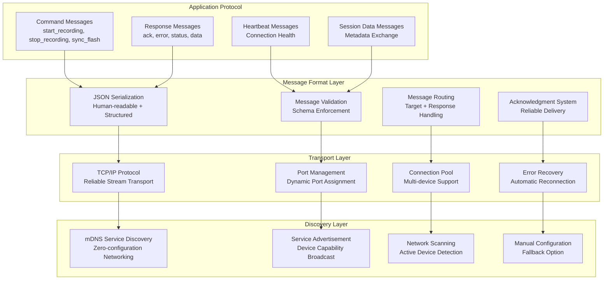

### Message Flow Examples

#### Session Start Sequence
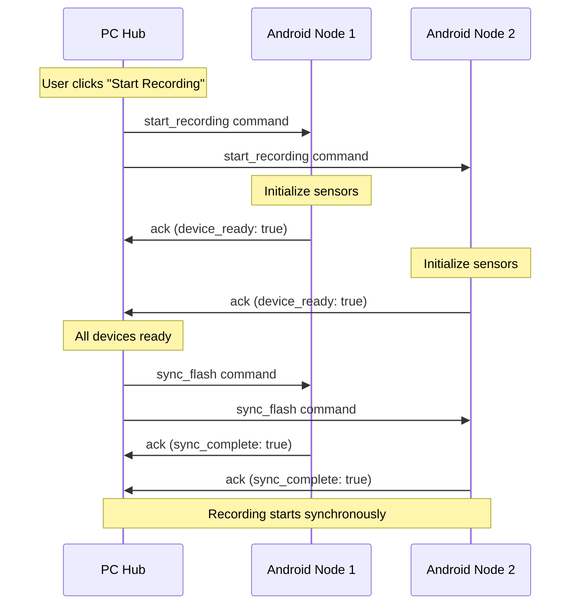

## Data Architecture

### Data Flow Pipeline

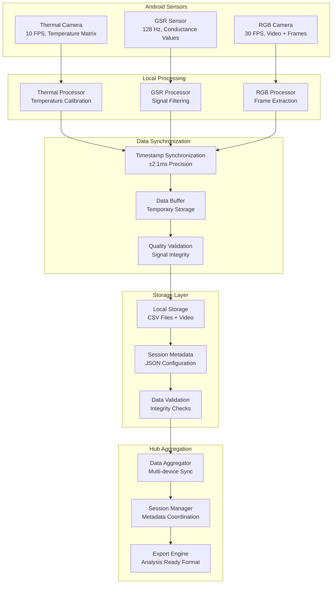

### Data Format Specifications

#### Session Directory Structure
```
sessions/
+-- session_YYYY-MM-DD_HH-MM-SS/           # Session timestamp
    +-- metadata.json                       # Session configuration
    +-- session_summary.json                # Session statistics
    +-- device_001/                         # First Android device
        +-- thermal_data.csv               # Temperature matrices
        +-- gsr_data.csv                   # GSR measurements
        +-- rgb_video.mp4                  # RGB video recording
        +-- rgb_frames/                     # Individual video frames
            +-- frame_000001.jpg
            +-- ...
        +-- device_metadata.json           # Device-specific info
    +-- device_002/                         # Second Android device
        +-- ...                             # Same structure
    +-- synchronization.json                # Cross-device sync data
```

#### Data Format Examples

**Thermal Data CSV**:
```csv
timestamp,frame_id,width,height,min_temp,max_temp,avg_temp,temperature_matrix
1641234567123,1,256,192,18.5,37.2,24.8,"[[18.5,18.7,...],[19.2,19.4,...]]"
1641234567223,2,256,192,18.4,37.3,24.9,"[[18.4,18.6,...],[19.1,19.3,...]]"
```

**GSR Data CSV**:
```csv
timestamp,conductance,resistance,ppg_value,signal_quality
1641234567123,2.45,0.408,1024.3,good
1641234567131,2.47,0.405,1026.1,good
```

## Component Library Architecture

### Library Dependency Graph

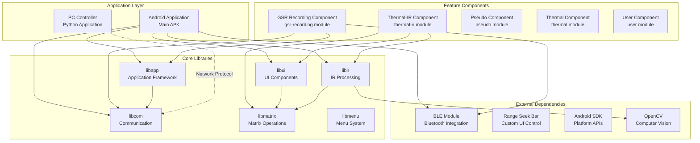

### Library Responsibilities

#### Core Libraries

**libir - Infrared Processing Library**
- Thermal camera hardware abstraction
- Temperature data processing and calibration
- Image format conversion and enhancement
- Native code integration for performance

**libcom - Communication Library** (`consolidated_libraries/libcom/`)
- Cross-platform networking implementation
- JSON protocol handling
- mDNS service discovery
- TCP connection management

**libapp - Application Framework**
- Android application lifecycle management
- Configuration and settings persistence
- Resource management and optimization
- Cross-component integration

**libui - User Interface Library**
- Custom Android UI components
- Material Design implementation
- Real-time data visualization widgets
- Responsive layout management

**libmatrix - Matrix Operations Library** (`consolidated_libraries/libmatrix/`)
- High-performance matrix operations
- Image processing algorithms
- Mathematical computation utilities
- Memory-optimized data structures

## Security Architecture

### Security Layers

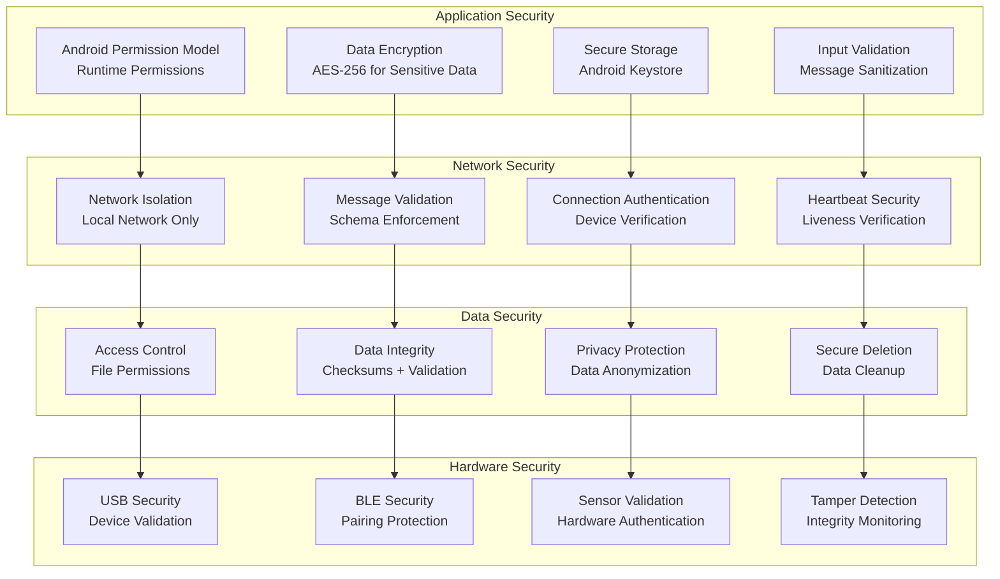

## Performance Architecture

### Performance Optimization Strategy

#### Multi-threading Model
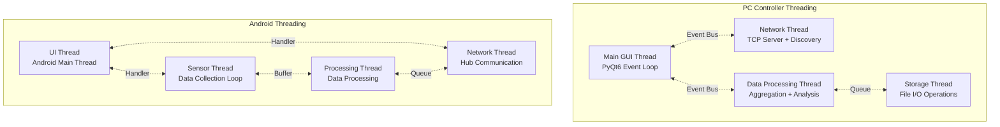

#### Memory Management
- **Object Pooling**: Reuse of frequently allocated objects
- **Streaming Processing**: Process data in chunks to minimize memory footprint
- **Garbage Collection Optimization**: Minimize allocation in performance-critical paths
- **Native Code Integration**: Use native code for computationally intensive operations

#### Network Optimization
- **Connection Pooling**: Reuse TCP connections for multiple messages
- **Message Batching**: Combine multiple small messages into larger packets
- **Compression**: Optional data compression for large transfers
- **Priority Queues**: Prioritize time-critical messages

## Build System Architecture

### Gradle Build Structure

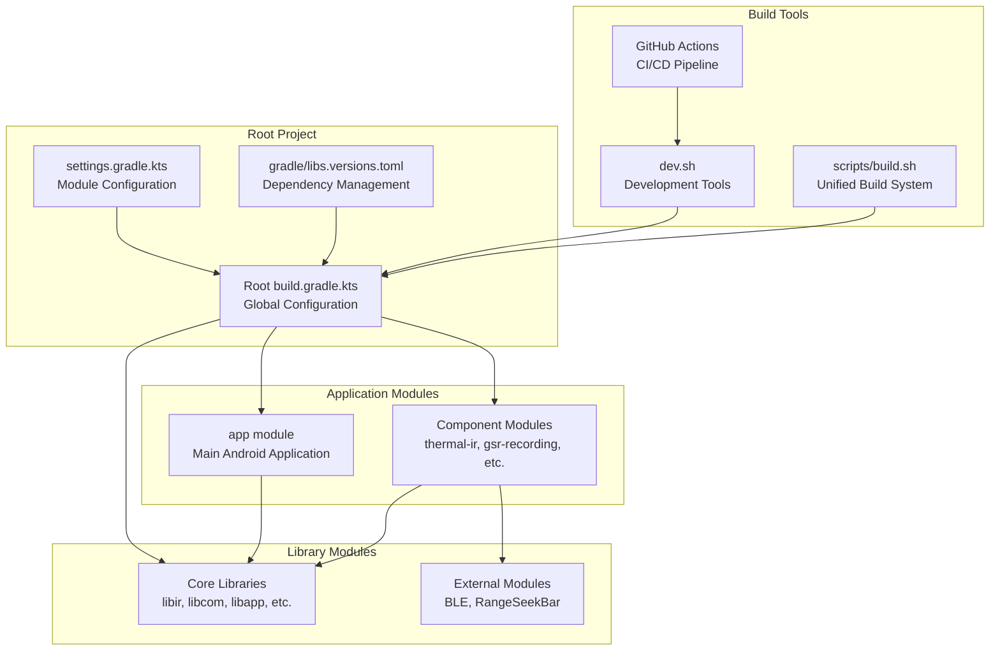

### Build Process Flow

1. **Configuration Phase**: Gradle resolves dependencies and configures modules
2. **Compilation Phase**: Kotlin/Java source code compilation
3. **Resource Processing**: Android resources and assets processing
4. **Library Integration**: Native library integration and packaging
5. **APK Assembly**: Final APK generation and signing
6. **Validation Phase**: Quality checks and testing

## Monitoring and Observability

### System Monitoring Architecture

```mermaid
graph TB
    subgraph "Application Monitoring"
        PerformanceMetrics[Performance Metrics<br/>CPU, Memory, Network]
        ErrorTracking[Error Tracking<br/>Exception Logging]
        UserInteraction[User Interaction<br/>Usage Analytics]
        SystemHealth[System Health<br/>Component Status]
    end
    
    subgraph "Network Monitoring"
        ConnectionHealth[Connection Health<br/>Latency, Packet Loss]
        ThroughputMetrics[Throughput Metrics<br/>Data Transfer Rates]
        DeviceStatus[Device Status<br/>Online/Offline State]
        ProtocolMetrics[Protocol Metrics<br/>Message Success Rate]
    end
    
    subgraph "Data Quality Monitoring"
        SensorQuality[Sensor Quality<br/>Signal Integrity]
        SyncAccuracy[Synchronization Accuracy<br/>Timing Precision]
        DataIntegrity[Data Integrity<br/>Validation Results]
        StorageHealth[Storage Health<br/>Disk Usage, I/O Performance]
    end
    
    subgraph "Logging and Alerting"
        CentralizedLogging[Centralized Logging<br/>Structured Log Aggregation]
        RealTimeAlerts[Real-time Alerts<br/>Critical Issue Notification]
        LogAnalysis[Log Analysis<br/>Pattern Detection]
        ReportGeneration[Report Generation<br/>System Status Reports]
    end
    
    PerformanceMetrics --> CentralizedLogging
    ErrorTracking --> RealTimeAlerts
    ConnectionHealth --> LogAnalysis
    SensorQuality --> ReportGeneration
```

## Future Architecture Considerations

### Scalability Enhancements
- **Cloud Integration**: AWS/Azure integration for large-scale data processing
- **Container Deployment**: Docker containerization for easy deployment
- **Microservices**: Breaking monolithic components into microservices
- **Load Balancing**: Support for multiple PC Controller hubs

### Technology Evolution
- **5G Connectivity**: Enhanced mobile connectivity for real-time streaming
- **Edge Computing**: On-device AI processing for real-time analysis
- **WebRTC**: Browser-based device connectivity
- **GraphQL**: More flexible API layer for data queries

### Security Enhancements
- **Zero Trust Architecture**: Comprehensive security model
- **End-to-End Encryption**: Full data encryption pipeline
- **Identity Management**: Centralized authentication system
- **Audit Logging**: Comprehensive activity logging

---

**Status**: [DONE] Complete Architecture Documentation  
**Last Updated**: Documentation Consolidation v1.0  
**Scope**: System-wide architecture coverage  
**Maintenance**: Update when making architectural changes or adding new components