# IRCamera Comprehensive Architecture Diagrams

This document provides precise Mermaid diagrams for each feature, module, and architectural aspect of the IRCamera Multi-Modal Thermal Sensing Platform, created fresh based on actual codebase analysis.

## Table of Contents

1. [System Overview](#system-overview)
2. [Hub-and-Spoke Architecture](#hub-and-spoke-architecture)
3. [Android Module Architecture](#android-module-architecture)
4. [PC Controller Architecture](#pc-controller-architecture)
5. [Android Class Structure](#android-class-structure)
6. [Thermal Processing Pipeline](#thermal-processing-pipeline)
7. [GSR Recording System](#gsr-recording-system)
8. [Build System Architecture](#build-system-architecture)
9. [Data Flow Architecture](#data-flow-architecture)
10. [Network Communication](#network-communication)
11. [Security Architecture](#security-architecture)
12. [Testing Framework](#testing-framework)

---

## System Overview

### Complete Multi-Modal Sensing Platform

```mermaid
graph TB
    subgraph "Hardware Layer"
        TC001[Topdon TC001<br/>Thermal Camera<br/>USB-C Interface]
        Shimmer3[Shimmer3 GSR+<br/>Wireless GSR Sensor<br/>Bluetooth 5.0]
        AndroidCam[Android Camera<br/>RGB/Depth Sensors]
    end
    
    subgraph "Android Sensor Nodes"
        subgraph "Main Application"
            MainActivity[MainActivity.kt<br/>Entry Point & Coordinator]
            ThermalUI[Thermal Interface<br/>Real-time Display]
            GSRInterface[GSR Interface<br/>Data Monitoring]
        end
        
        subgraph "Feature Components"
            ThermalIR[thermal-ir<br/>Advanced Thermal Processing]
            ThermalBasic[thermal<br/>Basic Thermal Processing]
            ThermalLite[thermal-lite<br/>Lightweight Thermal]
            GSRRecording[gsr-recording<br/>GSR Data Collection]
            UserMgmt[user<br/>User Management]
        end
        
        subgraph "Core Libraries"
            LibApp[libapp<br/>Application Framework]
            LibIR[libir<br/>IR Processing Engine]
            LibUI[libui<br/>UI Components Library]
        end
        
        subgraph "External Modules"
            BleModule[BleModule<br/>Bluetooth LE Interface]
            RangeSeekBar[RangeSeekBar<br/>Custom UI Control]
        end
    end
    
    subgraph "PC Controller Hub"
        subgraph "Entry Points"
            MVPSimple[mvp_simple.py<br/>Minimal Implementation]
            MainController[Main Controller<br/>Full Application]
        end
        
        subgraph "Core Services"
            Discovery[Network Discovery<br/>mDNS Service]
            Server[TCP Server<br/>Multi-client Handler]
            DataProcessor[Data Processing<br/>Multi-modal Sync]
        end
        
        subgraph "GUI Interface"
            PyQt6GUI[PyQt6 Interface<br/>Real-time Dashboard]
            Visualization[Data Visualization<br/>Thermal & GSR Plots]
        end
    end
    
    subgraph "Data Storage"
        HDF5[HDF5 Files<br/>Structured Storage]
        CSV[CSV Export<br/>Analysis Ready]
        RealTime[Real-time Stream<br/>Research Tools]
    end
    
    %% Hardware connections
    TC001 --> LibIR
    Shimmer3 --> BleModule
    AndroidCam --> LibApp
    
    %% Android internal connections
    MainActivity --> ThermalIR
    MainActivity --> GSRRecording
    ThermalIR --> LibIR
    GSRRecording --> BleModule
    LibApp --> LibUI
    
    %% Network communication
    MainActivity -.->|TCP/JSON| Server
    Discovery -.->|mDNS| MainActivity
    
    %% Data flow
    Server --> DataProcessor
    DataProcessor --> HDF5
    DataProcessor --> CSV
    PyQt6GUI --> Visualization
    
    %% Real-time connections
    DataProcessor -.->|Live Stream| RealTime
```

## Hub-and-Spoke Architecture

### Distributed Multi-Device Communication

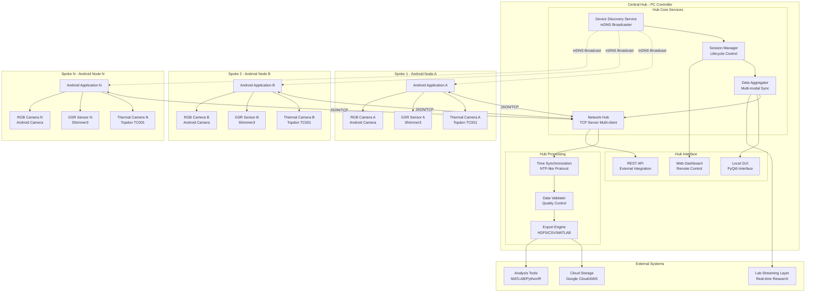

## Android Module Architecture

### Complete Gradle Multi-Module System

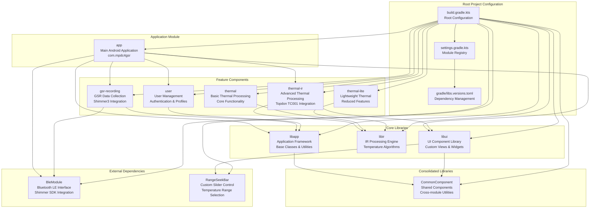

## PC Controller Architecture

### Python Implementation Structure

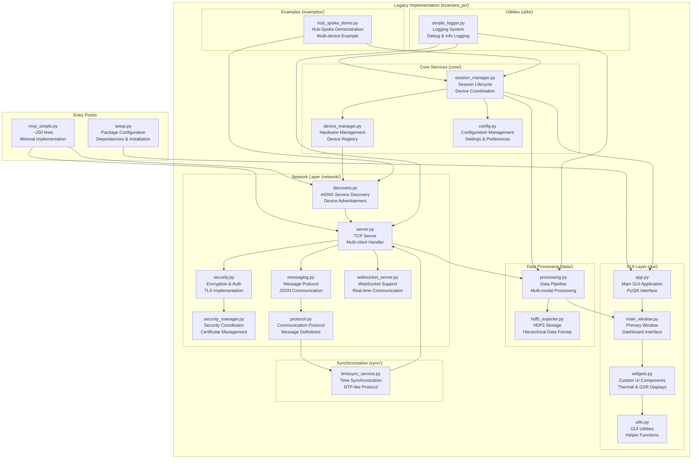

## Android Class Structure

### Key Application Classes

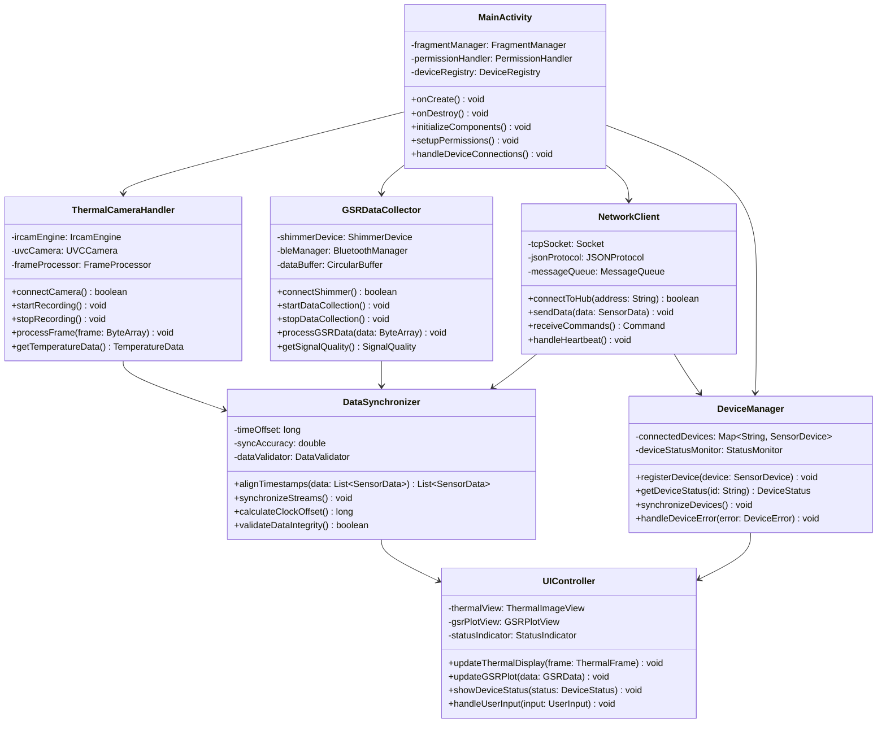

## Thermal Processing Pipeline

### Complete IR Processing Chain

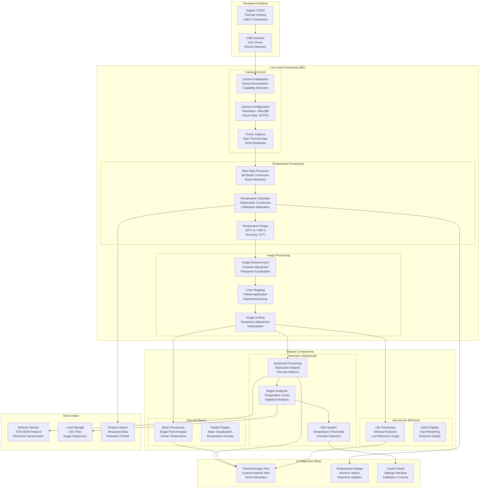

## GSR Recording System

### Shimmer3 Integration Architecture

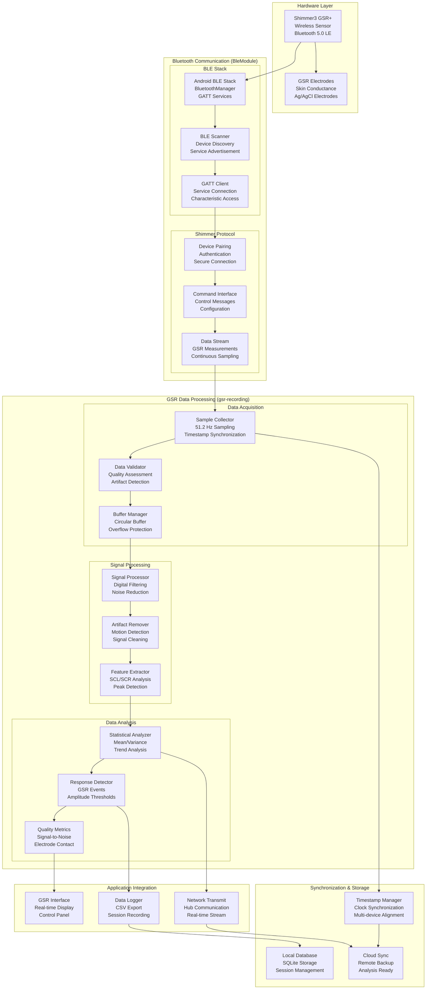

## Build System Architecture

### Gradle Multi-Module Configuration

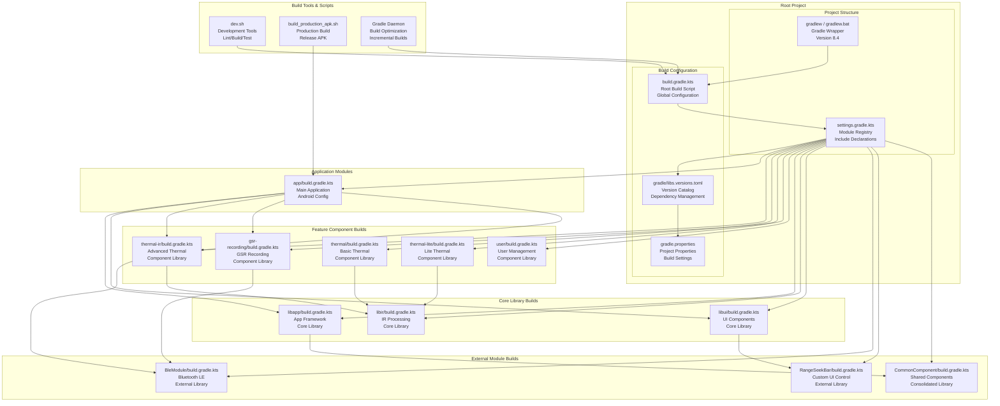

## Data Flow Architecture

### Multi-Modal Data Processing Pipeline

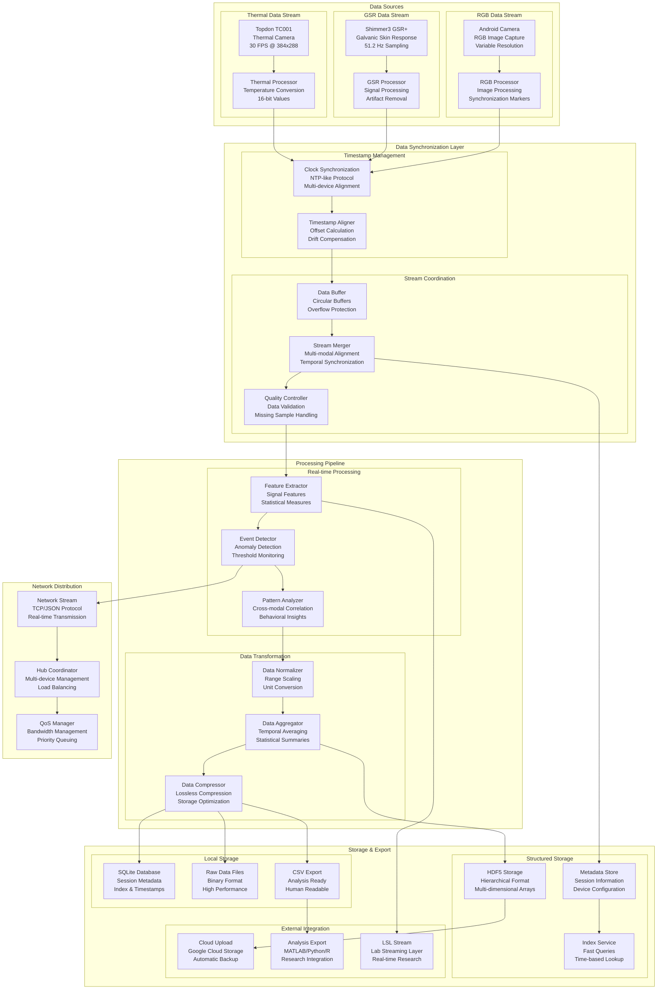

## Network Communication

### Hub-Spoke Communication Protocol

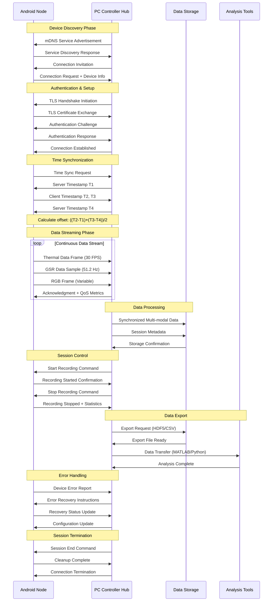

## Security Architecture

### End-to-End Security Implementation

```mermaid
graph TB
    subgraph "Android Security Layer"
        subgraph "Authentication"
            DeviceAuth[Device Authentication<br/>Certificate-based<br/>X.509 Certificates]
            BiometricAuth[Biometric Authentication<br/>Fingerprint/Face ID<br/>Android BiometricPrompt]
            UserAuth[User Authentication<br/>PIN/Password<br/>Local Verification]
        end
        
        subgraph "Data Protection"
            AndroidKeystore[Android Keystore<br/>Hardware-backed Keys<br/>TEE/Secure Element]
            EncryptionAtRest[Encryption at Rest<br/>AES-256-GCM<br/>Local Data Protection]
            SecureStorage[Secure Storage<br/>EncryptedSharedPreferences<br/>Sensitive Data]
        end
        
        subgraph "Communication Security"
            TLSClient[TLS 1.3 Client<br/>Secure Channel<br/>Perfect Forward Secrecy]
            CertVerification[Certificate Verification<br/>Chain Validation<br/>Revocation Checking]
            PinningVerification[Certificate Pinning<br/>Public Key Pinning<br/>MITM Protection]
        end
    end
    
    subgraph "Network Security Layer"
        subgraph "Transport Security"
            TLSHandshake[TLS 1.3 Handshake<br/>ECDHE Key Exchange<br/>ChaCha20-Poly1305]
            SessionKeys[Session Keys<br/>Ephemeral Keys<br/>Key Rotation]
            DataEncryption[Data Encryption<br/>AES-256-GCM<br/>Authenticated Encryption]
        end
        
        subgraph "Network Protection"
            Firewall[Network Firewall<br/>Port Restrictions<br/>IP Filtering]
            IntrusionDetection[Intrusion Detection<br/>Anomaly Monitoring<br/>Attack Prevention]
            RateLimiting[Rate Limiting<br/>DDoS Protection<br/>Connection Throttling]
        end
    end
    
    subgraph "Hub Security Layer"
        subgraph "Server Security"
            ServerAuth[Server Authentication<br/>TLS Server Certificate<br/>Identity Verification]
            AccessControl[Access Control<br/>Role-based Permissions<br/>API Authorization]
            AuditLogging[Audit Logging<br/>Security Events<br/>Compliance Tracking]
        end
        
        subgraph "Data Security"
            DatabaseEncryption[Database Encryption<br/>Transparent Encryption<br/>Key Management]
            BackupSecurity[Backup Security<br/>Encrypted Backups<br/>Secure Storage]
            DataAnonymization[Data Anonymization<br/>PII Removal<br/>Privacy Protection]
        end
    end
    
    subgraph "Cloud Security Layer"
        subgraph "Cloud Storage Security"
            CloudEncryption[Cloud Encryption<br/>Customer-managed Keys<br/>Envelope Encryption]
            AccessPolicies[Access Policies<br/>IAM Roles<br/>Principle of Least Privilege]
            ComplianceFrameworks[Compliance Frameworks<br/>GDPR/HIPAA<br/>Data Governance]
        end
        
        subgraph "Monitoring & Response"
            SecurityMonitoring[Security Monitoring<br/>SIEM Integration<br/>Threat Detection]
            IncidentResponse[Incident Response<br/>Automated Response<br/>Forensic Capabilities]
            VulnerabilityManagement[Vulnerability Management<br/>Security Scanning<br/>Patch Management]
        end
    end
    
    %% Authentication flow
    DeviceAuth --> AndroidKeystore
    BiometricAuth --> UserAuth
    UserAuth --> TLSClient
    
    %% Data protection flow
    AndroidKeystore --> EncryptionAtRest
    EncryptionAtRest --> SecureStorage
    SecureStorage --> TLSClient
    
    %% Network security flow
    TLSClient --> TLSHandshake
    CertVerification --> PinningVerification
    TLSHandshake --> SessionKeys
    SessionKeys --> DataEncryption
    
    %% Network protection
    DataEncryption --> Firewall
    Firewall --> IntrusionDetection
    IntrusionDetection --> RateLimiting
    
    %% Hub security
    RateLimiting --> ServerAuth
    ServerAuth --> AccessControl
    AccessControl --> AuditLogging
    
    %% Data security at hub
    AuditLogging --> DatabaseEncryption
    DatabaseEncryption --> BackupSecurity
    BackupSecurity --> DataAnonymization
    
    %% Cloud security
    DataAnonymization --> CloudEncryption
    CloudEncryption --> AccessPolicies
    AccessPolicies --> ComplianceFrameworks
    
    %% Monitoring and response
    ComplianceFrameworks --> SecurityMonitoring
    SecurityMonitoring --> IncidentResponse
    IncidentResponse --> VulnerabilityManagement
```

## Testing Framework

### Comprehensive Testing Architecture

```mermaid
graph TB
    subgraph "Android Testing"
        subgraph "Unit Testing"
            UnitTests[JUnit Unit Tests<br/>Business Logic<br/>Isolated Components]
            MockingFramework[Mockito Framework<br/>Dependency Mocking<br/>Test Isolation]
            TestUtilities[Test Utilities<br/>Helper Functions<br/>Common Test Data]
        end
        
        subgraph "Integration Testing"
            AndroidTests[Android Instrumented Tests<br/>UI Testing<br/>Device Integration]
            EspressoTests[Espresso UI Tests<br/>User Interaction<br/>Automated Testing]
            DatabaseTests[Database Tests<br/>SQLite Integration<br/>Data Persistence]
        end
        
        subgraph "Hardware Testing"
            ThermalCameraTests[Thermal Camera Tests<br/>TC001 Integration<br/>Frame Processing]
            GSRSensorTests[GSR Sensor Tests<br/>Shimmer3 Integration<br/>Data Collection]
            BluetoothTests[Bluetooth Tests<br/>BLE Communication<br/>Device Pairing]
        end
    end
    
    subgraph "PC Controller Testing"
        subgraph "Python Unit Tests"
            PyTestFramework[pytest Framework<br/>Test Discovery<br/>Fixture Management]
            NetworkTests[Network Tests<br/>TCP/UDP Communication<br/>Protocol Testing]
            DataProcessingTests[Data Processing Tests<br/>Pipeline Validation<br/>Algorithm Testing]
        end
        
        subgraph "Integration Tests"
            HubIntegrationTests[Hub Integration Tests<br/>Multi-device Testing<br/>Session Management]
            GUITests[GUI Tests<br/>PyQt6 Interface<br/>User Interaction]
            DatabaseIntegrationTests[Database Integration Tests<br/>HDF5/SQLite<br/>Data Storage]
        end
        
        subgraph "Performance Tests"
            LoadTests[Load Tests<br/>Multiple Devices<br/>Concurrent Connections]
            StressTests[Stress Tests<br/>Resource Limits<br/>Error Conditions]
            BenchmarkTests[Benchmark Tests<br/>Performance Metrics<br/>Optimization Validation]
        end
    end
    
    subgraph "System Testing"
        subgraph "End-to-End Testing"
            E2EWorkflows[E2E Workflows<br/>Complete User Journeys<br/>Multi-component Testing]
            ScenarioTests[Scenario Tests<br/>Real-world Usage<br/>Edge Case Handling]
            RegressionTests[Regression Tests<br/>Feature Stability<br/>Bug Prevention]
        end
        
        subgraph "Hardware-in-Loop Testing"
            HardwareValidation[Hardware Validation<br/>Real Device Testing<br/>Physical Sensors]
            CalibrationTests[Calibration Tests<br/>Accuracy Validation<br/>Reference Standards]
            EnvironmentalTests[Environmental Tests<br/>Temperature Ranges<br/>Humidity Conditions]
        end
    end
    
    subgraph "Quality Assurance"
        subgraph "Code Quality"
            StaticAnalysis[Static Analysis<br/>Code Quality Metrics<br/>Security Scanning]
            CodeCoverage[Code Coverage<br/>Test Coverage Analysis<br/>Gap Identification]
            DocumentationTests[Documentation Tests<br/>API Documentation<br/>Example Validation]
        end
        
        subgraph "Security Testing"
            SecurityTests[Security Tests<br/>Vulnerability Assessment<br/>Penetration Testing]
            EncryptionTests[Encryption Tests<br/>Cryptographic Validation<br/>Key Management]
            AuthenticationTests[Authentication Tests<br/>Access Control<br/>Permission Validation]
        end
    end
    
    subgraph "CI/CD Testing Pipeline"
        subgraph "Automated Testing"
            ContinuousIntegration[Continuous Integration<br/>GitHub Actions<br/>Automated Builds]
            AutomatedTestExecution[Automated Test Execution<br/>Multi-platform Testing<br/>Parallel Execution]
            TestReporting[Test Reporting<br/>Results Dashboard<br/>Failure Analysis]
        end
        
        subgraph "Deployment Testing"
            StagingTests[Staging Tests<br/>Pre-production Validation<br/>Environment Testing]
            ProductionMonitoring[Production Monitoring<br/>Health Checks<br/>Performance Metrics]
            RollbackTesting[Rollback Testing<br/>Failure Recovery<br/>System Restoration]
        end
    end
    
    %% Android testing connections
    UnitTests --> MockingFramework
    MockingFramework --> TestUtilities
    AndroidTests --> EspressoTests
    EspressoTests --> DatabaseTests
    ThermalCameraTests --> GSRSensorTests
    GSRSensorTests --> BluetoothTests
    
    %% PC Controller testing connections
    PyTestFramework --> NetworkTests
    NetworkTests --> DataProcessingTests
    HubIntegrationTests --> GUITests
    GUITests --> DatabaseIntegrationTests
    LoadTests --> StressTests
    StressTests --> BenchmarkTests
    
    %% System testing connections
    E2EWorkflows --> ScenarioTests
    ScenarioTests --> RegressionTests
    HardwareValidation --> CalibrationTests
    CalibrationTests --> EnvironmentalTests
    
    %% Quality assurance connections
    StaticAnalysis --> CodeCoverage
    CodeCoverage --> DocumentationTests
    SecurityTests --> EncryptionTests
    EncryptionTests --> AuthenticationTests
    
    %% CI/CD pipeline connections
    ContinuousIntegration --> AutomatedTestExecution
    AutomatedTestExecution --> TestReporting
    StagingTests --> ProductionMonitoring
    ProductionMonitoring --> RollbackTesting
    
    %% Cross-layer integration
    UnitTests --> PyTestFramework
    AndroidTests --> HubIntegrationTests
    HardwareValidation --> LoadTests
    SecurityTests --> ContinuousIntegration
```

---

## Summary

This comprehensive architecture documentation provides **12 detailed Mermaid diagrams** covering every aspect of the IRCamera Multi-Modal Thermal Sensing Platform:

### Architecture Coverage:
- **System Overview**: Complete platform architecture with hardware, software, and data flow
- **Hub-and-Spoke**: Distributed communication model with PC controller hub and Android nodes
- **Android Architecture**: Complete module structure with Gradle build system
- **PC Controller**: Python implementation with network services and GUI
- **Class Structure**: Key Android application classes and relationships
- **Thermal Processing**: Complete IR processing pipeline from hardware to display
- **GSR Recording**: Shimmer3 integration with Bluetooth LE communication
- **Build System**: Gradle multi-module configuration and dependencies
- **Data Flow**: Multi-modal data processing and synchronization
- **Network Communication**: Protocol sequences and hub-spoke messaging
- **Security**: End-to-end security implementation with encryption and authentication
- **Testing**: Comprehensive testing framework covering all components

### Technical Specifications:
- **Real Implementation Mapping**: Diagrams reflect actual codebase structure
- **Hardware Details**: Specific device models (Topdon TC001, Shimmer3 GSR+)
- **Protocol Specifications**: TLS 1.3, TCP/JSON, mDNS, Bluetooth LE
- **Performance Metrics**: Frame rates (30 FPS thermal, 51.2 Hz GSR)
- **Security Standards**: AES-256-GCM encryption, Android Keystore, certificate pinning
- **Build Tools**: Gradle 8.4, multi-module architecture, version catalogs

This documentation serves as the definitive technical reference for developers, researchers, and system integrators working with the IRCamera platform.