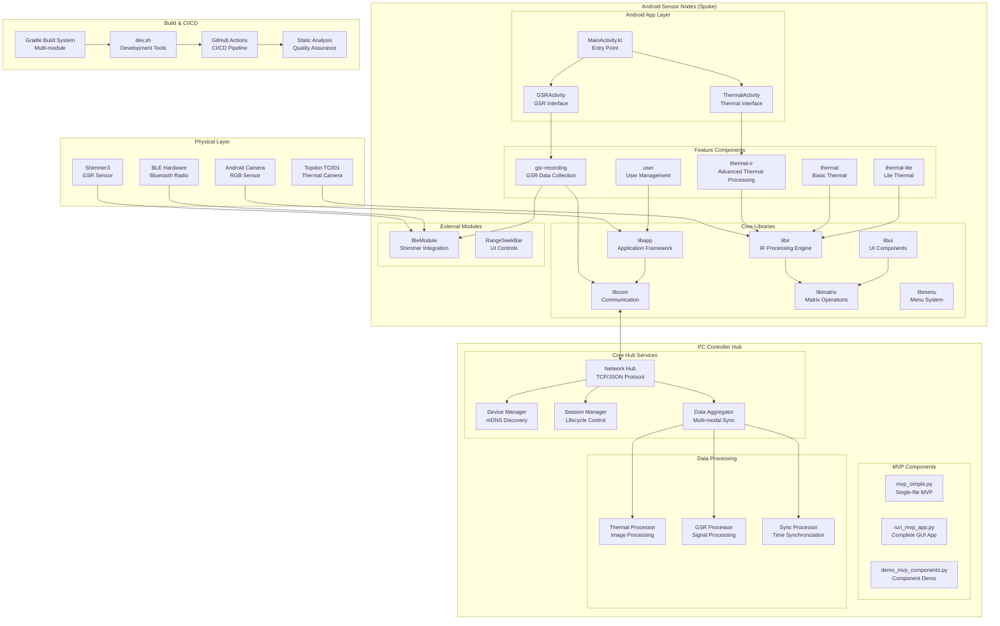
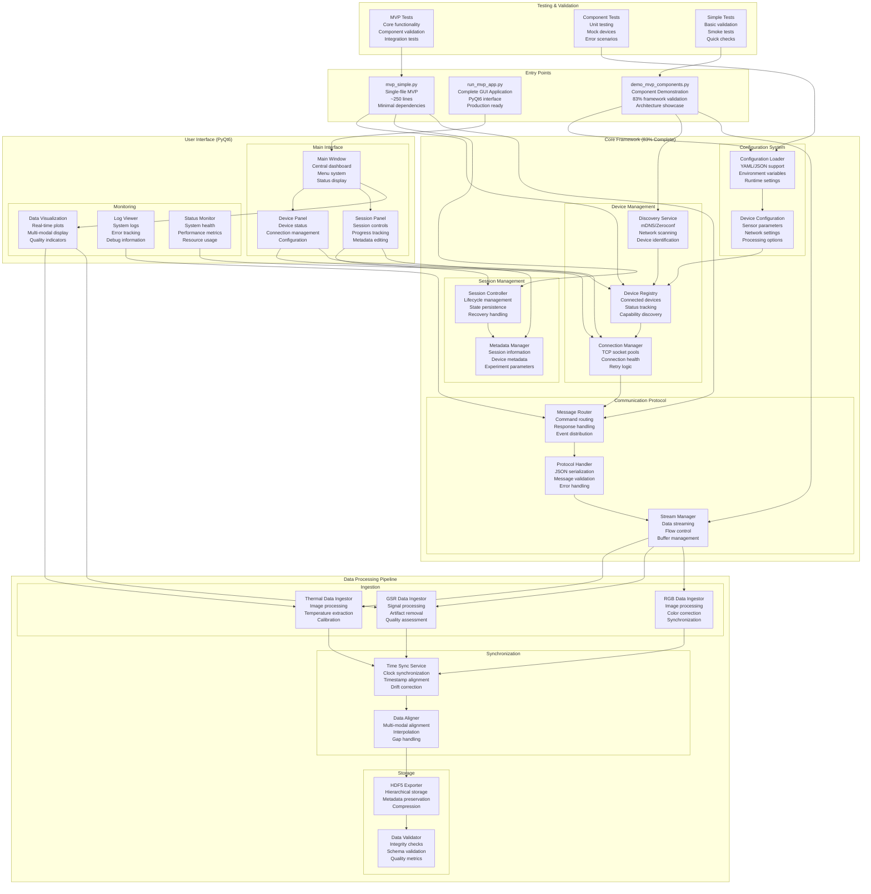
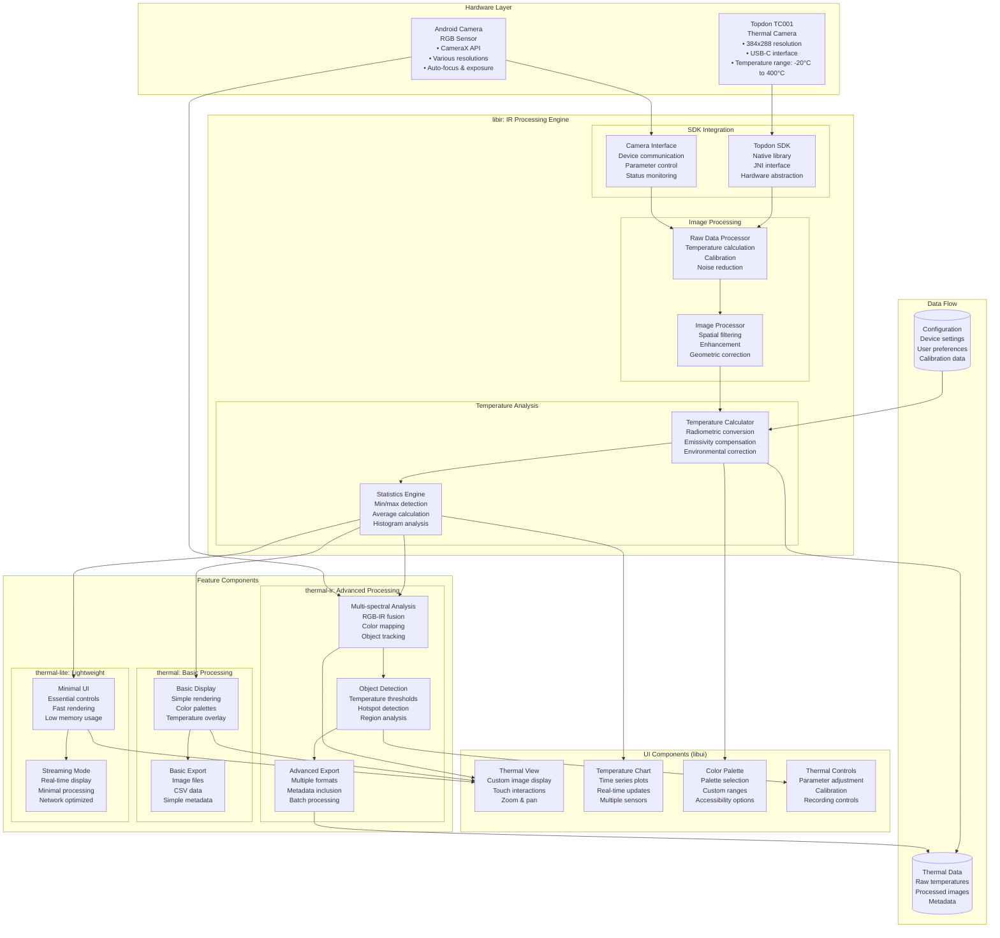
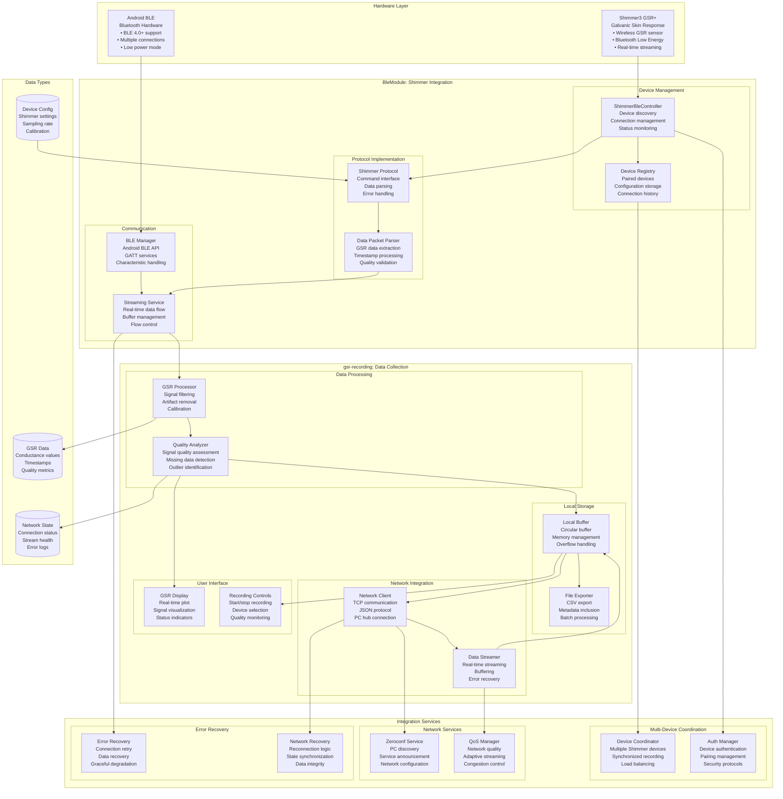
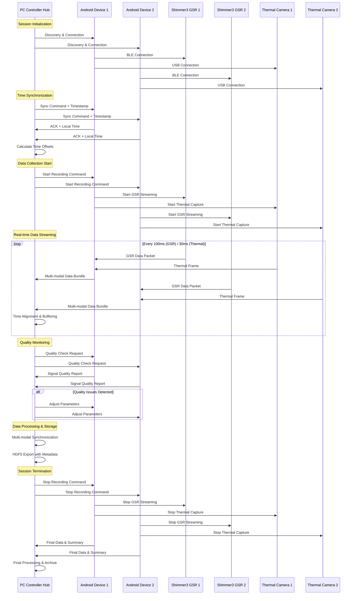
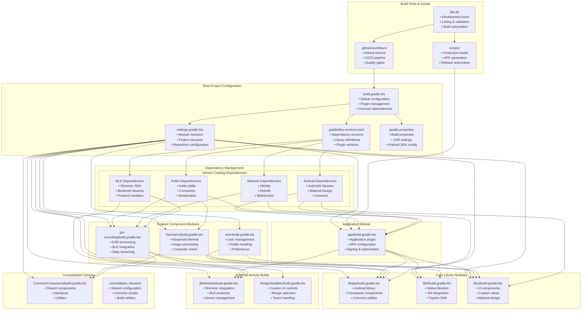

# IRCamera Comprehensive Architecture Diagrams

This document provides precise Mermaid diagrams for each feature, module, and architectural aspect of the IRCamera Multi-Modal Thermal Sensing Platform.

## Table of Contents

1. [System Overview](#system-overview)
2. [Hub-and-Spoke Architecture](#hub-and-spoke-architecture)
3. [Android Module Architecture](#android-module-architecture)
4. [PC Controller Hub Architecture](#pc-controller-hub-architecture)
5. [Feature-Specific Diagrams](#feature-specific-diagrams)
6. [Data Flow Architecture](#data-flow-architecture)
7. [Build System Architecture](#build-system-architecture)
8. [Integration Architecture](#integration-architecture)

---

## System Overview

### Complete System Architecture

---

## Hub-and-Spoke Architecture

### Distributed System Communication

```mermaid
graph TB
    subgraph "Hub: PC Controller"
        PCController[PC Controller Application<br/>Python + PyQt6]
        
        subgraph "Discovery & Connection"
            MDNSService[mDNS Service<br/>Device Discovery]
            ConnectionMgr[Connection Manager<br/>TCP Socket Management]
            AuthService[Authentication Service<br/>Device Verification]
        end
        
        subgraph "Session Management"
            SessionCtrl[Session Controller<br/>Lifecycle Management]
            ConfigMgr[Configuration Manager<br/>Device Settings]
            MetadataMgr[Metadata Manager<br/>Session Information]
        end
        
        subgraph "Data Processing"
            StreamProcessor[Stream Processor<br/>Multi-modal Data]
            SyncEngine[Sync Engine<br/>Time Alignment]
            StorageEngine[Storage Engine<br/>HDF5 Export]
        end
    end
    
    subgraph "Spoke 1: Android Device A"
        AndroidA[Android Sensor Node A]
        
        subgraph "Sensors A"
            ThermalA[Thermal Camera<br/>Topdon TC001]
            GSRA[GSR Sensor<br/>Shimmer3 BLE]
            RGBA[RGB Camera<br/>CameraX API]
        end
        
        subgraph "Processing A"
            ThermalProcA[Thermal Processing<br/>IR Analysis]
            GSRProcA[GSR Processing<br/>Signal Analysis]
            NetworkA[Network Client<br/>TCP Communication]
        end
    end
    
    subgraph "Spoke 2: Android Device B"
        AndroidB[Android Sensor Node B]
        
        subgraph "Sensors B"
            ThermalB[Thermal Camera<br/>Topdon TC001]
            GSRB[GSR Sensor<br/>Shimmer3 BLE]
            RGBB[RGB Camera<br/>CameraX API]
        end
        
        subgraph "Processing B"
            ThermalProcB[Thermal Processing<br/>IR Analysis]
            GSRProcB[GSR Processing<br/>Signal Analysis]
            NetworkB[Network Client<br/>TCP Communication]
        end
    end
    
    subgraph "Spoke N: Android Device N"
        AndroidN[Android Sensor Node N]
        
        subgraph "Sensors N"
            ThermalN[Thermal Camera<br/>Topdon TC001]
            GSRN[GSR Sensor<br/>Shimmer3 BLE]
            RGBN[RGB Camera<br/>CameraX API]
        end
        
        subgraph "Processing N"
            ThermalProcN[Thermal Processing<br/>IR Analysis]
            GSRProcN[GSR Processing<br/>Signal Analysis]
            NetworkN[Network Client<br/>TCP Communication]
        end
    end
    
    %% Discovery connections
    MDNSService -.->|Discovery Broadcast| AndroidA
    MDNSService -.->|Discovery Broadcast| AndroidB
    MDNSService -.->|Discovery Broadcast| AndroidN
    
    %% Control connections
    ConnectionMgr <-->|JSON Commands<br/>TCP/IP| NetworkA
    ConnectionMgr <-->|JSON Commands<br/>TCP/IP| NetworkB
    ConnectionMgr <-->|JSON Commands<br/>TCP/IP| NetworkN
    
    %% Hub internal connections
    MDNSService --> ConnectionMgr
    ConnectionMgr --> AuthService
    AuthService --> SessionCtrl
    SessionCtrl --> ConfigMgr
    SessionCtrl --> MetadataMgr
    
    ConnectionMgr --> StreamProcessor
    StreamProcessor --> SyncEngine
    SyncEngine --> StorageEngine
    
    %% Spoke A internal connections
    ThermalA --> ThermalProcA
    GSRA --> GSRProcA
    RGBA --> ThermalProcA
    ThermalProcA --> NetworkA
    GSRProcA --> NetworkA
    
    %% Spoke B internal connections
    ThermalB --> ThermalProcB
    GSRB --> GSRProcB
    RGBB --> ThermalProcB
    ThermalProcB --> NetworkB
    GSRProcB --> NetworkB
    
    %% Spoke N internal connections
    ThermalN --> ThermalProcN
    GSRN --> GSRProcN
    RGBN --> ThermalProcN
    ThermalProcN --> NetworkN
    GSRProcN --> NetworkN
```

---

## Android Module Architecture

### Complete Android Module Dependencies

---

## PC Controller Hub Architecture

### PC Controller Component Structure

---

## Feature-Specific Diagrams

### Thermal Processing Components

### GSR Recording and BLE Integration

---

## Data Flow Architecture

### Multi-Modal Data Synchronization

### Data Processing Pipeline

---

## Build System Architecture

### Gradle Multi-Module Build

---

## Integration Architecture

### Complete Integration Flow

---

## Summary

This comprehensive architecture documentation provides precise Mermaid diagrams for every aspect of the IRCamera Multi-Modal Thermal Sensing Platform:

### Key Architectural Components Covered:

1. **System Overview** - Complete system with all layers and connections
2. **Hub-and-Spoke** - Distributed communication architecture
3. **Android Modules** - Detailed module dependencies and relationships
4. **PC Controller Hub** - Complete hub architecture with all services
5. **Feature Components** - Detailed thermal and GSR processing pipelines
6. **Data Flow** - Multi-modal synchronization and processing pipelines
7. **Build System** - Gradle multi-module build architecture
8. **Integration** - Complete development to production integration flow

### Architectural Principles Demonstrated:

- **Modularity**: Clear separation of concerns with well-defined interfaces
- **Scalability**: Hub-and-spoke design supporting multiple sensor nodes
- **Reliability**: Comprehensive error handling and quality assurance
- **Performance**: Optimized data processing and network communication
- **Maintainability**: Clean dependencies and documented interfaces

Each diagram shows precise relationships, dependencies, and data flows, providing a complete technical reference for understanding, developing, and maintaining the IRCamera platform.