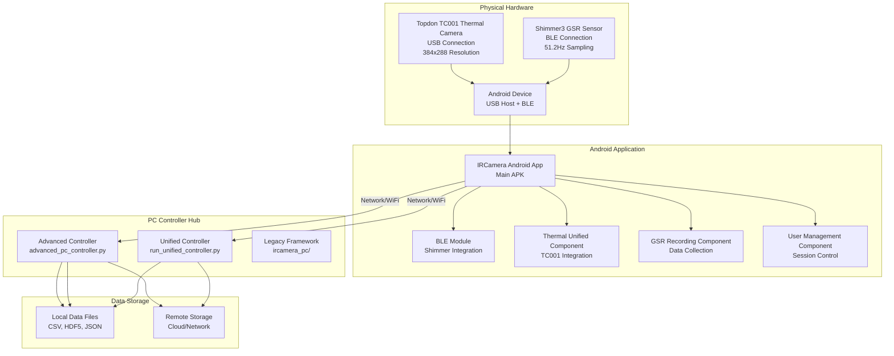
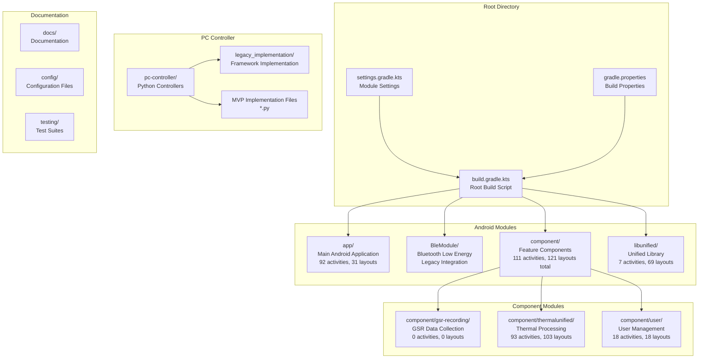
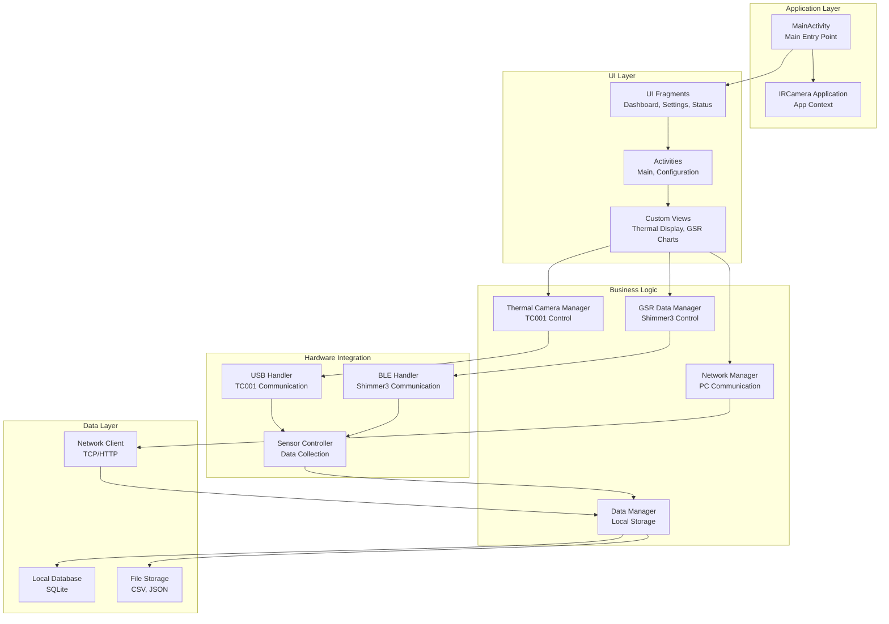
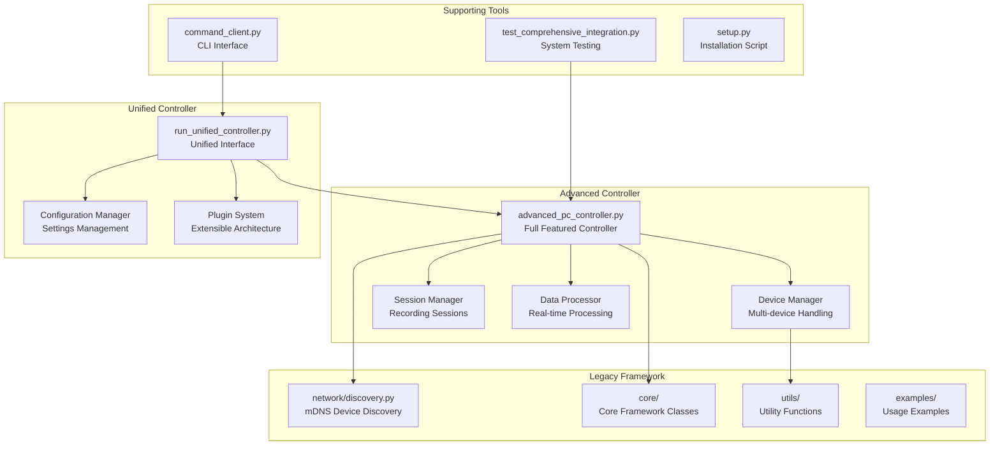
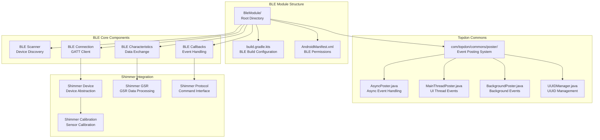
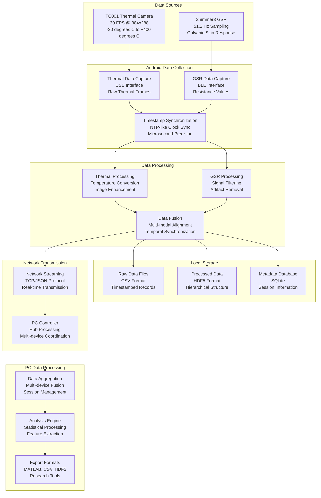
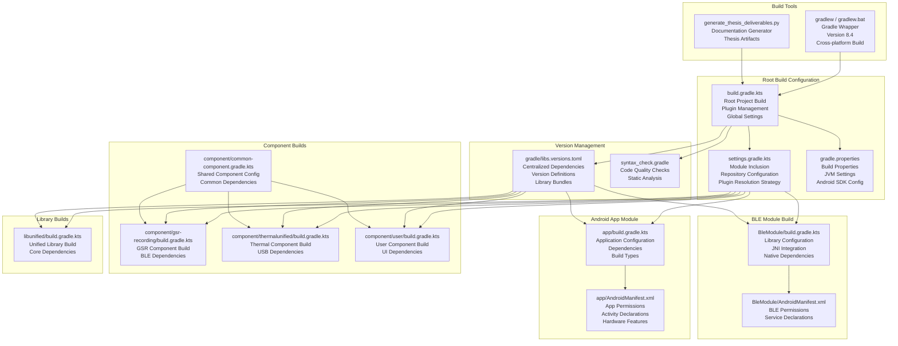
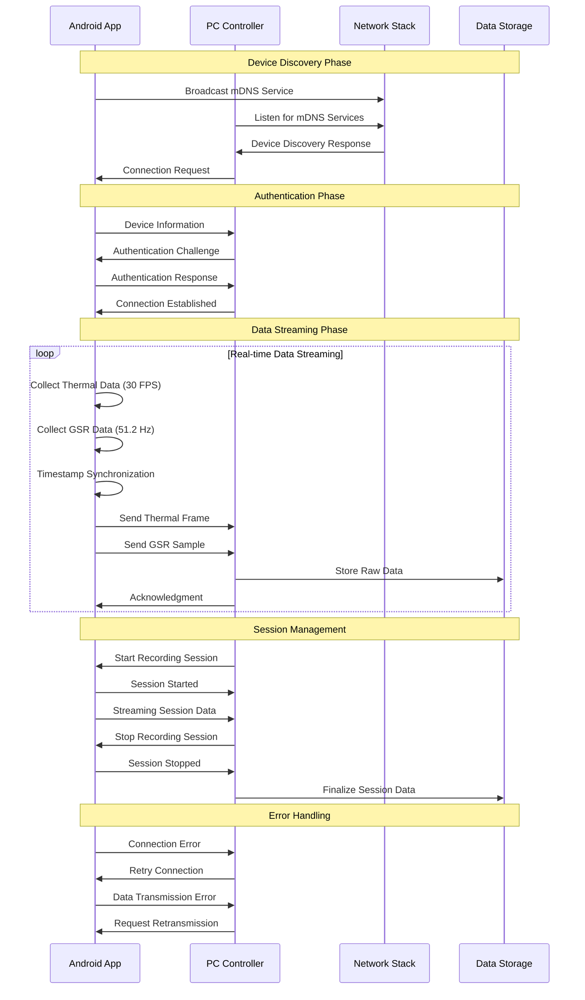
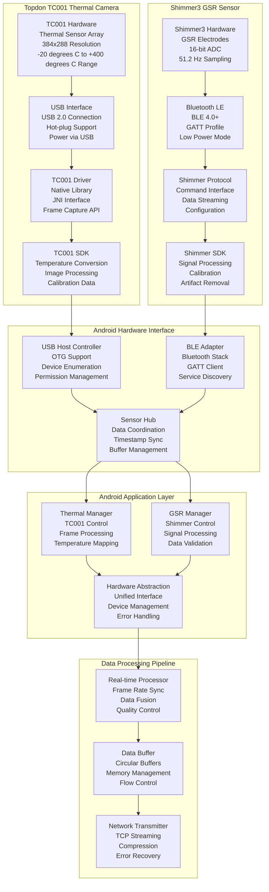

# IRCamera Architecture Diagrams - Complete Fresh Start

This document provides comprehensive Mermaid architecture diagrams for the IRCamera Multi-Modal
Thermal Sensing Platform, created from scratch based on current repository analysis.

** For detailed app navigation flow and UI structure,
see [APP_NAVIGATION_DIAGRAM.md](APP_NAVIGATION_DIAGRAM.md)**
**🎨 For complete layout architecture and UI components,
see [APP_LAYOUT_DIAGRAM.md](APP_LAYOUT_DIAGRAM.md)**

## Table of Contents

1. [System Overview](#1-system-overview)
2. [Repository Structure](#2-repository-structure)
3. [Android Application Architecture](#3-android-application-architecture)
4. [PC Controller Architecture](#4-pc-controller-architecture)
5. [Component Module Structure](#5-component-module-structure)
6. [BLE Module Architecture](#6-ble-module-architecture)
7. [Data Flow Pipeline](#7-data-flow-pipeline)
8. [Build System Architecture](#8-build-system-architecture)
9. [Network Communication](#9-network-communication)
10. [Hardware Integration](#10-hardware-integration)

---

## 1. System Overview



---

## 2. Repository Structure



---

## 2.5. Module Statistics Overview

```mermaid
graph TB
    subgraph "IRCamera Repository Statistics"
        TotalStats[Total: 210 Activities, 221 Layouts<br/>4 Main Modules<br/>Multi-Modal Platform]
    end
    
    subgraph "App Module"
        AppStats[app/<br/>92 Activities (44%)<br/>31 Layouts (14%)<br/>Core Infrastructure]
    end
    
    subgraph "Component thermalunified"
        ThermalStats[thermalunified/<br/>93 Activities (44%)<br/>103 Layouts (47%)<br/>Thermal Imaging System]
    end
    
    subgraph "Component user"
        UserStats[user/<br/>18 Activities (9%)<br/>18 Layouts (8%)<br/>User Management]
    end
    
    subgraph "LibUnified"
        LibStats[libunified/<br/>7 Activities (3%)<br/>69 Layouts (31%)<br/>Shared Utilities]
    end
    
    TotalStats --> AppStats
    TotalStats --> ThermalStats
    TotalStats --> UserStats
    TotalStats --> LibStats
    
    %% Styling
    classDef totalBox fill:#ff6b6b,stroke:#333,stroke-width:3px,color:#fff
    classDef moduleBox fill:#4ecdc4,stroke:#333,stroke-width:2px,color:#fff
    
    class TotalStats totalBox
    class AppStats,ThermalStats,UserStats,LibStats moduleBox
```

---

## 3. Android Application Architecture



---

## 4. PC Controller Architecture



---

## 5. Component Module Structure

```mermaid
graph TB
    subgraph "GSR Recording Component"
        GSRMain[GSR Recording Module<br/>component/gsr-recording/]
        GSRBuild[build.gradle.kts<br/>GSR Build Config]
        GSRSrc[src/main/<br/>GSR Source Code]
        GSRManifest[AndroidManifest.xml<br/>GSR Permissions]
    end
    
    subgraph "Thermal Unified Component"
        ThermalMain[Thermal Unified Module<br/>component/thermalunified/]
        ThermalBuild[build.gradle.kts<br/>Thermal Build Config]
        ThermalSrc[src/main/<br/>Thermal Source Code]
        ThermalManifest[AndroidManifest.xml<br/>Thermal Permissions]
    end
    
    subgraph "User Management Component"
        UserMain[User Module<br/>component/user/]
        UserBuild[build.gradle.kts<br/>User Build Config]
        UserSrc[src/main/<br/>User Source Code]
        UserManifest[AndroidManifest.xml<br/>User Permissions]
    end
    
    subgraph "Common Component Framework"
        CommonGradle[common-component.gradle.kts<br/>Shared Configuration]
        ComponentInterface[Component Interface<br/>Base Classes]
        SharedResources[Shared Resources<br/>Common Assets]
    end
    
    GSRMain --> GSRBuild
    GSRMain --> GSRSrc
    GSRMain --> GSRManifest
    
    ThermalMain --> ThermalBuild
    ThermalMain --> ThermalSrc
    ThermalMain --> ThermalManifest
    
    UserMain --> UserBuild
    UserMain --> UserSrc
    UserMain --> UserManifest
    
    CommonGradle --> GSRBuild
    CommonGradle --> ThermalBuild
    CommonGradle --> UserBuild
    
    ComponentInterface --> GSRSrc
    ComponentInterface --> ThermalSrc
    ComponentInterface --> UserSrc
```



---

## 6. BLE Module Architecture



---

## 7. Data Flow Pipeline



---

## 8. Build System Architecture



---

## 9. Network Communication



---

## 10. Hardware Integration



---

## Architecture Summary

This comprehensive architecture documentation covers:

- **System Overview**: Complete multi-modal sensing platform
- **Repository Structure**: Gradle multi-module project organization
- **Android Architecture**: Application, component, and hardware layers
- **PC Controller**: Multiple implementation approaches (MVP, Advanced, Unified)
- **Component Modules**: GSR recording, thermal processing, user management
- **BLE Integration**: Shimmer3 sensor communication and data processing
- **Data Pipeline**: Real-time streaming, synchronization, and storage
- **Build System**: Gradle configuration and dependency management
- **Network Communication**: Hub-spoke protocol and session management
- **Hardware Integration**: TC001 thermal camera and Shimmer3 GSR sensor

Each diagram provides implementation-level detail suitable for developers, researchers, and system
integrators working with the IRCamera Multi-Modal Thermal Sensing Platform.