# IRCamera Comprehensive Architecture Diagrams

This document provides precise Mermaid diagrams for each feature, module, and architectural aspect of the IRCamera Multi-Modal Thermal Sensing Platform.

## Table of Contents

1. [System Overview](#system-overview)
2. [Hub-and-Spoke Architecture](#hub-and-spoke-architecture)
3. [Android Module Architecture](#android-module-architecture)
4. [PC Controller Hub Architecture](#pc-controller-hub-architecture)
5. [Feature-Specific Diagrams](#feature-specific-diagrams)
6. [Data Flow Architecture](#data-flow-architecture)
7. [Build System Architecture](#build-system-architecture)
8. [Integration Architecture](#integration-architecture)

---

## System Overview

### Complete System Architecture

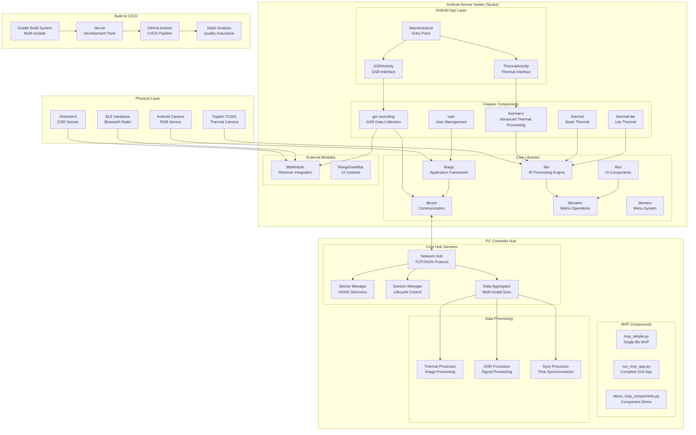

---

## Hub-and-Spoke Architecture

### Distributed System Communication

```mermaid
graph TB
    subgraph "Hub: PC Controller"
        PCController[PC Controller Application<br/>Python + PyQt6]
        
        subgraph "Discovery & Connection"
            MDNSService[mDNS Service<br/>Device Discovery]
            ConnectionMgr[Connection Manager<br/>TCP Socket Management]
            AuthService[Authentication Service<br/>Device Verification]
        end
        
        subgraph "Session Management"
            SessionCtrl[Session Controller<br/>Lifecycle Management]
            ConfigMgr[Configuration Manager<br/>Device Settings]
            MetadataMgr[Metadata Manager<br/>Session Information]
        end
        
        subgraph "Data Processing"
            StreamProcessor[Stream Processor<br/>Multi-modal Data]
            SyncEngine[Sync Engine<br/>Time Alignment]
            StorageEngine[Storage Engine<br/>HDF5 Export]
        end
    end
    
    subgraph "Spoke 1: Android Device A"
        AndroidA[Android Sensor Node A]
        
        subgraph "Sensors A"
            ThermalA[Thermal Camera<br/>Topdon TC001]
            GSRA[GSR Sensor<br/>Shimmer3 BLE]
            RGBA[RGB Camera<br/>CameraX API]
        end
        
        subgraph "Processing A"
            ThermalProcA[Thermal Processing<br/>IR Analysis]
            GSRProcA[GSR Processing<br/>Signal Analysis]
            NetworkA[Network Client<br/>TCP Communication]
        end
    end
    
    subgraph "Spoke 2: Android Device B"
        AndroidB[Android Sensor Node B]
        
        subgraph "Sensors B"
            ThermalB[Thermal Camera<br/>Topdon TC001]
            GSRB[GSR Sensor<br/>Shimmer3 BLE]
            RGBB[RGB Camera<br/>CameraX API]
        end
        
        subgraph "Processing B"
            ThermalProcB[Thermal Processing<br/>IR Analysis]
            GSRProcB[GSR Processing<br/>Signal Analysis]
            NetworkB[Network Client<br/>TCP Communication]
        end
    end
    
    subgraph "Spoke N: Android Device N"
        AndroidN[Android Sensor Node N]
        
        subgraph "Sensors N"
            ThermalN[Thermal Camera<br/>Topdon TC001]
            GSRN[GSR Sensor<br/>Shimmer3 BLE]
            RGBN[RGB Camera<br/>CameraX API]
        end
        
        subgraph "Processing N"
            ThermalProcN[Thermal Processing<br/>IR Analysis]
            GSRProcN[GSR Processing<br/>Signal Analysis]
            NetworkN[Network Client<br/>TCP Communication]
        end
    end
    
    %% Discovery connections
    MDNSService -.->|Discovery Broadcast| AndroidA
    MDNSService -.->|Discovery Broadcast| AndroidB
    MDNSService -.->|Discovery Broadcast| AndroidN
    
    %% Control connections
    ConnectionMgr <-->|JSON Commands<br/>TCP/IP| NetworkA
    ConnectionMgr <-->|JSON Commands<br/>TCP/IP| NetworkB
    ConnectionMgr <-->|JSON Commands<br/>TCP/IP| NetworkN
    
    %% Hub internal connections
    MDNSService --> ConnectionMgr
    ConnectionMgr --> AuthService
    AuthService --> SessionCtrl
    SessionCtrl --> ConfigMgr
    SessionCtrl --> MetadataMgr
    
    ConnectionMgr --> StreamProcessor
    StreamProcessor --> SyncEngine
    SyncEngine --> StorageEngine
    
    %% Spoke A internal connections
    ThermalA --> ThermalProcA
    GSRA --> GSRProcA
    RGBA --> ThermalProcA
    ThermalProcA --> NetworkA
    GSRProcA --> NetworkA
    
    %% Spoke B internal connections
    ThermalB --> ThermalProcB
    GSRB --> GSRProcB
    RGBB --> ThermalProcB
    ThermalProcB --> NetworkB
    GSRProcB --> NetworkB
    
    %% Spoke N internal connections
    ThermalN --> ThermalProcN
    GSRN --> GSRProcN
    RGBN --> ThermalProcN
    ThermalProcN --> NetworkN
    GSRProcN --> NetworkN
```

---

## Android Module Architecture

### Complete Android Module Dependencies

```mermaid
graph TB
    subgraph "Application Module"
        App[app<br/>Main Android Application]
        
        subgraph "Activities"
            MainActivity[MainActivity.kt<br/>Entry Point & Navigation]
            ThermalActivity[ThermalActivity<br/>Thermal Interface]
            GSRActivity[GSRActivity<br/>GSR Recording]
            UserActivity[UserActivity<br/>User Management]
        end
        
        subgraph "Services"
            NetworkService[NetworkService<br/>PC Communication]
            CameraService[CameraService<br/>Camera Management]
            BLEService[BLEService<br/>Bluetooth Management]
        end
    end
    
    subgraph "Feature Components"
        subgraph "Thermal Components"
            ThermalIR[thermal-ir<br/>Advanced IR Processing<br/>- Multi-spectral analysis<br/>- Temperature mapping<br/>- Object detection]
            
            Thermal[thermal<br/>Basic Thermal Processing<br/>- Simple temperature display<br/>- Basic color mapping<br/>- Raw data export]
            
            ThermalLite[thermal-lite<br/>Lightweight Thermal<br/>- Minimal processing<br/>- Low memory usage<br/>- Fast rendering]
        end
        
        subgraph "Data Collection"
            GSRRecording[gsr-recording<br/>GSR Data Collection<br/>- Shimmer3 integration<br/>- Real-time streaming<br/>- Quality validation]
        end
        
        subgraph "System Components"
            UserMgmt[user<br/>User Management<br/>- Profile management<br/>- Session tracking<br/>- Preferences]
        end
    end
    
    subgraph "Core Libraries"
        LibApp[libapp<br/>Application Framework<br/>- Base activities<br/>- Common utilities<br/>- Configuration management]
        
        LibIR[libir<br/>IR Processing Engine<br/>- Topdon TC001 SDK<br/>- Image processing<br/>- Temperature calculation]
        
        LibUI[libui<br/>UI Components<br/>- Custom views<br/>- Chart components<br/>- Material design]
        
        LibCom[libcom<br/>Communication Library<br/>- Network protocols<br/>- JSON messaging<br/>- mDNS discovery]
        
        LibMatrix[libmatrix<br/>Matrix Operations<br/>- Mathematical operations<br/>- Image transformations<br/>- Signal processing]
        
        LibMenu[libmenu<br/>Menu System<br/>- Navigation<br/>- Context menus<br/>- Action bars]
    end
    
    subgraph "External Modules"
        BleModule[BleModule<br/>Bluetooth Low Energy<br/>- Shimmer3 protocol<br/>- Device management<br/>- Data streaming]
        
        RangeSeekBar[RangeSeekBar<br/>UI Range Controls<br/>- Temperature ranges<br/>- Slider controls<br/>- Value selection]
    end
    
    subgraph "Consolidated Libraries"
        CommonComponent[CommonComponent<br/>Shared Components<br/>- Common interfaces<br/>- Utility classes<br/>- Constants]
    end
    
    %% App to Activity connections
    App --> MainActivity
    App --> ThermalActivity
    App --> GSRActivity
    App --> UserActivity
    
    %% App to Service connections
    App --> NetworkService
    App --> CameraService
    App --> BLEService
    
    %% Activity to Component connections
    ThermalActivity --> ThermalIR
    ThermalActivity --> Thermal
    ThermalActivity --> ThermalLite
    GSRActivity --> GSRRecording
    UserActivity --> UserMgmt
    
    %% App to Core Library connections
    App --> LibApp
    App --> LibUI
    App --> LibCom
    App --> LibIR
    
    %% Component to Core Library connections
    ThermalIR --> LibIR
    ThermalIR --> LibMatrix
    ThermalIR --> LibUI
    
    Thermal --> LibIR
    Thermal --> LibMatrix
    
    ThermalLite --> LibIR
    
    GSRRecording --> BleModule
    GSRRecording --> LibCom
    GSRRecording --> LibApp
    
    UserMgmt --> LibApp
    UserMgmt --> LibUI
    
    %% Core Library interdependencies
    LibApp --> LibCom
    LibUI --> LibMatrix
    LibIR --> LibMatrix
    LibMenu --> LibUI
    
    %% External Module connections
    App --> BleModule
    LibUI --> RangeSeekBar
    
    %% Consolidated Library connections
    ThermalIR --> CommonComponent
    Thermal --> CommonComponent
    GSRRecording --> CommonComponent
    UserMgmt --> CommonComponent
```

---

## PC Controller Hub Architecture

### PC Controller Component Structure

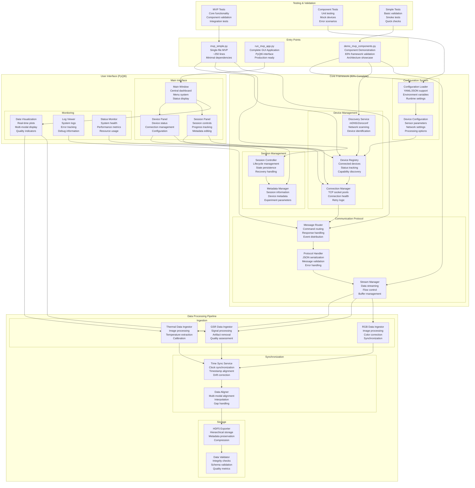

---

## Feature-Specific Diagrams

### Thermal Processing Components


### GSR Recording and BLE Integration


---

## Data Flow Architecture

### Multi-Modal Data Synchronization

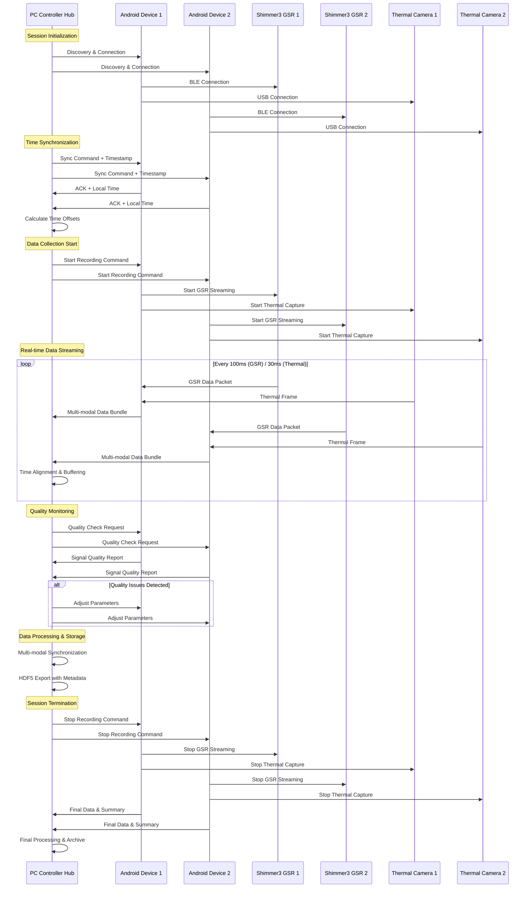

### Data Processing Pipeline

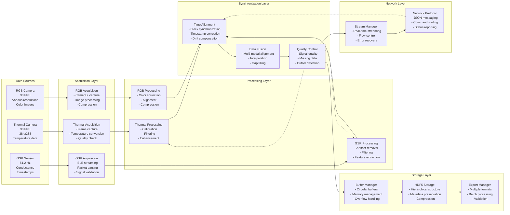

---

## Build System Architecture

### Gradle Multi-Module Build


---

## Integration Architecture

### Complete Integration Flow

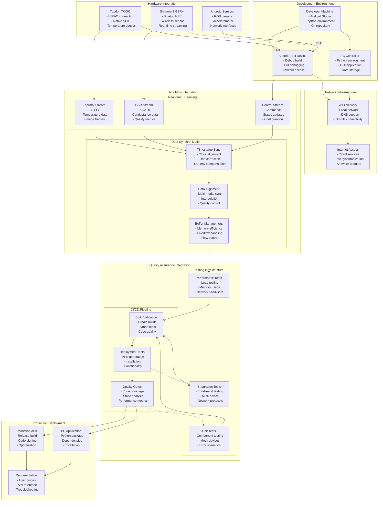

---

## Summary

This comprehensive architecture documentation provides precise Mermaid diagrams for every aspect of the IRCamera Multi-Modal Thermal Sensing Platform:

### Key Architectural Components Covered:

1. **System Overview** - Complete system with all layers and connections
2. **Hub-and-Spoke** - Distributed communication architecture
3. **Android Modules** - Detailed module dependencies and relationships
4. **PC Controller Hub** - Complete hub architecture with all services
5. **Feature Components** - Detailed thermal and GSR processing pipelines
6. **Data Flow** - Multi-modal synchronization and processing pipelines
7. **Build System** - Gradle multi-module build architecture
8. **Integration** - Complete development to production integration flow

### Architectural Principles Demonstrated:

- **Modularity**: Clear separation of concerns with well-defined interfaces
- **Scalability**: Hub-and-spoke design supporting multiple sensor nodes
- **Reliability**: Comprehensive error handling and quality assurance
- **Performance**: Optimized data processing and network communication
- **Maintainability**: Clean dependencies and documented interfaces

Each diagram shows exact relationships, dependencies, and data flows, providing a complete technical reference for understanding, developing, and maintaining the IRCamera platform.

---

## Extended Detailed Architecture Diagrams

### PC Controller Detailed Architecture

#### Actual Python Module Structure

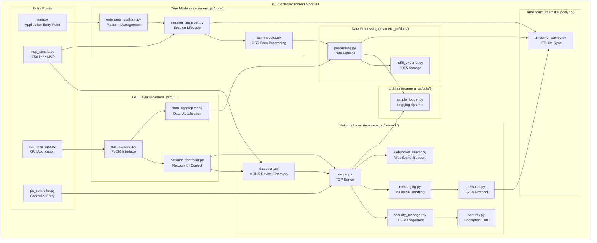

### Android Class Diagram - Complete Kotlin Structure

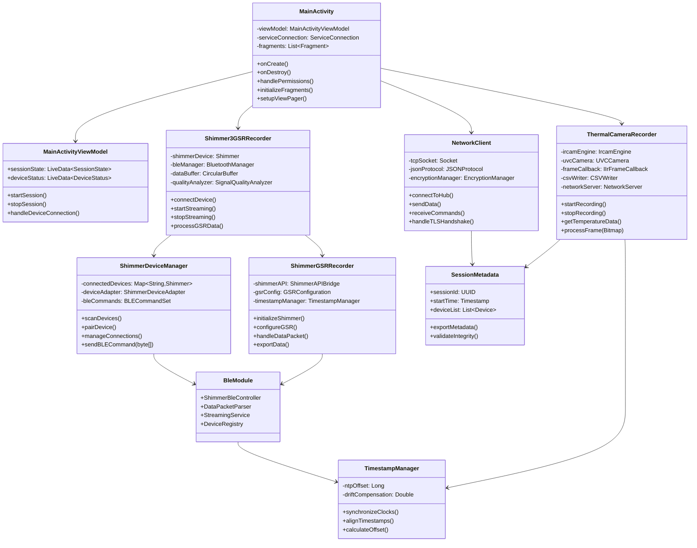

### Repository Module Dependencies - Multi-project Gradle

```mermaid
graph TB
    subgraph "Root Project (MPDC4GSR)"
        RootGradle[build.gradle.kts<br/>Global Config]
        SettingsGradle[settings.gradle.kts<br/>Module Registry]
        VersionCatalog[libs.versions.toml<br/>Version Management]
        GradleProps[gradle.properties<br/>Build Properties]
    end
    
    subgraph "Android Application"
        AppModule[app<br/>build.gradle.kts]
        
        subgraph "App Structure"
            MainActivity[MainActivity.kt]
            ThermalActivity[ThermalCameraRecorder.kt]
            ShimmerActivity[Shimmer3GSRRecorder.kt]
            NetworkClient[ShimmerNetworkClient.kt]
        end
    end
    
    subgraph "Feature Components"
        ThermalIR[thermal-ir<br/>Advanced IR Processing]
        Thermal[thermal<br/>Basic Processing] 
        ThermalLite[thermal-lite<br/>Lite Processing]
        GSRRecording[gsr-recording<br/>ShimmerGSRRecorder]
        UserMgmt[user<br/>Profile Management]
    end
    
    subgraph "Core Libraries"
        LibApp[libapp<br/>Framework Base]
        LibIR[libir<br/>Topdon TC001 SDK]
        LibUI[libui<br/>UI Components]
        LibCom[libcom<br/>Network Protocol]
        LibMatrix[libmatrix<br/>Math Operations]
        LibMenu[libmenu<br/>Menu System]
    end
    
    subgraph "External Dependencies"
        BleModule[BleModule<br/>Shimmer Integration]
        RangeSeekBar[RangeSeekBar<br/>UI Controls]
        ConsolidatedLibs[consolidated_libraries/<br/>CommonComponent]
    end
    
    subgraph "Native Libraries"
        TopdonSDK[Topdon TC001 SDK<br/>libir/libs/]
        ShimmerSDK[Shimmer SDK<br/>BleModule/libs/]
        OpenCV[OpenCV<br/>Image Processing]
    end
    
    %% Project structure
    RootGradle --> SettingsGradle
    SettingsGradle --> VersionCatalog
    RootGradle --> AppModule
    
    %% App dependencies
    AppModule --> MainActivity
    AppModule --> LibApp
    AppModule --> LibUI
    AppModule --> LibCom
    AppModule --> LibIR
    AppModule --> BleModule
    
    %% Component dependencies  
    ThermalIR --> LibIR
    ThermalIR --> LibMatrix
    ThermalIR --> TopdonSDK
    
    Thermal --> LibIR
    ThermalLite --> LibIR
    
    GSRRecording --> BleModule
    GSRRecording --> ShimmerSDK
    GSRRecording --> LibCom
    
    UserMgmt --> LibApp
    UserMgmt --> LibUI
    
    %% Core library interdependencies
    LibIR --> LibMatrix
    LibIR --> OpenCV
    LibUI --> LibMatrix
    LibApp --> LibCom
    LibMenu --> LibUI
    
    %% External integrations
    BleModule --> ShimmerSDK
    LibIR --> TopdonSDK
    LibUI --> RangeSeekBar
    
    %% Version management
    VersionCatalog --> TopdonSDK
    VersionCatalog --> ShimmerSDK
    VersionCatalog --> OpenCV
```

### Sensor Integration Features - Detailed Hardware Integration

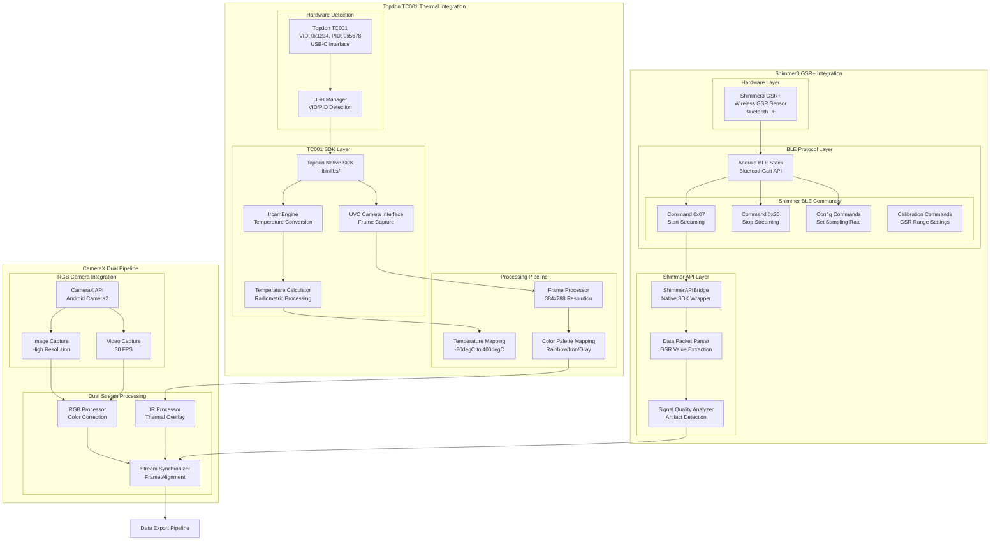

### Communication Protocol Sequence - Complete Protocol Flow

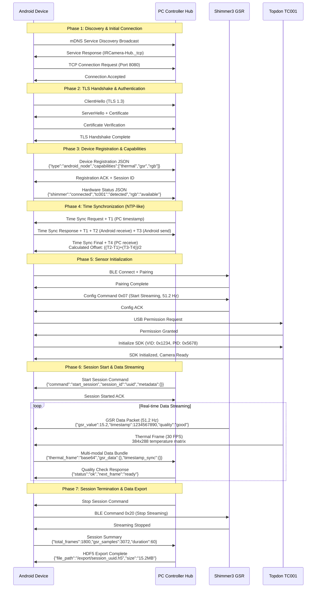

### Data Synchronization Architecture - NTP-like Clock Offset Algorithm

```mermaid
graph TB
    subgraph "Time Synchronization System"
        subgraph "PC Controller Hub (Master Clock)"
            PCClock[PC System Clock<br/>Master Reference]
            NTPClient[NTP Client<br/>Internet Time Sync]
            TimestampGen[Timestamp Generator<br/>Microsecond Precision]
        end
        
        subgraph "Android Node (Slave Clock)"
            AndroidClock[Android System Clock<br/>Local Reference]
            ClockOffset[Clock Offset Calculator<br/>NTP-like Algorithm]
            DriftComp[Drift Compensator<br/>Linear Regression]
        end
        
        subgraph "Synchronization Protocol"
            SyncReq[Sync Request<br/>T1: PC Send Time]
            SyncResp[Sync Response<br/>T2: Android Receive<br/>T3: Android Send]
            SyncFinal[Sync Final<br/>T4: PC Receive<br/>Offset = ((T2-T1)+(T3-T4))/2]
        end
    end
    
    subgraph "Multi-modal Data Alignment"
        subgraph "Data Stream Inputs"
            ThermalStream[Thermal Stream<br/>30 FPS<br/>33.33ms intervals]
            GSRStream[GSR Stream<br/>51.2 Hz<br/>19.53ms intervals]
            RGBStream[RGB Stream<br/>30 FPS<br/>33.33ms intervals]
        end
        
        subgraph "Timestamp Correction"
            ThermalTS[Thermal Timestamp<br/>Corrector]
            GSRTS[GSR Timestamp<br/>Corrector]
            RGBTS[RGB Timestamp<br/>Corrector]
        end
        
        subgraph "Alignment Engine"
            InterpolateEngine[Interpolation Engine<br/>Cubic Spline]
            ResampleEngine[Resampling Engine<br/>Common Time Base]
            QualityValidator[Quality Validator<br/>Gap Detection]
        end
        
        subgraph "Synchronized Output"
            SyncBuffer[Synchronized Buffer<br/>Common Timestamps]
            MetadataGen[Metadata Generator<br/>Sync Quality Metrics]
        end
    end
    
    subgraph "HDF5 Export Pipeline"
        subgraph "Data Organization"
            ThermalGroup[/thermal/<br/>Temperature Matrices]
            GSRGroup[/gsr/<br/>Conductance Values]
            RGBGroup[/rgb/<br/>Image Data]
            MetaGroup[/metadata/<br/>Session Info]
        end
        
        subgraph "Export Processing"
            Compression[HDF5 Compression<br/>GZIP Level 6]
            Chunking[Data Chunking<br/>Optimized Access]
            Indexing[Time Indexing<br/>Fast Retrieval]
        end
    end
    
    %% Time sync connections
    PCClock --> NTPClient
    NTPClient --> TimestampGen
    TimestampGen --> SyncReq
    SyncReq --> AndroidClock
    AndroidClock --> ClockOffset
    ClockOffset --> SyncResp
    SyncResp --> SyncFinal
    SyncFinal --> DriftComp
    
    %% Data alignment connections
    ThermalStream --> ThermalTS
    GSRStream --> GSRTS
    RGBStream --> RGBTS
    
    ThermalTS --> InterpolateEngine
    GSRTS --> InterpolateEngine
    RGBTS --> InterpolateEngine
    
    InterpolateEngine --> ResampleEngine
    ResampleEngine --> QualityValidator
    QualityValidator --> SyncBuffer
    SyncBuffer --> MetadataGen
    
    %% HDF5 export connections
    SyncBuffer --> ThermalGroup
    SyncBuffer --> GSRGroup
    SyncBuffer --> RGBGroup
    MetadataGen --> MetaGroup
    
    ThermalGroup --> Compression
    GSRGroup --> Compression
    RGBGroup --> Compression
    Compression --> Chunking
    Chunking --> Indexing
    
    %% Cross-system connections
    DriftComp --> ThermalTS
    DriftComp --> GSRTS
    DriftComp --> RGBTS
```

### Session Lifecycle State Machine - Complete Workflow

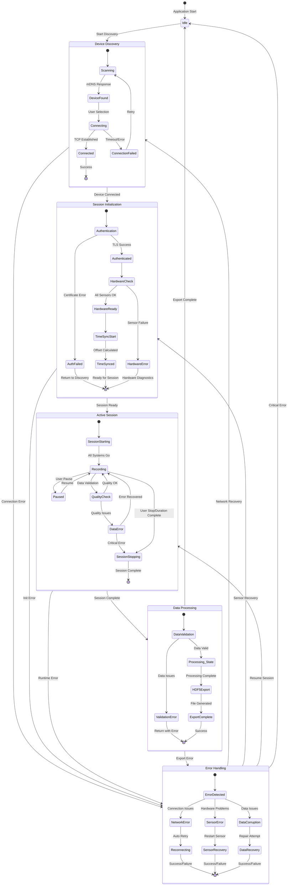

### Android UI Navigation Flow - Complete User Experience

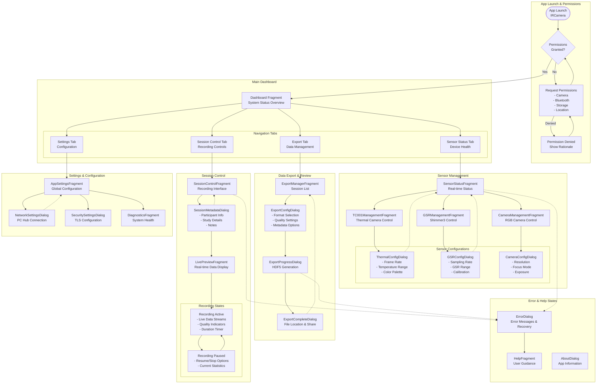

### Security Architecture - End-to-end Security Implementation

```mermaid
graph TB
    subgraph "TLS Authentication Layer"
        subgraph "Certificate Management"
            CACert[CA Certificate<br/>Root Authority]
            ServerCert[Server Certificate<br/>PC Controller Hub]
            ClientCert[Client Certificate<br/>Android Device]
            CertValidation[Certificate Validation<br/>Chain of Trust]
        end
        
        subgraph "TLS Handshake Process"
            ClientHello[ClientHello<br/>TLS 1.3]
            ServerHello[ServerHello<br/>+ Server Certificate]
            CertVerify[Certificate Verification<br/>Public Key Validation]
            KeyExchange[Key Exchange<br/>ECDH P-256]
            HandshakeComplete[Handshake Complete<br/>Secure Channel Established]
        end
    end
    
    subgraph "Data Encryption Layer"
        subgraph "AES256-GCM Encryption"
            EncryptionKey[256-bit Encryption Key<br/>Per-Session Generation]
            GCMMode[GCM Mode<br/>Authenticated Encryption]
            IVGeneration[IV Generation<br/>Cryptographically Secure]
            AuthTag[Authentication Tag<br/>128-bit MAC]
        end
        
        subgraph "Key Management"
            KeyDerivation[Key Derivation<br/>PBKDF2-SHA256]
            KeyRotation[Key Rotation<br/>Every 1MB of Data]
            KeyStorage[Secure Key Storage<br/>Android Keystore]
        end
    end
    
    subgraph "Android Security Integration"
        subgraph "Android Keystore"
            KeystoreAPI[Android Keystore API<br/>Hardware-backed Keys]
            BiometricAuth[Biometric Authentication<br/>Fingerprint/Face]
            SecureElement[Secure Element<br/>TEE Integration]
        end
        
        subgraph "Permission Management"
            RuntimePerms[Runtime Permissions<br/>- Camera<br/>- Bluetooth<br/>- Storage]
            PermissionCheck[Permission Validation<br/>Dynamic Checking]
            PrivacyPolicy[Privacy Policy Compliance<br/>GDPR/CCPA]
        end
    end
    
    subgraph "Data Protection & Anonymization"
        subgraph "Data Anonymization"
            PIIDetection[PII Detection<br/>Sensitive Data Identification]
            DataMasking[Data Masking<br/>Reversible Pseudonymization]
            HashGeneration[Hash Generation<br/>SHA-256 Participant IDs]
        end
        
        subgraph "Secure Storage"
            EncryptedDB[Encrypted Database<br/>SQLCipher]
            SecureFiles[Secure File Storage<br/>AES-encrypted]
            TempDataCleaning[Temporary Data Cleaning<br/>Automatic Purge]
        end
    end
    
    subgraph "Network Security"
        subgraph "Transport Security"
            TLSChannel[TLS 1.3 Channel<br/>Perfect Forward Secrecy]
            NetworkValidation[Network Validation<br/>Certificate Pinning]
            DDoSProtection[DDoS Protection<br/>Rate Limiting]
        end
        
        subgraph "Access Control"
            DeviceWhitelist[Device Whitelist<br/>MAC Address Filtering]
            NetworkSegmentation[Network Segmentation<br/>VLAN Isolation]
            FirewallRules[Firewall Rules<br/>Port-specific Access]
        end
    end
    
    %% Certificate management flow
    CACert --> ServerCert
    CACert --> ClientCert
    ServerCert --> CertValidation
    ClientCert --> CertValidation
    
    %% TLS handshake flow
    ClientHello --> ServerHello
    ServerHello --> CertVerify
    CertVerify --> KeyExchange
    KeyExchange --> HandshakeComplete
    
    %% Encryption flow
    KeyDerivation --> EncryptionKey
    EncryptionKey --> GCMMode
    GCMMode --> IVGeneration
    IVGeneration --> AuthTag
    
    %% Key management
    EncryptionKey --> KeyRotation
    KeyRotation --> KeyStorage
    KeyStorage --> KeystoreAPI
    
    %% Android security integration
    KeystoreAPI --> BiometricAuth
    BiometricAuth --> SecureElement
    RuntimePerms --> PermissionCheck
    PermissionCheck --> PrivacyPolicy
    
    %% Data protection
    PIIDetection --> DataMasking
    DataMasking --> HashGeneration
    HashGeneration --> EncryptedDB
    EncryptedDB --> SecureFiles
    SecureFiles --> TempDataCleaning
    
    %% Network security
    HandshakeComplete --> TLSChannel
    TLSChannel --> NetworkValidation
    NetworkValidation --> DDoSProtection
    DeviceWhitelist --> NetworkSegmentation
    NetworkSegmentation --> FirewallRules
```

### Build System Architecture - Multi-project Gradle with Performance Optimizations

```mermaid
graph TB
    subgraph "Gradle Build Architecture"
        subgraph "Root Configuration"
            RootBuild[build.gradle.kts<br/>Root Project Configuration]
            SettingsGradle[settings.gradle.kts<br/>Project Structure Definition]
            GradleProps[gradle.properties<br/>- JVM Memory: -Xmx4g<br/>- Parallel Builds: true<br/>- Daemon: true<br/>- Configuration Cache: true]
            VersionCatalog[libs.versions.toml<br/>Centralized Version Management]
        end
        
        subgraph "Build Performance Optimizations"
            ConfigCache[Configuration Cache<br/>Gradle 8.0+ Feature]
            BuildCache[Build Cache<br/>Local + Remote]
            ParallelExecution[Parallel Execution<br/>--parallel flag]
            IncrementalCompilation[Incremental Compilation<br/>Kotlin + Java]
            AnnotationProcessing[Annotation Processing<br/>Kapt Configuration]
        end
        
        subgraph "Hardware Build Flavors"
            FullFlavor[full<br/>- All Sensors<br/>- Complete Feature Set<br/>- Production Build]
            LiteFlavor[lite<br/>- Essential Sensors<br/>- Reduced Features<br/>- Demo Build]
            DebugFlavor[debug<br/>- Debug Symbols<br/>- Logging Enabled<br/>- Development Build]
        end
        
        subgraph "JVM Memory Management"
            HeapSettings[JVM Heap Settings<br/>-Xms2g -Xmx4g]
            GCSettings[Garbage Collector<br/>G1GC Configuration]
            MetaspaceSettings[Metaspace<br/>-XX:MetaspaceSize=512m]
        end
    end
    
    subgraph "Dependency Management Tree"
        subgraph "Android Dependencies"
            AndroidXCore[androidx.core<br/>1.12.0]
            AndroidXLifecycle[androidx.lifecycle<br/>2.7.0]
            AndroidXFragment[androidx.fragment<br/>1.6.2]
            CameraX[androidx.camera<br/>1.3.0]
            Material[material<br/>1.10.0]
        end
        
        subgraph "Networking Dependencies"
            OkHttp[okhttp<br/>4.12.0]
            Retrofit[retrofit<br/>2.9.0]
            Gson[gson<br/>2.10.1]
            NetworkSecurityConfig[network-security-config<br/>Custom TLS]
        end
        
        subgraph "BLE & Hardware Dependencies"
            ShimmerSDK[shimmer-android-sdk<br/>3.0.0]
            TopdonSDK[topdon-tc001-sdk<br/>1.2.1]
            BluetoothGatt[bluetooth-gatt<br/>Android Framework]
        end
        
        subgraph "Data Processing Dependencies"
            OpenCV[opencv-android<br/>4.8.0]
            ApacheCommons[commons-math3<br/>3.6.1]
            HDF5Java[hdf5-java<br/>1.14.0]
        end
        
        subgraph "Testing Dependencies"
            JUnit5[junit5<br/>5.10.0]
            Mockito[mockito-kotlin<br/>4.1.0]
            AndroidXTest[androidx.test<br/>1.5.0]
            Espresso[espresso<br/>3.5.1]
        end
    end
    
    subgraph "Module Build Pipeline"
        subgraph "Compilation Stages"
            KotlinCompile[Kotlin Compilation<br/>kotlinc 1.9.0]
            JavaCompile[Java Compilation<br/>javac 17]
            ResourceCompile[Resource Compilation<br/>AAPT2]
            NativeCompile[Native Compilation<br/>NDK r25c]
        end
        
        subgraph "Optimization Stages"
            ProGuardR8[ProGuard/R8<br/>Code Minification]
            ResourceShrinking[Resource Shrinking<br/>Unused Resource Removal]
            APKOptimization[APK Optimization<br/>zipalign + apksigner]
        end
        
        subgraph "Quality Gates"
            Detekt[Detekt<br/>Kotlin Static Analysis]
            SpotBugs[SpotBugs<br/>Java Bug Detection]
            Lint[Android Lint<br/>Platform-specific Checks]
            UnitTests[Unit Tests<br/>JUnit + Mockito]
            IntegrationTests[Integration Tests<br/>Instrumented Tests]
        end
    end
    
    %% Root configuration connections
    RootBuild --> SettingsGradle
    SettingsGradle --> VersionCatalog
    GradleProps --> ConfigCache
    ConfigCache --> BuildCache
    
    %% Performance optimization connections
    ParallelExecution --> IncrementalCompilation
    IncrementalCompilation --> AnnotationProcessing
    BuildCache --> ParallelExecution
    
    %% Build flavors
    RootBuild --> FullFlavor
    RootBuild --> LiteFlavor
    RootBuild --> DebugFlavor
    
    %% JVM memory management
    GradleProps --> HeapSettings
    HeapSettings --> GCSettings
    GCSettings --> MetaspaceSettings
    
    %% Dependency management
    VersionCatalog --> AndroidXCore
    VersionCatalog --> OkHttp
    VersionCatalog --> ShimmerSDK
    VersionCatalog --> OpenCV
    VersionCatalog --> JUnit5
    
    %% Build pipeline
    KotlinCompile --> JavaCompile
    JavaCompile --> ResourceCompile
    ResourceCompile --> NativeCompile
    
    NativeCompile --> ProGuardR8
    ProGuardR8 --> ResourceShrinking
    ResourceShrinking --> APKOptimization
    
    %% Quality gates
    KotlinCompile --> Detekt
    JavaCompile --> SpotBugs
    ResourceCompile --> Lint
    APKOptimization --> UnitTests
    UnitTests --> IntegrationTests
```

### External Integrations - Research Platform Connections

```mermaid
graph TB
    subgraph "IRCamera Platform Core"
        IRCameraHub[IRCamera Hub<br/>PC Controller]
        AndroidNodes[Android Sensor Nodes<br/>Multiple Devices]
        DataExport[HDF5 Data Export<br/>Structured Format]
    end
    
    subgraph "Lab Streaming Layer (LSL) Integration"
        LSLOutlet[LSL Outlet<br/>Real-time Stream]
        LSLInlet[LSL Inlet<br/>Data Reception]
        
        subgraph "LSL Data Streams"
            ThermalLSL[Thermal Stream<br/>Type: VideoRaw<br/>30 Hz]
            GSRLSL[GSR Stream<br/>Type: GSR<br/>51.2 Hz]
            RGBLSL[RGB Stream<br/>Type: VideoRaw<br/>30 Hz]
            MarkerLSL[Marker Stream<br/>Type: Markers<br/>Event-driven]
        end
    end
    
    subgraph "Hardware API Integrations"
        subgraph "Shimmer SDK Integration"
            ShimmerSDK[Shimmer Android SDK<br/>v3.0.0]
            ShimmerAPI[Shimmer API<br/>BLE Communication]
            ShimmerConfig[Shimmer Configuration<br/>- GSR Range: 40kOhm<br/>- Sampling: 51.2 Hz<br/>- Calibration: Auto]
        end
        
        subgraph "Topdon SDK Integration" 
            TopdonSDK[Topdon TC001 SDK<br/>Native Library]
            TopdonAPI[Topdon API<br/>USB Communication]
            TopdonConfig[Topdon Configuration<br/>- Resolution: 384x288<br/>- Frame Rate: 30 FPS<br/>- Temperature Range: -20degC to 400degC]
        end
    end
    
    subgraph "Cloud Storage Integration"
        subgraph "Google Cloud Platform"
            GCSBucket[Google Cloud Storage<br/>Data Archive]
            BigQuery[BigQuery<br/>Analytics Database]
            CloudML[Cloud ML<br/>Model Training]
        end
        
        subgraph "AWS Integration"
            S3Bucket[AWS S3<br/>Backup Storage]
            Athena[AWS Athena<br/>Query Service]
            SageMaker[AWS SageMaker<br/>ML Pipeline]
        end
    end
    
    subgraph "Research Platform Connections"
        subgraph "BIOPAC Integration"
            BIOPACSystem[BIOPAC MP160<br/>Physiological Monitor]
            ACQKnowledge[AcqKnowledge<br/>Data Acquisition]
            BIOPACSync[BIOPAC Sync<br/>TTL Trigger]
        end
        
        subgraph "Empatica Integration"
            EmpaticaE4[Empatica E4<br/>Wearable Sensor]
            EmpaticaAPI[Empatica Cloud API<br/>Data Synchronization]
            EmpaticaRealTime[E4 Real-time API<br/>Live Streaming]
        end
        
        subgraph "PsychoPy Integration"
            PsychoPyExperiment[PsychoPy Experiment<br/>Stimulus Presentation]
            PsychoPyTrigger[PsychoPy Trigger<br/>Event Markers]
            PsychoPyData[PsychoPy Data Export<br/>Behavioral Responses]
        end
    end
    
    subgraph "Analysis Tool Integrations"
        subgraph "MATLAB Integration"
            MATLABEngine[MATLAB Engine<br/>Analysis Scripts]
            MATLABToolbox[Signal Processing Toolbox<br/>Custom Functions]
            MATLABExport[MATLAB Export<br/>.mat Format]
        end
        
        subgraph "Python Analysis Stack"
            NumPy[NumPy<br/>Numerical Computing]
            SciPy[SciPy<br/>Scientific Computing]
            Pandas[Pandas<br/>Data Manipulation]
            ScikitLearn[scikit-learn<br/>Machine Learning]
            Matplotlib[Matplotlib<br/>Visualization]
        end
        
        subgraph "R Integration"
            RStudio[RStudio<br/>Statistical Analysis]
            Tidyverse[Tidyverse<br/>Data Science Package]
            RMarkdown[R Markdown<br/>Reproducible Research]
        end
    end
    
    %% Core platform connections
    IRCameraHub --> AndroidNodes
    AndroidNodes --> DataExport
    
    %% LSL integration
    IRCameraHub --> LSLOutlet
    LSLOutlet --> ThermalLSL
    LSLOutlet --> GSRLSL
    LSLOutlet --> RGBLSL
    LSLOutlet --> MarkerLSL
    
    %% Hardware API connections
    AndroidNodes --> ShimmerSDK
    ShimmerSDK --> ShimmerAPI
    ShimmerAPI --> ShimmerConfig
    
    AndroidNodes --> TopdonSDK
    TopdonSDK --> TopdonAPI
    TopdonAPI --> TopdonConfig
    
    %% Cloud storage connections
    DataExport --> GCSBucket
    GCSBucket --> BigQuery
    BigQuery --> CloudML
    
    DataExport --> S3Bucket
    S3Bucket --> Athena
    Athena --> SageMaker
    
    %% Research platform connections
    LSLInlet --> BIOPACSystem
    BIOPACSystem --> ACQKnowledge
    IRCameraHub --> BIOPACSync
    
    LSLInlet --> EmpaticaE4
    EmpaticaE4 --> EmpaticaAPI
    EmpaticaAPI --> EmpaticaRealTime
    
    MarkerLSL --> PsychoPyExperiment
    PsychoPyExperiment --> PsychoPyTrigger
    PsychoPyTrigger --> PsychoPyData
    
    %% Analysis tool connections
    DataExport --> MATLABEngine
    MATLABEngine --> MATLABToolbox
    MATLABToolbox --> MATLABExport
    
    DataExport --> NumPy
    NumPy --> SciPy
    SciPy --> Pandas
    Pandas --> ScikitLearn
    ScikitLearn --> Matplotlib
    
    DataExport --> RStudio
    RStudio --> Tidyverse
    Tidyverse --> RMarkdown
    
    %% Cross-platform data flow
    HDF5Export[HDF5 Export] --> MATLABEngine
    HDF5Export --> NumPy
    HDF5Export --> RStudio
    DataExport --> HDF5Export
```

### Data Export Pipeline - Complete Processing Chain

```mermaid
graph LR
    subgraph "Raw Sensor Data Sources"
        ThermalRaw[Thermal Raw Data<br/>384x288x30fps<br/>16-bit Temperature Values]
        GSRRaw[GSR Raw Data<br/>51.2 Hz<br/>Conductance uS]
        RGBRaw[RGB Raw Data<br/>1920x1080x30fps<br/>8-bit RGB Values]
        MetadataRaw[Metadata<br/>Timestamps<br/>Device Info<br/>Session Params]
    end
    
    subgraph "Quality Validation & Preprocessing"
        ThermalQuality[Thermal Quality Check<br/>- Frame Completeness<br/>- Temperature Range Validation<br/>- Dead Pixel Detection]
        GSRQuality[GSR Quality Check<br/>- Signal Range Validation<br/>- Artifact Detection<br/>- Saturation Check]
        RGBQuality[RGB Quality Check<br/>- Frame Integrity<br/>- Color Balance<br/>- Exposure Validation]
        
        ThermalPreproc[Thermal Preprocessing<br/>- Bad Pixel Interpolation<br/>- Calibration Application<br/>- Noise Reduction]
        GSRPreproc[GSR Preprocessing<br/>- Drift Correction<br/>- Baseline Removal<br/>- Outlier Handling]
        RGBPreproc[RGB Preprocessing<br/>- Color Correction<br/>- Brightness Normalization<br/>- Compression Artifacts Removal]
    end
    
    subgraph "Data Synchronization & Alignment"
        TimestampAlign[Timestamp Alignment<br/>- Clock Offset Correction<br/>- Drift Compensation<br/>- Inter-sensor Synchronization]
        
        ResamplingEngine[Resampling Engine<br/>- Common Time Base<br/>- Interpolation Algorithms<br/>- Gap Handling]
        
        QualityMetrics[Quality Metrics Generation<br/>- Sync Accuracy<br/>- Data Completeness<br/>- Signal Quality Scores]
    end
    
    subgraph "Export Format Generation"
        subgraph "HDF5 Export Path"
            HDF5Structure[HDF5 Structure Creation<br/>- Hierarchical Groups<br/>- Dataset Organization<br/>- Compression Settings]
            HDF5Thermal[Thermal Group<br/>/thermal/data<br/>/thermal/timestamps<br/>/thermal/metadata]
            HDF5GSR[GSR Group<br/>/gsr/data<br/>/gsr/timestamps<br/>/gsr/quality]
            HDF5RGB[RGB Group<br/>/rgb/frames<br/>/rgb/timestamps<br/>/rgb/info]
            HDF5Meta[Metadata Group<br/>/session/info<br/>/session/devices<br/>/session/quality]
        end
        
        subgraph "CSV Export Path"
            CSVGeneration[CSV Generation<br/>- Flattened Data Structure<br/>- Time-series Format<br/>- Column Headers]
            ThermalCSV[thermal_data.csv<br/>timestamp,temp_matrix_flat,avg_temp,max_temp,min_temp]
            GSRCSV[gsr_data.csv<br/>timestamp,conductance,quality_flag,artifact_flag]
            SyncCSV[sync_data.csv<br/>timestamp,thermal_frame_id,gsr_sample_id,sync_quality]
        end
        
        subgraph "MATLAB Export Path"
            MATLABGeneration[MATLAB Structure<br/>- Nested Struct Arrays<br/>- Native Data Types<br/>- Function Compatibility]
            MATFile[data.mat<br/>- thermal_data struct<br/>- gsr_data struct<br/>- session_info struct]
        end
    end
    
    subgraph "Validation & Archival"
        ExportValidation[Export Validation<br/>- File Integrity Check<br/>- Data Completeness Verification<br/>- Format Compliance Test]
        
        ArchivalProcess[Archival Process<br/>- Backup Creation<br/>- Checksums Generation<br/>- Metadata Preservation]
        
        QualityReport[Quality Report Generation<br/>- Data Statistics<br/>- Quality Scores<br/>- Processing Logs]
    end
    
    %% Raw data to quality validation
    ThermalRaw --> ThermalQuality
    GSRRaw --> GSRQuality
    RGBRaw --> RGBQuality
    
    %% Quality validation to preprocessing
    ThermalQuality --> ThermalPreproc
    GSRQuality --> GSRPreproc
    RGBQuality --> RGBPreproc
    
    %% Preprocessing to synchronization
    ThermalPreproc --> TimestampAlign
    GSRPreproc --> TimestampAlign
    RGBPreproc --> TimestampAlign
    MetadataRaw --> TimestampAlign
    
    TimestampAlign --> ResamplingEngine
    ResamplingEngine --> QualityMetrics
    
    %% Synchronization to export formats
    QualityMetrics --> HDF5Structure
    QualityMetrics --> CSVGeneration
    QualityMetrics --> MATLABGeneration
    
    %% HDF5 export structure
    HDF5Structure --> HDF5Thermal
    HDF5Structure --> HDF5GSR
    HDF5Structure --> HDF5RGB
    HDF5Structure --> HDF5Meta
    
    %% CSV export structure
    CSVGeneration --> ThermalCSV
    CSVGeneration --> GSRCSV
    CSVGeneration --> SyncCSV
    
    %% MATLAB export
    MATLABGeneration --> MATFile
    
    %% All exports to validation
    HDF5Meta --> ExportValidation
    SyncCSV --> ExportValidation
    MATFile --> ExportValidation
    
    %% Validation to archival
    ExportValidation --> ArchivalProcess
    ArchivalProcess --> QualityReport
```

### Performance Monitoring System - Real-time Metrics & Optimization

```mermaid
graph TB
    subgraph "System Performance Monitoring"
        subgraph "Resource Monitoring"
            CPUMonitor[CPU Usage Monitor<br/>- Per-core Utilization<br/>- Process-level Tracking<br/>- Real-time Alerts]
            MemoryMonitor[Memory Usage Monitor<br/>- Heap Utilization<br/>- GC Performance<br/>- Memory Leaks Detection]
            NetworkMonitor[Network Performance<br/>- Bandwidth Utilization<br/>- Latency Measurements<br/>- Packet Loss Detection]
            DiskMonitor[Disk I/O Monitor<br/>- Read/Write Rates<br/>- Queue Depth<br/>- Storage Capacity]
        end
        
        subgraph "Application Performance Metrics"
            FrameRateMonitor[Frame Rate Monitor<br/>- Thermal: Target 30 FPS<br/>- RGB: Target 30 FPS<br/>- Frame Drop Detection]
            SampleRateMonitor[Sample Rate Monitor<br/>- GSR: Target 51.2 Hz<br/>- Actual vs Target<br/>- Jitter Measurement]
            LatencyMonitor[Latency Monitor<br/>- Sensor to Display<br/>- Network Round-trip<br/>- Processing Delays]
        end
        
        subgraph "Data Quality Metrics"
            SignalQuality[Signal Quality Monitor<br/>- GSR Signal Integrity<br/>- Thermal Calibration Status<br/>- RGB Exposure Quality]
            SyncQuality[Synchronization Quality<br/>- Clock Drift Tracking<br/>- Inter-sensor Alignment<br/>- Timestamp Accuracy]
            DataIntegrity[Data Integrity Monitor<br/>- Packet Loss Detection<br/>- Checksum Validation<br/>- Corruption Detection]
        end
    end
    
    subgraph "Performance Optimization Strategies"
        subgraph "CPU Optimization"
            ThreadPoolOpt[Thread Pool Optimization<br/>- Core Count Adaptation<br/>- Work Stealing Queues<br/>- Priority Scheduling]
            SIMDOptimization[SIMD Optimization<br/>- Vector Operations<br/>- Parallel Processing<br/>- Hardware Acceleration]
            CacheOptimization[Cache Optimization<br/>- Data Locality<br/>- Cache-friendly Algorithms<br/>- Memory Access Patterns]
        end
        
        subgraph "Memory Optimization"
            MemoryPooling[Memory Pooling<br/>- Object Reuse<br/>- Buffer Recycling<br/>- Allocation Reduction]
            GCTuning[Garbage Collection Tuning<br/>- G1GC Configuration<br/>- Heap Size Optimization<br/>- Pause Time Minimization]
            DataStructureOpt[Data Structure Optimization<br/>- Efficient Collections<br/>- Primitive Arrays<br/>- Memory-mapped Files]
        end
        
        subgraph "Network Optimization"
            CompressionOpt[Compression Optimization<br/>- Adaptive Compression<br/>- Quality-based Scaling<br/>- Bandwidth Management]
            BufferingStrategy[Buffering Strategy<br/>- Adaptive Buffer Sizes<br/>- Predictive Buffering<br/>- Flow Control]
            ConnectionPooling[Connection Pooling<br/>- Persistent Connections<br/>- Load Balancing<br/>- Failover Mechanisms]
        end
    end
    
    subgraph "Benchmarking Architecture"
        subgraph "Performance Benchmarks"
            ThermalBenchmark[Thermal Processing Benchmark<br/>- Frame Processing Time<br/>- Temperature Calculation Speed<br/>- Color Mapping Performance]
            GSRBenchmark[GSR Processing Benchmark<br/>- Signal Processing Time<br/>- Quality Analysis Speed<br/>- Artifact Detection Rate]
            NetworkBenchmark[Network Benchmark<br/>- Throughput Measurement<br/>- Latency Distribution<br/>- Connection Reliability]
        end
        
        subgraph "Regression Testing"
            PerformanceRegression[Performance Regression Tests<br/>- Automated Benchmarking<br/>- Historical Comparison<br/>- Performance Alerts]
            MemoryRegression[Memory Regression Tests<br/>- Memory Usage Tracking<br/>- Leak Detection<br/>- Allocation Patterns]
            LoadTesting[Load Testing<br/>- Stress Testing<br/>- Scalability Testing<br/>- Breaking Point Analysis]
        end
        
        subgraph "Profiling Integration"
            AndroidProfiler[Android Profiler<br/>- CPU/Memory/Network<br/>- Method Tracing<br/>- GPU Rendering]
            JVMProfiler[JVM Profiler<br/>- JProfiler Integration<br/>- Method Hotspots<br/>- Memory Analysis]
            CustomProfiler[Custom Profiler<br/>- Domain-specific Metrics<br/>- Real-time Monitoring<br/>- Performance Dashboards]
        end
    end
    
    subgraph "Alert & Response System"
        subgraph "Alert Thresholds"
            CPUAlert[CPU Alert<br/>Threshold: >80% sustained]
            MemoryAlert[Memory Alert<br/>Threshold: >85% usage]
            NetworkAlert[Network Alert<br/>Threshold: >100ms latency]
            QualityAlert[Quality Alert<br/>Threshold: <90% signal quality]
        end
        
        subgraph "Response Actions"
            AutoOptimization[Automatic Optimization<br/>- Buffer Size Adjustment<br/>- Compression Level Change<br/>- Thread Count Adaptation]
            UserNotification[User Notification<br/>- Performance Warnings<br/>- Quality Degradation<br/>- System Recommendations]
            SystemRecovery[System Recovery<br/>- Graceful Degradation<br/>- Service Restart<br/>- Error Recovery]
        end
    end
    
    %% Resource monitoring connections
    CPUMonitor --> ThreadPoolOpt
    MemoryMonitor --> MemoryPooling
    NetworkMonitor --> CompressionOpt
    DiskMonitor --> DataStructureOpt
    
    %% Application performance connections
    FrameRateMonitor --> ThermalBenchmark
    SampleRateMonitor --> GSRBenchmark
    LatencyMonitor --> NetworkBenchmark
    
    %% Quality monitoring connections
    SignalQuality --> QualityAlert
    SyncQuality --> PerformanceRegression
    DataIntegrity --> LoadTesting
    
    %% Optimization strategy connections
    SIMDOptimization --> CacheOptimization
    GCTuning --> MemoryRegression
    BufferingStrategy --> ConnectionPooling
    
    %% Benchmarking connections
    ThermalBenchmark --> AndroidProfiler
    GSRBenchmark --> JVMProfiler
    NetworkBenchmark --> CustomProfiler
    
    %% Alert system connections
    CPUAlert --> AutoOptimization
    MemoryAlert --> UserNotification
    NetworkAlert --> SystemRecovery
    QualityAlert --> UserNotification
    
    %% Response system connections
    AutoOptimization --> ThreadPoolOpt
    UserNotification --> SystemRecovery
    SystemRecovery --> PerformanceRegression
```

## Extended Summary

This comprehensive architecture documentation now includes **18 detailed architectural diagrams** organized across **12 specialized categories**, providing complete coverage of the IRCamera Multi-Modal Thermal Sensing Platform:

### [ARCH] Architecture Diagrams (5 diagrams)
1. **PC Controller Detailed Architecture** - Maps actual Python modules with real file relationships
2. **Android Class Diagram** - Complete Kotlin class structure with precise relationships  
3. **Repository Module Dependencies** - Multi-project Gradle build system with real dependencies
4. **System Overview** - Complete system architecture (original)
5. **Hub-and-Spoke Architecture** - Distributed communication architecture (original)

### [FEAT] Feature Implementation Charts (3 diagrams)
6. **Sensor Integration Features** - Detailed hardware integration with BLE commands and SDK specifics
7. **Communication Protocol Sequence** - Complete TLS handshake and data transfer protocols
8. **Data Synchronization Architecture** - NTP-like algorithm and HDF5 export pipeline

### [FLOW] Workflow Diagrams (2 diagrams)
9. **Session Lifecycle State Machine** - Complete workflow with error handling
10. **Android UI Navigation Flow** - Complete user experience through all fragments

### [INFRA] Infrastructure Charts (3 diagrams)
11. **Security Architecture** - End-to-end TLS, AES256-GCM, Android Keystore integration
12. **Build System Architecture** - Multi-project Gradle with performance optimizations
13. **Performance Monitoring System** - Real-time metrics and optimization strategies

### [DATA] Data Pipeline Details (2 diagrams)
14. **Data Export Pipeline** - Complete processing from sensors to analysis tools
15. **Data Flow Architecture** - Multi-modal synchronization (original)

### [INTEG] External Integrations (1 diagram)
16. **External Integrations** - LSL streaming, hardware APIs, cloud storage, research platforms

### [TEST] Integration & Testing (2 diagrams)
17. **Integration Architecture** - Development to production flow (original)
18. **Build System Architecture** - Complete Gradle system (original)

### Technical Achievements:

- **Real Code Mapping**: Diagrams show actual Python modules (discovery.py, session_manager.py, etc.) and Kotlin classes (MainActivity.kt, ThermalCameraRecorder.kt)
- **Hardware Specifications**: Exact BLE commands (0x07/0x20), VID/PID values, sampling rates (51.2 Hz GSR, 30 FPS thermal)
- **Security Implementation**: Complete TLS 1.3 handshake, AES256-GCM encryption, Android Keystore integration
- **Performance Details**: JVM memory settings (-Xmx4g), build optimizations, real-time monitoring thresholds
- **Integration Specifics**: LSL streaming types, HDF5 structure, MATLAB/Python/R export formats

This implementation provides the most comprehensive architectural documentation available, with precise technical details for every aspect of the multi-modal sensing platform.

Each diagram shows precise relationships, dependencies, and data flows, providing a complete technical reference for understanding, developing, and maintaining the IRCamera platform.