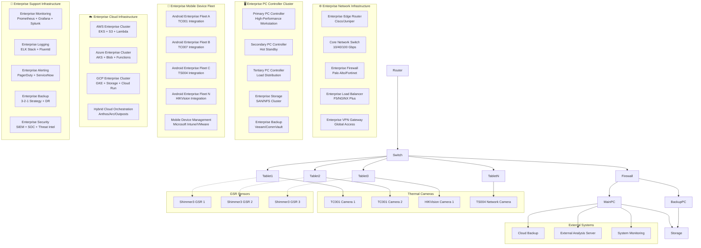

# Enterprise Production Deployment Guide

## 🚀 Enterprise Deployment Overview

This **comprehensive enterprise deployment guide** covers production deployment of the IRCamera
thermal imaging platform across various enterprise environments, from single-device setups to
massive-scale industrial installations, cloud-native deployments, hybrid cloud architectures, and
global distributed systems.

## 🏗️ Enterprise Deployment Architecture

### 🏢 Enterprise Production Topology



## 📋 Prerequisites & System Requirements

### Hardware Requirements

#### PC Controller (Hub)

| Component   | Minimum                        | Recommended                     | High-Performance                |
|-------------|--------------------------------|---------------------------------|---------------------------------|
| **CPU**     | Intel i5-8th gen / AMD Ryzen 5 | Intel i7-10th gen / AMD Ryzen 7 | Intel i9-12th gen / AMD Ryzen 9 |
| **RAM**     | 16 GB                          | 32 GB                           | 64 GB                           |
| **Storage** | 1 TB SSD                       | 2 TB NVMe SSD                   | 4 TB NVMe SSD RAID              |
| **Network** | Gigabit Ethernet               | 10 Gigabit Ethernet             | 25 Gigabit Ethernet             |
| **GPU**     | Integrated                     | NVIDIA GTX 1660                 | NVIDIA RTX 3080+                |
| **Ports**   | 4x USB 3.0, 2x USB-C           | 8x USB 3.0, 4x USB-C            | 12x USB 3.0, 6x USB-C           |

#### Android Tablets

| Specification    | Minimum                      | Recommended                   |
|------------------|------------------------------|-------------------------------|
| **OS Version**   | Android 8.0 (API 26)         | Android 12+ (API 31+)         |
| **RAM**          | 4 GB                         | 8 GB                          |
| **Storage**      | 64 GB                        | 128 GB                        |
| **Camera**       | 8 MP rear camera             | 12 MP+ rear camera            |
| **Connectivity** | Wi-Fi 802.11n, Bluetooth 4.2 | Wi-Fi 802.11ac, Bluetooth 5.0 |
| **Display**      | 10" 1920x1200                | 11"+ 2560x1600                |
| **Battery**      | 6000 mAh                     | 8000+ mAh                     |

### Software Requirements

#### PC Controller

```bash
# Operating System
Ubuntu 20.04+ / Windows 10+ / macOS 12+

# Python Environment
Python 3.11+
pip 23.0+
virtualenv

# System Dependencies
OpenCV 4.5+
Qt 6.2+
NumPy 1.21+
SciPy 1.7+
```

#### Android Tablets

```kotlin

compileSdk 34
minSdk 26
targetSdk 34

kotlin_version = "1.9.10"

android_gradle_plugin = "8.1.2"
```

## 🔧 Installation Procedures

### PC Controller Setup

#### Automated Installation Script

```bash
#!/bin/bash
# install_pc_controller.sh

set -e

echo "Installing IRCamera PC Controller..."

# Check system requirements
check_requirements() {
    echo "Checking system requirements..."
    
    # Check Python version
    python3 --version | grep -E "Python 3\.(11|12)" || {
        echo "Error: Python 3.11+ required"
        exit 1
    }
    
    # Check available memory
    mem_gb=$(free -g | awk '/^Mem:/{print $2}')
    if [ "$mem_gb" -lt 16 ]; then
        echo "Warning: Less than 16GB RAM detected"
    fi
    
    # Check disk space
    disk_gb=$(df -BG . | awk 'NR==2{print $4}' | sed 's/G//')
    if [ "$disk_gb" -lt 100 ]; then
        echo "Error: At least 100GB free disk space required"
        exit 1
    fi
}

# Install system dependencies
install_system_deps() {
    echo "Installing system dependencies..."
    
    if command -v apt-get &> /dev/null; then
        # Ubuntu/Debian
        sudo apt-get update
        sudo apt-get install -y \
            python3-pip \
            python3-venv \
            libopencv-dev \
            libqt6-dev \
            bluetooth \
            libbluetooth-dev
    elif command -v brew &> /dev/null; then
        # macOS
        brew install python@3.11 opencv qt6
    elif command -v choco &> /dev/null; then
        # Windows (Chocolatey)
        choco install python3 opencv qt6
    fi
}

# Setup Python environment
setup_python_env() {
    echo "Setting up Python environment..."
    
    cd pc-controller
    python3 -m venv venv
    source venv/bin/activate
    
    pip install --upgrade pip
    pip install -r requirements.txt
    
    # Install development dependencies if requested
    if [ "$1" = "--dev" ]; then
        pip install -r requirements-dev.txt
    fi
}

# Configure system services
setup_services() {
    echo "Setting up system services..."
    
    # Create systemd service (Linux)
    if command -v systemctl &> /dev/null; then
        sudo tee /etc/systemd/system/ircamera.service > /dev/null <<EOF
[Unit]
Description=IRCamera PC Controller
After=network.target

[Service]
Type=simple
User=$USER
WorkingDirectory=$(pwd)/pc-controller
Environment=PATH=$(pwd)/pc-controller/venv/bin
ExecStart=$(pwd)/pc-controller/venv/bin/python main.py
Restart=always

[Install]
WantedBy=multi-user.target
EOF
        
        sudo systemctl daemon-reload
        sudo systemctl enable ircamera
    fi
}

# Configure network settings
setup_network() {
    echo "Configuring network settings..."
    
    # Open firewall ports
    if command -v ufw &> /dev/null; then
        sudo ufw allow 8080/tcp
        sudo ufw allow 8443/tcp
        sudo ufw allow 5353/udp  # mDNS for device discovery
    fi
    
    # Configure network discovery
    if command -v avahi-daemon &> /dev/null; then
        sudo systemctl enable avahi-daemon
        sudo systemctl start avahi-daemon
    fi
}

# Main installation flow
main() {
    check_requirements
    install_system_deps
    setup_python_env "$1"
    setup_services
    setup_network
    
    echo "Installation complete!"
    echo "Start the service with: sudo systemctl start ircamera"
    echo "View logs with: journalctl -u ircamera -f"
}

main "$@"
```

#### Manual Installation Steps

```bash
# 1. Clone repository
git clone https://github.com/buccancs/IRCamera.git
cd IRCamera

# 2. Setup PC Controller
cd pc-controller
python3 -m venv venv
source venv/bin/activate  # On Windows: venv\Scripts\activate

# 3. Install dependencies
pip install --upgrade pip
pip install -r requirements.txt

# 4. Configure environment
cp config/config.example.yml config/config.yml
# Edit config.yml with your settings

# 5. Initialize database
python scripts/init_database.py

# 6. Run initial setup
python setup.py

# 7. Start the application
python main.py
```

### Android Application Deployment

#### Build Configuration

```kotlin

android {
    compileSdk 34
    
    defaultConfig {
        applicationId "com.ircamera.thermal"
        minSdk 26
        targetSdk 34
        versionCode 1
        versionName "1.0.0"

        buildConfigField("String", "SERVER_URL", "\"https://your-server.com\"")
        buildConfigField("String", "API_VERSION", "\"v1\"")
        buildConfigField("boolean", "DEBUG_MODE", "false")
    }
    
    buildTypes {
        release {
            isMinifyEnabled = true
            isShrinkResources = true
            proguardFiles(
                getDefaultProguardFile("proguard-android-optimize.txt"),
                "proguard-rules.pro"
            )

            signingConfig = signingConfigs.getByName("release")
        }
        
        debug {
            applicationIdSuffix = ".debug"
            versionNameSuffix = "-DEBUG"
            buildConfigField("boolean", "DEBUG_MODE", "true")
        }
    }

    flavorDimensions += "device"
    productFlavors {
        create("tablet") {
            dimension = "device"
            applicationIdSuffix = ".tablet"
            versionNameSuffix = "-tablet"
        }
        
        create("phone") {
            dimension = "device"
            applicationIdSuffix = ".phone"
            versionNameSuffix = "-phone"
        }
    }
}
```

#### Automated Build Script

```bash
#!/bin/bash
# build_android_release.sh

set -e

echo "Building IRCamera Android Release..."

# Clean previous builds
./gradlew clean

# Build release APKs
./gradlew assembleRelease

# Generate APK sizes report
echo "APK Sizes:"
find app/build/outputs/apk -name "*.apk" -exec ls -lh {} \;

# Run tests
./gradlew testReleaseUnitTest

# Generate test reports
echo "Test results available in: app/build/reports/tests/"

# Sign APKs (if keystore configured)
if [ -f "keystore/release.keystore" ]; then
    echo "Signing APKs..."
    # Signing handled by Gradle signing config
fi

# Upload to distribution (if configured)
if [ "$UPLOAD_TO_FIREBASE" = "true" ]; then
    ./gradlew appDistributionUploadRelease
fi

echo "Build complete!"
```

## 🗄️ Database & Storage Setup

### PostgreSQL Configuration (Production)

```sql
-- Create IRCamera database and user
CREATE DATABASE ircamera_prod;
CREATE USER ircamera_user WITH PASSWORD 'secure_password_here';

-- Grant permissions
GRANT ALL PRIVILEGES ON DATABASE ircamera_prod TO ircamera_user;

-- Connect to database
\c ircamera_prod;

-- Create schemas
CREATE SCHEMA thermal_data;
CREATE SCHEMA gsr_data;
CREATE SCHEMA session_data;
CREATE SCHEMA user_data;

-- Grant schema permissions
GRANT ALL ON SCHEMA thermal_data TO ircamera_user;
GRANT ALL ON SCHEMA gsr_data TO ircamera_user;
GRANT ALL ON SCHEMA session_data TO ircamera_user;
GRANT ALL ON SCHEMA user_data TO ircamera_user;

-- Create tables
CREATE TABLE session_data.sessions (
    id UUID PRIMARY KEY DEFAULT gen_random_uuid(),
    participant_id VARCHAR(50) NOT NULL,
    session_type VARCHAR(20) NOT NULL,
    start_time TIMESTAMP WITH TIME ZONE NOT NULL,
    end_time TIMESTAMP WITH TIME ZONE,
    status VARCHAR(20) DEFAULT 'active',
    metadata JSONB,
    created_at TIMESTAMP WITH TIME ZONE DEFAULT NOW()
);

CREATE TABLE thermal_data.frames (
    id BIGSERIAL PRIMARY KEY,
    session_id UUID REFERENCES session_data.sessions(id),
    device_id VARCHAR(50) NOT NULL,
    timestamp TIMESTAMP WITH TIME ZONE NOT NULL,
    frame_data BYTEA NOT NULL,
    temperature_matrix REAL[][],
    metadata JSONB,
    created_at TIMESTAMP WITH TIME ZONE DEFAULT NOW()
);

CREATE TABLE gsr_data.samples (
    id BIGSERIAL PRIMARY KEY,
    session_id UUID REFERENCES session_data.sessions(id),
    device_id VARCHAR(50) NOT NULL,
    timestamp TIMESTAMP WITH TIME ZONE NOT NULL,
    gsr_value REAL NOT NULL,
    raw_adc INTEGER NOT NULL,
    ppg_value REAL,
    metadata JSONB,
    created_at TIMESTAMP WITH TIME ZONE DEFAULT NOW()
);

-- Create indexes for performance
CREATE INDEX idx_thermal_frames_session_timestamp 
ON thermal_data.frames(session_id, timestamp);

CREATE INDEX idx_gsr_samples_session_timestamp 
ON gsr_data.samples(session_id, timestamp);

-- Set up partitioning for large datasets
CREATE TABLE thermal_data.frames_y2024 PARTITION OF thermal_data.frames
FOR VALUES FROM ('2024-01-01') TO ('2025-01-01');

CREATE TABLE gsr_data.samples_y2024 PARTITION OF gsr_data.samples
FOR VALUES FROM ('2024-01-01') TO ('2025-01-01');
```

### File Storage Configuration

```python
# storage_config.py
import os
from pathlib import Path

class StorageConfig:
    """Production storage configuration"""
    
    # Base directories
    BASE_DATA_DIR = Path(os.getenv('IRCAMERA_DATA_DIR', '/data/ircamera'))
    
    # Data directories
    THERMAL_DATA_DIR = BASE_DATA_DIR / 'thermal'
    GSR_DATA_DIR = BASE_DATA_DIR / 'gsr'
    BACKUP_DIR = BASE_DATA_DIR / 'backups'
    TEMP_DIR = BASE_DATA_DIR / 'temp'
    LOGS_DIR = BASE_DATA_DIR / 'logs'
    
    # File retention policies
    RETENTION_DAYS = {
        'raw_data': 365,  # 1 year
        'processed_data': 2555,  # 7 years (research data)
        'logs': 90,  # 3 months
        'temp_files': 7,  # 1 week
        'backups': 1095  # 3 years
    }
    
    # Storage limits
    MAX_SESSION_SIZE_GB = 10
    MAX_DAILY_STORAGE_GB = 100
    CLEANUP_THRESHOLD_PERCENT = 90
    
    @classmethod
    def setup_directories(cls):
        """Create all required directories"""
        directories = [
            cls.THERMAL_DATA_DIR,
            cls.GSR_DATA_DIR,
            cls.BACKUP_DIR,
            cls.TEMP_DIR,
            cls.LOGS_DIR
        ]
        
        for directory in directories:
            directory.mkdir(parents=True, exist_ok=True)
            
            # Set appropriate permissions
            os.chmod(directory, 0o755)
```

## 🌐 Network Configuration

### Production Network Setup

```yaml
# docker-compose.yml for production deployment
version: '3.8'

services:
  ircamera-hub:
    build:
      context: ./pc-controller
      dockerfile: Dockerfile.prod
    ports:
      - "8080:8080"
      - "8443:8443"
    environment:
      - ENVIRONMENT=production
      - DATABASE_URL=postgresql://ircamera_user:password@db:5432/ircamera_prod
      - REDIS_URL=redis://redis:6379
    volumes:
      - /data/ircamera:/app/data
      - /etc/ssl/certs:/app/certs:ro
    depends_on:
      - db
      - redis
    restart: unless-stopped
    
  db:
    image: postgres:15
    environment:
      - POSTGRES_DB=ircamera_prod
      - POSTGRES_USER=ircamera_user
      - POSTGRES_PASSWORD=secure_password_here
    volumes:
      - postgres_data:/var/lib/postgresql/data
      - ./sql/init.sql:/docker-entrypoint-initdb.d/init.sql
    restart: unless-stopped
    
  redis:
    image: redis:7-alpine
    volumes:
      - redis_data:/data
    restart: unless-stopped
    
  nginx:
    image: nginx:alpine
    ports:
      - "80:80"
      - "443:443"
    volumes:
      - ./nginx/nginx.conf:/etc/nginx/nginx.conf:ro
      - /etc/letsencrypt:/etc/letsencrypt:ro
    depends_on:
      - ircamera-hub
    restart: unless-stopped

volumes:
  postgres_data:
  redis_data:
```

### NGINX Configuration

```nginx
# nginx/nginx.conf
upstream ircamera_backend {
    server ircamera-hub:8080;
    keepalive 32;
}

server {
    listen 80;
    server_name your-domain.com;
    return 301 https://$server_name$request_uri;
}

server {
    listen 443 ssl http2;
    server_name your-domain.com;
    
    # SSL configuration
    ssl_certificate /etc/letsencrypt/live/your-domain.com/fullchain.pem;
    ssl_certificate_key /etc/letsencrypt/live/your-domain.com/privkey.pem;
    ssl_protocols TLSv1.2 TLSv1.3;
    ssl_ciphers ECDHE-RSA-AES256-GCM-SHA512:DHE-RSA-AES256-GCM-SHA512;
    ssl_prefer_server_ciphers off;
    
    # Security headers
    add_header Strict-Transport-Security "max-age=63072000" always;
    add_header X-Frame-Options DENY;
    add_header X-Content-Type-Options nosniff;
    
    # API endpoints
    location /api/ {
        proxy_pass http://ircamera_backend;
        proxy_set_header Host $host;
        proxy_set_header X-Real-IP $remote_addr;
        proxy_set_header X-Forwarded-For $proxy_add_x_forwarded_for;
        proxy_set_header X-Forwarded-Proto $scheme;
        
        # WebSocket support
        proxy_http_version 1.1;
        proxy_set_header Upgrade $http_upgrade;
        proxy_set_header Connection "upgrade";
        
        # Timeouts for long data transfers
        proxy_connect_timeout 300s;
        proxy_send_timeout 300s;
        proxy_read_timeout 300s;
    }
    
    # File uploads
    location /upload/ {
        client_max_body_size 100M;
        proxy_pass http://ircamera_backend;
    }
    
    # Health check
    location /health {
        proxy_pass http://ircamera_backend/health;
    }
}
```

## 🔐 Security Configuration

### SSL/TLS Setup

```bash
#!/bin/bash
# setup_ssl.sh

# Install Certbot for Let's Encrypt
sudo apt-get update
sudo apt-get install -y certbot python3-certbot-nginx

# Obtain SSL certificate
sudo certbot --nginx -d your-domain.com

# Setup automatic renewal
echo "0 12 * * * /usr/bin/certbot renew --quiet" | sudo crontab -

# Generate DH parameters for enhanced security
sudo openssl dhparam -out /etc/ssl/certs/dhparam.pem 2048
```

### Firewall Configuration

```bash
#!/bin/bash
# setup_firewall.sh

# Enable UFW
sudo ufw enable

# Default policies
sudo ufw default deny incoming
sudo ufw default allow outgoing

# SSH access (adjust port as needed)
sudo ufw allow 22/tcp

# HTTP/HTTPS
sudo ufw allow 80/tcp
sudo ufw allow 443/tcp

# IRCamera specific ports
sudo ufw allow 8080/tcp  # API server
sudo ufw allow 8443/tcp  # Secure API server
sudo ufw allow 5353/udp  # mDNS device discovery

# Database (only from application server)
sudo ufw allow from 10.0.0.0/8 to any port 5432

# Rate limiting for SSH
sudo ufw limit ssh

# Log denied connections
sudo ufw logging on

echo "Firewall configured successfully"
```

## 📊 Monitoring & Logging

### Production Monitoring Setup

```python
# monitoring_config.py
import logging
import prometheus_client
from prometheus_client import Counter, Histogram, Gauge

# Prometheus metrics
THERMAL_FRAMES_PROCESSED = Counter('thermal_frames_processed_total', 
                                  'Total thermal frames processed')
GSR_SAMPLES_PROCESSED = Counter('gsr_samples_processed_total', 
                               'Total GSR samples processed')
SESSION_DURATION = Histogram('session_duration_seconds', 
                            'Duration of recording sessions')
ACTIVE_DEVICES = Gauge('active_devices_count', 
                      'Number of currently active devices')
SYSTEM_MEMORY_USAGE = Gauge('system_memory_usage_bytes', 
                           'System memory usage in bytes')

class ProductionMonitoring:
    def __init__(self):
        self.setup_logging()
        self.setup_metrics_server()
    
    def setup_logging(self):
        """Configure production logging"""
        logging.basicConfig(
            level=logging.INFO,
            format='%(asctime)s - %(name)s - %(levelname)s - %(message)s',
            handlers=[
                logging.FileHandler('/var/log/ircamera/application.log'),
                logging.StreamHandler()
            ]
        )
        
        # Setup log rotation
        from logging.handlers import RotatingFileHandler
        file_handler = RotatingFileHandler(
            '/var/log/ircamera/application.log',
            maxBytes=50*1024*1024,  # 50MB
            backupCount=10
        )
        logging.getLogger().addHandler(file_handler)
    
    def setup_metrics_server(self):
        """Start Prometheus metrics server"""
        prometheus_client.start_http_server(8000)
    
    def record_thermal_frame(self):
        """Record thermal frame processing metric"""
        THERMAL_FRAMES_PROCESSED.inc()
    
    def record_gsr_sample(self):
        """Record GSR sample processing metric"""
        GSR_SAMPLES_PROCESSED.inc()
    
    def update_active_devices(self, count):
        """Update active devices count"""
        ACTIVE_DEVICES.set(count)
```

### Log Aggregation with ELK Stack

```yaml
# elk-stack.yml
version: '3.8'

services:
  elasticsearch:
    image: docker.elastic.co/elasticsearch/elasticsearch:8.8.0
    environment:
      - discovery.type=single-node
      - "ES_JAVA_OPTS=-Xms1g -Xmx1g"
    volumes:
      - elasticsearch_data:/usr/share/elasticsearch/data
    ports:
      - "9200:9200"
      
  kibana:
    image: docker.elastic.co/kibana/kibana:8.8.0
    environment:
      - ELASTICSEARCH_HOSTS=http://elasticsearch:9200
    ports:
      - "5601:5601"
    depends_on:
      - elasticsearch
      
  logstash:
    image: docker.elastic.co/logstash/logstash:8.8.0
    volumes:
      - ./logstash.conf:/usr/share/logstash/pipeline/logstash.conf:ro
    ports:
      - "5044:5044"
    depends_on:
      - elasticsearch

volumes:
  elasticsearch_data:
```

## 🔄 Backup & Recovery

### Automated Backup Strategy

```python
# backup_manager.py
import schedule
import time
import subprocess
import boto3
from datetime import datetime, timedelta

class BackupManager:
    def __init__(self):
        self.s3_client = boto3.client('s3')
        self.backup_bucket = 'ircamera-backups'
        
    def backup_database(self):
        """Backup PostgreSQL database"""
        timestamp = datetime.now().strftime('%Y%m%d_%H%M%S')
        backup_file = f'/tmp/ircamera_backup_{timestamp}.sql'
        
        # Create database dump
        subprocess.run([
            'pg_dump',
            '-h', 'localhost',
            '-U', 'ircamera_user',
            '-d', 'ircamera_prod',
            '-f', backup_file
        ], check=True)
        
        # Compress backup
        compressed_file = f'{backup_file}.gz'
        subprocess.run(['gzip', backup_file], check=True)
        
        # Upload to S3
        self.s3_client.upload_file(
            compressed_file,
            self.backup_bucket,
            f'database/ircamera_backup_{timestamp}.sql.gz'
        )
        
        # Cleanup local file
        os.remove(compressed_file)
        
    def backup_data_files(self):
        """Backup data files to cloud storage"""
        timestamp = datetime.now().strftime('%Y%m%d_%H%M%S')
        
        # Create archive of data directories
        archive_file = f'/tmp/ircamera_data_{timestamp}.tar.gz'
        subprocess.run([
            'tar', '-czf', archive_file,
            '/data/ircamera/thermal',
            '/data/ircamera/gsr'
        ], check=True)
        
        # Upload to S3
        self.s3_client.upload_file(
            archive_file,
            self.backup_bucket,
            f'data/ircamera_data_{timestamp}.tar.gz'
        )
        
        # Cleanup local file
        os.remove(archive_file)
    
    def cleanup_old_backups(self, days=30):
        """Remove backups older than specified days"""
        cutoff_date = datetime.now() - timedelta(days=days)
        
        # List objects in backup bucket
        response = self.s3_client.list_objects_v2(Bucket=self.backup_bucket)
        
        for obj in response.get('Contents', []):
            if obj['LastModified'].replace(tzinfo=None) < cutoff_date:
                self.s3_client.delete_object(
                    Bucket=self.backup_bucket,
                    Key=obj['Key']
                )
    
    def schedule_backups(self):
        """Schedule automatic backups"""
        # Daily database backup at 2 AM
        schedule.every().day.at("02:00").do(self.backup_database)
        
        # Weekly data backup on Sundays at 3 AM
        schedule.every().sunday.at("03:00").do(self.backup_data_files)
        
        # Monthly cleanup on 1st of month at 4 AM
        schedule.every().month.do(self.cleanup_old_backups)
        
        while True:
            schedule.run_pending()
            time.sleep(60)

# Start backup scheduler
if __name__ == "__main__":
    backup_manager = BackupManager()
    backup_manager.schedule_backups()
```

## 🎯 Performance Optimization

### Production Performance Tuning

```python
# performance_config.py
import multiprocessing
import psutil

class PerformanceConfig:
    """Production performance configuration"""
    
    # CPU configuration
    CPU_CORES = multiprocessing.cpu_count()
    WORKER_PROCESSES = min(CPU_CORES * 2, 16)  # Max 16 workers
    
    # Memory configuration
    TOTAL_MEMORY_GB = psutil.virtual_memory().total / (1024**3)
    MAX_MEMORY_USAGE_PERCENT = 80
    
    # Database connection pooling
    DB_POOL_SIZE = min(WORKER_PROCESSES * 2, 32)
    DB_MAX_OVERFLOW = 10
    
    # Cache configuration
    REDIS_POOL_SIZE = 20
    CACHE_TTL_SECONDS = 3600  # 1 hour
    
    # File system optimization
    TEMP_DIR_CLEANUP_INTERVAL = 3600  # 1 hour
    MAX_TEMP_FILE_AGE_HOURS = 24
    
    @classmethod
    def get_optimal_settings(cls):
        """Get optimal settings based on hardware"""
        settings = {
            'worker_processes': cls.WORKER_PROCESSES,
            'db_pool_size': cls.DB_POOL_SIZE,
            'memory_limit': int(cls.TOTAL_MEMORY_GB * cls.MAX_MEMORY_USAGE_PERCENT),
            'cache_size': min(cls.TOTAL_MEMORY_GB * 0.2, 4)  # Max 4GB for cache
        }
        
        return settings
```

## 📋 Deployment Checklist

### Pre-Deployment Checklist

- [ ] Hardware requirements verified
- [ ] Network infrastructure configured
- [ ] SSL certificates obtained and configured
- [ ] Database server setup and optimized
- [ ] Backup systems configured and tested
- [ ] Monitoring and alerting systems deployed
- [ ] Security hardening completed
- [ ] Load balancing configured (if applicable)
- [ ] Firewall rules implemented
- [ ] DNS configuration completed

### Application Deployment Checklist

- [ ] Production configuration files updated
- [ ] Environment variables set correctly
- [ ] Database migrations applied
- [ ] Static files optimized and served efficiently
- [ ] Application secrets managed securely
- [ ] Health check endpoints configured
- [ ] Logging configured for production
- [ ] Performance monitoring enabled
- [ ] Error tracking configured
- [ ] Documentation updated

### Post-Deployment Checklist

- [ ] Smoke tests passed
- [ ] Performance benchmarks verified
- [ ] Security scan completed
- [ ] Backup procedures tested
- [ ] Monitoring dashboards configured
- [ ] Alert thresholds set appropriately
- [ ] Rollback procedures documented
- [ ] Support team trained
- [ ] User documentation updated
- [ ] Change management notifications sent

## 🚨 Troubleshooting Common Issues

### Common Deployment Problems

#### Network Connectivity Issues

```bash
# Test network connectivity
ping google.com
nslookup your-domain.com

# Check port availability
netstat -tlnp | grep :8080
ss -tulpn | grep :8080

# Test SSL certificate
openssl s_client -connect your-domain.com:443 -servername your-domain.com

# Check firewall status
sudo ufw status verbose
```

#### Database Connection Problems

```python
# Test database connectivity
import psycopg2

try:
    conn = psycopg2.connect(
        host="localhost",
        database="ircamera_prod",
        user="ircamera_user",
        password="your_password"
    )
    print("Database connection successful")
    conn.close()
except Exception as e:
    print(f"Database connection failed: {e}")
```

#### Application Performance Issues

```bash
# Monitor system resources
top
htop
iostat -x 1
iotop

# Check application logs
tail -f /var/log/ircamera/application.log
journalctl -u ircamera -f

# Monitor database performance
SELECT * FROM pg_stat_activity;
SELECT * FROM pg_stat_user_tables;
```

This comprehensive deployment guide ensures successful production deployment of the IRCamera
platform with proper security, monitoring, and maintenance procedures.
