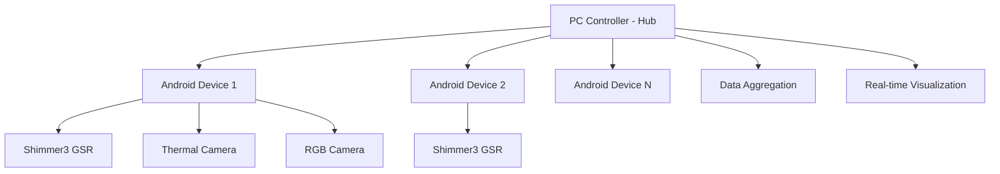

# Developer Guide - MPDC4GSR Platform

Comprehensive development guide for the Multi-Modal Physiological Sensing Platform.

## 🏗️ Architecture Overview

### Hub-and-Spoke Model
The MPDC4GSR platform implements a distributed client-server architecture:



### Technology Stack

#### Android Sensor Node (Spoke)
- **Language**: Kotlin
- **Architecture**: MVVM with Android Architecture Components
- **Async**: Kotlin Coroutines for all background operations
- **Camera**: CameraX for RGB/RAW capture
- **Sensors**: Official Shimmer Android API for GSR
- **Network**: TLS-secured TCP/IP communication

#### PC Controller (Hub)
- **Language**: Python 3.11+ with C++ backend
- **GUI**: PyQt6 for cross-platform interface
- **Performance**: PyBind11 C++ extensions for real-time processing
- **Data**: HDF5 for efficient storage, pandas for analysis
- **Network**: asyncio for concurrent device management

## 🔧 Development Environment Setup

### Prerequisites
```bash
# System requirements
- Android SDK 34+
- NDK r25+
- Python 3.11+
- CMake 3.20+
- Qt6 development libraries

# IDE recommendations  
- Android Studio Hedgehog+ for Android development
- PyCharm/VSCode for Python development
- CLion for C++ backend development
```

### Repository Setup
```bash
# Clone with submodules
git clone --recursive https://github.com/buccancs/IRCamera.git
cd IRCamera

# Set up pre-commit hooks
pip install pre-commit
pre-commit install

# Verify environment
./scripts/verify_environment.sh
```

### Android Development
```bash
# Build all modules
./gradlew clean build

# Run tests
./gradlew test

# Generate documentation
./gradlew dokkaHtml

# Code formatting
./gradlew ktlintFormat
```

### Python Development
```bash
cd pc-controller

# Set up virtual environment
python -m venv venv
source venv/bin/activate  # Linux/macOS
venv\Scripts\activate     # Windows

# Install development dependencies
pip install -r requirements-dev.txt

# Code formatting
black src/
isort src/
flake8 src/

# Type checking
mypy src/
```

## 📱 Android Architecture

### Package Structure
```
com/topdon/irCamera/
├── ui/                     # UI Layer (Activities, Fragments)
│   ├── activities/         # Main activities
│   ├── fragments/          # Reusable UI components
│   └── viewmodels/         # MVVM ViewModels
├── service/                # Background Services
│   ├── RecordingService/   # Foreground recording service
│   └── NetworkService/     # Device discovery and communication
├── sensors/                # Sensor Integration Layer
│   ├── rgb/               # RGB camera implementation
│   ├── thermal/           # Thermal camera implementation
│   └── gsr/               # Shimmer3 GSR implementation
├── network/               # Network Communication
│   ├── NetworkClient/     # TCP client implementation
│   └── ProtocolHandler/   # Message serialization
├── data/                  # Data Layer
│   ├── models/            # Data models and entities
│   ├── repositories/      # Data access abstraction
│   └── storage/           # Local storage management
└── utils/                 # Utility Classes
    ├── TimeManager/       # Time synchronization
    └── FileManager/       # File operations
```

### Key Components

#### Recording Controller
```kotlin
class RecordingController @Inject constructor(
    private val rgbRecorder: RgbCameraRecorder,
    private val thermalRecorder: ThermalCameraRecorder,
    private val gsrRecorder: GSRRecorder,
    private val timeManager: TimeManager
) {
    suspend fun startRecording(sessionConfig: SessionConfig): Result<Session> {
        return try {
            val session = createSession(sessionConfig)
            val syncTime = timeManager.getCurrentSyncTime()
            
            // Start all recorders simultaneously
            val rgbJob = async { rgbRecorder.startRecording(session, syncTime) }
            val thermalJob = async { thermalRecorder.startRecording(session, syncTime) }
            val gsrJob = async { gsrRecorder.startRecording(session, syncTime) }
            
            awaitAll(rgbJob, thermalJob, gsrJob)
            Result.success(session)
        } catch (e: Exception) {
            Result.failure(e)
        }
    }
}
```

#### Sensor Recorder Interface
```kotlin
interface SensorRecorder {
    suspend fun initialize(): Boolean
    suspend fun startRecording(session: Session, syncTime: Long): Boolean
    suspend fun stopRecording(): SessionData
    suspend fun addSyncMarker(type: String, metadata: Map<String, Any>)
    fun isRecording(): Boolean
    fun getRecordingDuration(): Duration
}
```

### Data Models
```kotlin
@Entity(tableName = "sessions")
data class Session(
    @PrimaryKey val sessionId: String,
    val participantId: String,
    val studyId: String,
    val startTime: Instant,
    val configuration: SessionConfiguration,
    val status: SessionStatus
)

data class GSRSample(
    val timestamp: Long,
    val conductanceMs: Double,
    val resistanceKohms: Double,
    val sampleIndex: Long,
    val sessionId: String
)

data class SyncEvent(
    val timestamp: Long,
    val eventType: String,
    val sessionId: String,
    val metadata: Map<String, Any> = emptyMap()
)
```

## 🖥️ PC Controller Architecture

### Module Structure
```
pc-controller/
├── src/
│   ├── main.py            # Application entry point
│   ├── gui/               # PyQt6 GUI components
│   │   ├── main_window.py # Main application window
│   │   ├── device_widget.py # Device management UI
│   │   └── plots/         # Real-time visualization
│   ├── network/           # Network layer
│   │   ├── discovery.py   # Device discovery service
│   │   ├── controller.py  # Device communication
│   │   └── protocol.py    # Message protocol
│   ├── core/              # Core logic
│   │   ├── session_manager.py # Session lifecycle
│   │   ├── time_sync.py   # Time synchronization
│   │   └── data_processor.py # Real-time processing
│   └── data/              # Data handling
│       ├── aggregator.py  # Multi-device data aggregation
│       └── exporters/     # HDF5, CSV export
├── native_backend/        # C++ performance extensions
│   ├── shimmer_native.cpp # Direct Shimmer serial communication
│   ├── webcam_capture.cpp # High-performance video capture
│   └── pybind_module.cpp  # Python bindings
└── tests/                 # pytest test suite
```

### Key Components

#### Network Controller
```python
class NetworkController(QThread):
    device_discovered = pyqtSignal(Device)
    device_connected = pyqtSignal(Device)
    data_received = pyqtSignal(Device, dict)
    
    def __init__(self):
        super().__init__()
        self.discovery_service = DiscoveryService()
        self.connected_devices = {}
        
    def run(self):
        """Main network thread - handles device discovery and communication"""
        asyncio.run(self._async_main())
        
    async def _async_main(self):
        # Start discovery service
        discovery_task = asyncio.create_task(
            self.discovery_service.start_discovery()
        )
        
        # Start TCP server for device connections
        server_task = asyncio.create_task(
            self._start_tcp_server()
        )
        
        await asyncio.gather(discovery_task, server_task)
```

#### Session Manager
```python
class SessionManager:
    def __init__(self, devices: List[Device]):
        self.devices = devices
        self.current_session = None
        self.data_aggregator = DataAggregator()
        
    async def start_session(self, config: SessionConfig) -> Session:
        """Start synchronized recording across all devices"""
        session = Session.create(config)
        
        # Calculate synchronization offset for each device
        sync_tasks = [
            self._sync_device_time(device) for device in self.devices
        ]
        offsets = await asyncio.gather(*sync_tasks)
        
        # Send start recording command to all devices
        start_tasks = [
            device.send_command({
                'action': 'start_recording',
                'session_id': session.id,
                'sync_offset': offset,
                'config': config.to_dict()
            }) for device, offset in zip(self.devices, offsets)
        ]
        
        await asyncio.gather(*start_tasks)
        self.current_session = session
        return session
```

### C++ Native Backend
```cpp
// native_backend/shimmer_native.cpp
class NativeShimmer {
public:
    NativeShimmer(const std::string& port) : port_(port) {
        data_queue_ = std::make_unique<lockfree::queue<GSRSample>>(1000);
    }
    
    bool connect() {
        serial_ = std::make_unique<serial::Serial>(port_, 115200);
        if (serial_->isOpen()) {
            // Start background thread for data acquisition
            acquisition_thread_ = std::thread(&NativeShimmer::acquisition_loop, this);
            return true;
        }
        return false;
    }
    
    std::vector<GSRSample> get_samples() {
        std::vector<GSRSample> samples;
        GSRSample sample;
        while (data_queue_->pop(sample)) {
            samples.push_back(sample);
        }
        return samples;
    }
    
private:
    void acquisition_loop() {
        while (running_) {
            if (auto data = read_shimmer_packet()) {
                auto sample = parse_gsr_sample(*data);
                data_queue_->push(sample);
            }
        }
    }
    
    std::unique_ptr<lockfree::queue<GSRSample>> data_queue_;
    std::thread acquisition_thread_;
    std::string port_;
    std::atomic<bool> running_{false};
};

// Python bindings
PYBIND11_MODULE(native_backend, m) {
    py::class_<NativeShimmer>(m, "NativeShimmer")
        .def(py::init<const std::string&>())
        .def("connect", &NativeShimmer::connect)
        .def("get_samples", &NativeShimmer::get_samples);
}
```

## 🔗 Communication Protocol

### Message Format
All communication uses JSON over TLS-secured TCP:

```json
{
    "message_id": "uuid-v4",
    "timestamp": "2024-01-01T12:00:00.000Z",
    "sender_id": "device-identifier",
    "message_type": "command|response|data|heartbeat",
    "payload": {
        // Message-specific data
    }
}
```

### Command Messages
```json
// Start recording command
{
    "message_type": "command",
    "payload": {
        "action": "start_recording",
        "session_id": "session_20240101_120000",
        "participant_id": "P001",
        "sync_offset_ms": 150,
        "configuration": {
            "rgb_quality": "4K60",
            "raw_capture": true,
            "gsr_sampling_rate": 128,
            "thermal_fps": 30
        }
    }
}

// Sync flash command
{
    "message_type": "command", 
    "payload": {
        "action": "sync_flash",
        "flash_duration_ms": 100
    }
}
```

### Data Streaming
```json
// Real-time GSR data
{
    "message_type": "data",
    "payload": {
        "data_type": "gsr_sample",
        "timestamp": 1704110400000,
        "conductance_us": 12.345,
        "resistance_kohms": 80.987,
        "sample_index": 12345
    }
}
```

## 🧪 Testing Strategy

### Unit Tests
```kotlin
// Android unit tests
@Test
fun `GSRRecorder should process samples at 128Hz`() = runTest {
    val recorder = GSRRecorder(mockContext)
    val samples = mutableListOf<GSRSample>()
    
    recorder.addListener { sample -> samples.add(sample) }
    recorder.startRecording(testSession, System.currentTimeMillis())
    
    delay(1000) // Record for 1 second
    recorder.stopRecording()
    
    // Should have ~128 samples (±5% tolerance)
    assertThat(samples.size).isCloseTo(128, within(7))
}
```

```python
# Python unit tests
def test_time_synchronization():
    device = MockDevice()
    sync_service = TimeSyncService()
    
    offset = asyncio.run(sync_service.calculate_offset(device))
    
    assert abs(offset) < 5  # Within 5ms tolerance
    assert device.received_messages[-1]['action'] == 'time_sync'
```

### Integration Tests
```kotlin
@Test
fun `Full recording session should produce synchronized data`() = runTest {
    val controller = RecordingController(
        rgbRecorder = mockRgbRecorder,
        gsrRecorder = mockGsrRecorder,
        thermalRecorder = mockThermalRecorder
    )
    
    val session = controller.startRecording(testConfig)
    delay(5000) // 5 second recording
    val data = controller.stopRecording()
    
    // Verify all streams have data
    assertThat(data.rgbFrames).isNotEmpty()
    assertThat(data.gsrSamples).isNotEmpty()
    assertThat(data.thermalFrames).isNotEmpty()
    
    // Verify synchronization
    val firstRgbTime = data.rgbFrames.first().timestamp
    val firstGsrTime = data.gsrSamples.first().timestamp
    assertThat(abs(firstRgbTime - firstGsrTime)).isLessThan(5) // 5ms tolerance
}
```

### Performance Tests
```python
def test_data_throughput():
    """Test system can handle expected data rates"""
    controller = SessionManager([mock_device])
    
    # Simulate 4 devices recording simultaneously
    devices = [MockDevice() for _ in range(4)]
    
    start_time = time.time()
    session = asyncio.run(controller.start_session_multi_device(devices))
    
    # Record for 30 seconds
    await asyncio.sleep(30)
    
    data = asyncio.run(controller.stop_session())
    
    # Verify data rates
    expected_gsr_samples = 4 * 128 * 30  # 4 devices * 128Hz * 30s
    assert len(data.gsr_samples) >= expected_gsr_samples * 0.95  # 95% tolerance
```

## 🔧 Build System

### Gradle Configuration (Android)
```kotlin
// app/build.gradle.kts
android {
    compileSdk = 34
    
    defaultConfig {
        minSdk = 21
        targetSdk = 34
        versionCode = 1
        versionName = "1.0.0"
    }
    
    buildTypes {
        // Release-only configuration
        release {
            isMinifyEnabled = true
            isShrinkResources = true
            proguardFiles(
                getDefaultProguardFile("proguard-android-optimize.txt"),
                "proguard-rules.pro"
            )
        }
    }
    
    // Disable debug builds
    variantFilter {
        if (buildType.name == "debug") {
            ignore = true
        }
    }
}

dependencies {
    // Core Android
    implementation(libs.androidx.core.ktx)
    implementation(libs.androidx.lifecycle.runtime.ktx)
    implementation(libs.androidx.activity.compose)
    
    // Camera
    implementation(libs.androidx.camera.camera2)
    implementation(libs.androidx.camera.lifecycle)
    implementation(libs.androidx.camera.video)
    
    // Shimmer SDK
    implementation(libs.shimmer.android.api)
    
    // Network
    implementation(libs.kotlinx.coroutines.android)
    implementation(libs.kotlinx.serialization.json)
    
    // Testing
    testImplementation(libs.junit)
    testImplementation(libs.androidx.test.ext.junit)
    testImplementation(libs.kotlinx.coroutines.test)
}
```

### Python Setup (PC Controller)
```python
# setup.py
from setuptools import setup, find_packages
from pybind11.setup_helpers import Pybind11Extension, build_ext

ext_modules = [
    Pybind11Extension(
        "native_backend",
        ["native_backend/shimmer_native.cpp",
         "native_backend/webcam_capture.cpp", 
         "native_backend/pybind_module.cpp"],
        include_dirs=["/usr/include/opencv4"],
        libraries=["opencv_core", "opencv_imgproc", "opencv_imgcodecs"],
        cxx_std=17,
    ),
]

setup(
    name="mpdc4gsr-pc-controller",
    version="1.0.0",
    packages=find_packages(where="src"),
    package_dir={"": "src"},
    ext_modules=ext_modules,
    cmdclass={"build_ext": build_ext},
    install_requires=[
        "PyQt6>=6.6.0",
        "numpy>=1.24.0",
        "pandas>=2.0.0",
        "h5py>=3.8.0",
        "opencv-python>=4.8.0",
        "pyserial>=3.5",
        "zeroconf>=0.130.0",
        "pyqtgraph>=0.13.0",
    ],
    extras_require={
        "dev": [
            "pytest>=7.0.0",
            "black>=23.0.0",
            "isort>=5.12.0",
            "flake8>=6.0.0",
            "mypy>=1.6.0",
        ]
    }
)
```

## 🚀 Deployment

### Android APK Distribution
```bash
# Production build
./gradlew clean :app:assembleRelease

# Sign for distribution (if not auto-signed)
jarsigner -verbose -sigalg SHA256withRSA -digestalg SHA-256 \
    app-release-unsigned.apk mpdc4gsr.keystore

# Optimize APK
zipalign -v 4 app-release-unsigned.apk app-release.apk
```

### PC Controller Distribution
```bash
# Create standalone executable with PyInstaller
pip install pyinstaller
pyinstaller --onefile --windowed --name MPDC4GSR-Controller src/main.py

# Package with dependencies
python setup.py bdist_wheel
pip install dist/mpdc4gsr_pc_controller-1.0.0-py3-none-any.whl
```

## 📊 Performance Optimization

### Android Optimizations
- Use CameraX for efficient camera management
- Implement proper lifecycle management for background services  
- Use WorkManager for scheduled tasks
- Optimize memory usage with proper resource management

### PC Controller Optimizations
- Leverage C++ backend for performance-critical operations
- Use asyncio for concurrent device management
- Implement efficient data structures for real-time processing
- Cache frequently accessed data

### Network Optimizations
- Implement connection pooling for multiple devices
- Use compression for large data transfers
- Implement adaptive bitrate for real-time streaming
- Handle network interruptions gracefully

## 🔍 Debugging and Monitoring

### Android Debugging
```kotlin
// Enable comprehensive logging
class DebugLogger {
    companion object {
        private const val TAG = "MPDC4GSR"
        
        fun logRecordingEvent(event: String, data: Map<String, Any>) {
            Log.d(TAG, "Recording Event: $event")
            data.forEach { (key, value) ->
                Log.d(TAG, "  $key: $value")
            }
        }
    }
}
```

### PC Controller Monitoring
```python
import logging
from pythonjsonlogger import jsonlogger

# Structured logging for analysis
logging.basicConfig(
    level=logging.INFO,
    handlers=[
        logging.StreamHandler(),
        logging.FileHandler('mpdc4gsr.log')
    ]
)

logger = logging.getLogger('mpdc4gsr')
logger.info("Session started", extra={
    'session_id': session.id,
    'device_count': len(devices),
    'configuration': config.to_dict()
})
```

## 📚 Additional Resources

- **[API Reference](API_REFERENCE.md)** - Complete API documentation
- **[User Manual](USER_MANUAL.md)** - End-user documentation  
- **[Troubleshooting](TROUBLESHOOTING.md)** - Common issues and solutions
- **[Contributing](CONTRIBUTING.md)** - Contribution guidelines

---

**Happy coding!** 🚀 For questions or issues, please open a GitHub issue or refer to our troubleshooting guide.