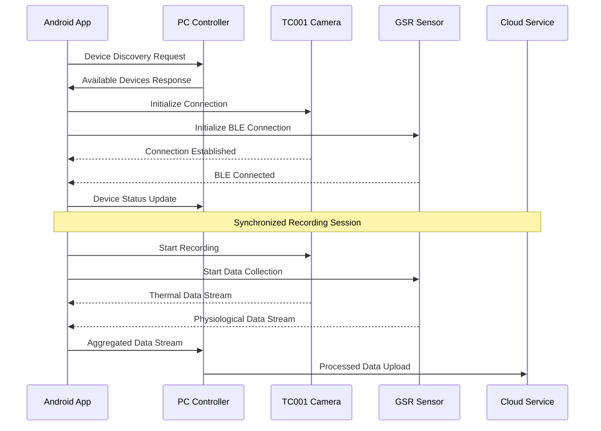
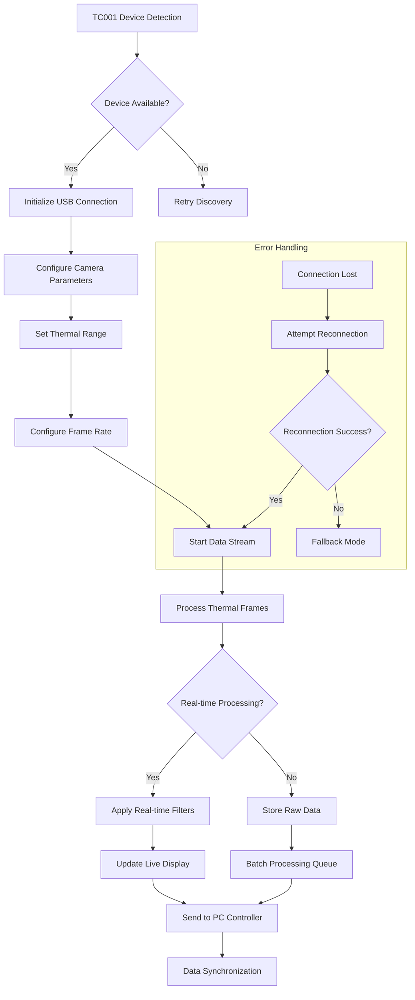

# IRCamera Platform - Integration Patterns & Best Practices

## Overview

This document provides comprehensive integration patterns, workflows, and best practices for
implementing and extending the IRCamera thermal imaging platform across different environments and
use cases.

## Table of Contents

1. [Platform Integration Patterns](#platform-integration-patterns)
2. [Cross-Module Integration](#cross-module-integration)
3. [Hardware Integration Workflows](#hardware-integration-workflows)
4. [Data Pipeline Integration](#data-pipeline-integration)
5. [Third-Party Integration](#third-party-integration)
6. [Enterprise Integration](#enterprise-integration)
7. [Cloud Integration Patterns](#cloud-integration-patterns)
8. [Real-Time Processing Integration](#real-time-processing-integration)

---

## Platform Integration Patterns

### Multi-Device Synchronization Pattern



### Component Lifecycle Integration Pattern

```kotlin

class ThermalIntegrationManager : ComponentLifecycleObserver {
    private val thermalProcessor = ThermalProcessingEngine()
    private val dataAggregator = DataAggregationService()
    private val syncManager = CrossDeviceSyncManager()
    
    override fun onComponentStart() {
        thermalProcessor.initialize()
        dataAggregator.startCollection()
        syncManager.establishConnections()
    }
    
    override fun onComponentStop() {
        syncManager.disconnectAll()
        dataAggregator.stopCollection()
        thermalProcessor.cleanup()
    }
    
    fun integrateWithPCController(pcEndpoint: String) {
        syncManager.connectToPC(pcEndpoint) { success ->
            if (success) {
                dataAggregator.setUpstreamTarget(pcEndpoint)
                thermalProcessor.enableRemoteControl()
            }
        }
    }
}
```

---

## Cross-Module Integration

### Thermal-IR and GSR Integration Pattern

```kotlin

class MultiModalDataCorrelator {
    private val thermalProcessor = ThermalIRProcessor()
    private val gsrProcessor = GSRDataProcessor()
    private val correlationEngine = DataCorrelationEngine()
    
    fun startCorrelatedRecording(sessionConfig: SessionConfiguration) {
        val sessionId = generateSessionId()
        val timestamp = getCurrentTimestamp()

        thermalProcessor.startRecording(ThermalConfig(
            sessionId = sessionId,
            baseTimestamp = timestamp,
            resolution = sessionConfig.thermalResolution,
            frameRate = sessionConfig.frameRate
        ))

        gsrProcessor.startRecording(GSRConfig(
            sessionId = sessionId,
            baseTimestamp = timestamp,
            samplingRate = sessionConfig.gsrSamplingRate,
            filterSettings = sessionConfig.gsrFilters
        ))

        correlationEngine.startCorrelation(sessionId, timestamp)
    }
    
    fun processCorrelatedFrame(
        thermalFrame: ThermalFrame,
        gsrData: GSRDataPoint
    ): CorrelatedDataPoint {
        return correlationEngine.correlate(
            thermal = thermalFrame,
            physiological = gsrData,
            temporalWindow = 100 // ms
        )
    }
}
```

### LibIR and LibMatrix Integration

```kotlin

class AdvancedThermalProcessor {
    private val irLibrary = LibIRProcessor()
    private val matrixLibrary = LibMatrixProcessor()
    
    fun processAdvancedThermalImage(
        rawThermalData: ByteArray,
        enhancementMode: EnhancementMode
    ): ProcessedThermalImage {

        val basicProcessed = irLibrary.processRawThermal(rawThermalData)

        val thermalMatrix = matrixLibrary.createMatrix(basicProcessed.data)
        val enhancedMatrix = when (enhancementMode) {
            EnhancementMode.EDGE_DETECTION -> {
                matrixLibrary.applySobelFilter(thermalMatrix)
            }
            EnhancementMode.NOISE_REDUCTION -> {
                matrixLibrary.applyGaussianFilter(thermalMatrix, sigma = 1.5)
            }
            EnhancementMode.CONTRAST_ENHANCEMENT -> {
                matrixLibrary.applyHistogramEqualization(thermalMatrix)
            }
        }

        return irLibrary.matrixToThermalImage(enhancedMatrix)
    }
}
```

---

## Hardware Integration Workflows

### TC001 Advanced Integration Workflow



### GSR Sensor Integration Workflow

```kotlin

class GSRIntegrationWorkflow {
    private val bleManager = BLEConnectionManager()
    private val dataProcessor = GSRDataProcessor()
    private val calibrationManager = GSRCalibrationManager()
    
    suspend fun initializeGSRSensor(deviceAddress: String): GSRIntegrationResult {
        return try {

            val connection = bleManager.connectToDevice(deviceAddress)
            if (!connection.isSuccessful) {
                return GSRIntegrationResult.Failure("BLE connection failed")
            }

            val capabilities = discoverDeviceCapabilities(connection.device)

            val calibrationResult = calibrationManager.performCalibration(connection.device)
            if (!calibrationResult.isSuccessful) {
                return GSRIntegrationResult.Failure("Calibration failed")
            }

            configureDataStreaming(connection.device, capabilities)

            startDataCollection(connection.device)
            
            GSRIntegrationResult.Success(connection.device, capabilities)
        } catch (e: Exception) {
            GSRIntegrationResult.Failure("Integration error: ${e.message}")
        }
    }
    
    private suspend fun configureDataStreaming(
        device: GSRDevice,
        capabilities: DeviceCapabilities
    ) {
        val streamConfig = GSRStreamConfiguration(
            samplingRate = capabilities.maxSamplingRate,
            bufferSize = 1024,
            compressionEnabled = true,
            timestampSync = true
        )
        
        device.configureStreaming(streamConfig)
    }
}
```

---

## Data Pipeline Integration

### Real-Time Data Pipeline

```python
# PC Controller data pipeline integration
class IRCameraDataPipeline:
    def __init__(self):
        self.thermal_processor = ThermalDataProcessor()
        self.gsr_processor = GSRDataProcessor()
        self.data_aggregator = DataAggregator()
        self.storage_manager = StorageManager()
        
    async def process_realtime_data(self, data_stream):
        """Process real-time data from Android devices"""
        async for data_packet in data_stream:
            if data_packet.type == DataType.THERMAL:
                processed_thermal = await self.thermal_processor.process(
                    data_packet.payload
                )
                await self.data_aggregator.add_thermal_data(processed_thermal)
                
            elif data_packet.type == DataType.GSR:
                processed_gsr = await self.gsr_processor.process(
                    data_packet.payload
                )
                await self.data_aggregator.add_gsr_data(processed_gsr)
                
            # Check if we have correlated data ready
            if self.data_aggregator.has_correlated_data():
                correlated_batch = self.data_aggregator.get_correlated_batch()
                await self.storage_manager.store_batch(correlated_batch)
                
                # Trigger real-time analysis
                analysis_result = await self.analyze_correlated_data(
                    correlated_batch
                )
                await self.publish_analysis_result(analysis_result)
    
    async def analyze_correlated_data(self, batch):
        """Perform real-time analysis on correlated data"""
        return AnalysisEngine().analyze(
            thermal_data=batch.thermal_frames,
            gsr_data=batch.gsr_measurements,
            correlation_window=batch.temporal_window
        )
```

### Batch Processing Pipeline

```python
class BatchProcessingPipeline:
    def __init__(self):
        self.job_queue = JobQueue()
        self.result_store = ResultStore()
        
    async def submit_batch_job(self, session_data: SessionData) -> str:
        """Submit a batch processing job"""
        job_id = generate_job_id()
        
        job_config = BatchJobConfiguration(
            job_id=job_id,
            thermal_files=session_data.thermal_files,
            gsr_files=session_data.gsr_files,
            processing_options=session_data.processing_options,
            output_format=session_data.output_format
        )
        
        await self.job_queue.submit(job_config)
        return job_id
    
    async def process_batch_job(self, job_config: BatchJobConfiguration):
        """Process a batch job"""
        try:
            # Load and validate data
            thermal_data = await self.load_thermal_data(job_config.thermal_files)
            gsr_data = await self.load_gsr_data(job_config.gsr_files)
            
            # Synchronize timestamps
            synchronized_data = await self.synchronize_data(thermal_data, gsr_data)
            
            # Apply processing pipeline
            processed_data = await self.apply_processing_pipeline(
                synchronized_data, 
                job_config.processing_options
            )
            
            # Generate output
            output = await self.generate_output(
                processed_data, 
                job_config.output_format
            )
            
            # Store results
            await self.result_store.store_result(job_config.job_id, output)
            
        except Exception as e:
            await self.result_store.store_error(job_config.job_id, str(e))
```

---

## Third-Party Integration

### MATLAB Integration Pattern

```python
# MATLAB Engine integration for advanced analysis
class MATLABIntegrationService:
    def __init__(self):
        import matlab.engine
        self.matlab_engine = matlab.engine.start_matlab()
        self.matlab_engine.addpath('matlab_scripts')
    
    async def analyze_thermal_sequence(
        self, 
        thermal_sequence: List[ThermalFrame],
        analysis_type: str
    ) -> MATLABAnalysisResult:
        """Perform MATLAB-based thermal sequence analysis"""
        
        # Convert thermal data to MATLAB format
        matlab_data = self.convert_to_matlab_format(thermal_sequence)
        
        # Execute MATLAB analysis
        if analysis_type == "temporal_analysis":
            result = self.matlab_engine.thermal_temporal_analysis(
                matlab_data,
                nargout=1
            )
        elif analysis_type == "spatial_analysis":
            result = self.matlab_engine.thermal_spatial_analysis(
                matlab_data,
                nargout=1
            )
        elif analysis_type == "frequency_domain":
            result = self.matlab_engine.thermal_fft_analysis(
                matlab_data,
                nargout=1
            )
        
        return MATLABAnalysisResult(
            raw_result=result,
            analysis_type=analysis_type,
            processed_at=datetime.now()
        )
```

### Python Scientific Stack Integration

```python
# Integration with NumPy, SciPy, scikit-learn
class ScientificAnalysisIntegration:
    def __init__(self):
        import numpy as np
        import scipy.signal as signal
        from sklearn.decomposition import PCA
        from sklearn.cluster import KMeans
        
        self.np = np
        self.signal = signal
        self.pca = PCA
        self.kmeans = KMeans
    
    def analyze_gsr_signal(self, gsr_data: np.ndarray) -> GSRAnalysisResult:
        """Advanced GSR signal analysis using scientific Python stack"""
        
        # Preprocessing
        filtered_signal = self.signal.butter_filter(
            gsr_data, 
            lowcut=0.1, 
            highcut=5.0,
            fs=128  # 128 Hz sampling rate
        )
        
        # Feature extraction
        features = self.extract_gsr_features(filtered_signal)
        
        # Statistical analysis
        statistical_metrics = self.compute_statistical_metrics(filtered_signal)
        
        # Clustering analysis
        clusters = self.perform_response_clustering(features)
        
        return GSRAnalysisResult(
            filtered_signal=filtered_signal,
            features=features,
            statistics=statistical_metrics,
            clusters=clusters
        )
    
    def analyze_thermal_patterns(
        self, 
        thermal_frames: List[np.ndarray]
    ) -> ThermalPatternAnalysis:
        """Pattern analysis of thermal image sequences"""
        
        # Stack frames for temporal analysis
        thermal_stack = self.np.stack(thermal_frames, axis=0)
        
        # Dimensionality reduction
        reshaped_data = thermal_stack.reshape(len(thermal_frames), -1)
        pca_model = self.pca(n_components=10)
        reduced_data = pca_model.fit_transform(reshaped_data)
        
        # Temporal pattern detection
        temporal_patterns = self.detect_temporal_patterns(reduced_data)
        
        # Spatial pattern analysis
        spatial_patterns = self.analyze_spatial_patterns(thermal_stack)
        
        return ThermalPatternAnalysis(
            temporal_patterns=temporal_patterns,
            spatial_patterns=spatial_patterns,
            pca_components=pca_model.components_,
            explained_variance=pca_model.explained_variance_ratio_
        )
```

---

## Enterprise Integration

### REST API Integration Pattern

```python
# Enterprise REST API integration
from fastapi import FastAPI, HTTPException
from pydantic import BaseModel
from typing import List, Optional

app = FastAPI(title="IRCamera Enterprise API")

class ThermalAnalysisRequest(BaseModel):
    session_id: str
    thermal_data: List[str]  # Base64 encoded thermal frames
    analysis_options: dict
    callback_url: Optional[str] = None

class AnalysisResult(BaseModel):
    session_id: str
    analysis_id: str
    results: dict
    status: str
    processing_time: float

@app.post("/api/v1/thermal/analyze")
async def analyze_thermal_data(request: ThermalAnalysisRequest) -> AnalysisResult:
    """Enterprise API endpoint for thermal data analysis"""
    try:
        # Decode thermal data
        thermal_frames = [
            decode_thermal_frame(frame_data) 
            for frame_data in request.thermal_data
        ]
        
        # Submit for processing
        analysis_id = await thermal_processor.submit_analysis(
            session_id=request.session_id,
            frames=thermal_frames,
            options=request.analysis_options
        )
        
        # Start background processing
        await background_processor.start_analysis(analysis_id)
        
        # If callback URL provided, setup notification
        if request.callback_url:
            await notification_service.setup_callback(
                analysis_id, 
                request.callback_url
            )
        
        return AnalysisResult(
            session_id=request.session_id,
            analysis_id=analysis_id,
            results={},
            status="processing",
            processing_time=0.0
        )
        
    except Exception as e:
        raise HTTPException(status_code=500, detail=str(e))

@app.get("/api/v1/analysis/{analysis_id}")
async def get_analysis_result(analysis_id: str) -> AnalysisResult:
    """Get analysis results by ID"""
    result = await result_store.get_result(analysis_id)
    if not result:
        raise HTTPException(status_code=404, detail="Analysis not found")
    
    return result
```

### Database Integration Pattern

```python
# Enterprise database integration with SQLAlchemy
from sqlalchemy import create_engine, Column, Integer, String, DateTime, JSON
from sqlalchemy.ext.declarative import declarative_base
from sqlalchemy.orm import sessionmaker

Base = declarative_base()

class ThermalSession(Base):
    __tablename__ = 'thermal_sessions'
    
    id = Column(Integer, primary_key=True)
    session_id = Column(String(50), unique=True, nullable=False)
    device_type = Column(String(20), nullable=False)
    start_time = Column(DateTime, nullable=False)
    end_time = Column(DateTime)
    configuration = Column(JSON)
    metadata = Column(JSON)

class ThermalFrame(Base):
    __tablename__ = 'thermal_frames'
    
    id = Column(Integer, primary_key=True)
    session_id = Column(String(50), nullable=False)
    frame_index = Column(Integer, nullable=False)
    timestamp = Column(DateTime, nullable=False)
    frame_data_path = Column(String(255), nullable=False)
    analysis_results = Column(JSON)

class DatabaseIntegrationService:
    def __init__(self, database_url: str):
        self.engine = create_engine(database_url)
        self.SessionLocal = sessionmaker(bind=self.engine)
        Base.metadata.create_all(bind=self.engine)
    
    async def store_thermal_session(
        self, 
        session_data: ThermalSessionData
    ) -> str:
        """Store thermal session data"""
        db = self.SessionLocal()
        try:
            session = ThermalSession(
                session_id=session_data.session_id,
                device_type=session_data.device_type,
                start_time=session_data.start_time,
                configuration=session_data.configuration,
                metadata=session_data.metadata
            )
            db.add(session)
            db.commit()
            return session.session_id
        finally:
            db.close()
    
    async def query_sessions_by_criteria(
        self, 
        criteria: SessionQueryCriteria
    ) -> List[ThermalSession]:
        """Query sessions based on criteria"""
        db = self.SessionLocal()
        try:
            query = db.query(ThermalSession)
            
            if criteria.device_type:
                query = query.filter(
                    ThermalSession.device_type == criteria.device_type
                )
            
            if criteria.date_range:
                query = query.filter(
                    ThermalSession.start_time.between(
                        criteria.date_range.start,
                        criteria.date_range.end
                    )
                )
            
            return query.all()
        finally:
            db.close()
```

---

## Cloud Integration Patterns

### AWS Integration Pattern

```python
# AWS cloud integration for IRCamera platform
import boto3
from botocore.exceptions import ClientError

class AWSCloudIntegration:
    def __init__(self, aws_config: AWSConfiguration):
        self.s3_client = boto3.client(
            's3',
            aws_access_key_id=aws_config.access_key,
            aws_secret_access_key=aws_config.secret_key,
            region_name=aws_config.region
        )
        self.lambda_client = boto3.client('lambda', region_name=aws_config.region)
        self.bucket_name = aws_config.bucket_name
    
    async def upload_thermal_session(
        self, 
        session_data: ThermalSessionData
    ) -> CloudUploadResult:
        """Upload thermal session data to AWS S3"""
        try:
            # Upload thermal frames
            frame_urls = []
            for i, frame in enumerate(session_data.thermal_frames):
                key = f"sessions/{session_data.session_id}/frames/frame_{i:06d}.bin"
                
                self.s3_client.put_object(
                    Bucket=self.bucket_name,
                    Key=key,
                    Body=frame.raw_data,
                    Metadata={
                        'timestamp': str(frame.timestamp),
                        'temperature_range': frame.temperature_range,
                        'device_type': session_data.device_type
                    }
                )
                
                frame_urls.append(f"s3://{self.bucket_name}/{key}")
            
            # Upload session metadata
            metadata_key = f"sessions/{session_data.session_id}/metadata.json"
            self.s3_client.put_object(
                Bucket=self.bucket_name,
                Key=metadata_key,
                Body=json.dumps(session_data.metadata),
                ContentType='application/json'
            )
            
            # Trigger cloud processing
            processing_result = await self.trigger_cloud_processing(
                session_data.session_id
            )
            
            return CloudUploadResult(
                session_id=session_data.session_id,
                frame_urls=frame_urls,
                metadata_url=f"s3://{self.bucket_name}/{metadata_key}",
                processing_job_id=processing_result.job_id
            )
            
        except ClientError as e:
            return CloudUploadResult.failure(str(e))
    
    async def trigger_cloud_processing(self, session_id: str) -> ProcessingJobResult:
        """Trigger AWS Lambda function for cloud processing"""
        payload = {
            'session_id': session_id,
            'bucket': self.bucket_name,
            'processing_options': {
                'thermal_analysis': True,
                'pattern_detection': True,
                'export_format': 'hdf5'
            }
        }
        
        response = self.lambda_client.invoke(
            FunctionName='ircamera-thermal-processor',
            InvocationType='Event',  # Asynchronous
            Payload=json.dumps(payload)
        )
        
        return ProcessingJobResult(
            job_id=response['ResponseMetadata']['RequestId'],
            status='submitted'
        )
```

### Google Cloud Integration Pattern

```python
# Google Cloud Platform integration
from google.cloud import storage, pubsub_v1, functions_v1

class GCPCloudIntegration:
    def __init__(self, gcp_config: GCPConfiguration):
        self.storage_client = storage.Client(project=gcp_config.project_id)
        self.publisher = pubsub_v1.PublisherClient()
        self.functions_client = functions_v1.CloudFunctionsServiceClient()
        self.bucket_name = gcp_config.bucket_name
        self.topic_path = self.publisher.topic_path(
            gcp_config.project_id, 
            gcp_config.topic_name
        )
    
    async def stream_thermal_data(
        self, 
        session_id: str, 
        thermal_stream: AsyncIterator[ThermalFrame]
    ):
        """Stream thermal data to Google Cloud for real-time processing"""
        async for frame in thermal_stream:
            # Upload frame to Cloud Storage
            blob_name = f"realtime/{session_id}/frame_{frame.index}.bin"
            bucket = self.storage_client.bucket(self.bucket_name)
            blob = bucket.blob(blob_name)
            
            blob.upload_from_string(
                frame.raw_data,
                content_type='application/octet-stream'
            )
            
            # Publish frame notification to Pub/Sub
            message_data = {
                'session_id': session_id,
                'frame_index': frame.index,
                'blob_path': f"gs://{self.bucket_name}/{blob_name}",
                'timestamp': frame.timestamp.isoformat(),
                'processing_required': True
            }
            
            future = self.publisher.publish(
                self.topic_path,
                json.dumps(message_data).encode('utf-8')
            )
            
            # Optional: wait for publish confirmation
            message_id = future.result()
            print(f"Published frame {frame.index} with message ID: {message_id}")
```

---

## Real-Time Processing Integration

### WebSocket Integration for Live Data

```kotlin

class RealtimeDataStreamer {
    private lateinit var webSocketClient: WebSocketClient
    private val dataBuffer = ConcurrentLinkedQueue<DataPacket>()
    private val streamingScope = CoroutineScope(Dispatchers.IO)
    
    fun initializeStream(serverEndpoint: String, sessionConfig: StreamingConfig) {
        val request = Request.Builder()
            .url(serverEndpoint)
            .addHeader("Session-ID", sessionConfig.sessionId)
            .addHeader("Device-Type", sessionConfig.deviceType)
            .build()
        
        webSocketClient = WebSocketClient(request, object : WebSocketListener() {
            override fun onOpen(webSocket: WebSocket, response: Response) {
                startDataStreaming()
            }
            
            override fun onMessage(webSocket: WebSocket, text: String) {
                handleServerMessage(text)
            }
            
            override fun onFailure(
                webSocket: WebSocket, 
                t: Throwable, 
                response: Response?
            ) {
                handleStreamingError(t)
            }
        })
    }
    
    private fun startDataStreaming() {
        streamingScope.launch {
            while (webSocketClient.isConnected()) {
                val dataPacket = dataBuffer.poll()
                if (dataPacket != null) {
                    val message = serializeDataPacket(dataPacket)
                    webSocketClient.send(message)
                }
                delay(10) // 100Hz streaming rate
            }
        }
    }
    
    fun streamThermalFrame(thermalFrame: ThermalFrame) {
        val packet = DataPacket(
            type = DataType.THERMAL,
            timestamp = System.nanoTime(),
            payload = thermalFrame.toByteArray(),
            metadata = mapOf(
                "device_id" to thermalFrame.deviceId,
                "frame_index" to thermalFrame.index.toString(),
                "temperature_range" to thermalFrame.temperatureRange.toString()
            )
        )
        
        dataBuffer.offer(packet)
    }
    
    fun streamGSRData(gsrMeasurement: GSRMeasurement) {
        val packet = DataPacket(
            type = DataType.GSR,
            timestamp = gsrMeasurement.timestamp,
            payload = gsrMeasurement.toByteArray(),
            metadata = mapOf(
                "sensor_id" to gsrMeasurement.sensorId,
                "sampling_rate" to gsrMeasurement.samplingRate.toString(),
                "signal_quality" to gsrMeasurement.signalQuality.toString()
            )
        )
        
        dataBuffer.offer(packet)
    }
}
```

### Real-Time Analytics Integration

```python
# Real-time analytics processing
class RealtimeAnalyticsEngine:
    def __init__(self):
        self.thermal_analyzer = ThermalRealtimeAnalyzer()
        self.gsr_analyzer = GSRRealtimeAnalyzer()
        self.pattern_detector = PatternDetectionEngine()
        self.alert_system = AlertingSystem()
        
    async def process_realtime_data(self, data_stream):
        """Process incoming real-time data stream"""
        temporal_window = TemporalWindow(size=5.0)  # 5-second window
        
        async for data_packet in data_stream:
            # Add to temporal window
            temporal_window.add_packet(data_packet)
            
            if data_packet.type == DataType.THERMAL:
                # Real-time thermal analysis
                thermal_metrics = await self.thermal_analyzer.analyze_frame(
                    data_packet.payload
                )
                
                # Check for thermal anomalies
                if thermal_metrics.max_temperature > 45.0:  # Celsius
                    await self.alert_system.trigger_thermal_alert(
                        thermal_metrics
                    )
                
            elif data_packet.type == DataType.GSR:
                # Real-time GSR analysis
                gsr_metrics = await self.gsr_analyzer.analyze_signal(
                    data_packet.payload
                )
                
                # Check for stress indicators
                if gsr_metrics.stress_level > 0.8:
                    await self.alert_system.trigger_stress_alert(
                        gsr_metrics
                    )
            
            # Pattern detection on temporal window
            if temporal_window.is_full():
                patterns = await self.pattern_detector.detect_patterns(
                    temporal_window.get_data()
                )
                
                if patterns.significant_patterns:
                    await self.alert_system.trigger_pattern_alert(patterns)
                
                # Slide the window
                temporal_window.slide()
    
    async def generate_realtime_insights(
        self, 
        current_data: MultiModalData
    ) -> RealtimeInsights:
        """Generate real-time insights from current data"""
        
        insights = RealtimeInsights()
        
        # Thermal insights
        thermal_insights = await self.thermal_analyzer.generate_insights(
            current_data.thermal_data
        )
        insights.thermal_insights = thermal_insights
        
        # Physiological insights
        physio_insights = await self.gsr_analyzer.generate_insights(
            current_data.gsr_data
        )
        insights.physiological_insights = physio_insights
        
        # Cross-modal correlations
        correlations = await self.pattern_detector.analyze_correlations(
            thermal_data=current_data.thermal_data,
            gsr_data=current_data.gsr_data
        )
        insights.correlations = correlations
        
        return insights
```

---

## Performance Integration Patterns

### Memory-Efficient Processing

```kotlin

class MemoryEfficientThermalProcessor {
    private val processingQueue = ArrayBlockingQueue<ThermalFrame>(100)
    private val processedFramePool = ObjectPool<ProcessedThermalFrame> {
        ProcessedThermalFrame()
    }
    
    fun processFrameStreaming(frame: ThermalFrame): ProcessedThermalFrame {

        val processedFrame = processedFramePool.acquire()
        
        try {

            processedFrame.reset()
            processedFrame.deviceId = frame.deviceId
            processedFrame.timestamp = frame.timestamp

            val chunkSize = 1024
            for (i in frame.rawData.indices step chunkSize) {
                val endIndex = minOf(i + chunkSize, frame.rawData.size)
                val chunk = frame.rawData.sliceArray(i until endIndex)
                
                val processedChunk = processChunk(chunk)
                processedFrame.addProcessedChunk(processedChunk)
            }
            
            return processedFrame
            
        } catch (e: Exception) {

            processedFramePool.release(processedFrame)
            throw e
        }
    }
    
    private fun processChunk(chunk: ByteArray): FloatArray {

        val result = FloatArray(chunk.size / 2)
        for (i in chunk.indices step 2) {
            val rawValue = (chunk[i].toInt() and 0xFF) or 
                          ((chunk[i + 1].toInt() and 0xFF) shl 8)
            result[i / 2] = convertToTemperature(rawValue)
        }
        return result
    }
}
```

This comprehensive integration patterns documentation provides detailed guidance for implementing
and extending the IRCamera platform across various environments and use cases. Each pattern includes
practical code examples and architectural guidance for successful integration.
