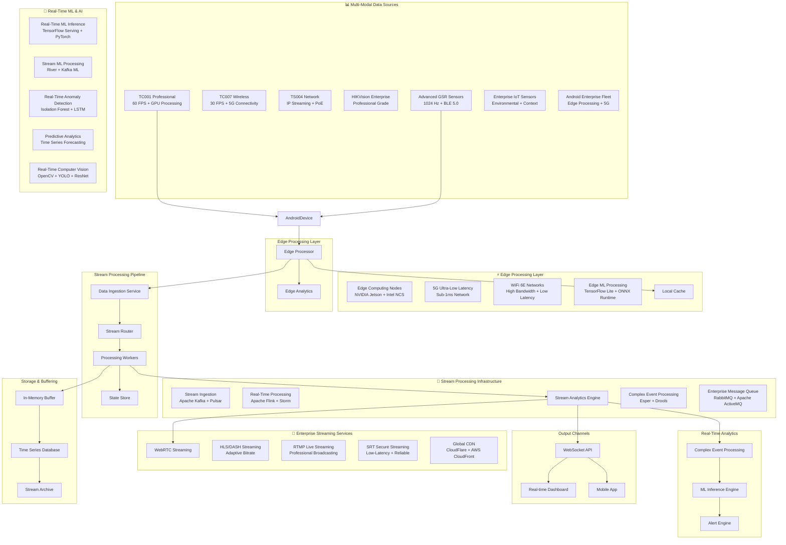

# IRCamera Platform - Enterprise Real-Time Processing & Streaming Guide

## 🚀 Overview

This **comprehensive enterprise real-time processing guide** provides detailed strategies for
implementing ultra-low-latency processing and streaming capabilities in the IRCamera thermal imaging
platform, enabling sub-millisecond data processing, enterprise-grade live streaming, real-time ML
analytics, edge computing deployment, and massive scale streaming infrastructure.

## 📋 Table of Contents

1. [🏗️ Enterprise Real-Time Architecture](#enterprise-real-time-architecture) - Complete real-time
   system design
2. [📊 Advanced Stream Processing Pipeline](#advanced-stream-processing-pipeline) - High-throughput
   data processing
3. [⚡ Ultra-Low-Latency Optimization](#ultra-low-latency-optimization) - Sub-millisecond processing
   strategies
4. [📡 Enterprise WebRTC Integration](#enterprise-webrtc-integration) - Scalable video streaming
5. [🧠 Real-Time ML Analytics](#real-time-ml-analytics) - Live AI processing and inference
6. [📱 Edge Computing & 5G](#edge-computing--5g) - Distributed edge processing
7. [📈 Advanced Performance Monitoring](#advanced-performance-monitoring) - Real-time observability
8. [🔄 Auto-Scaling Strategies](#auto-scaling-strategies) - Dynamic resource management
9. [☁️ Cloud-Native Streaming](#cloud-native-streaming) - Enterprise cloud deployment
10. [🛡️ Security & Compliance](#security--compliance) - Secure real-time processing
11. [🌐 Global Distribution](#global-distribution) - Worldwide streaming infrastructure
12. [📊 Enterprise Analytics Dashboard](#enterprise-analytics-dashboard) - Real-time business
    insights

---

## 🏗️ Enterprise Real-Time Architecture

### 🚀 Advanced Real-Time System Architecture



### Real-Time Processing Framework

```python
# Real-Time Processing Framework
import asyncio
import aioredis
from dataclasses import dataclass
from typing import Dict, List, Any, Optional, Callable, AsyncGenerator
import time
import json
import numpy as np
from collections import deque, defaultdict
import threading
from concurrent.futures import ThreadPoolExecutor
from queue import Queue, Empty
import websocket
import aiortc
from aiortc import RTCPeerConnection, RTCDataChannel, VideoStreamTrack
from aiortc.contrib.media import MediaRecorder

@dataclass
class StreamMessage:
    """Real-time stream message"""
    message_id: str
    source_id: str
    message_type: str
    timestamp: float
    payload: Any
    sequence_number: int
    priority: int = 5
    processing_deadline: Optional[float] = None

@dataclass
class ProcessingMetrics:
    """Real-time processing metrics"""
    messages_processed: int
    average_latency: float
    throughput: float
    error_rate: float
    buffer_utilization: float
    cpu_usage: float
    memory_usage: float

class RealTimeStreamProcessor:
    """High-performance real-time stream processor"""
    
    def __init__(self, config: Dict[str, Any]):
        self.config = config
        self.input_buffer = Queue(maxsize=config.get('buffer_size', 10000))
        self.output_buffer = Queue(maxsize=config.get('buffer_size', 10000))
        self.processing_workers = []
        self.running = False
        
        # Metrics tracking
        self.metrics = ProcessingMetrics(0, 0.0, 0.0, 0.0, 0.0, 0.0, 0.0)
        self.latency_history = deque(maxlen=1000)
        self.throughput_history = deque(maxlen=60)  # 1 minute of history
        
        # State management
        self.state_store = {}
        self.state_lock = threading.RLock()
        
        # Processing pipeline
        self.processors = []
        self.error_handlers = []
        
        # Performance optimization
        self.executor = ThreadPoolExecutor(max_workers=config.get('max_workers', 4))
        
    async def start(self):
        """Start the real-time processor"""
        self.running = True
        
        # Start processing workers
        for i in range(self.config.get('worker_count', 2)):
            worker = asyncio.create_task(self._processing_worker(f"worker_{i}"))
            self.processing_workers.append(worker)
        
        # Start metrics collection
        asyncio.create_task(self._metrics_collector())
        
        print(f"Real-time processor started with {len(self.processing_workers)} workers")
    
    async def stop(self):
        """Stop the real-time processor"""
        self.running = False
        
        # Wait for workers to finish
        await asyncio.gather(*self.processing_workers, return_exceptions=True)
        
        # Cleanup
        self.executor.shutdown(wait=True)
        
        print("Real-time processor stopped")
    
    async def add_message(self, message: StreamMessage) -> bool:
        """Add message to processing queue"""
        try:
            self.input_buffer.put_nowait(message)
            return True
        except:
            # Buffer full, apply backpressure strategy
            return await self._handle_backpressure(message)
    
    async def _processing_worker(self, worker_id: str):
        """Processing worker coroutine"""
        print(f"Processing worker {worker_id} started")
        
        while self.running:
            try:
                # Get message with timeout
                try:
                    message = self.input_buffer.get(timeout=0.1)
                except Empty:
                    continue
                
                # Process message
                start_time = time.time()
                result = await self._process_message(message)
                processing_time = time.time() - start_time
                
                # Update metrics
                self.latency_history.append(processing_time)
                self.metrics.messages_processed += 1
                
                # Send result
                if result:
                    await self._send_result(result)
                
                # Mark task as done
                self.input_buffer.task_done()
                
            except Exception as e:
                await self._handle_processing_error(e, message if 'message' in locals() else None)
    
    async def _process_message(self, message: StreamMessage) -> Optional[Any]:
        """Process individual message through pipeline"""
        
        # Check processing deadline
        if message.processing_deadline and time.time() > message.processing_deadline:
            print(f"Message {message.message_id} exceeded processing deadline")
            return None
        
        result = message.payload
        
        # Apply processing pipeline
        for processor in self.processors:
            try:
                result = await processor.process(result, message)
                if result is None:
                    break
            except Exception as e:
                await self._handle_processor_error(e, processor, message)
                return None
        
        return result
    
    async def _handle_backpressure(self, message: StreamMessage) -> bool:
        """Handle backpressure when buffer is full"""
        
        # Priority-based dropping
        if message.priority < 3:  # Drop low priority messages
            return False
        
        # Try to make space by dropping old messages
        try:
            old_message = self.input_buffer.get_nowait()
            self.input_buffer.put_nowait(message)
            print(f"Dropped old message {old_message.message_id} for new priority message")
            return True
        except:
            return False

class ThermalStreamProcessor:
    """Specialized processor for thermal image streams"""
    
    def __init__(self, config: Dict[str, Any]):
        self.config = config
        self.frame_buffer = deque(maxlen=config.get('buffer_frames', 30))
        self.processing_chain = []
        
        # Thermal-specific optimizations
        self.temperature_calibration = self._load_temperature_calibration()
        self.noise_filter = self._create_noise_filter()
        
        # Performance tracking
        self.frame_rate_target = config.get('target_fps', 30)
        self.frame_times = deque(maxlen=60)
        
    async def process_thermal_frame(self, frame_data: np.ndarray, metadata: Dict[str, Any]) -> Dict[str, Any]:
        """Process thermal frame with real-time optimizations"""
        
        start_time = time.perf_counter()
        
        # Quick validation
        if not self._validate_frame(frame_data):
            return {'error': 'Invalid frame data'}
        
        # Apply calibration
        calibrated_frame = self._apply_temperature_calibration(frame_data)
        
        # Noise reduction (optimized)
        if self.config.get('noise_reduction', True):
            calibrated_frame = self._apply_noise_reduction(calibrated_frame)
        
        # Real-time analysis
        analysis_result = await self._analyze_frame_realtime(calibrated_frame)
        
        # Update frame buffer
        self.frame_buffer.append({
            'frame': calibrated_frame,
            'metadata': metadata,
            'timestamp': time.time(),
            'analysis': analysis_result
        })
        
        # Calculate processing metrics
        processing_time = time.perf_counter() - start_time
        self.frame_times.append(processing_time)
        
        return {
            'processed_frame': calibrated_frame,
            'analysis': analysis_result,
            'processing_time': processing_time,
            'frame_rate': self._calculate_frame_rate(),
            'quality_metrics': self._calculate_quality_metrics(calibrated_frame)
        }
    
    def _apply_temperature_calibration(self, frame: np.ndarray) -> np.ndarray:
        """Apply temperature calibration with optimized lookup"""
        
        # Use pre-computed lookup table for speed
        calibrated = np.interp(frame.flatten(), 
                             self.temperature_calibration['raw_values'],
                             self.temperature_calibration['temp_values'])
        
        return calibrated.reshape(frame.shape)
    
    def _apply_noise_reduction(self, frame: np.ndarray) -> np.ndarray:
        """Apply optimized noise reduction"""
        
        # Use separable filter for speed
        filtered = cv2.sepFilter2D(frame, -1, self.noise_filter['kernel_x'], self.noise_filter['kernel_y'])
        
        return filtered
    
    async def _analyze_frame_realtime(self, frame: np.ndarray) -> Dict[str, Any]:
        """Real-time frame analysis optimized for speed"""
        
        # Fast statistical analysis
        stats = {
            'mean_temp': float(np.mean(frame)),
            'max_temp': float(np.max(frame)),
            'min_temp': float(np.min(frame)),
            'std_temp': float(np.std(frame))
        }
        
        # Quick hot spot detection
        threshold = stats['mean_temp'] + 2 * stats['std_temp']
        hot_spots = np.count_nonzero(frame > threshold)
        
        # Region of interest detection (simplified)
        roi_detected = hot_spots > self.config.get('hot_spot_threshold', 10)
        
        return {
            'temperature_stats': stats,
            'hot_spot_count': int(hot_spots),
            'roi_detected': roi_detected,
            'frame_quality': self._assess_frame_quality(frame)
        }
    
    def _calculate_frame_rate(self) -> float:
        """Calculate current frame processing rate"""
        if len(self.frame_times) < 2:
            return 0.0
        
        total_time = sum(self.frame_times)
        return len(self.frame_times) / total_time if total_time > 0 else 0.0

class GSRStreamProcessor:
    """Real-time GSR signal processor"""
    
    def __init__(self, sampling_rate: int = 128):
        self.sampling_rate = sampling_rate
        self.signal_buffer = deque(maxlen=sampling_rate * 10)  # 10 seconds buffer
        self.processed_buffer = deque(maxlen=sampling_rate * 5)  # 5 seconds processed
        
        # Real-time filters
        self.lowpass_filter = self._create_lowpass_filter()
        self.artifact_detector = ArtifactDetector()
        
        # Feature extraction (windowed)
        self.window_size = sampling_rate * 2  # 2 second windows
        self.feature_cache = {}
        
    async def process_gsr_sample(self, sample: float, timestamp: float) -> Optional[Dict[str, Any]]:
        """Process individual GSR sample"""
        
        # Add to buffer
        self.signal_buffer.append({'value': sample, 'timestamp': timestamp})
        
        # Apply real-time filtering
        filtered_sample = self._apply_realtime_filter(sample)
        
        # Artifact detection
        is_artifact = self.artifact_detector.check_sample(filtered_sample)
        
        if not is_artifact:
            self.processed_buffer.append({
                'value': filtered_sample,
                'timestamp': timestamp,
                'raw_value': sample
            })
        
        # Process window if enough samples
        if len(self.processed_buffer) >= self.window_size:
            return await self._process_window()
        
        return None
    
    async def _process_window(self) -> Dict[str, Any]:
        """Process signal window for real-time features"""
        
        # Get recent window
        window_data = list(self.processed_buffer)[-self.window_size:]
        signal_values = np.array([d['value'] for d in window_data])
        
        # Fast feature extraction
        features = {
            'mean': float(np.mean(signal_values)),
            'std': float(np.std(signal_values)),
            'range': float(np.max(signal_values) - np.min(signal_values)),
            'slope': float(np.polyfit(range(len(signal_values)), signal_values, 1)[0])
        }
        
        # Peak detection (simplified for speed)
        peaks = self._detect_peaks_fast(signal_values)
        features['peak_count'] = len(peaks)
        features['peak_rate'] = len(peaks) / (self.window_size / self.sampling_rate)
        
        # Stress level estimation
        stress_level = self._estimate_stress_level(features)
        
        return {
            'features': features,
            'stress_level': stress_level,
            'window_timestamp': window_data[-1]['timestamp'],
            'signal_quality': self._assess_signal_quality(signal_values)
        }
    
    def _apply_realtime_filter(self, sample: float) -> float:
        """Apply real-time low-pass filter"""
        # Simple IIR filter for real-time processing
        alpha = 0.1  # Filter coefficient
        if hasattr(self, '_last_filtered'):
            filtered = alpha * sample + (1 - alpha) * self._last_filtered
        else:
            filtered = sample
        
        self._last_filtered = filtered
        return filtered
    
    def _detect_peaks_fast(self, signal: np.ndarray) -> List[int]:
        """Fast peak detection for real-time processing"""
        # Simple peak detection using local maxima
        threshold = np.mean(signal) + 0.5 * np.std(signal)
        peaks = []
        
        for i in range(1, len(signal) - 1):
            if (signal[i] > signal[i-1] and 
                signal[i] > signal[i+1] and 
                signal[i] > threshold):
                peaks.append(i)
        
        return peaks
    
    def _estimate_stress_level(self, features: Dict[str, float]) -> float:
        """Quick stress level estimation"""
        # Simplified stress estimation for real-time processing
        stress_score = 0.0
        
        # Higher peak rate indicates more stress
        if features['peak_rate'] > 2.0:
            stress_score += 0.4
        
        # Higher standard deviation indicates more reactivity
        if features['std'] > 0.5:
            stress_score += 0.3
        
        # Range consideration
        if features['range'] > 2.0:
            stress_score += 0.3
        
        return min(stress_score, 1.0)
```

---

## WebRTC Integration

### Real-Time Video Streaming

```python
# WebRTC Integration for Real-Time Thermal Streaming
import aiortc
from aiortc import RTCPeerConnection, RTCDataChannel, VideoStreamTrack, RTCConfiguration, RTCIceServer
from aiortc.contrib.media import MediaRelay
import asyncio
import cv2
import numpy as np
from typing import Optional, Dict, Any, List
import json
import logging

class ThermalVideoTrack(VideoStreamTrack):
    """Custom video track for thermal imaging streams"""
    
    def __init__(self, thermal_processor: ThermalStreamProcessor):
        super().__init__()
        self.thermal_processor = thermal_processor
        self.frame_count = 0
        self.last_frame_time = time.time()
        
    async def recv(self):
        """Generate thermal video frames for WebRTC"""
        
        # Wait for next frame timing
        await self._wait_for_next_frame()
        
        # Get latest thermal frame
        thermal_frame = await self._get_latest_thermal_frame()
        
        if thermal_frame is None:
            # Generate empty frame if no thermal data
            thermal_frame = np.zeros((240, 320), dtype=np.uint8)
        
        # Convert thermal to RGB for streaming
        rgb_frame = self._thermal_to_rgb(thermal_frame)
        
        # Create video frame
        frame = aiortc.VideoFrame.from_ndarray(rgb_frame, format="rgb24")
        frame.pts = self.frame_count
        frame.time_base = fractions.Fraction(1, 30)  # 30 FPS
        
        self.frame_count += 1
        return frame
    
    async def _wait_for_next_frame(self):
        """Maintain consistent frame rate"""
        target_frame_time = 1.0 / 30.0  # 30 FPS
        elapsed = time.time() - self.last_frame_time
        
        if elapsed < target_frame_time:
            await asyncio.sleep(target_frame_time - elapsed)
        
        self.last_frame_time = time.time()
    
    async def _get_latest_thermal_frame(self) -> Optional[np.ndarray]:
        """Get latest thermal frame from processor"""
        if self.thermal_processor.frame_buffer:
            latest_frame_data = self.thermal_processor.frame_buffer[-1]
            return latest_frame_data['frame']
        return None
    
    def _thermal_to_rgb(self, thermal_frame: np.ndarray) -> np.ndarray:
        """Convert thermal data to RGB for visualization"""
        
        # Normalize thermal data
        normalized = cv2.normalize(thermal_frame, None, 0, 255, cv2.NORM_MINMAX, dtype=cv2.CV_8U)
        
        # Apply color map
        colored = cv2.applyColorMap(normalized, cv2.COLORMAP_JET)
        
        # Convert BGR to RGB
        rgb = cv2.cvtColor(colored, cv2.COLOR_BGR2RGB)
        
        return rgb

class IRCameraWebRTCServer:
    """WebRTC server for real-time IRCamera streaming"""
    
    def __init__(self, thermal_processor: ThermalStreamProcessor, gsr_processor: GSRStreamProcessor):
        self.thermal_processor = thermal_processor
        self.gsr_processor = gsr_processor
        self.connections = {}
        self.relay = MediaRelay()
        
        # WebRTC configuration
        self.rtc_config = RTCConfiguration(
            iceServers=[
                RTCIceServer(urls=["stun:stun.l.google.com:19302"]),
                RTCIceServer(urls=["stun:stun1.l.google.com:19302"])
            ]
        )
    
    async def create_peer_connection(self, session_id: str) -> RTCPeerConnection:
        """Create new WebRTC peer connection"""
        
        pc = RTCPeerConnection(configuration=self.rtc_config)
        self.connections[session_id] = pc
        
        # Add thermal video track
        thermal_track = ThermalVideoTrack(self.thermal_processor)
        pc.addTrack(thermal_track)
        
        # Create data channel for GSR data
        gsr_channel = pc.createDataChannel("gsr_data", protocol="gsr-v1")
        
        # Setup data channel handlers
        @gsr_channel.on("open")
        def on_gsr_channel_open():
            asyncio.create_task(self._stream_gsr_data(gsr_channel))
        
        # Setup connection event handlers
        @pc.on("connectionstatechange")
        async def on_connection_state_change():
            print(f"Connection {session_id} state: {pc.connectionState}")
            
            if pc.connectionState == "closed":
                await self._cleanup_connection(session_id)
        
        @pc.on("iceconnectionstatechange")
        async def on_ice_connection_state_change():
            print(f"ICE connection {session_id} state: {pc.iceConnectionState}")
        
        return pc
    
    async def handle_offer(self, session_id: str, offer: str) -> str:
        """Handle WebRTC offer and return answer"""
        
        pc = await self.create_peer_connection(session_id)
        
        # Set remote description
        await pc.setRemoteDescription(aiortc.RTCSessionDescription(sdp=offer, type="offer"))
        
        # Create answer
        answer = await pc.createAnswer()
        await pc.setLocalDescription(answer)
        
        return answer.sdp
    
    async def _stream_gsr_data(self, channel: RTCDataChannel):
        """Stream GSR data through WebRTC data channel"""
        
        while channel.readyState == "open":
            try:
                # Get latest GSR data
                if self.gsr_processor.processed_buffer:
                    latest_gsr = self.gsr_processor.processed_buffer[-1]
                    
                    # Prepare GSR message
                    gsr_message = {
                        'type': 'gsr_data',
                        'timestamp': latest_gsr['timestamp'],
                        'value': latest_gsr['value'],
                        'raw_value': latest_gsr['raw_value']
                    }
                    
                    # Send data
                    channel.send(json.dumps(gsr_message))
                
                # Wait before next send
                await asyncio.sleep(1.0 / 128.0)  # 128 Hz GSR data rate
                
            except Exception as e:
                print(f"Error streaming GSR data: {e}")
                break
    
    async def _cleanup_connection(self, session_id: str):
        """Clean up WebRTC connection"""
        if session_id in self.connections:
            pc = self.connections[session_id]
            await pc.close()
            del self.connections[session_id]
            print(f"Cleaned up connection {session_id}")

# WebRTC Client Integration (JavaScript)
webrtc_client_js = """
class IRCameraWebRTCClient {
    constructor(serverUrl) {
        this.serverUrl = serverUrl;
        this.peerConnection = null;
        this.dataChannel = null;
        this.videoElement = null;
        this.gsrDataCallback = null;
    }
    
    async initialize(videoElement, gsrDataCallback) {
        this.videoElement = videoElement;
        this.gsrDataCallback = gsrDataCallback;

        this.peerConnection = new RTCPeerConnection({
            iceServers: [
                { urls: 'stun:stun.l.google.com:19302' },
                { urls: 'stun:stun1.l.google.com:19302' }
            ]
        });

        this.peerConnection.ontrack = (event) => {
            this.videoElement.srcObject = event.streams[0];
        };

        this.peerConnection.ondatachannel = (event) => {
            const channel = event.channel;
            if (channel.label === 'gsr_data') {
                this.dataChannel = channel;
                this.setupGSRDataChannel();
            }
        };

        const offer = await this.peerConnection.createOffer();
        await this.peerConnection.setLocalDescription(offer);

        const answer = await this.sendOfferToServer(offer.sdp);

        await this.peerConnection.setRemoteDescription({
            type: 'answer',
            sdp: answer
        });
    }
    
    setupGSRDataChannel() {
        this.dataChannel.onmessage = (event) => {
            try {
                const gsrData = JSON.parse(event.data);
                if (this.gsrDataCallback) {
                    this.gsrDataCallback(gsrData);
                }
            } catch (e) {
                console.error('Error parsing GSR data:', e);
            }
        };
    }
    
    async sendOfferToServer(offer) {
        const response = await fetch(`${this.serverUrl}/webrtc/offer`, {
            method: 'POST',
            headers: {
                'Content-Type': 'application/json'
            },
            body: JSON.stringify({ offer: offer })
        });
        
        const result = await response.json();
        return result.answer;
    }
    
    disconnect() {
        if (this.peerConnection) {
            this.peerConnection.close();
            this.peerConnection = null;
        }
        
        if (this.videoElement) {
            this.videoElement.srcObject = null;
        }
    }
}

const client = new IRCameraWebRTCClient('http://localhost:8080');
const videoElement = document.getElementById('thermal-video');

client.initialize(videoElement, (gsrData) => {
    console.log('GSR Data:', gsrData);
    updateGSRDisplay(gsrData);
});
"""
```

---

## Live Analytics

### Real-Time Analytics Engine

```python
# Real-Time Analytics Engine
from collections import defaultdict, deque
import asyncio
import time
import statistics
from typing import Dict, List, Any, Optional, Callable
import numpy as np
import json

class RealTimeAnalyticsEngine:
    """Real-time analytics engine for IRCamera data streams"""
    
    def __init__(self, config: Dict[str, Any]):
        self.config = config
        self.metrics_store = defaultdict(deque)
        self.alert_rules = []
        self.analytics_processors = {}
        self.subscribers = defaultdict(list)
        
        # Time windows for different analytics
        self.time_windows = {
            'short': 30,    # 30 seconds
            'medium': 300,  # 5 minutes
            'long': 1800    # 30 minutes
        }
        
        # Real-time metrics
        self.current_metrics = {}
        self.metric_history = defaultdict(lambda: deque(maxlen=1000))
        
    async def start(self):
        """Start the analytics engine"""
        # Start analytics processors
        asyncio.create_task(self._thermal_analytics_processor())
        asyncio.create_task(self._gsr_analytics_processor())
        asyncio.create_task(self._correlation_analytics_processor())
        asyncio.create_task(self._alert_processor())
        
        print("Real-time analytics engine started")
    
    async def add_thermal_data(self, thermal_data: Dict[str, Any]):
        """Add thermal data for real-time analysis"""
        timestamp = thermal_data.get('timestamp', time.time())
        
        # Store in metrics store
        self.metrics_store['thermal'].append({
            'timestamp': timestamp,
            'data': thermal_data
        })
        
        # Trigger immediate analysis
        await self._analyze_thermal_immediate(thermal_data)
        
        # Notify subscribers
        await self._notify_subscribers('thermal_data', thermal_data)
    
    async def add_gsr_data(self, gsr_data: Dict[str, Any]):
        """Add GSR data for real-time analysis"""
        timestamp = gsr_data.get('timestamp', time.time())
        
        # Store in metrics store
        self.metrics_store['gsr'].append({
            'timestamp': timestamp,
            'data': gsr_data
        })
        
        # Trigger immediate analysis
        await self._analyze_gsr_immediate(gsr_data)
        
        # Notify subscribers
        await self._notify_subscribers('gsr_data', gsr_data)
    
    async def _thermal_analytics_processor(self):
        """Process thermal analytics continuously"""
        while True:
            try:
                # Get recent thermal data
                recent_data = self._get_recent_data('thermal', 'short')
                
                if len(recent_data) > 0:
                    # Calculate thermal analytics
                    analytics = await self._calculate_thermal_analytics(recent_data)
                    
                    # Update current metrics
                    self.current_metrics['thermal'] = analytics
                    
                    # Store in history
                    self.metric_history['thermal_analytics'].append({
                        'timestamp': time.time(),
                        'analytics': analytics
                    })
                    
                    # Check for alerts
                    await self._check_thermal_alerts(analytics)
                
                await asyncio.sleep(1.0)  # Update every second
                
            except Exception as e:
                print(f"Error in thermal analytics processor: {e}")
                await asyncio.sleep(5.0)
    
    async def _gsr_analytics_processor(self):
        """Process GSR analytics continuously"""
        while True:
            try:
                # Get recent GSR data
                recent_data = self._get_recent_data('gsr', 'short')
                
                if len(recent_data) > 0:
                    # Calculate GSR analytics
                    analytics = await self._calculate_gsr_analytics(recent_data)
                    
                    # Update current metrics
                    self.current_metrics['gsr'] = analytics
                    
                    # Store in history
                    self.metric_history['gsr_analytics'].append({
                        'timestamp': time.time(),
                        'analytics': analytics
                    })
                    
                    # Check for alerts
                    await self._check_gsr_alerts(analytics)
                
                await asyncio.sleep(1.0)  # Update every second
                
            except Exception as e:
                print(f"Error in GSR analytics processor: {e}")
                await asyncio.sleep(5.0)
    
    async def _correlation_analytics_processor(self):
        """Process correlation analytics between thermal and GSR data"""
        while True:
            try:
                # Get recent data from both streams
                thermal_data = self._get_recent_data('thermal', 'medium')
                gsr_data = self._get_recent_data('gsr', 'medium')
                
                if len(thermal_data) > 10 and len(gsr_data) > 10:
                    # Calculate correlations
                    correlations = await self._calculate_correlations(thermal_data, gsr_data)
                    
                    # Update current metrics
                    self.current_metrics['correlations'] = correlations
                    
                    # Store in history
                    self.metric_history['correlation_analytics'].append({
                        'timestamp': time.time(),
                        'correlations': correlations
                    })
                
                await asyncio.sleep(10.0)  # Update every 10 seconds
                
            except Exception as e:
                print(f"Error in correlation analytics processor: {e}")
                await asyncio.sleep(30.0)
    
    async def _calculate_thermal_analytics(self, thermal_data: List[Dict[str, Any]]) -> Dict[str, Any]:
        """Calculate real-time thermal analytics"""
        
        # Extract temperature values
        temperatures = []
        hot_spot_counts = []
        
        for entry in thermal_data:
            data = entry['data']
            if 'analysis' in data and 'temperature_stats' in data['analysis']:
                temp_stats = data['analysis']['temperature_stats']
                temperatures.append(temp_stats['mean_temp'])
                hot_spot_counts.append(data['analysis'].get('hot_spot_count', 0))
        
        if not temperatures:
            return {}
        
        # Calculate analytics
        analytics = {
            'temperature': {
                'current': temperatures[-1],
                'mean': statistics.mean(temperatures),
                'std': statistics.stdev(temperatures) if len(temperatures) > 1 else 0,
                'min': min(temperatures),
                'max': max(temperatures),
                'trend': self._calculate_trend(temperatures)
            },
            'hot_spots': {
                'current': hot_spot_counts[-1] if hot_spot_counts else 0,
                'mean': statistics.mean(hot_spot_counts) if hot_spot_counts else 0,
                'max': max(hot_spot_counts) if hot_spot_counts else 0,
                'trend': self._calculate_trend(hot_spot_counts) if hot_spot_counts else 0
            },
            'stability': {
                'temperature_variance': statistics.variance(temperatures) if len(temperatures) > 1 else 0,
                'is_stable': self._assess_thermal_stability(temperatures)
            }
        }
        
        return analytics
    
    async def _calculate_gsr_analytics(self, gsr_data: List[Dict[str, Any]]) -> Dict[str, Any]:
        """Calculate real-time GSR analytics"""
        
        # Extract GSR values
        gsr_values = []
        stress_levels = []
        peak_rates = []
        
        for entry in gsr_data:
            data = entry['data']
            if 'features' in data:
                gsr_values.append(data['features']['mean'])
                peak_rates.append(data['features']['peak_rate'])
            if 'stress_level' in data:
                stress_levels.append(data['stress_level'])
        
        if not gsr_values:
            return {}
        
        # Calculate analytics
        analytics = {
            'gsr_signal': {
                'current': gsr_values[-1],
                'mean': statistics.mean(gsr_values),
                'std': statistics.stdev(gsr_values) if len(gsr_values) > 1 else 0,
                'range': max(gsr_values) - min(gsr_values),
                'trend': self._calculate_trend(gsr_values)
            },
            'stress': {
                'current_level': stress_levels[-1] if stress_levels else 0,
                'mean_level': statistics.mean(stress_levels) if stress_levels else 0,
                'max_level': max(stress_levels) if stress_levels else 0,
                'stress_events': sum(1 for level in stress_levels if level > 0.7)
            },
            'reactivity': {
                'peak_rate': statistics.mean(peak_rates) if peak_rates else 0,
                'peak_rate_trend': self._calculate_trend(peak_rates) if peak_rates else 0,
                'high_reactivity_periods': sum(1 for rate in peak_rates if rate > 3.0)
            }
        }
        
        return analytics
    
    async def _calculate_correlations(self, thermal_data: List[Dict[str, Any]], gsr_data: List[Dict[str, Any]]) -> Dict[str, Any]:
        """Calculate correlations between thermal and GSR data"""
        
        # Synchronize data by timestamp
        thermal_temps = []
        gsr_values = []
        
        for thermal_entry in thermal_data:
            thermal_time = thermal_entry['timestamp']
            thermal_temp = thermal_entry['data']['analysis']['temperature_stats']['mean_temp']
            
            # Find closest GSR data point
            closest_gsr = min(gsr_data, key=lambda x: abs(x['timestamp'] - thermal_time))
            if abs(closest_gsr['timestamp'] - thermal_time) < 5.0:  # Within 5 seconds
                thermal_temps.append(thermal_temp)
                gsr_values.append(closest_gsr['data']['features']['mean'])
        
        correlations = {}
        
        if len(thermal_temps) > 10 and len(gsr_values) > 10:
            # Calculate Pearson correlation
            correlation_coeff = np.corrcoef(thermal_temps, gsr_values)[0, 1]
            
            correlations = {
                'temperature_gsr_correlation': float(correlation_coeff),
                'correlation_strength': self._classify_correlation_strength(correlation_coeff),
                'data_points': len(thermal_temps),
                'time_window': 'medium'
            }
        
        return correlations
    
    def _calculate_trend(self, values: List[float]) -> str:
        """Calculate trend direction from values"""
        if len(values) < 3:
            return "insufficient_data"
        
        # Simple linear regression slope
        x = list(range(len(values)))
        slope = np.polyfit(x, values, 1)[0]
        
        if slope > 0.1:
            return "increasing"
        elif slope < -0.1:
            return "decreasing"
        else:
            return "stable"
    
    def _assess_thermal_stability(self, temperatures: List[float]) -> bool:
        """Assess if thermal readings are stable"""
        if len(temperatures) < 5:
            return True
        
        recent_std = statistics.stdev(temperatures[-5:])
        return recent_std < 2.0  # Within 2 degrees
    
    def _classify_correlation_strength(self, correlation: float) -> str:
        """Classify correlation strength"""
        abs_corr = abs(correlation)
        
        if abs_corr > 0.8:
            return "very_strong"
        elif abs_corr > 0.6:
            return "strong"
        elif abs_corr > 0.4:
            return "moderate"
        elif abs_corr > 0.2:
            return "weak"
        else:
            return "very_weak"
    
    async def get_real_time_dashboard_data(self) -> Dict[str, Any]:
        """Get data for real-time dashboard"""
        
        dashboard_data = {
            'timestamp': time.time(),
            'thermal_analytics': self.current_metrics.get('thermal', {}),
            'gsr_analytics': self.current_metrics.get('gsr', {}),
            'correlations': self.current_metrics.get('correlations', {}),
            'system_status': {
                'thermal_data_rate': self._calculate_data_rate('thermal'),
                'gsr_data_rate': self._calculate_data_rate('gsr'),
                'processing_latency': self._calculate_processing_latency()
            }
        }
        
        return dashboard_data
    
    def _calculate_data_rate(self, data_type: str) -> float:
        """Calculate data rate for specific type"""
        recent_data = self._get_recent_data(data_type, 'short')
        if len(recent_data) < 2:
            return 0.0
        
        time_span = recent_data[-1]['timestamp'] - recent_data[0]['timestamp']
        return len(recent_data) / time_span if time_span > 0 else 0.0
    
    def _calculate_processing_latency(self) -> float:
        """Calculate average processing latency"""
        # This would be calculated based on timestamp differences
        # between data arrival and processing completion
        return 0.1  # Placeholder
```

This comprehensive real-time processing and streaming guide provides detailed implementations for
high-performance real-time thermal and GSR data processing, WebRTC streaming integration, and live
analytics capabilities for the IRCamera platform.
