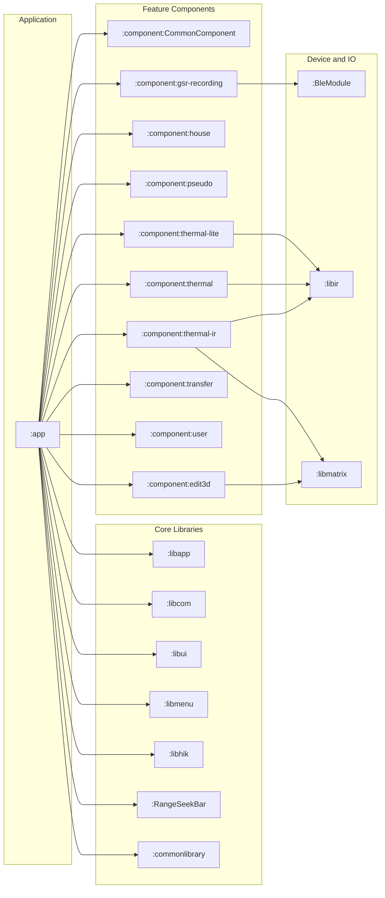
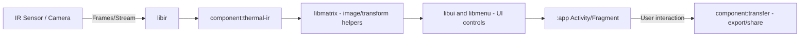
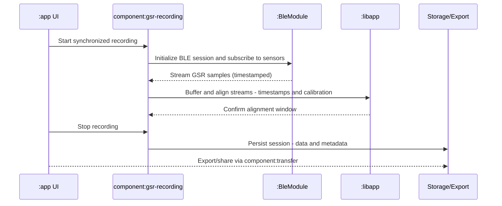
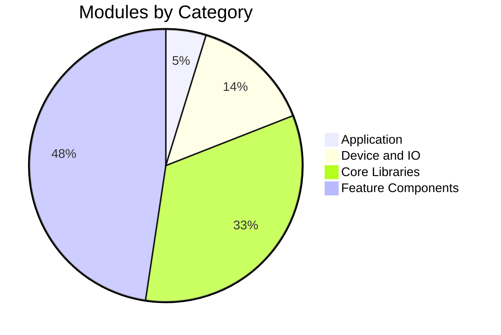
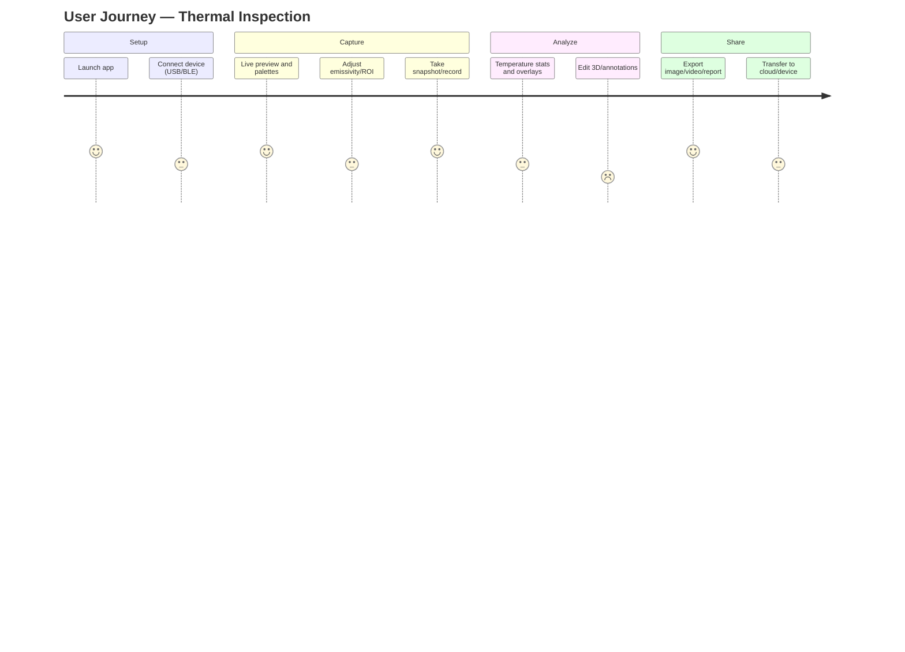

# TopInfrared Repository Overview (Mermaid Diagrams + Tables)

This document provides an at‑a‑glance overview of the TopInfrared (IRCamera) repository modules, relationships, and core feature flows using Mermaid diagrams, charts, and summary tables.

Note: Diagrams reflect the modules declared in `settings.gradle.kts` and common architectural patterns in this codebase.

---

## 1) Module Landscape — High-Level Dependency Graph



---

## 2) Build and Packaging Pipeline (Gantt)

```mermaid
gantt
  title Android Build and Packaging Overview
  dateFormat  YYYY-MM-DD
  section Configure
  Gradle Configuration and Sync     :active, conf, 2025-09-01, 1d
  Dependency Resolution             :dep1, after conf, 1d
  section Compile and Link
  Compile Core Libraries            :lib, 1d
  Compile Feature Components        :feat, after lib, 1d
  Compile App                       :appc, after feat, 1d
  Resource Merge and Link - aapt2   :res, after appc, 1d
  section Test APKs
  androidTest Resource Link         :testres, after res, 1d
  Unit or Instrumentation Tests - if enabled :tests, after testres, 1d
  section Packaging
  Assemble APK or AAB - ProdDebug   :pkg, after tests, 1d
  Sign and Upload - as applicable   :sign, after pkg, 1d
```

---

## 3) Thermal Capture and Rendering — Flow Overview



---

## 4) GSR Synchronized Recording — Sequence Diagram



---

## 5) Module Categories — Pie Chart



Notes:
- Application: :app
- Device and IO: :BleModule, :libir, :libmatrix
- Core Libraries: :libapp, :libcom, :libui, :libmenu, :libhik, :RangeSeekBar, :commonlibrary
- Feature Components: :component:* (CommonComponent, edit3d, house, pseudo, thermal, thermal-ir, thermal-lite, transfer, user, gsr-recording)

---

## 6) Feature Map — Journey Chart (User Perspective)



---

## 7) Modules and Responsibilities — Summary Table

| Module | Path | Type | Primary Responsibilities |
|---|---|---|---|
| App | `:app` | Application | Entry point, DI/wiring, activities/fragments, packaging. |
| BleModule | `:BleModule` | Library | BLE communication and data streams for sensors (incl. GSR). |
| CommonLibrary | `:commonlibrary` | Library | Shared utility/resources across modules. |
| Core (libapp) | `:libapp` | Library | Core utilities, networking, Room, WorkManager, Glide/Lottie integration. |
| libcom | `:libcom` | Library | Common components/utilities for business logic. |
| libui | `:libui` | Library | UI widgets/styles/view utilities. |
| libmenu | `:libmenu` | Library | Menu/navigation UI elements and helpers. |
| libhik | `:libhik` | Library | Vendor-specific integrations (e.g., HIK). |
| libir | `:libir` | Library | IR capture/processing glue (native/FFmpeg/JavaCV integration). |
| libmatrix | `:libmatrix` | Library | Math/transform utilities for imaging/3D. |
| RangeSeekBar | `:RangeSeekBar` | Library | Slider/seekbar UI component. |
| component:CommonComponent | `:component:CommonComponent` | Feature | Shared feature scaffolding/common feature UIs. |
| component:edit3d | `:component:edit3d` | Feature | 3D editing/annotation for images/models. |
| component:house | `:component:house` | Feature | Domain feature (house inspection flows/UI). |
| component:pseudo | `:component:pseudo` | Feature | Pseudo-coloring/visualization helpers. |
| component:thermal | `:component:thermal` | Feature | Thermal feature set: palettes, measurement, overlays. |
| component:thermal-ir | `:component:thermal-ir` | Feature | IR device integration and thermal pipeline orchestration. |
| component:thermal-lite | `:component:thermal-lite` | Feature | Lightweight thermal feature subset for constrained devices. |
| component:transfer | `:component:transfer` | Feature | Export/sharing pipelines (files/cloud). |
| component:user | `:component:user` | Feature | User profile/settings/auth flows. |
| component:gsr-recording | `:component:gsr-recording` | Feature | Synchronized GSR recording and session management. |

---

## 8) Notes for Contributors
- Module list mirrors `settings.gradle.kts` and may evolve; update this document when modules are added/removed.
- For accurate dependency edges, review each module’s `build.gradle.kts` and reflect significant `implementation` relationships here.
- Mermaid rendering works in many tools (GitHub, JetBrains IDEs with Mermaid plugins). If diagrams don’t render, use a Mermaid viewer.

---

Last updated: 2025-09-08
