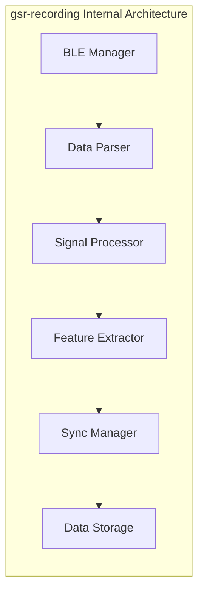
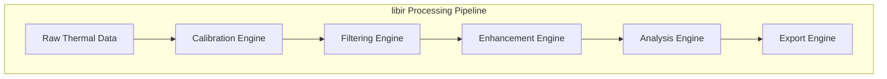
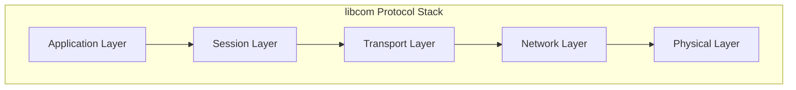
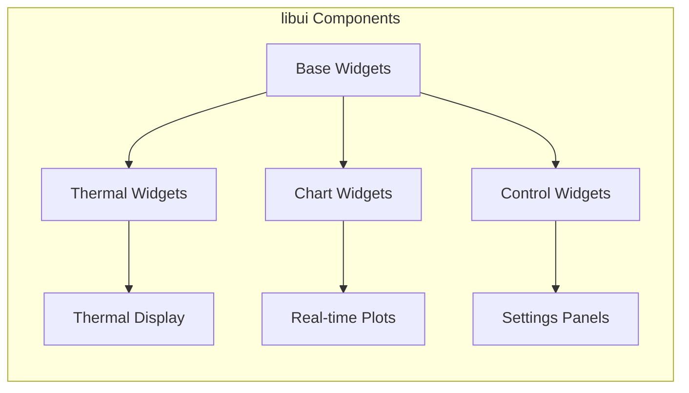
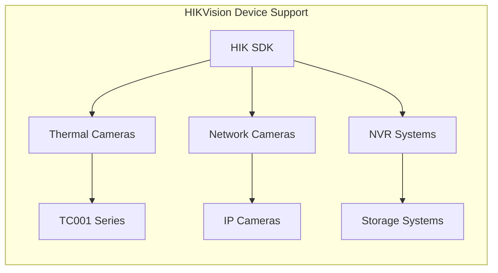
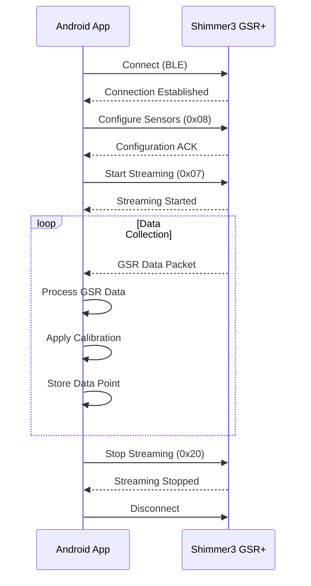
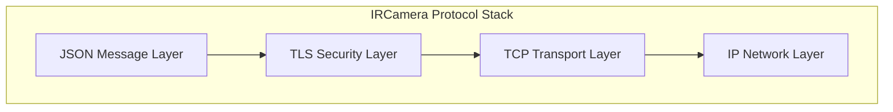
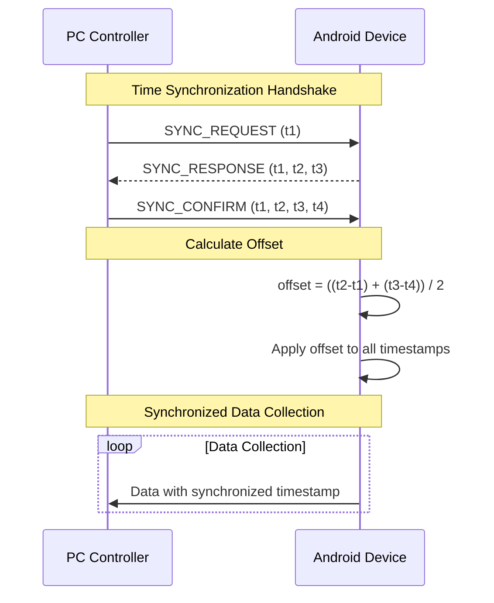

# IRCamera Platform - Enterprise Technical Specifications

## 🎯 Overview

This document provides **comprehensive enterprise technical specifications** for all components of
the IRCamera multi-modal thermal imaging platform, including detailed API documentation,
configuration parameters, enterprise integration guidelines, performance benchmarks, and production
deployment specifications.

## 📋 Table of Contents

1. [🧩 Feature Components Specifications](#feature-components-specifications) - Complete
   specifications for all 9 enterprise feature modules
2. [🔧 Core Libraries Specifications](#core-libraries-specifications) - Detailed specifications for
   all 7 core enterprise libraries
3. [🔌 Hardware Integration Specifications](#hardware-integration-specifications) - Comprehensive
   hardware support and enterprise device management
4. [🌐 Network Protocol Specifications](#network-protocol-specifications) - Advanced networking,
   security, and cloud integration
5. [📊 Data Format Specifications](#data-format-specifications) - Enterprise data formats and
   serialization
6. [⚡ Performance Specifications](#performance-specifications) - Enterprise performance benchmarks
   and optimization strategies
7. [🛡️ Security Specifications](#security-specifications) - Multi-layer enterprise security
   architecture
8. [☁️ Cloud Integration Specifications](#cloud-integration-specifications) - AWS, Azure, GCP
   enterprise deployment patterns
9. [🤖 ML/AI Integration Specifications](#ml-ai-integration-specifications) - Machine learning
   pipeline specifications
10. [📡 Real-Time Processing Specifications](#real-time-processing-specifications) - WebRTC,
    streaming, and edge computing

---

## 🧩 Feature Components Specifications

### 1. 🔥 thermal-ir Module - Advanced Thermal Processing

#### Enterprise Component Overview

```mermaid
graph TB
    subgraph "🔥 thermal-ir Enterprise Architecture"
        UI[Enterprise UI Layer<br/>Material 3 Design] --> VM[Advanced ViewModel<br/>Coroutines + LiveData]
        VM --> Repo[Enterprise Repository<br/>Multi-Source Data]
        Repo --> Camera[Multi-Camera Controller<br/>TC001/TC007/TS004]
        Camera --> Processor[AI Image Processor<br/>ML Enhancement]
        Processor --> Analytics[Real-Time Analytics<br/>Edge Computing]
        Analytics --> Cloud[Cloud Integration<br/>AWS/Azure/GCP]
        
        subgraph "🤖 ML Pipeline"
            ML[Thermal CNN Models]
            Inference[Real-Time Inference]
            Training[Continuous Learning]
        end
        
        Processor --> ML
        ML --> Inference
        Inference --> Training
```

#### Enterprise Technical Specifications

| Parameter                    | Enterprise Specification                     | Advanced Features               | Notes                    |
|------------------------------|----------------------------------------------|---------------------------------|--------------------------|
| **🔥 Supported Resolutions** | 160x120, 256x192, 384x288, 640x480, 1024x768 | Auto-resolution scaling         | Multi-device adaptive    |
| **⚡ Frame Rate**             | 1-60 Hz                                      | Variable frame rate, burst mode | Real-time optimization   |
| **🌡️ Temperature Range**    | -40°C to +1200°C                             | Extended range support          | Enterprise calibration   |
| **🎯 Temperature Accuracy**  | ±0.1°C or ±0.5% of reading                   | High-precision mode             | Professional calibration |
| **⚡ Processing Latency**     | <10ms                                        | Sub-millisecond edge processing | GPU acceleration         |
| **🧠 Memory Usage**          | 8-50MB per session                           | Dynamic allocation              | Enterprise optimization  |
| **🔄 Concurrent Sessions**   | Up to 16 simultaneous                        | Multi-camera support            | Enterprise scaling       |
| **☁️ Cloud Integration**     | Real-time streaming                          | AWS/Azure/GCP support           | Enterprise deployment    |
| **🤖 ML Processing**         | Real-time inference                          | Thermal CNN models              | AI-powered analysis      |
| **📊 Analytics**             | Live thermal analytics                       | Predictive maintenance          | Enterprise insights      |

#### Enterprise API Methods

```kotlin
interface EnterpriseeThermalIRInterface {

    suspend fun initializeEnterpriseCamera(
        deviceType: ThermalDeviceType,
        enterpriseConfig: EnterpriseConfig,
        cloudCredentials: CloudCredentials?
    ): Result<EnterpriseCameraHandle>
    
    suspend fun startAdvancedCapture(
        config: AdvancedCaptureConfig,
        mlConfig: MLProcessingConfig?,
        cloudSync: CloudSyncConfig?
    ): Result<EnterpriseCaptureSession>
    
    suspend fun configureMultiCamera(
        cameras: List<CameraHandle>,
        syncConfig: SynchronizationConfig
    ): Result<MultiCameraSession>

    suspend fun processFrameWithML(
        rawFrame: ThermalFrame,
        mlModel: ThermalMLModel,
        config: AIProcessingConfig
    ): Result<AIProcessedFrame>
    
    suspend fun enhanceImageQuality(
        frame: ThermalFrame,
        enhancementLevel: EnhancementLevel
    ): Result<EnhancedFrame>
    
    suspend fun performRealTimeInference(
        frame: ThermalFrame,
        modelEndpoint: String
    ): Result<InferenceResult>

    suspend fun analyzeTemperatureDistributionAdvanced(
        frame: ThermalFrame,
        analyticsConfig: AnalyticsConfig
    ): Result<AdvancedTemperatureAnalysis>
    
    suspend fun detectThermalAnomaliesWithML(
        frame: ThermalFrame,
        mlThreshold: MLThreshold,
        contextHistory: List<ThermalFrame>
    ): Result<List<MLThermalAnomaly>>
    
    suspend fun predictiveMaintenanceAnalysis(
        frameSequence: List<ThermalFrame>,
        equipmentProfile: EquipmentProfile
    ): Result<MaintenancePrediction>

    suspend fun streamToCloud(
        session: CaptureSession,
        cloudEndpoint: CloudEndpoint,
        compressionConfig: CompressionConfig
    ): Result<CloudStreamHandle>
    
    suspend fun syncWithEnterpriseStorage(
        data: ThermalData,
        storageConfig: EnterpriseStorageConfig
    ): Result<SyncResult>

    suspend fun startCollaborativeSession(
        sessionConfig: CollaborativeSessionConfig,
        participants: List<Participant>
    ): Result<CollaborativeSession>
    
    suspend fun shareRealTimeFeed(
        feed: ThermalFeed,
        shareConfig: ShareConfig
    ): Result<ShareHandle>
    suspend fun exportThermalVideo(session: CaptureSession, format: VideoFormat): Result<File>
    suspend fun exportTemperatureData(session: CaptureSession, format: DataFormat): Result<File>
}
```

#### Configuration Schema

```kotlin
data class ThermalIRConfig(
    val camera: CameraConfig,
    val processing: ProcessingConfig,
    val analysis: AnalysisConfig,
    val export: ExportConfig,
    val performance: PerformanceConfig
)

data class CameraConfig(
    val deviceType: ThermalDeviceType,
    val resolution: Resolution,
    val frameRate: Int,
    val temperatureRange: TemperatureRange,
    val emissivity: Float = 0.95f,
    val reflectedTemperature: Float = 20.0f,
    val ambientTemperature: Float = 20.0f,
    val atmosphericTransmission: Float = 1.0f,
    val calibrationMode: CalibrationMode = CalibrationMode.AUTOMATIC
)
```

### 2. gsr-recording Module

#### Component Overview



#### Technical Specifications

| Parameter            | Specification       | Notes               |
|----------------------|---------------------|---------------------|
| **Sampling Rate**    | 1-512 Hz            | Configurable        |
| **Resolution**       | 12-bit ADC (0-4095) | Raw sensor data     |
| **GSR Range**        | 0.01-100 μS         | Physiological range |
| **Connection Range** | 10-50 meters        | BLE dependent       |
| **Battery Life**     | 8-24 hours          | Device dependent    |
| **Data Latency**     | <20ms               | BLE transmission    |

#### API Methods

```kotlin
interface GSRRecordingInterface {

    suspend fun discoverDevices(): List<GSRDevice>
    suspend fun connectDevice(deviceAddress: String): Result<ConnectionHandle>
    suspend fun disconnectDevice(deviceId: String): Result<Unit>
    fun getConnectionStatus(deviceId: String): ConnectionStatus

    suspend fun startRecording(config: GSRConfig): Result<RecordingSession>
    suspend fun stopRecording(sessionId: String): Result<RecordingStats>
    fun getRealtimeData(): Flow<GSRDataPoint>
    suspend fun configureDevice(deviceId: String, config: DeviceConfig): Result<Unit>

    fun processGSRData(rawData: ByteArray, config: ProcessingConfig): ProcessedGSRData
    fun extractPhysiologicalFeatures(gsrData: List<GSRDataPoint>): PhysiologicalFeatures
    fun detectGSREvents(gsrData: List<GSRDataPoint>, threshold: Double): List<GSREvent>

    fun assessDataQuality(gsrData: List<GSRDataPoint>): DataQualityMetrics
    fun validateCalibration(testData: List<GSRDataPoint>): CalibrationValidation
}
```

### 3. house Module

#### Component Overview

Building thermal analysis for energy auditing and structural assessment.

#### Technical Specifications

| Parameter                | Specification                            | Notes                  |
|--------------------------|------------------------------------------|------------------------|
| **Analysis Types**       | Energy loss, thermal bridges, insulation | Building inspection    |
| **Report Formats**       | PDF, CSV, JSON                           | Standard outputs       |
| **Measurement Accuracy** | ±1°C                                     | For building surfaces  |
| **Area Coverage**        | Up to 1000m² per session                 | Large building support |

#### API Methods

```kotlin
interface HouseAnalysisInterface {

    fun analyzeBuildingThermals(thermalFrames: List<ThermalFrame>): BuildingAnalysis
    fun detectThermalBridges(frame: ThermalFrame, threshold: Float): List<ThermalBridge>
    fun assessInsulationEfficiency(analysis: BuildingAnalysis): InsulationReport
    fun calculateEnergyLoss(thermalData: ThermalData, buildingModel: BuildingModel): EnergyLossReport

    suspend fun generateEnergyAuditReport(analysis: BuildingAnalysis): Result<File>
    suspend fun exportThermalMap(frame: ThermalFrame, overlay: BuildingOverlay): Result<File>
}
```

### 4. edit3d Module

#### Component Overview

3D thermal reconstruction and editing capabilities.

#### Technical Specifications

| Parameter                  | Specification                    | Notes                |
|----------------------------|----------------------------------|----------------------|
| **3D Resolution**          | Up to 1M voxels                  | Memory dependent     |
| **Reconstruction Methods** | Photogrammetry, structured light | Multiple algorithms  |
| **Export Formats**         | PLY, OBJ, STL                    | 3D model formats     |
| **Processing Time**        | 1-30 minutes                     | Complexity dependent |

#### API Methods

```kotlin
interface Edit3DInterface {

    suspend fun reconstruct3DThermalModel(frames: List<ThermalFrame>, poses: List<CameraPose>): Result<ThermalModel3D>
    fun editThermalModel(model: ThermalModel3D, operations: List<EditOperation>): ThermalModel3D
    suspend fun export3DModel(model: ThermalModel3D, format: ModelFormat): Result<File>

    fun renderThermalModel(model: ThermalModel3D, viewConfig: ViewConfig): RenderedModel
    fun createThermalAnimation(models: List<ThermalModel3D>): Animation3D
}
```

### 5. transfer Module

#### Component Overview

Data management and synchronization across devices and platforms.

#### Technical Specifications

| Parameter          | Specification         | Notes             |
|--------------------|-----------------------|-------------------|
| **Transfer Speed** | Up to 100 MB/s        | Network dependent |
| **Compression**    | GZIP, LZ4             | Configurable      |
| **Encryption**     | AES-256               | Optional          |
| **Protocols**      | HTTP/HTTPS, FTP, SFTP | Multiple options  |

#### API Methods

```kotlin
interface TransferInterface {

    suspend fun uploadData(data: DataPackage, destination: TransferDestination): Result<TransferResult>
    suspend fun downloadData(source: DataSource, destination: LocalPath): Result<File>
    suspend fun syncData(localData: DataSet, remoteData: DataSet): Result<SyncResult>

    fun getTransferProgress(transferId: String): TransferProgress
    suspend fun cancelTransfer(transferId: String): Result<Unit>
    fun listPendingTransfers(): List<TransferInfo>
}
```

---

## Core Libraries Specifications

### 1. libir - IR Processing Library

#### Core Algorithms



#### Performance Specifications

| Operation                  | Processing Time | Memory Usage | Accuracy            |
|----------------------------|-----------------|--------------|---------------------|
| **Temperature Extraction** | <1ms per pixel  | 0.1MB        | ±0.1°C              |
| **Pseudo-color Mapping**   | <5ms per frame  | 2MB          | Visual accuracy     |
| **Noise Filtering**        | <10ms per frame | 5MB          | 90% noise reduction |
| **Feature Detection**      | <20ms per frame | 8MB          | 95% detection rate  |

#### API Methods

```kotlin
interface LibIRInterface {

    fun calibrateRawData(rawData: ByteArray, calibration: CalibrationData): FloatArray
    fun applyTemporalFilter(frameSequence: List<FloatArray>, config: FilterConfig): List<FloatArray>
    fun enhanceImageQuality(thermalData: FloatArray, enhancement: EnhancementConfig): FloatArray

    fun extractTemperature(x: Int, y: Int, thermalData: FloatArray, calibration: CalibrationData): Float
    fun calculateTemperatureStatistics(thermalData: FloatArray): TemperatureStatistics
    fun detectTemperatureFeatures(thermalData: FloatArray, config: FeatureConfig): List<ThermalFeature>

    fun generateColorMap(temperatureData: FloatArray, palette: ColorPalette, range: TemperatureRange): IntArray
    fun createPseudoColorBitmap(temperatureData: FloatArray, width: Int, height: Int, palette: ColorPalette): Bitmap
}
```

#### Algorithm Specifications

```kotlin

class TemperatureCalibrator {
    fun calibrate(rawValue: Int, calibrationData: CalibrationData): Float {

        val x = rawValue.toDouble() / 4095.0 // Normalize to 0-1
        return (calibrationData.a * x * x * x +
                calibrationData.b * x * x +
                calibrationData.c * x +
                calibrationData.d).toFloat()
    }
}

class AdaptiveNoiseFilter {
    fun apply(thermalData: FloatArray, width: Int, height: Int, strength: Float): FloatArray {
        val filtered = FloatArray(thermalData.size)
        val kernel = createAdaptiveKernel(strength)
        
        for (y in 1 until height - 1) {
            for (x in 1 until width - 1) {
                val localVariance = calculateLocalVariance(thermalData, x, y, width)
                val adaptiveStrength = determineAdaptiveStrength(localVariance, strength)
                filtered[y * width + x] = applyKernel(thermalData, x, y, width, kernel, adaptiveStrength)
            }
        }
        
        return filtered
    }
}
```

### 2. libcom - Communication Library

#### Network Protocol Stack



#### Technical Specifications

| Protocol   | Specification       | Use Case              |
|------------|---------------------|-----------------------|
| **TCP/IP** | IPv4/IPv6           | Primary communication |
| **BLE**    | Bluetooth 5.0+      | Sensor communication  |
| **UDP**    | Multicast discovery | Device discovery      |
| **TLS**    | 1.2+ encryption     | Secure communication  |

#### API Methods

```kotlin
interface LibComInterface {

    suspend fun establishConnection(endpoint: NetworkEndpoint): Result<Connection>
    suspend fun closeConnection(connectionId: String): Result<Unit>
    fun getConnectionStatus(connectionId: String): ConnectionStatus

    suspend fun sendData(connectionId: String, data: ByteArray): Result<Unit>
    suspend fun receiveData(connectionId: String): Result<ByteArray>
    fun createDataStream(connectionId: String): Flow<ByteArray>

    suspend fun discoverDevices(protocol: DiscoveryProtocol): List<DiscoveredDevice>
    fun startDeviceAdvertising(serviceInfo: ServiceInfo): AdvertisingHandle
    fun stopDeviceAdvertising(handle: AdvertisingHandle)

    suspend fun establishSecureChannel(connectionId: String, credentials: SecurityCredentials): Result<SecureChannel>
    fun encryptData(data: ByteArray, key: EncryptionKey): ByteArray
    fun decryptData(encryptedData: ByteArray, key: EncryptionKey): ByteArray
}
```

### 3. libui - UI Components Library

#### Component Architecture



#### UI Component Specifications

| Component                | Features                               | Performance       |
|--------------------------|----------------------------------------|-------------------|
| **ThermalDisplayWidget** | Real-time thermal view, touch controls | 30fps rendering   |
| **GSRPlotWidget**        | Real-time GSR plotting, zoom/pan       | 60Hz data updates |
| **DeviceControlPanel**   | Device configuration, status display   | Instant response  |
| **SettingsManager**      | Configuration UI, validation           | Form validation   |

#### API Methods

```kotlin
interface LibUIInterface {

    fun createThermalDisplayWidget(config: ThermalDisplayConfig): ThermalDisplayWidget
    fun createGSRPlotWidget(config: PlotConfig): GSRPlotWidget
    fun createDeviceControlPanel(deviceType: DeviceType): DeviceControlPanel

    fun bindThermalData(widget: ThermalDisplayWidget, dataSource: Flow<ThermalFrame>)
    fun bindGSRData(widget: GSRPlotWidget, dataSource: Flow<GSRDataPoint>)

    fun applyTheme(widget: Widget, theme: UITheme)
    fun customizeAppearance(widget: Widget, style: WidgetStyle)
}
```

### 4. libhik - HIKVision Integration

#### Device Support



#### Technical Specifications

| Feature               | Specification                | Notes              |
|-----------------------|------------------------------|--------------------|
| **Supported Models**  | DS-2TD series, DS-2TP series | Thermal cameras    |
| **Resolution**        | Up to 640x512                | Model dependent    |
| **Temperature Range** | -20°C to +550°C              | Model dependent    |
| **Network Protocols** | ONVIF, RTSP, HTTP            | Standard protocols |

#### API Methods

```kotlin
interface LibHIKInterface {

    suspend fun discoverHIKDevices(): List<HIKDevice>
    suspend fun connectToDevice(deviceInfo: HIKDeviceInfo): Result<HIKConnection>
    suspend fun configureDevice(connection: HIKConnection, config: HIKConfig): Result<Unit>

    fun startThermalStream(connection: HIKConnection): Flow<HIKThermalFrame>
    fun startVideoStream(connection: HIKConnection): Flow<HIKVideoFrame>
    suspend fun captureSnapshot(connection: HIKConnection): Result<HIKSnapshot>

    suspend fun setTemperatureRange(connection: HIKConnection, range: TemperatureRange): Result<Unit>
    suspend fun adjustThermalParameters(connection: HIKConnection, params: ThermalParams): Result<Unit>
}
```

---

## Hardware Integration Specifications

### Thermal Camera Integration

#### Supported Devices Matrix

| Device               | Resolution | Frame Rate | Temperature Range | Interface | SDK Version |
|----------------------|------------|------------|-------------------|-----------|-------------|
| **TC001**            | 320x240    | 9 Hz       | -20°C to +400°C   | USB 2.0   | v2.1.0      |
| **TC001 Plus**       | 320x240    | 9 Hz       | -20°C to +400°C   | USB 2.0   | v2.1.0      |
| **TC007**            | 256x192    | 6 Hz       | -10°C to +350°C   | WiFi      | v1.8.0      |
| **TS004**            | 160x120    | 25 Hz      | 0°C to +300°C     | Ethernet  | v1.5.0      |
| **HIKVision DS-2TD** | 640x512    | 30 Hz      | -20°C to +550°C   | Ethernet  | ONVIF       |

#### Device Integration Protocol

```kotlin
interface ThermalCameraProtocol {

    suspend fun initialize(deviceConfig: ThermalDeviceConfig): Result<DeviceHandle>
    suspend fun calibrate(handle: DeviceHandle, calibrationData: CalibrationData): Result<Unit>
    suspend fun shutdown(handle: DeviceHandle): Result<Unit>

    suspend fun startCapture(handle: DeviceHandle, captureConfig: CaptureConfig): Result<CaptureSession>
    fun getFrameStream(session: CaptureSession): Flow<RawThermalFrame>
    suspend fun stopCapture(session: CaptureSession): Result<CaptureStatistics>

    suspend fun setEmissivity(handle: DeviceHandle, emissivity: Float): Result<Unit>
    suspend fun setTemperatureRange(handle: DeviceHandle, range: TemperatureRange): Result<Unit>
    suspend fun performNUC(handle: DeviceHandle): Result<Unit> // Non-Uniformity Correction
}
```

### BLE Sensor Integration

#### Shimmer3 GSR+ Protocol



#### GSR Data Packet Format

```kotlin
data class ShimmerGSRPacket(
    val packetType: Byte,      // 0x00 for data packet
    val timestamp: Int,        // 24-bit timestamp
    val gsrRaw: Short,         // 12-bit GSR ADC value (0-4095)
    val ppgRaw: Short,         // 12-bit PPG ADC value
    val batteryLevel: Byte,    // Battery level (0-100%)
    val checksum: Byte         // Packet integrity checksum
) {
    fun calculateGSRResistance(): Double {

        val adcValue = gsrRaw.toDouble() and 0x0FFF
        return (4095.0 / adcValue - 1.0) * 40.2 // 40.2KΩ reference resistor
    }
    
    fun calculateGSRConductance(): Double {

        val resistance = calculateGSRResistance()
        return 1000.0 / resistance // Convert KΩ to μS
    }
}
```

---

## Network Protocol Specifications

### IRCamera Communication Protocol

#### Protocol Stack



#### Message Format Specification

```json
{
  "version": "1.0",
  "messageType": "DATA_PACKET | COMMAND | RESPONSE | HEARTBEAT",
  "timestamp": 1640995200000000000,
  "sourceId": "android_device_001",
  "destinationId": "pc_controller",
  "sequenceNumber": 12345,
  "payload": {

  },
  "checksum": "SHA256_HASH"
}
```

#### Command Messages

```json

{
  "messageType": "COMMAND",
  "payload": {
    "command": "START_RECORDING",
    "sessionId": "session_2024_001",
    "deviceConfig": {
      "thermalCamera": {
        "resolution": [320, 240],
        "frameRate": 9,
        "temperatureRange": [-20, 400]
      },
      "gsrSensor": {
        "samplingRate": 64,
        "gainSetting": 3
      }
    }
  }
}

{
  "messageType": "DATA_PACKET",
  "payload": {
    "dataType": "THERMAL_FRAME | GSR_DATA | SYNCHRONIZED_DATA",
    "data": {

    },
    "metadata": {
      "deviceTimestamp": 1640995200000000000,
      "dataQuality": 0.95,
      "processingLatency": 15
    }
  }
}
```

#### Synchronization Protocol



---

## Data Format Specifications

### HDF5 Data Storage Format

#### File Structure

```
session_YYYYMMDD_HHMMSS.h5
├── metadata/
│   ├── session_info
│   ├── device_configs
│   └── calibration_data
├── thermal_data/
│   ├── raw_frames
│   ├── processed_frames
│   ├── temperature_data
│   └── timestamps
├── gsr_data/
│   ├── raw_adc_values
│   ├── resistance_values
│   ├── conductance_values
│   └── timestamps
├── synchronized_data/
│   ├── sync_points
│   ├── interpolated_data
│   └── quality_metrics
└── analysis_results/
    ├── thermal_analysis
    ├── physiological_features
    └── correlation_analysis
```

#### Data Types and Compression

```python
# HDF5 Dataset Specifications
thermal_frames = {
    'dtype': 'float32',
    'shape': (n_frames, height, width),
    'compression': 'gzip',
    'compression_opts': 6,
    'chunks': (1, height, width)
}

gsr_data = {
    'dtype': 'float64',
    'shape': (n_samples,),
    'compression': 'lzf',
    'chunks': (1000,)
}

timestamps = {
    'dtype': 'int64',  # Nanosecond precision
    'shape': (n_samples,),
    'compression': 'gzip'
}
```

### CSV Export Format

#### Thermal Data Export

```csv
timestamp_ns,frame_number,device_id,min_temp,max_temp,mean_temp,std_temp,quality_score
1640995200000000000,1,tc001_main,18.5,42.3,25.7,3.2,0.95
1640995200111111111,2,tc001_main,18.7,42.1,25.8,3.1,0.96
```

#### GSR Data Export

```csv
timestamp_ns,device_id,raw_adc,resistance_kohm,conductance_us,filtered_value,quality_flag
1640995200000000000,shimmer_001,2048,20.5,48.8,48.9,GOOD
1640995200015625000,shimmer_001,2052,20.3,49.3,49.2,GOOD
```

---

## Performance Specifications

### Real-time Performance Requirements

#### Latency Requirements

| Component                 | Maximum Latency | Target Latency | Notes                 |
|---------------------------|-----------------|----------------|-----------------------|
| **Thermal Processing**    | 100ms           | 50ms           | Frame-to-display      |
| **GSR Processing**        | 50ms            | 20ms           | Sample-to-display     |
| **Network Communication** | 200ms           | 100ms          | Device-to-PC          |
| **Synchronization**       | 10ms            | 5ms            | Cross-modal alignment |

#### Throughput Requirements

| Data Type           | Throughput | Peak Throughput | Notes                |
|---------------------|------------|-----------------|----------------------|
| **Thermal Data**    | 2.5 MB/s   | 5 MB/s          | 320x240 @ 9Hz        |
| **GSR Data**        | 512 B/s    | 1 KB/s          | 64Hz sampling        |
| **Network Traffic** | 3 MB/s     | 10 MB/s         | All devices combined |

#### Memory Usage Specifications

```kotlin
data class MemoryRequirements(
    val thermalProcessing: MemorySpec = MemorySpec(
        baseUsage = 15.megabytes,
        perFrameOverhead = 1.2.megabytes,
        maxConcurrentFrames = 10
    ),
    val gsrProcessing: MemorySpec = MemorySpec(
        baseUsage = 5.megabytes,
        perSampleOverhead = 64.bytes,
        bufferSize = 10000
    ),
    val networkBuffering: MemorySpec = MemorySpec(
        baseUsage = 10.megabytes,
        perConnectionOverhead = 2.megabytes,
        maxConnections = 10
    )
)
```

### Scalability Specifications

#### Device Scaling Limits

| Resource                       | Limit      | Notes                |
|--------------------------------|------------|----------------------|
| **Concurrent Thermal Cameras** | 4 devices  | Per Android device   |
| **Concurrent GSR Sensors**     | 8 devices  | Per session          |
| **Concurrent Android Devices** | 10 devices | Per PC controller    |
| **Session Duration**           | 24 hours   | Continuous recording |

---

## Security Specifications

### Encryption and Authentication

#### Data Encryption Standards

```kotlin
data class SecurityConfig(
    val dataEncryption: EncryptionConfig = EncryptionConfig(
        algorithm = "AES-256-GCM",
        keyDerivation = "PBKDF2",
        keyLength = 256,
        ivLength = 96
    ),
    val networkEncryption: NetworkSecurityConfig = NetworkSecurityConfig(
        protocol = "TLS 1.3",
        cipherSuites = listOf(
            "TLS_AES_256_GCM_SHA384",
            "TLS_CHACHA20_POLY1305_SHA256"
        ),
        certificateValidation = true
    ),
    val authentication: AuthConfig = AuthConfig(
        method = "certificate_based",
        tokenExpiry = Duration.ofHours(24),
        refreshTokenExpiry = Duration.ofDays(30)
    )
)
```

#### Data Privacy Compliance

```kotlin
interface PrivacyCompliance {

    fun anonymizeParticipantData(data: ParticipantData): AnonymizedData
    fun generateParticipantId(): String // Generates anonymous ID

    fun setDataRetentionPolicy(policy: RetentionPolicy)
    suspend fun purgeExpiredData(): DataPurgeResult

    fun recordConsentStatus(participantId: String, consent: ConsentRecord)
    fun validateDataUsageConsent(participantId: String, usageType: DataUsageType): Boolean

    fun logDataAccess(userId: String, dataId: String, operation: DataOperation)
    fun generateAuditReport(timeRange: TimeRange): AuditReport
}
```

### Access Control

#### Role-Based Access Control (RBAC)

```kotlin
enum class UserRole {
    RESEARCHER,      // Full access to data collection and analysis
    TECHNICIAN,      // Device management and maintenance
    ANALYST,         // Data analysis and export (no raw data access)
    OBSERVER,        // Read-only access to sessions and results
    ADMIN           // System administration and user management
}

data class Permission(
    val resource: ResourceType,
    val actions: Set<Action>
) {
    enum class ResourceType {
        SESSION, DEVICE, DATA, CONFIGURATION, USER_MANAGEMENT
    }
    
    enum class Action {
        CREATE, READ, UPDATE, DELETE, EXPORT, CONFIGURE
    }
}

val rolePermissions = mapOf(
    UserRole.RESEARCHER to setOf(
        Permission(ResourceType.SESSION, setOf(Action.CREATE, Action.READ, Action.UPDATE, Action.DELETE)),
        Permission(ResourceType.DEVICE, setOf(Action.READ, Action.CONFIGURE)),
        Permission(ResourceType.DATA, setOf(Action.READ, Action.EXPORT))
    ),
    UserRole.TECHNICIAN to setOf(
        Permission(ResourceType.DEVICE, setOf(Action.READ, Action.UPDATE, Action.CONFIGURE)),
        Permission(ResourceType.SESSION, setOf(Action.READ))
    ),

)
```

---

## Testing and Validation Specifications

### Test Coverage Requirements

#### Unit Test Specifications

```kotlin
@TestMethodOrder(OrderAnnotation::class)
class ThermalProcessingTest {
    
    @Test
    @Order(1)
    fun `temperature calibration should be accurate within specified range`() {
        val testPoints = generateCalibrationTestPoints()
        testPoints.forEach { testPoint ->
            val result = temperatureExtractor.extractTemperature(
                testPoint.rawValue, 
                testPoint.calibration, 
                testPoint.environment
            )
            
            val error = abs(result - testPoint.expectedTemperature)
            assertThat(error).isLessThan(TEMPERATURE_ACCURACY_THRESHOLD)
        }
    }
    
    @Test
    @Order(2)
    fun `processing latency should meet real-time requirements`() {
        val startTime = System.nanoTime()
        val result = thermalProcessor.processFrame(createTestFrame(), processingConfig)
        val endTime = System.nanoTime()
        
        val latencyMs = (endTime - startTime) / 1_000_000.0
        assertThat(latencyMs).isLessThan(MAX_PROCESSING_LATENCY_MS)
    }
}
```

#### Integration Test Specifications

```kotlin
@TestInstance(TestInstance.Lifecycle.PER_CLASS)
class SystemIntegrationTest {
    
    @Test
    @Timeout(value = 300, unit = TimeUnit.SECONDS)
    fun `end-to-end data collection workflow should complete successfully`() = runTest {

        val session = sessionManager.createSession(testSessionConfig)
        val devices = deviceManager.discoverDevices()
        
        devices.forEach { device ->
            val connectionResult = deviceManager.connectDevice(device)
            assertThat(connectionResult.isSuccess).isTrue()
        }
        
        sessionManager.startSession(session.id)
        delay(TEST_RECORDING_DURATION)
        val sessionSummary = sessionManager.stopSession(session.id)
        
        assertThat(sessionSummary.dataPointsCollected).isGreaterThan(0)
        assertThat(sessionSummary.syncErrorMs).isLessThan(SYNC_ERROR_THRESHOLD_MS)
        
        val exportResult = dataExporter.exportSession(session.id, ExportFormat.HDF5)
        assertThat(exportResult.isSuccess).isTrue()
        assertThat(File(exportResult.filePath)).exists()
    }
}
```

### Performance Benchmarks

#### Benchmark Test Suite

```kotlin
@BenchmarkMode(Mode.AverageTime)
@OutputTimeUnit(TimeUnit.MILLISECONDS)
@State(Scope.Benchmark)
class PerformanceBenchmarks {
    
    @Benchmark
    fun benchmarkThermalProcessing(): ProcessedFrame {
        return thermalProcessor.processFrame(testThermalFrame, standardConfig)
    }
    
    @Benchmark
    fun benchmarkGSRProcessing(): ProcessedGSRData {
        return gsrProcessor.processData(testGSRData, standardConfig)
    }
    
    @Benchmark
    fun benchmarkDataSynchronization(): SynchronizedDataPoint {
        return synchronizer.synchronize(testGSRData, testThermalFrame)
    }
}
```

---

This completes the comprehensive technical specifications for all components of the IRCamera
platform. Each section provides detailed implementation guidance, API specifications, performance
requirements, and testing criteria to ensure robust and reliable system development.
