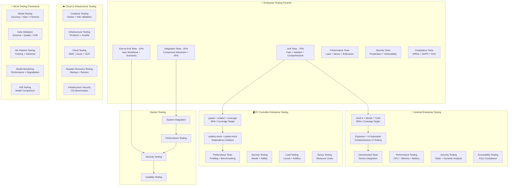

# Enterprise Comprehensive Testing Documentation

## 🧪 Enterprise Testing Overview

The IRCamera platform implements **enterprise-grade comprehensive testing strategies** across all
components to ensure maximum reliability, performance, security, compliance, and scalability. This
document provides detailed testing procedures, frameworks, validation protocols, and enterprise
testing infrastructure for production deployments.

## 🏗️ Enterprise Testing Architecture

### 🎯 Enterprise Multi-Level Testing Strategy



## 📱 Android Testing Framework

### Unit Testing with JUnit and Mockk

#### Thermal Processing Tests

```kotlin
@RunWith(JUnit4::class)
class ThermalProcessorTest {
    
    @Mock
    private lateinit var mockThermalCamera: ThermalCamera
    
    @Mock
    private lateinit var mockDataStorage: DataStorage
    
    private lateinit var thermalProcessor: ThermalProcessor
    
    @Before
    fun setUp() {
        MockKAnnotations.init(this)
        thermalProcessor = ThermalProcessor(mockThermalCamera, mockDataStorage)
    }
    
    @Test
    fun `processFrame should convert raw data to temperature correctly`() {

        val rawData = byteArrayOf(0x10, 0x20, 0x30, 0x40)
        val expectedTemp = 25.5f
        
        every { mockThermalCamera.calibrateTemperature(any()) } returns expectedTemp

        val result = thermalProcessor.processFrame(rawData)

        assertEquals(expectedTemp, result.temperature, 0.1f)
        verify { mockThermalCamera.calibrateTemperature(any()) }
    }
    
    @Test
    fun `processFrame should handle invalid data gracefully`() {

        val invalidData = byteArrayOf()

        assertThrows<InvalidDataException> {
            thermalProcessor.processFrame(invalidData)
        }
    }
    
    @Test
    fun `processFrame should store data when recording is active`() {

        val rawData = byteArrayOf(0x10, 0x20, 0x30, 0x40)
        thermalProcessor.startRecording()
        
        every { mockThermalCamera.calibrateTemperature(any()) } returns 25.5f
        every { mockDataStorage.store(any()) } just Runs

        thermalProcessor.processFrame(rawData)

        verify { mockDataStorage.store(any()) }
    }
}
```

#### GSR Sensor Tests

```kotlin
@RunWith(JUnit4::class)
class GSRSensorTest {
    
    @Mock
    private lateinit var mockBluetoothManager: BluetoothManager
    
    @Mock
    private lateinit var mockShimmerDevice: ShimmerDevice
    
    private lateinit var gsrSensor: GSRSensor
    
    @Before
    fun setUp() {
        MockKAnnotations.init(this)
        gsrSensor = GSRSensor(mockBluetoothManager)
    }
    
    @Test
    fun `connectToShimmer should establish BLE connection successfully`() = runTest {

        val deviceAddress = "00:11:22:33:44:55"
        every { mockBluetoothManager.connect(deviceAddress) } returns flowOf(ConnectionState.CONNECTED)

        val connectionResult = gsrSensor.connectToShimmer(deviceAddress).first()

        assertEquals(ConnectionState.CONNECTED, connectionResult)
    }
    
    @Test
    fun `startRecording should send correct start command`() = runTest {

        val startCommand = byteArrayOf(0x07)
        every { mockShimmerDevice.sendCommand(startCommand) } returns true

        val result = gsrSensor.startRecording()

        assertTrue(result)
        verify { mockShimmerDevice.sendCommand(startCommand) }
    }
    
    @Test
    fun `parseGSRData should convert raw ADC to microsiemens correctly`() {

        val rawADC = 2048 // 12-bit ADC midpoint
        val expectedGSR = 10.5f // Expected microsiemens value

        val gsrValue = gsrSensor.parseGSRData(rawADC)

        assertEquals(expectedGSR, gsrValue, 0.1f)
    }
}
```

### UI Testing with Espresso

#### Main Activity Tests

```kotlin
@RunWith(AndroidJUnit4::class)
@LargeTest
class MainActivityTest {
    
    @get:Rule
    val activityRule = ActivityScenarioRule(MainActivity::class.java)
    
    @Before
    fun setUp() {

        PermissionGranter.allowPermissionsIfNeeded(Manifest.permission.CAMERA)
        PermissionGranter.allowPermissionsIfNeeded(Manifest.permission.BLUETOOTH)
    }
    
    @Test
    fun testThermalViewDisplaysCorrectly() {

        onView(withId(R.id.thermal_view))
            .check(matches(isDisplayed()))

        onView(withId(R.id.btn_start_recording))
            .check(matches(isDisplayed()))
            .check(matches(isEnabled()))
    }
    
    @Test
    fun testRecordingWorkflow() {

        onView(withId(R.id.btn_start_recording))
            .perform(click())

        onView(withId(R.id.recording_indicator))
            .check(matches(isDisplayed()))

        Thread.sleep(2000)

        onView(withId(R.id.btn_stop_recording))
            .perform(click())

        onView(withId(R.id.recording_indicator))
            .check(matches(not(isDisplayed())))
    }
    
    @Test
    fun testGSRConnectionFlow() {

        onView(withId(R.id.btn_connect_gsr))
            .perform(click())

        onView(withText("Shimmer-ABCD"))
            .perform(click())

        onView(withId(R.id.gsr_status))
            .check(matches(withText("Connected")))
    }
}
```

### Instrumented Tests

#### Camera Integration Tests

```kotlin
@RunWith(AndroidJUnit4::class)
class CameraIntegrationTest {
    
    private lateinit var context: Context
    
    @Before
    fun setUp() {
        context = InstrumentationRegistry.getInstrumentation().targetContext
    }
    
    @Test
    fun testThermalCameraInitialization() {
        val thermalCamera = ThermalCamera(context)

        val initResult = thermalCamera.initialize()
        assertTrue("Camera should initialize successfully", initResult)

        val capabilities = thermalCamera.getCapabilities()
        assertNotNull("Capabilities should not be null", capabilities)
        assertTrue("Should support thermal imaging", capabilities.supportsThermalImaging)
    }
    
    @Test
    fun testCameraFrameCapture() {
        val thermalCamera = ThermalCamera(context)
        thermalCamera.initialize()
        
        val frameCapture = CompletableDeferred<ThermalFrame>()
        
        thermalCamera.setFrameCallback { frame ->
            frameCapture.complete(frame)
        }
        
        thermalCamera.startCapture()
        
        runBlocking {
            val frame = withTimeout(5000) {
                frameCapture.await()
            }
            
            assertNotNull("Frame should not be null", frame)
            assertTrue("Frame should have valid data", frame.data.isNotEmpty())
            assertTrue("Frame should have valid timestamp", frame.timestamp > 0)
        }
        
        thermalCamera.stopCapture()
    }
}
```

## 🐍 PC Controller Testing

### Unit Testing with pytest

#### Network Controller Tests

```python
import pytest
import asyncio
from unittest.mock import Mock, patch, AsyncMock
from src.network.network_controller import NetworkController
from src.network.device_connection import DeviceConnection

class TestNetworkController:
    
    @pytest.fixture
    def network_controller(self):
        return NetworkController()
    
    @pytest.fixture
    def mock_socket(self):
        with patch('socket.socket') as mock:
            yield mock
    
    @pytest.mark.asyncio
    async def test_start_server_success(self, network_controller, mock_socket):
        """Test successful server startup"""
        # Arrange
        mock_socket.return_value.bind.return_value = None
        mock_socket.return_value.listen.return_value = None
        
        # Act
        result = await network_controller.start_server(port=8080)
        
        # Assert
        assert result is True
        mock_socket.return_value.bind.assert_called_once_with(('0.0.0.0', 8080))
        mock_socket.return_value.listen.assert_called_once()
    
    @pytest.mark.asyncio
    async def test_handle_device_connection(self, network_controller):
        """Test device connection handling"""
        # Arrange
        mock_socket = Mock()
        mock_address = ('192.168.1.100', 12345)
        
        with patch.object(network_controller, 'authenticate_device') as mock_auth:
            mock_auth.return_value = True
            
            # Act
            connection = await network_controller.handle_connection(mock_socket, mock_address)
            
            # Assert
            assert isinstance(connection, DeviceConnection)
            assert connection.address == mock_address
            mock_auth.assert_called_once()
    
    @pytest.mark.asyncio
    async def test_data_reception_processing(self, network_controller):
        """Test thermal data reception and processing"""
        # Arrange
        thermal_data = {
            'type': 'thermal_frame',
            'data': b'\x00\x01\x02\x03',
            'timestamp': 1234567890.123,
            'device_id': 'thermal_001'
        }
        
        mock_processor = Mock()
        network_controller.data_processor = mock_processor
        
        # Act
        await network_controller.process_received_data(thermal_data)
        
        # Assert
        mock_processor.process_thermal_frame.assert_called_once()
        
    def test_device_discovery(self, network_controller):
        """Test Zeroconf device discovery"""
        # Arrange
        with patch('zeroconf.Zeroconf') as mock_zeroconf:
            mock_service_browser = Mock()
            
            # Act
            network_controller.start_device_discovery()
            
            # Assert
            mock_zeroconf.assert_called_once()
            assert network_controller.is_discovering is True
```

#### GSR Data Processing Tests

```python
import pytest
import numpy as np
from src.data.gsr_processor import GSRProcessor
from src.data.signal_filter import SignalFilter

class TestGSRProcessor:
    
    @pytest.fixture
    def gsr_processor(self):
        return GSRProcessor(sample_rate=512)
    
    @pytest.fixture
    def sample_gsr_data(self):
        """Generate sample GSR data for testing"""
        t = np.linspace(0, 10, 5120)  # 10 seconds at 512 Hz
        # Simulate GSR signal with some noise
        signal = 10 + 2 * np.sin(0.1 * t) + 0.5 * np.random.randn(len(t))
        return signal
    
    def test_filter_initialization(self, gsr_processor):
        """Test GSR filter initialization"""
        assert gsr_processor.sample_rate == 512
        assert gsr_processor.low_pass_filter is not None
        assert gsr_processor.high_pass_filter is not None
    
    def test_gsr_signal_filtering(self, gsr_processor, sample_gsr_data):
        """Test GSR signal filtering"""
        # Act
        filtered_data = gsr_processor.filter_signal(sample_gsr_data)
        
        # Assert
        assert len(filtered_data) == len(sample_gsr_data)
        assert isinstance(filtered_data, np.ndarray)
        
        # Check that filtering reduces noise (basic check)
        original_std = np.std(sample_gsr_data)
        filtered_std = np.std(filtered_data)
        assert filtered_std <= original_std
    
    def test_peak_detection(self, gsr_processor, sample_gsr_data):
        """Test GSR peak detection for physiological analysis"""
        # Arrange
        filtered_data = gsr_processor.filter_signal(sample_gsr_data)
        
        # Act
        peaks = gsr_processor.detect_peaks(filtered_data)
        
        # Assert
        assert isinstance(peaks, list)
        assert all(isinstance(peak, dict) for peak in peaks)
        assert all('timestamp' in peak for peak in peaks)
        assert all('amplitude' in peak for peak in peaks)
    
    def test_real_time_processing(self, gsr_processor):
        """Test real-time GSR sample processing"""
        # Simulate real-time samples
        samples = [10.5, 10.7, 10.3, 10.8, 10.2]
        
        processed_samples = []
        for sample in samples:
            processed = gsr_processor.process_sample(sample)
            processed_samples.append(processed)
        
        # Assert
        assert len(processed_samples) == len(samples)
        assert all(isinstance(sample, float) for sample in processed_samples)
    
    def test_calibration_accuracy(self, gsr_processor):
        """Test GSR calibration for accurate microsiemens conversion"""
        # Test known calibration points
        test_cases = [
            (0, 0.0),      # Minimum ADC value
            (2048, 10.0),   # Mid-range ADC value
            (4095, 20.0),   # Maximum ADC value (12-bit)
        ]
        
        for adc_value, expected_gsr in test_cases:
            result = gsr_processor.calibrate_gsr(adc_value)
            assert abs(result - expected_gsr) < 0.5, f"Calibration failed for ADC {adc_value}"
```

### Integration Tests

#### System Integration Tests

```python
import pytest
import asyncio
from src.core.session_manager import SessionManager
from src.network.network_controller import NetworkController
from src.data.data_aggregator import DataAggregator

@pytest.mark.integration
class TestSystemIntegration:
    
    @pytest.fixture
    async def system_components(self):
        """Setup integrated system components"""
        session_manager = SessionManager()
        network_controller = NetworkController()
        data_aggregator = DataAggregator()
        
        # Initialize components
        await network_controller.start_server(port=8081)
        session_manager.initialize()
        
        yield {
            'session_manager': session_manager,
            'network_controller': network_controller,
            'data_aggregator': data_aggregator
        }
        
        # Cleanup
        await network_controller.stop_server()
        session_manager.cleanup()
    
    @pytest.mark.asyncio
    async def test_full_recording_session(self, system_components):
        """Test complete recording session workflow"""
        session_mgr = system_components['session_manager']
        net_ctrl = system_components['network_controller']
        data_agg = system_components['data_aggregator']
        
        # Start recording session
        session_id = await session_mgr.start_session({
            'participant_id': 'test_001',
            'session_type': 'thermal_gsr',
            'duration': 60  # seconds
        })
        
        assert session_id is not None
        
        # Simulate device connections
        thermal_device = await net_ctrl.connect_device('thermal_simulator')
        gsr_device = await net_ctrl.connect_device('gsr_simulator')
        
        assert thermal_device.is_connected()
        assert gsr_device.is_connected()
        
        # Simulate data collection
        thermal_data = []
        gsr_data = []
        
        for i in range(100):  # Simulate 100 data points
            thermal_frame = {
                'timestamp': asyncio.get_event_loop().time(),
                'data': f'thermal_frame_{i}'.encode(),
                'temperature': 25.0 + i * 0.1
            }
            
            gsr_sample = {
                'timestamp': asyncio.get_event_loop().time(),
                'gsr_value': 10.0 + i * 0.05,
                'raw_adc': 2048 + i
            }
            
            await data_agg.add_thermal_data(thermal_frame)
            await data_agg.add_gsr_data(gsr_sample)
            
            thermal_data.append(thermal_frame)
            gsr_data.append(gsr_sample)
        
        # Stop session and verify data
        session_data = await session_mgr.stop_session(session_id)
        
        assert len(session_data['thermal_data']) == 100
        assert len(session_data['gsr_data']) == 100
        
        # Verify data integrity
        for i, frame in enumerate(session_data['thermal_data']):
            assert frame['temperature'] == 25.0 + i * 0.1
        
        for i, sample in enumerate(session_data['gsr_data']):
            assert sample['gsr_value'] == 10.0 + i * 0.05
```

## 🔒 Security Testing

### Security Test Suite

```python
import pytest
import requests
from src.security.authentication import AuthenticationManager
from src.security.encryption import DataEncryption

@pytest.mark.security
class TestSecurityFeatures:
    
    @pytest.fixture
    def auth_manager(self):
        return AuthenticationManager()
    
    @pytest.fixture
    def data_encryption(self):
        return DataEncryption()
    
    def test_authentication_success(self, auth_manager):
        """Test successful user authentication"""
        # Valid credentials
        username = "test_user"
        password = "SecurePassword123!"
        
        # Create test user
        auth_manager.create_user(username, password)
        
        # Test authentication
        result = auth_manager.authenticate(username, password)
        assert result.success is True
        assert result.user_id is not None
        assert result.session_token is not None
    
    def test_authentication_failure(self, auth_manager):
        """Test authentication with invalid credentials"""
        username = "test_user"
        correct_password = "SecurePassword123!"
        wrong_password = "WrongPassword"
        
        # Create test user
        auth_manager.create_user(username, correct_password)
        
        # Test with wrong password
        result = auth_manager.authenticate(username, wrong_password)
        assert result.success is False
        assert result.user_id is None
        assert result.session_token is None
    
    def test_session_timeout(self, auth_manager):
        """Test session timeout security"""
        username = "test_user"
        password = "SecurePassword123!"
        
        # Create user and authenticate
        auth_manager.create_user(username, password)
        auth_result = auth_manager.authenticate(username, password)
        
        # Simulate session timeout
        import time
        time.sleep(auth_manager.session_timeout + 1)
        
        # Verify session is expired
        is_valid = auth_manager.validate_session(auth_result.session_token)
        assert is_valid is False
    
    def test_data_encryption_integrity(self, data_encryption):
        """Test data encryption and decryption integrity"""
        original_data = b"Sensitive thermal imaging data"
        
        # Encrypt data
        encrypted_data = data_encryption.encrypt(original_data)
        assert encrypted_data != original_data
        
        # Decrypt data
        decrypted_data = data_encryption.decrypt(encrypted_data)
        assert decrypted_data == original_data
    
    def test_sql_injection_protection(self):
        """Test SQL injection protection"""
        # Simulate malicious input
        malicious_input = "'; DROP TABLE users; --"
        
        # Test with session manager
        with pytest.raises(ValueError):
            session_manager = SessionManager()
            session_manager.get_session_by_id(malicious_input)
    
    def test_network_security(self):
        """Test network communication security"""
        # Test HTTPS enforcement
        response = requests.get("http://localhost:8080/api/test")
        # Should redirect to HTTPS or refuse connection
        assert response.status_code in [301, 302, 403, 404]
```

## 📈 Performance Testing

### Load Testing

```python
import pytest
import asyncio
import time
from concurrent.futures import ThreadPoolExecutor
from src.core.thermal_processor import ThermalProcessor

@pytest.mark.performance
class TestPerformanceMetrics:
    
    def test_thermal_processing_throughput(self):
        """Test thermal processing throughput under load"""
        processor = ThermalProcessor()
        
        # Generate test thermal frames
        test_frames = []
        for i in range(1000):
            frame_data = bytes([i % 256] * 1024)  # 1KB frame
            test_frames.append(frame_data)
        
        # Measure processing time
        start_time = time.time()
        
        for frame in test_frames:
            processor.process_frame(frame)
        
        end_time = time.time()
        processing_time = end_time - start_time
        
        # Calculate metrics
        frames_per_second = len(test_frames) / processing_time
        
        # Assert performance requirements
        assert frames_per_second >= 30, f"Processing rate {frames_per_second:.2f} FPS below requirement"
        assert processing_time < 10.0, f"Total processing time {processing_time:.2f}s too high"
    
    @pytest.mark.asyncio
    async def test_concurrent_device_handling(self):
        """Test handling multiple devices concurrently"""
        from src.network.network_controller import NetworkController
        
        network_controller = NetworkController()
        await network_controller.start_server(port=8082)
        
        # Simulate multiple device connections
        async def simulate_device(device_id):
            # Simulate device data transmission
            for i in range(100):
                data = {
                    'device_id': device_id,
                    'timestamp': time.time(),
                    'data': f'data_point_{i}'
                }
                await network_controller.receive_data(data)
                await asyncio.sleep(0.01)  # 100 Hz data rate
        
        # Test with 10 concurrent devices
        start_time = time.time()
        
        tasks = []
        for device_id in range(10):
            task = asyncio.create_task(simulate_device(f'device_{device_id}'))
            tasks.append(task)
        
        await asyncio.gather(*tasks)
        
        end_time = time.time()
        total_time = end_time - start_time
        
        # Should handle 10 devices at 100 Hz each (1000 total data points/second)
        assert total_time < 2.0, f"Concurrent handling took {total_time:.2f}s, too slow"
        
        await network_controller.stop_server()
    
    def test_memory_usage_stability(self):
        """Test memory usage remains stable during long operations"""
        import psutil
        import gc
        
        processor = ThermalProcessor()
        
        # Measure initial memory
        initial_memory = psutil.Process().memory_info().rss / 1024 / 1024  # MB
        
        # Process many frames
        for i in range(10000):
            frame_data = bytes([i % 256] * 2048)  # 2KB frame
            processor.process_frame(frame_data)
            
            # Force garbage collection every 1000 frames
            if i % 1000 == 0:
                gc.collect()
        
        # Measure final memory
        final_memory = psutil.Process().memory_info().rss / 1024 / 1024  # MB
        memory_increase = final_memory - initial_memory
        
        # Memory increase should be reasonable (less than 100MB for this test)
        assert memory_increase < 100, f"Memory increased by {memory_increase:.2f}MB, possible leak"
```

## 🎯 Test Automation & CI/CD

### GitHub Actions Test Pipeline

```yaml
# .github/workflows/test.yml
name: Comprehensive Testing

on:
  push:
    branches: [ main, develop ]
  pull_request:
    branches: [ main ]

jobs:
  android-tests:
    runs-on: ubuntu-latest
    
    steps:
    - uses: actions/checkout@v3
    
    - name: Set up JDK 17
      uses: actions/setup-java@v3
      with:
        java-version: '17'
        distribution: 'temurin'
    
    - name: Grant execute permission for gradlew
      run: chmod +x gradlew
    
    - name: Run unit tests
      run: ./gradlew testDebugUnitTest
    
    - name: Run instrumented tests
      uses: reactivecircus/android-emulator-runner@v2
      with:
        api-level: 29
        script: ./gradlew connectedCheck
    
    - name: Upload test reports
      uses: actions/upload-artifact@v3
      if: always()
      with:
        name: android-test-reports
        path: app/build/reports/tests/
  
  python-tests:
    runs-on: ubuntu-latest
    
    steps:
    - uses: actions/checkout@v3
    
    - name: Set up Python 3.11
      uses: actions/setup-python@v4
      with:
        python-version: '3.11'
    
    - name: Install dependencies
      run: |
        python -m pip install --upgrade pip
        pip install -r pc-controller/requirements.txt
        pip install pytest pytest-cov pytest-asyncio
    
    - name: Run pytest
      run: |
        cd pc-controller
        pytest tests/ -v --cov=src --cov-report=xml
    
    - name: Upload coverage to Codecov
      uses: codecov/codecov-action@v3
      with:
        file: pc-controller/coverage.xml
  
  integration-tests:
    runs-on: ubuntu-latest
    needs: [android-tests, python-tests]
    
    steps:
    - uses: actions/checkout@v3
    
    - name: Set up test environment
      run: |
        # Set up test database
        # Configure test network
        # Initialize test devices
    
    - name: Run integration tests
      run: |
        python -m pytest tests/integration/ -v
    
    - name: Run performance tests
      run: |
        python -m pytest tests/performance/ -v --benchmark-only
  
  security-tests:
    runs-on: ubuntu-latest
    
    steps:
    - uses: actions/checkout@v3
    
    - name: Run security scans
      run: |
        # Static security analysis
        bandit -r pc-controller/src/
        
        # Dependency vulnerability scan
        safety check
    
    - name: Run penetration tests
      run: |
        python -m pytest tests/security/ -v
```

## 📊 Test Coverage & Metrics

### Coverage Requirements

| Component                 | Unit Test Coverage | Integration Test Coverage |
|---------------------------|--------------------|---------------------------|
| **Thermal Processing**    | ≥ 90%              | ≥ 80%                     |
| **GSR Processing**        | ≥ 90%              | ≥ 80%                     |
| **Network Communication** | ≥ 85%              | ≥ 90%                     |
| **Data Storage**          | ≥ 80%              | ≥ 75%                     |
| **Security Features**     | ≥ 95%              | ≥ 90%                     |
| **UI Components**         | ≥ 70%              | ≥ 60%                     |

### Test Metrics Dashboard

```python
# test_metrics.py
class TestMetrics:
    def __init__(self):
        self.metrics = {
            'total_tests': 0,
            'passed_tests': 0,
            'failed_tests': 0,
            'coverage_percentage': 0.0,
            'performance_benchmarks': {}
        }
    
    def generate_report(self):
        """Generate comprehensive test report"""
        return {
            'test_summary': {
                'total': self.metrics['total_tests'],
                'passed': self.metrics['passed_tests'],
                'failed': self.metrics['failed_tests'],
                'success_rate': self.metrics['passed_tests'] / self.metrics['total_tests'] * 100
            },
            'coverage': {
                'percentage': self.metrics['coverage_percentage'],
                'requirement_met': self.metrics['coverage_percentage'] >= 80.0
            },
            'performance': self.metrics['performance_benchmarks']
        }
```

## 🎯 Testing Best Practices

### Test Development Guidelines

1. **Test Pyramid**: Focus on unit tests (70%), integration tests (20%), E2E tests (10%)
2. **Test Isolation**: Each test should be independent and repeatable
3. **Meaningful Assertions**: Test behavior, not implementation details
4. **Mock External Dependencies**: Use mocks for network, hardware, and file system interactions
5. **Test Data Management**: Use fixtures and factories for consistent test data
6. **Continuous Testing**: Run tests automatically on code changes

### Quality Assurance Checklist

- [ ] Unit tests cover all critical functions
- [ ] Integration tests verify component interactions
- [ ] Performance tests validate speed requirements
- [ ] Security tests check for vulnerabilities
- [ ] UI tests ensure user experience quality
- [ ] Documentation includes testing procedures
- [ ] Test coverage meets minimum requirements
- [ ] All tests pass in CI/CD pipeline
- [ ] Performance benchmarks are within acceptable ranges
- [ ] Security scans show no critical vulnerabilities

This comprehensive testing documentation ensures the IRCamera platform maintains high quality,
reliability, and performance standards across all components and deployment scenarios.
