```mermaid
graph TB
    %% Core Application Layer
    subgraph "Application Layer"
        App[📱 app<br/>Main Android Application]
        MainActivity[MainActivity.kt]
        App --> MainActivity
    end
    
    %% Library Layer
    subgraph "Library Layer"
        LibApp[📚 libapp<br/>Application Library]
        LibCom[📚 libcom<br/>Communication Library] 
        LibIR[📚 libir<br/>Infrared Camera Library]
        LibMatrix[📚 libmatrix<br/>Matrix Operations]
        LibMenu[📚 libmenu<br/>Menu Components]
        LibUI[📚 libui<br/>UI Components Library]
    end
    
    %% Component Layer  
    subgraph "Component Layer"
        ThermalIR[🌡️ thermal-ir<br/>Thermal IR Component]
        Thermal[🌡️ thermal<br/>Thermal Component]
        ThermalLite[🌡️ thermal-lite<br/>Thermal Lite Component]
        GSRRecording[📊 gsr-recording<br/>GSR Data Recording]
        UserComp[👤 user<br/>User Management Component]
        PseudoComp[🔧 pseudo<br/>Pseudo Component]
        CommonComp[🔧 CommonComponent<br/>Shared Components]
    end
    
    %% External Module Layer
    subgraph "External Modules"
        BleModule[📡 BleModule<br/>Bluetooth Low Energy]
        RangeSeekBar[🎚️ RangeSeekBar<br/>UI Range Selector]
    end
    
    %% CI/CD Pipeline
    subgraph "CI/CD Pipeline"
        DevScript[🛠️ dev.sh<br/>Development Tools]
        CIWorkflow[⚙️ CI Workflow<br/>Build & Quality]
        GradleBuild[⚙️ Gradle Build Check<br/>Matrix Testing]  
        StaticAnalysis[🔍 Static Analysis<br/>Multi-language Linting]
    end
    
    %% Build System
    subgraph "Build System"
        GradleBuild2[🏗️ build.gradle.kts<br/>Root Build Config]
        VersionCatalog[📋 gradle/libs.versions.toml<br/>Version Catalog]
        Settings[⚙️ settings.gradle.kts<br/>Project Settings]
    end
    
    %% Dependencies and Relationships
    App --> LibApp
    App --> LibUI
    App --> LibCom
    App --> LibIR
    App --> BleModule
    
    LibApp --> LibCom
    LibUI --> LibMatrix
    LibIR --> LibMatrix
    
    ThermalIR --> LibIR
    Thermal --> LibIR  
    ThermalLite --> LibIR
    GSRRecording --> LibCom
    UserComp --> LibApp
    
    BleModule --> GSRRecording
    
    %% CI/CD Integration
    DevScript --> CIWorkflow
    DevScript --> GradleBuild
    DevScript --> StaticAnalysis
    
    CIWorkflow --> GradleBuild2
    GradleBuild --> GradleBuild2
    StaticAnalysis --> DevScript
    
    %% Build Dependencies
    GradleBuild2 --> VersionCatalog
    GradleBuild2 --> Settings
    
    %% Styling
    classDef appLayer fill:
    classDef libLayer fill:
    classDef componentLayer fill:
    classDef externalLayer fill:
    classDef cicdLayer fill:
    classDef buildLayer fill:
    
    class App,MainActivity appLayer
    class LibApp,LibCom,LibIR,LibMatrix,LibMenu,LibUI libLayer
    class ThermalIR,Thermal,ThermalLite,GSRRecording,UserComp,PseudoComp,CommonComp componentLayer
    class BleModule,RangeSeekBar externalLayer
    class DevScript,CIWorkflow,GradleBuild,StaticAnalysis cicdLayer
    class GradleBuild2,VersionCatalog,Settings buildLayer
```

This diagram shows the complete IRCamera repository architecture with:

- **Application Layer**: Main Android app and core activities
- **Library Layer**: Reusable libraries for different functionalities  
- **Component Layer**: Feature-specific components for thermal imaging, GSR recording, user management
- **External Modules**: Third-party and external components
- **CI/CD Pipeline**: Automated build validation, testing, and quality assurance
- **Build System**: Gradle configuration and dependency management

1. **App → Libraries**: Main app depends on libapp, libui, libcom, libir
2. **Components → Libraries**: Thermal components use libir, GSR uses libcom  
3. **BLE Integration**: BleModule connects to GSR recording functionality
4. **CI/CD Integration**: Development tools integrate with all validation workflows
5. **Build System**: Centralized version catalog and gradle configuration
