# IRCamera Repository Architecture

This document contains a detailed Mermaid diagram showing the complete architecture of the IRCamera repository, including all modules, components, CI/CD workflows, and their relationships.

## Repository Architecture Diagram

```mermaid
graph TB
    %% Repository Root
    subgraph "IRCamera Repository"
        
        %% Main Application
        subgraph "Core Application"
            APP["`**app**
            Main Android Application
            • UI Activities & Fragments
            • Application Entry Point
            • Dependency Aggregator`"]
        end
        
        %% Library Modules
        subgraph "Library Modules"
            LIBAPP["`**libapp**
            Application Library
            • Core App Logic
            • Shared Components
            • LMS SDK Integration`"]
            
            LIBCOM["`**libcom**
            Communication Library  
            • Network Operations
            • API Connections
            • Data Exchange`"]
            
            LIBIR["`**libir**
            IR Camera Library
            • Thermal Imaging
            • Camera Controls
            • Image Processing`"]
            
            LIBUI["`**libui**
            UI Components Library
            • Custom Views
            • Shared UI Elements
            • Theme & Styling`"]
            
            LIBMENU["`**libmenu**
            Menu System Library
            • Navigation Logic
            • Menu Components
            • User Interface`"]
            
            LIBMATRIX["`**libmatrix**
            Matrix Operations Library
            • Mathematical Operations
            • Data Processing
            • Algorithm Support`"]
        end
        
        %% Feature Components
        subgraph "Feature Components"
            THERMAL["`**component:thermal**
            Thermal Processing
            • Standard Thermal Imaging
            • Temperature Analysis
            • Image Enhancement`"]
            
            THERMAL_IR["`**component:thermal-ir**
            Thermal IR Resources
            • IR-Specific Resources
            • Configuration Files
            • Asset Management`"]
            
            THERMAL_LITE["`**component:thermal-lite**
            Thermal Lite Mode
            • Lightweight Processing
            • Performance Optimized
            • Resource Efficient`"]
            
            PSEUDO["`**component:pseudo**
            Pseudo Color Processing
            • Color Mapping
            • Visual Enhancement
            • Display Optimization`"]
            
            GSR["`**component:gsr-recording**
            GSR Recording System
            • Galvanic Skin Response
            • Data Recording
            • Sensor Integration`"]
            
            USER["`**component:user**
            User Management
            • User Profiles
            • Settings Management
            • Authentication`"]
            
            COMMON["`**component:CommonComponent**
            Shared Components
            • Common Utilities
            • Shared Resources
            • Base Classes`"]
        end
        
        %% External Modules
        subgraph "External Modules"
            BLE["`**BleModule**
            Bluetooth Low Energy
            • BLE Communication
            • Device Connection
            • Nordic Backend`"]
            
            RANGE["`**RangeSeekBar**
            Range Selection UI
            • Custom Seek Bar
            • Range Input Control
            • User Interaction`"]
        end
        
        %% CI/CD System
        subgraph "CI/CD Pipeline"
            CI_MAIN["`**CI Main Workflow**
            .github/workflows/ci.yml
            • Build Validation
            • Code Quality Checks
            • Linting & Analysis
            • Artifact Generation`"]
            
            GRADLE_CHECK["`**Gradle Build Check**
            .github/workflows/gradle-build-check.yml
            • Multi-task Validation
            • Matrix Strategy Testing
            • Build Verification`"]
            
            STATIC_ANALYSIS["`**Static Analysis**
            .github/workflows/static-analysis.yml
            • Multi-language Analysis
            • Code Quality Metrics
            • Standards Compliance`"]
        end
        
        %% Development Tools
        subgraph "Development Tools"
            DEV_SCRIPT["`**dev.sh**
            Development Script
            • lint - Code linting
            • static - Static analysis  
            • build-check - Build validation
            • validate - Full validation
            • diagram - Architecture diagram`"]
            
            GRADLE_WRAPPER["`**Gradle System**
            gradlew / build.gradle.kts
            • Build Automation
            • Dependency Management
            • Multi-module Coordination`"]
        end
        
        %% Configuration Files
        subgraph "Configuration & Resources"
            SETTINGS["`**settings.gradle.kts**
            Project Configuration
            • Module Definitions
            • Repository Settings
            • Dependency Resolution`"]
            
            LIBS_VERSION["`**gradle/libs.versions.toml**
            Version Catalog
            • Dependency Versions
            • Library Definitions
            • Version Management`"]
            
            AAR_LIBS["`**Local AAR Libraries**
            Native & Third-party Libraries
            • USB IR SDK
            • LMS International SDK
            • Authentication Libraries`"]
        end
    end
    
    %% Dependencies - App Level
    APP --> THERMAL
    APP --> THERMAL_IR
    APP --> THERMAL_LITE
    APP --> PSEUDO
    APP --> GSR
    APP --> USER
    APP --> LIBAPP
    APP --> LIBCOM
    APP --> LIBIR
    APP --> LIBUI
    APP --> LIBMENU
    APP --> BLE
    
    %% Library Dependencies
    LIBAPP --> LIBCOM
    LIBIR --> LIBMATRIX
    LIBUI --> COMMON
    
    %% Component Dependencies
    THERMAL --> LIBIR
    THERMAL --> LIBMATRIX
    THERMAL_IR --> LIBIR
    THERMAL_LITE --> LIBIR
    PSEUDO --> LIBIR
    GSR --> LIBCOM
    USER --> LIBUI
    USER --> COMMON
    
    %% External Dependencies
    APP --> AAR_LIBS
    LIBAPP --> AAR_LIBS
    LIBIR --> AAR_LIBS
    
    %% CI/CD Workflow Dependencies
    CI_MAIN --> DEV_SCRIPT
    GRADLE_CHECK --> GRADLE_WRAPPER
    STATIC_ANALYSIS --> DEV_SCRIPT
    
    %% Development Tool Dependencies
    DEV_SCRIPT --> GRADLE_WRAPPER
    GRADLE_WRAPPER --> SETTINGS
    GRADLE_WRAPPER --> LIBS_VERSION
    
    %% Styling
    classDef appModule fill:#e1f5fe
    classDef libModule fill:#f3e5f5
    classDef componentModule fill:#e8f5e8
    classDef externalModule fill:#fff3e0
    classDef cicdModule fill:#fce4ec
    classDef toolModule fill:#f1f8e9
    classDef configModule fill:#fafafa
    
    class APP appModule
    class LIBAPP,LIBCOM,LIBIR,LIBUI,LIBMENU,LIBMATRIX libModule
    class THERMAL,THERMAL_IR,THERMAL_LITE,PSEUDO,GSR,USER,COMMON componentModule
    class BLE,RANGE externalModule
    class CI_MAIN,GRADLE_CHECK,STATIC_ANALYSIS cicdModule
    class DEV_SCRIPT,GRADLE_WRAPPER toolModule
    class SETTINGS,LIBS_VERSION,AAR_LIBS configModule
```

## Architecture Overview

### Core Application Layer
- **app**: Main Android application module that integrates all components and provides the user interface

### Library Layer
- **libir**: Core IR camera functionality and thermal imaging processing
- **libapp**: Application-level shared components and business logic
- **libcom**: Communication and networking capabilities
- **libui**: Reusable UI components and custom views
- **libmenu**: Menu system and navigation logic
- **libmatrix**: Mathematical operations and matrix processing

### Feature Components Layer
- **thermal**: Standard thermal processing and analysis
- **thermal-ir**: IR-specific resources and configurations  
- **thermal-lite**: Lightweight thermal processing for performance
- **pseudo**: Pseudo color mapping and visual enhancement
- **gsr-recording**: Galvanic skin response recording system
- **user**: User management, profiles, and settings
- **CommonComponent**: Shared utilities and base classes

### External Modules
- **BleModule**: Bluetooth Low Energy communication with Nordic backend
- **RangeSeekBar**: Custom UI control for range selection

### CI/CD Pipeline
- **ci.yml**: Main CI workflow with comprehensive validation
- **gradle-build-check.yml**: Matrix strategy build validation
- **static-analysis.yml**: Multi-language static analysis

### Development Tools
- **dev.sh**: Unified development script with validation commands
- **Gradle System**: Build automation and dependency management

## Module Statistics

### File Distribution
- **Kotlin Files**: ~1,478 files across all modules
- **Java Files**: ~886 files for Android compatibility
- **Python Files**: ~96 files for tooling and scripts
- **Total Modules**: 17 active modules (app + 10 components + 6 libraries)

### Key Dependencies
- **Android Gradle Plugin**: 8.1.2
- **Kotlin**: 1.9.10
- **Java**: 17 (toolchain)
- **Native Libraries**: ARM64-v8a architecture support
- **Third-party SDKs**: LMS International, USB IR SDK, Authentication libraries

This architecture provides a modular, scalable structure for the IRCamera application with comprehensive CI/CD automation and development tooling.
