# Communication Sequence Diagram (PC-Device Interaction)

## Figure 3.3: Protocol Sequence Diagram - PC to Android Communication

This sequence diagram shows the step-by-step messaging between the PC orchestrator and the Android device, tracing how commands travel, how the device acknowledges and initializes sensors, how data recording occurs, and how STOP/SYNC commands are handled.

```mermaid
sequenceDiagram
    participant User as Researcher
    participant PC as PC Orchestrator<br/>(Python/PyQt6)
    participant NetServer as Network Server<br/>(TCP :8080)
    participant Android as Android Device<br/>(Recording App)
    participant Thermal as TC001 Thermal<br/>(USB/OTG)
    participant GSR as Shimmer3 GSR<br/>(Bluetooth LE)
    participant Camera as RGB Camera<br/>(CameraX)
    participant Storage as Local Storage<br/>(Session Directory)

    Note over User,Storage: Phase 1: Connection and Discovery
    
    User->>PC: Launch Application
    PC->>NetServer: Start TCP Server (Port 8080)
    NetServer->>NetServer: Listen for connections
    
    User->>Android: Launch Recording App
    Android->>Android: Auto-discover PC (mDNS)
    Android->>NetServer: TCP Connect (IP:8080)
    NetServer->>PC: Connection Established
    
    Android->>NetServer: HELLO {device_name, device_id, capabilities}
    activate NetServer
    NetServer->>PC: Process HELLO message
    PC->>PC: Register device<br/>Create DeviceManager entry
    PC->>NetServer: Response: ACK HELLO {pc_time, session_ready}
    deactivate NetServer
    NetServer->>Android: ACK HELLO
    
    PC->>User: Display "Samsung_S22_001 Connected"
    
    Note over User,Storage: Phase 2: Time Synchronization
    
    PC->>NetServer: SYNC_REQUEST {t1=pc_send_time}
    NetServer->>Android: SYNC_REQUEST t1=1703441234567
    activate Android
    Android->>Android: Record t2=receive_time<br/>1703441234569
    Android->>Android: Prepare response t3=send_time<br/>1703441234570
    Android->>NetServer: SYNC_RESPONSE {t2, t3}
    deactivate Android
    NetServer->>PC: SYNC_RESPONSE received
    
    activate PC
    PC->>PC: Calculate offset:<br/>t4=receive_time<br/>rtt = (t4-t1) - (t3-t2)<br/>offset = ((t2-t1) + (t3-t4))/2<br/>Result: +2ms offset
    deactivate PC
    
    PC->>NetServer: ACK SYNC {offset=+2ms}
    NetServer->>Android: ACK SYNC
    Android->>Android: Adjust local clock offset
    
    Note over User,Storage: Phase 3: Capability Exchange
    
    User->>PC: Check device capabilities
    PC->>NetServer: GET_CAPABILITIES
    NetServer->>Android: GET_CAPABILITIES
    
    activate Android
    Android->>Thermal: Query TC001 (via USB)
    activate Thermal
    Thermal->>Android: Device info: 256x192, 25Hz
    deactivate Thermal
    
    Android->>GSR: Query Shimmer3 (via BLE)
    activate GSR
    GSR->>Android: Device info: 128Hz, GSR+PPG
    deactivate GSR
    
    Android->>Camera: Query Camera capabilities
    activate Camera
    Camera->>Android: Resolution: 1920x1080, 30fps
    deactivate Camera
    
    Android->>NetServer: CAPABILITIES {thermal, gsr, rgb}<br/>thermal=256x192@25Hz<br/>gsr=128Hz GSR+PPG<br/>rgb=1920x1080@30fps
    deactivate Android
    
    NetServer->>PC: Device capabilities received
    PC->>User: Display sensor capabilities
    
    Note over User,Storage: Phase 4: Session Initiation
    
    User->>PC: Click "Start Recording"<br/>Session ID: session_20241215_1430
    activate PC
    PC->>PC: Create session directory<br/>Initialize metadata.json
    PC->>NetServer: START_RECORD {session_id, pc_timestamp}
    deactivate PC
    NetServer->>Android: START_RECORD session_id=session_20241215_1430
    
    activate Android
    Android->>Android: Validate command<br/>Check state = IDLE
    Android->>Storage: Create session directory<br/>/IRCamera/sessions/session_20241215_1430/
    deactivate Android
    
    par Parallel Sensor Initialization
        Android->>Thermal: Initialize TC001 SDK
        activate Thermal
        Thermal->>Thermal: IRCMD.init()<br/>Set emissivity, temp range<br/>Register frame callback
        Thermal->>Android: Init success
        deactivate Thermal
        Android->>NetServer: ACK START_RECORD {sensor=thermal, status=initializing}
        
        Android->>GSR: Start BLE discovery
        activate GSR
        GSR->>GSR: Scan for Shimmer3<br/>MAC address known
        GSR->>Android: Device found
        Android->>GSR: Connect GATT
        GSR->>Android: Connected
        Android->>GSR: Send 0x07 (start streaming)
        GSR->>Android: Streaming started (128Hz)
        deactivate GSR
        Android->>NetServer: ACK START_RECORD {sensor=gsr, status=initializing}
        
        Android->>Camera: Initialize CameraX
        activate Camera
        Camera->>Camera: Request permissions<br/>Configure 1920x1080@30fps<br/>Setup H.264 encoder
        Camera->>Android: Ready for recording
        deactivate Camera
        Android->>NetServer: ACK START_RECORD {sensor=rgb, status=initializing}
    end
    
    NetServer->>PC: All sensor ACKs received
    PC->>User: Display "Sensors Initializing..."
    
    Android->>Android: Wait for all sensors ready<br/>(Join point)
    Android->>Android: Transition to READY state
    
    Note over User,Storage: Phase 5: Recording Start
    
    Android->>NetServer: READY_TO_RECORD {all_sensors_ready}
    NetServer->>PC: Device ready
    PC->>User: Display "Device Ready"
    
    PC->>NetServer: BEGIN_RECORDING {final_sync_timestamp}
    NetServer->>Android: BEGIN_RECORDING
    
    activate Android
    par Start All Sensors
        Android->>Thermal: Start capture
        activate Thermal
        Thermal->>Thermal: LibIRParse.startStream()<br/>Frame callback active
        Thermal-->>Android: Frame callback (256x192 data)
        Android->>Android: TimeManager.getCurrentTimestampNanos()<br/>ts=1703441234570123456
        Android->>Android: Temperature calibration<br/>(+/-2 degrees C)
        Android->>Storage: Write CSV: ts,w,h,t0,t1,...,t49151
        deactivate Thermal
        
        Android->>GSR: Confirm streaming
        activate GSR
        GSR-->>Android: ADC data @128Hz<br/>(12-bit raw value)
        Android->>Android: Convert to microsiemens<br/>μS = (ADC/4095) * Vref / Rskin
        Android->>Storage: Write CSV: ts,gsr_microsiemens,ppg
        deactivate GSR
        
        Android->>Camera: Start recording
        activate Camera
        Camera-->>Android: Frame callbacks @30fps<br/>(YUV_420_888)
        Android->>Android: H.264 encoding<br/>MediaRecorder
        Android->>Storage: Write MP4: rgb_video.mp4
        deactivate Camera
    end
    deactivate Android
    
    Android->>NetServer: STATUS_UPDATE {state=RECORDING, time_elapsed=0}
    NetServer->>PC: Recording started
    PC->>User: Display "Recording Active" (00:00)
    
    Note over User,Storage: Phase 6: Active Recording (Continuous Data Flow)
    
    loop Every 2 seconds (Heartbeat)
        Android->>NetServer: HEARTBEAT {status=recording, duration=elapsed}
        NetServer->>PC: Update device status
        PC->>User: Update timer display
    end
    
    loop Continuous Data Capture
        GSR-->>Android: ADC sample (128Hz)
        Android->>Android: Timestamp + Convert
        Android->>Storage: Append to gsr_data.csv
        
        Thermal-->>Android: Thermal frame (25Hz)
        Android->>Android: Timestamp + Calibrate
        Android->>Storage: Append to thermal_data.csv
        
        Camera-->>Android: Video frame (30fps)
        Android->>Android: Timestamp + Encode
        Android->>Storage: Write to rgb_video.mp4
    end
    
    Note over User,Storage: Phase 7: Mid-Session Time Sync
    
    PC->>NetServer: SYNC_REQUEST {t1=current_pc_time}
    NetServer->>Android: SYNC_REQUEST (does not stop recording)
    activate Android
    Android->>Android: Record t2, t3<br/>(recording continues)
    Android->>NetServer: SYNC_RESPONSE {t2, t3}
    deactivate Android
    NetServer->>PC: Calculate new offset
    
    activate PC
    PC->>PC: Check drift:<br/>new_offset = +2.7ms<br/>drift = 0.7ms (acceptable)
    deactivate PC
    
    PC->>NetServer: ACK SYNC {drift_ok}
    NetServer->>Android: ACK SYNC
    Android->>Android: Apply minor correction<br/>(if needed)
    
    Note over User,Storage: Phase 8: Session Termination
    
    User->>PC: Click "Stop Recording"<br/>(after 15 minutes)
    activate PC
    PC->>PC: Validate session state
    PC->>NetServer: STOP_RECORD {session_id, final_timestamp}
    deactivate PC
    NetServer->>Android: STOP_RECORD
    
    activate Android
    par Graceful Sensor Shutdown
        Android->>Thermal: Stop capture
        activate Thermal
        Thermal->>Thermal: LibIRProcess.stopStream()<br/>Release resources
        Thermal->>Android: Stopped
        deactivate Thermal
        
        Android->>GSR: Stop streaming
        activate GSR
        Android->>GSR: Send 0x20 (stop command)
        GSR->>GSR: Halt ADC sampling
        GSR->>Android: Stopped
        deactivate GSR
        
        Android->>Camera: Stop recording
        activate Camera
        Camera->>Camera: CameraX.stopRecording()<br/>Finalize MP4 file
        Camera->>Android: Video saved
        deactivate Camera
    end
    
    Android->>Storage: Close CSV files<br/>Flush buffers
    Android->>Storage: Generate metadata.json<br/>{session_id, start_time,<br/>end_time, duration, files[]}
    deactivate Android
    
    Android->>NetServer: ACK STOP_RECORD {files_ready, file_count=5}
    NetServer->>PC: Stop acknowledged
    PC->>User: Display "Finalizing..."
    
    Note over User,Storage: Phase 9: File Transfer
    
    PC->>NetServer: REQUEST_FILES {session_id}
    NetServer->>Android: REQUEST_FILES
    
    activate Android
    Android->>Storage: Read file list<br/>thermal_data.csv<br/>gsr_data.csv<br/>rgb_video.mp4<br/>metadata.json
    Android->>Android: Calculate total size: 2.3 GB
    Android->>NetServer: FILE_MANIFEST {file_list, total_size}
    deactivate Android
    
    NetServer->>PC: File manifest received
    PC->>User: Display "Transferring files (2.3 GB)..."
    
    loop For each file
        PC->>NetServer: REQUEST_FILE {filename}
        NetServer->>Android: REQUEST_FILE
        Android->>Storage: Read file (chunked)
        
        loop Until file complete
            Android->>NetServer: FILE_CHUNK {data, offset, chunk_size}
            NetServer->>PC: Write chunk to disk
            PC->>User: Update progress (e.g., 45%)
        end
        
        Android->>NetServer: FILE_COMPLETE {filename, checksum}
        NetServer->>PC: Verify checksum
        PC->>NetServer: ACK_FILE {filename}
        NetServer->>Android: ACK_FILE
    end
    
    Android->>NetServer: ALL_FILES_SENT
    NetServer->>PC: Transfer complete
    
    activate PC
    PC->>PC: Update session metadata<br/>Mark session complete
    PC->>User: Display "Session Complete"<br/>"5 files saved (2.3 GB)"
    deactivate PC
    
    Note over User,Storage: Phase 10: Connection Cleanup
    
    PC->>NetServer: SESSION_COMPLETE {session_id}
    NetServer->>Android: SESSION_COMPLETE
    Android->>Android: Clean up session resources<br/>Transition to IDLE
    Android->>NetServer: READY_FOR_NEW_SESSION
    NetServer->>PC: Device ready
    PC->>User: Display "Ready for new session"
```



## Protocol Message Specifications

### Connection Phase Messages

**HELLO** (Android → PC)
```json
{
  "command": "HELLO",
  "device_id": "Samsung_S22_001",
  "device_name": "Samsung Galaxy S22",
  "app_version": "1.2.3",
  "capabilities": ["thermal", "gsr", "rgb"],
  "timestamp": 1703441234567
}
```

**ACK HELLO** (PC → Android)
```json
{
  "command": "ACK",
  "ack_for": "HELLO",
  "status": "connected",
  "pc_timestamp": 1703441234568,
  "session_ready": true
}
```

### Time Synchronization Messages

**SYNC_REQUEST** (PC → Android)
```json
{
  "command": "SYNC_REQUEST",
  "t1": 1703441234567,
  "sequence_number": 42
}
```

**SYNC_RESPONSE** (Android → PC)
```json
{
  "command": "SYNC_RESPONSE",
  "t2": 1703441234569,
  "t3": 1703441234570,
  "sequence_number": 42
}
```

### Recording Control Messages

**START_RECORD** (PC → Android)
```json
{
  "command": "START_RECORD",
  "session_id": "session_20241215_1430",
  "pc_timestamp": 1703441234567,
  "config": {
    "thermal_enabled": true,
    "gsr_enabled": true,
    "rgb_enabled": true,
    "thermal_fps": 25,
    "gsr_rate": 128,
    "rgb_resolution": "1920x1080",
    "rgb_fps": 30
  }
}
```

**ACK START_RECORD** (Android → PC)
```json
{
  "command": "ACK",
  "ack_for": "START_RECORD",
  "sensor": "thermal",
  "status": "initializing",
  "timestamp": 1703441234570
}
```

**STOP_RECORD** (PC → Android)
```json
{
  "command": "STOP_RECORD",
  "session_id": "session_20241215_1430",
  "final_timestamp": 1703442134567
}
```

### Status and Monitoring Messages

**HEARTBEAT** (Android → PC)
```json
{
  "command": "HEARTBEAT",
  "status": "recording",
  "duration": 123.45,
  "thermal_frames": 3086,
  "gsr_samples": 15802,
  "rgb_frames": 3704,
  "battery_level": 87,
  "storage_free_mb": 45230,
  "timestamp": 1703441357012
}
```

**STATUS_UPDATE** (Android → PC)
```json
{
  "command": "STATUS_UPDATE",
  "state": "RECORDING",
  "time_elapsed": 123.45,
  "thermal_status": "active",
  "gsr_status": "active",
  "rgb_status": "active",
  "warnings": [],
  "timestamp": 1703441357012
}
```

### File Transfer Messages

**FILE_MANIFEST** (Android → PC)
```json
{
  "command": "FILE_MANIFEST",
  "session_id": "session_20241215_1430",
  "files": [
    {"name": "thermal_data.csv", "size": 125000000},
    {"name": "gsr_data.csv", "size": 8500000},
    {"name": "rgb_video.mp4", "size": 2150000000},
    {"name": "metadata.json", "size": 4096}
  ],
  "total_size": 2283504096
}
```

**FILE_CHUNK** (Android → PC)
```json
{
  "command": "FILE_CHUNK",
  "filename": "rgb_video.mp4",
  "offset": 104857600,
  "chunk_size": 1048576,
  "data": "<base64_encoded_chunk>"
}
```

## Timing Characteristics

### Latency Requirements
- **Command Propagation**: < 50ms (PC to Android)
- **ACK Response**: < 100ms (Android to PC)
- **Heartbeat Interval**: 2 seconds
- **Sync Exchange**: < 10ms round-trip

### Timeout Values
- **Connection Establishment**: 30 seconds
- **Sensor Initialization**: 10 seconds per sensor
- **Command Acknowledgment**: 5 seconds
- **File Transfer Chunk**: 60 seconds
- **Heartbeat Timeout**: 6 seconds (3 missed beats)

### Bandwidth Usage
- **Control Messages**: ~1 KB/s average
- **Heartbeat Traffic**: 0.5 KB/s
- **File Transfer**: Up to 10 MB/s (limited by network)

## Error Handling

### Network Errors
- **Connection Lost During Recording**: Android continues local recording, queues status updates, attempts reconnection
- **Packet Loss**: TCP ensures reliable delivery, retransmission handled by protocol stack
- **Timeout**: Commands have retry logic with exponential backoff (500ms, 1s, 2s, 4s, 8s max)

### Sensor Errors
- **Initialization Failure**: Send ERROR message to PC with details, mark sensor unavailable
- **Mid-Recording Failure**: Log warning, continue with remaining sensors, notify PC via STATUS_UPDATE
- **Recovery**: Attempt auto-reconnection, send recovery status when restored

### File Transfer Errors
- **Partial Transfer**: Resume from last successful chunk using offset
- **Checksum Mismatch**: Request file retransmission
- **Storage Full on PC**: Abort transfer, send ERROR, require user intervention

This communication protocol ensures reliable, efficient coordination between the PC orchestrator and Android sensor nodes with comprehensive error handling and recovery mechanisms.
