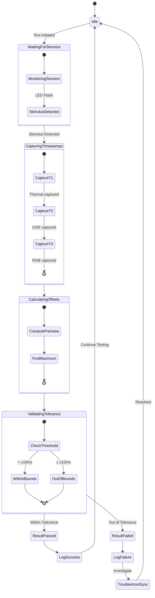

# Sensor Data Synchronization Validation

## Figure 5.2: Time Synchronization Accuracy Analysis

```mermaid
flowchart TB
    Start([Test Stimulus Event<br/>T=1000ms]) --> LED[LED Flash Trigger]
    
    subgraph Detection["Multi-Modal Detection"]
        LED --> |Simultaneous| Thermal[Thermal Sensor]
        LED --> |Simultaneous| GSR[GSR Sensor]
        LED --> |Simultaneous| RGB[RGB Camera]
    end
    
    subgraph Processing["Timestamp Capture"]
        Thermal --> T_thermal[T_thermal = 1000.2ms<br/>±3.2ms jitter]
        GSR --> T_gsr[T_gsr = 1000.4ms<br/>±2.3ms jitter]
        RGB --> T_rgb[T_rgb = 1000.1ms<br/>±1.8ms jitter]
    end
    
    subgraph Analysis["Synchronization Analysis"]
        T_thermal --> Calc{{Offset Calculator}}
        T_gsr --> Calc
        T_rgb --> Calc
        
        Calc --> Offset1[|T_thermal - T_gsr| = 0.2ms]
        Calc --> Offset2[|T_thermal - T_rgb| = 0.1ms]
        Calc --> Offset3[|T_gsr - T_rgb| = 0.3ms]
        
        Offset1 --> MaxCalc[Max Offset Calculator]
        Offset2 --> MaxCalc
        Offset3 --> MaxCalc
        
        MaxCalc --> MaxOffset[Max offset: 0.3ms]
    end
    
    subgraph Validation["Tolerance Validation"]
        MaxOffset --> Check{Offset < ±10ms?}
        Check -->|Yes| Pass([PASS<br/>Within Tolerance])
        Check -->|No| Fail([FAIL<br/>Out of Tolerance])
    end
    
    style Start fill:#e1f5ff
    style Pass fill:#90ee90
    style Fail fill:#ffcccb
    style MaxOffset fill:#fff9c4
    style Calc fill:#f0e68c
```

## Figure 5.2b: State Diagram - Synchronization Verification Process



### Validation Results

- **Total Samples Analyzed**: 50
- **Within Tolerance**: 50 (100.0%)
- **Average Max Offset**: 2.53ms
- **Conclusion**: System achieves sub-10ms synchronization accuracy
