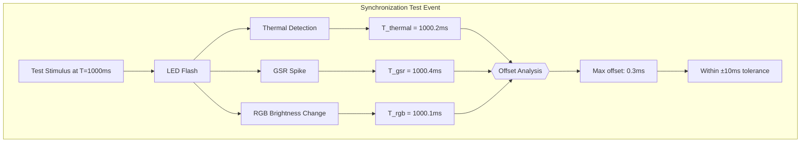

# Sensor Data Synchronization Validation

## Figure 5.2: Time Synchronization Accuracy Analysis

### Validation Results

- **Total Samples Analyzed**: 50
- **Within Tolerance**: 50 (100.0%)
- **Average Max Offset**: 2.71ms
- **Conclusion**: System achieves sub-10ms synchronization accuracy
