# System Event Timeline and Synchronization

## Figure 5.1: Multi-Sensor Recording Session Timeline

```mermaid
gantt
    title System Event Timeline - Recording Session Start
    dateFormat X
    axisFormat %L ms

    section PC Controller
    NTP Sync           :milestone, ntp, 0, 0ms
    START Command      :milestone, start, 50, 50ms
    Sync Verification  :milestone, verify, 200, 200ms

    section Android Device
    Receive Command    :active, recv, 52, 54ms
    TimeManager Init   :active, init, 54, 58ms
    Sensor Broadcast   :active, coord, 58, 65ms

    section Sensor Activation
    Thermal Start      :milestone, therm, 65, 65ms
    GSR Start          :milestone, gsr, 66, 66ms
    RGB Start          :milestone, rgb, 68, 68ms
```

### Synchronization Performance

- **Network Latency**: 2ms (PC to Android)
- **Sensor Coordination Window**: 13ms (from first to last sensor)
- **Total Start Latency**: 68ms (command to all sensors active)
- **Target Met**: All sensors started within <100ms requirement
