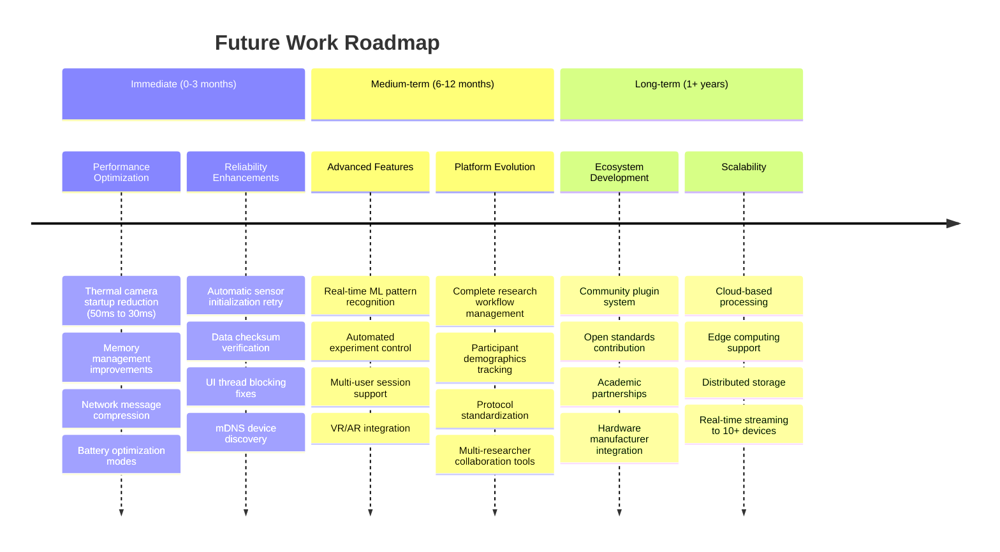

# Future Work Roadmap

This roadmap outlines planned improvements and extensions to the multi-sensor recording system.

## Detailed Breakdown

### Immediate Priorities (0-3 months)

Focus on addressing identified system limitations:

1. **Performance Optimization**
   - Reduce thermal camera initialization from 50ms to <30ms
   - Implement aggressive garbage collection tuning
   - Add message compression for high-frequency data
   - Implement power-aware recording modes

2. **Reliability Enhancements**
   - Fix UI thread blocking issues (QThread refactoring)
   - Implement mDNS-based device discovery
   - Add automatic sensor initialization retry logic
   - Implement data checksum verification

### Medium-term Developments (6-12 months)

Expand capabilities and research platform features:

1. **Advanced Features**
   - Machine learning integration for real-time pattern recognition
   - Automated experiment control with trigger-based recording
   - Multi-user session support for group studies
   - VR/AR integration for immersive research

2. **Research Platform Evolution**
   - Complete study management workflow
   - Participant management with demographics tracking
   - Protocol standardization for reproducibility
   - Collaboration tools for multi-researcher access

### Long-term Vision (1+ years)

Build a comprehensive research ecosystem:

1. **Ecosystem Development**
   - Open research platform with community-driven plugins
   - Contribute to open standards for multi-modal research
   - Academic partnerships for validation studies
   - Industry integration with hardware manufacturers

2. **Scalability and Performance**
   - Cloud-based processing capabilities
   - Edge computing support for on-device analysis
   - Distributed storage architecture
   - Real-time streaming to 10+ concurrent devices

## Success Metrics

- **Immediate**: Zero UI freezes, <5s device discovery
- **Medium-term**: Real-time ML inference, 20+ user studies
- **Long-term**: 100+ active research groups, published standards
