# Objectives Fulfillment Diagram

This diagram visualizes the four main project objectives and their fulfillment status.

```mermaid
graph TB
    subgraph "Chapter 6: Objectives vs Outcomes"
        direction TB
        
        subgraph "Objective 1: Integrated Multi-Device Platform"
            O1[Objective 1:<br/>Integrated Multi-Device Platform]
            O1_Goal["Target: Integrate Python controller,<br/>Android app, and Shimmer3 GSR+"]
            O1_Outcome["Outcome: ACHIEVED<br/>Successfully recorded synchronised<br/>1080p RGB, 256x192 thermal, 128Hz GSR<br/>from 3 devices for 12-minute session"]
            O1 --> O1_Goal
            O1_Goal --> O1_Outcome
        end
        
        subgraph "Objective 2: Sub-5ms Timing Precision"
            O2[Objective 2:<br/>Sub-5ms Timing Precision]
            O2_Goal["Target: Time synchronization<br/>accuracy within ±5ms"]
            O2_Outcome["Outcome: EXCEEDED<br/>Achieved 2.7ms median drift<br/>across 4 devices over 14 sessions<br/>Note: Wi-Fi roaming caused issues"]
            O2 --> O2_Goal
            O2_Goal --> O2_Outcome
        end
        
        subgraph "Objective 3: User-Friendly Research Tool"
            O3[Objective 3:<br/>User-Friendly Research Tool]
            O3_Goal["Target: Setup time under 5 minutes<br/>for non-technical researchers"]
            O3_Outcome["Outcome: PARTIALLY ACHIEVED<br/>Core functionality operational<br/>but new users avg 12.8 min setup<br/>UI responsiveness issues persist"]
            O3 --> O3_Goal
            O3_Goal --> O3_Outcome
        end
        
        subgraph "Objective 4: Pilot Study Validation"
            O4[Objective 4:<br/>Pilot Study Validation]
            O4_Goal["Target: 5-8 participants<br/>validating contactless GSR measurement"]
            O4_Outcome["Outcome: NOT ACHIEVED<br/>Hardware delays, UI stability issues,<br/>time constraints, ethics approval delays<br/>prevented pilot study execution"]
            O4 --> O4_Goal
            O4_Goal --> O4_Outcome
        end
    end
    
    classDef achieved fill:#90EE90,stroke:#228B22,stroke-width:3px
    classDef exceeded fill:#87CEEB,stroke:#4169E1,stroke-width:3px
    classDef partial fill:#FFD700,stroke:#FF8C00,stroke-width:3px
    classDef notmet fill:#FFB6C1,stroke:#DC143C,stroke-width:3px
    
    class O1_Outcome achieved
    class O2_Outcome exceeded
    class O3_Outcome partial
    class O4_Outcome notmet
```

## Color Legend

- **Green**: Objective Achieved
- **Blue**: Objective Exceeded
- **Gold**: Partially Achieved
- **Pink**: Not Achieved

## Summary

| Objective | Status | Key Result |
|-----------|--------|------------|
| Objective 1: Integrated Multi-Device Platform | ✅ Achieved | Successfully recorded from 3 devices simultaneously |
| Objective 2: Sub-5ms Timing Precision | ⭐ Exceeded | 2.7ms median drift (better than ±5ms target) |
| Objective 3: User-Friendly Research Tool | ⚠️ Partial | Functional but usability issues remain |
| Objective 4: Pilot Study Validation | ❌ Not Achieved | Multiple factors prevented execution |
