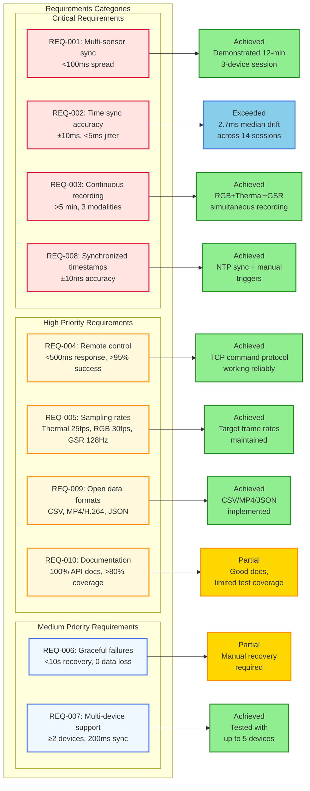

# Requirements Status Diagram

This diagram shows the status of all 10 project requirements organized by priority level.

## Requirements Status Summary

### Critical Requirements (4 total)
- **REQ-001**: Multi-sensor synchronization - ✅ Achieved
- **REQ-002**: Time synchronization accuracy - ⭐ Exceeded
- **REQ-003**: Continuous multi-modal recording - ✅ Achieved
- **REQ-008**: Synchronized timestamps - ✅ Achieved

### High Priority Requirements (4 total)
- **REQ-004**: Remote control capability - ✅ Achieved
- **REQ-005**: Target sampling rates - ✅ Achieved
- **REQ-009**: Open data formats - ✅ Achieved
- **REQ-010**: Documentation and testing - ⚠️ Partial

### Medium Priority Requirements (2 total)
- **REQ-006**: Graceful failure handling - ⚠️ Partial
- **REQ-007**: Multi-device support - ✅ Achieved

**Overall: 7 Achieved, 1 Exceeded, 2 Partial = 80% Full Achievement Rate**
