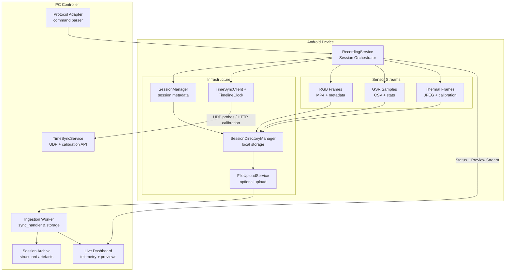

# Data Pipeline Overview

This flowchart captures the major data pathways from live sensor acquisition through storage, export, and monitoring.

```mermaid
flowchart TD
    subgraph OnDevice["Android Device"]
        Service["RecordingService\nSession Orchestrator"]

        subgraph Streams["Sensor Streams"]
            RGB["RGB Frames\nMP4 + metadata"]
            GSR["GSR Samples\nCSV + stats"]
            Thermal["Thermal Frames\nJPEG + calibration"]
        end

        subgraph Infra["Infrastructure"]
            SessionMgr["SessionManager\nsession metadata"]
            TimeSync["TimeSyncClient +\nTimelineClock"]
            Directory["SessionDirectoryManager\nlocal storage"]
            Export["FileUploadService\noptional upload"]
        end

        Service --> SessionMgr
        Service --> TimeSync
        Service --> RGB
        Service --> GSR
        Service --> Thermal
        RGB --> Directory
        GSR --> Directory
        Thermal --> Directory
        SessionMgr --> Directory
        Directory --> Export
    end

    subgraph OffDevice["PC Controller"]
        Protocol["Protocol Adapter\ncommand parser"]
        Monitor["Live Dashboard\ntelemetry + previews"]
        Ingest["Ingestion Worker\nsync_handler & storage"]
        TimeService["TimeSyncService\nUDP + calibration API"]
        Archive["Session Archive\nstructured artefacts"]
    end

    Service -->|Status + Preview Stream| Monitor
    Export --> Ingest
    Protocol --> Service
    TimeSync -->|UDP probes / HTTP calibration| TimeService
    Ingest --> Archive
    Ingest --> Monitor
```
