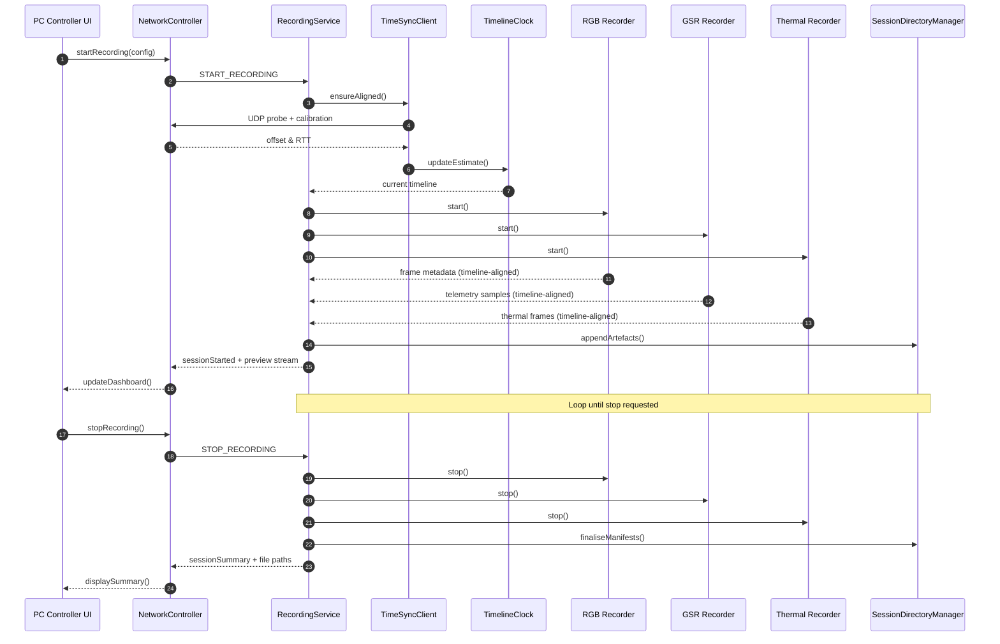

# Recording Session Sequence

The following sequence diagram illustrates how the PC controller, Android runtime, and sensor recorders coordinate a
start-to-finish capture session.

```mermaid
sequenceDiagram
    autonumber
    participant PC as PC Controller UI
    participant Net as NetworkController
    participant RS as RecordingService
    participant Sync as TimeSyncClient
    participant Clock as TimelineClock
    participant RGB as RGB Recorder
    participant GSR as GSR Recorder
    participant Thermal as Thermal Recorder
    participant Store as SessionDirectoryManager

    PC->>Net: startRecording(config)
    Net->>RS: START_RECORDING
    RS->>Sync: ensureAligned()
    Sync->>Net: UDP probe + calibration
    Net-->>Sync: offset & RTT
    Sync->>Clock: updateEstimate()
    Clock-->>RS: current timeline
    RS->>RGB: start()
    RS->>GSR: start()
    RS->>Thermal: start()
    RGB-->>RS: frame metadata (timeline-aligned)
    GSR-->>RS: telemetry samples (timeline-aligned)
    Thermal-->>RS: thermal frames (timeline-aligned)
    RS->>Store: appendArtefacts()
    RS-->>Net: sessionStarted + preview stream
    Net-->>PC: updateDashboard()
    Note over RS,Store: Loop until stop requested
    PC->>Net: stopRecording()
    Net->>RS: STOP_RECORDING
    RS->>RGB: stop()
    RS->>GSR: stop()
    RS->>Thermal: stop()
    RS->>Store: finaliseManifests()
    RS-->>Net: sessionSummary + file paths
    Net-->>PC: displaySummary()
```
