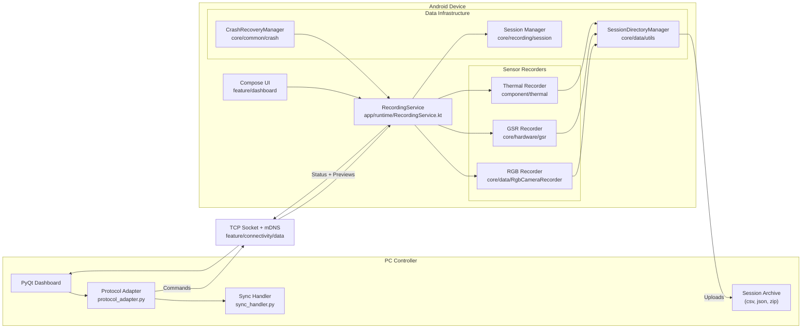

# System Architecture Diagram

This diagram highlights how the MPDC4GSR Android capture device, its supporting services, and the desktop PC controller
collaborate during a recording session.

```mermaid
flowchart LR
    subgraph PC["PC Controller"]
        UI["PyQt Dashboard"]
        Adapter["Protocol Adapter\nprotocol_adapter.py"]
        Sync["Sync Handler\nsync_handler.py"]
        Archive["Session Archive\n(csv, json, zip)"]

        UI --> Adapter
        Adapter --> Sync
    end

    subgraph Android["Android Device"]
        App["Compose UI\nfeature/dashboard"]
        Service["RecordingService\napp/runtime/RecordingService.kt"]

        subgraph Sensors["Sensor Recorders"]
            RGB["RGB Recorder\ncore/data/RgbCameraRecorder"]
            GSR["GSR Recorder\ncore/hardware/gsr"]
            Thermal["Thermal Recorder\ncomponent/thermal"]
        end

        subgraph Infra["Data Infrastructure"]
            SessionMgr["Session Manager\ncore/recording/session"]
            Directory["SessionDirectoryManager\ncore/data/utils"]
            CrashRecovery["CrashRecoveryManager\ncore/common/crash"]
        end

        App --> Service
        Service --> SessionMgr
        Service --> RGB
        Service --> GSR
        Service --> Thermal
        RGB --> Directory
        GSR --> Directory
        Thermal --> Directory
        CrashRecovery --> Service
    end

    Network["TCP Socket + mDNS\nfeature/connectivity/data"]
    Adapter -->|Commands| Network
    Network --> Service
    Service -->|Status + Previews| Network
    Network --> UI
    Directory -->|Uploads| Archive
```
