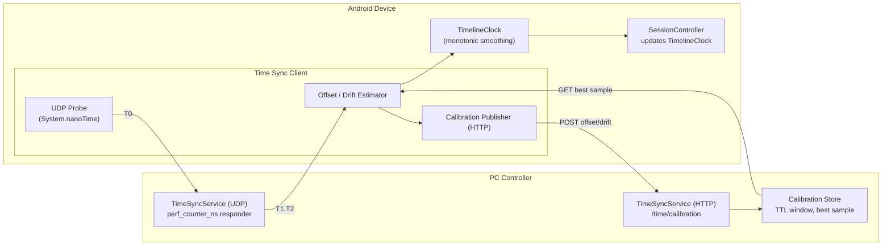

# Time Synchronisation Components

```mermaid
flowchart LR
    subgraph Android["Android Device"]
        subgraph Client["Time Sync Client"]
            UDPReq["UDP Probe\n(System.nanoTime)"]
            Estimator["Offset / Drift Estimator"]
            Poster["Calibration Publisher (HTTP)"]
        end
        Timeline["TimelineClock\n(monotonic smoothing)"]
        Session["SessionController\nupdates TimelineClock"]
    end

    subgraph PC["PC Controller"]
        UDPService["TimeSyncService (UDP)\nperf_counter_ns responder"]
        HttpService["TimeSyncService (HTTP)\n/time/calibration"]
        Store["Calibration Store\nTTL window, best sample"]
    end

    UDPReq -->|T0| UDPService
    UDPService -->|T1,T2| Estimator
    Estimator --> Timeline
    Timeline --> Session
    Estimator --> Poster
    Poster -->|POST offset/drift| HttpService
    HttpService --> Store
    Store -->|GET best sample| Estimator
```
