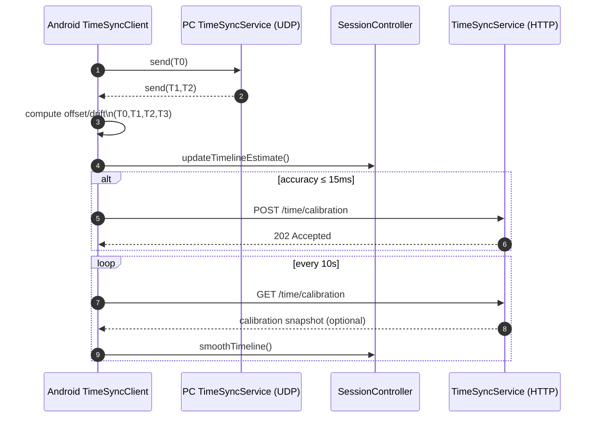

# Time Synchronisation Sequence

```mermaid
sequenceDiagram
    autonumber
    participant Client as Android TimeSyncClient
    participant UDP as PC TimeSyncService (UDP)
    participant Session as SessionController
    participant HTTP as TimeSyncService (HTTP)

    Client->>UDP: send(T0)
    UDP-->>Client: send(T1,T2)
    Client->>Client: compute offset/drift\n(T0,T1,T2,T3)
    Client->>Session: updateTimelineEstimate()
    alt accuracy ≤ 15ms
        Client->>HTTP: POST /time/calibration
        HTTP-->>Client: 202 Accepted
    end
    loop every 10s
        Client->>HTTP: GET /time/calibration
        HTTP-->>Client: calibration snapshot (optional)
        Client->>Session: smoothTimeline()
    end
```
