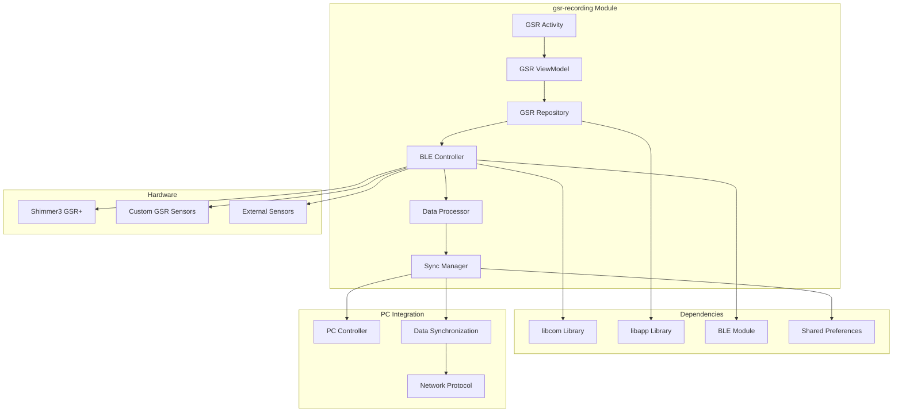

# GSR Recording Module Documentation

## Overview

The `gsr-recording` module provides comprehensive Galvanic Skin Response (GSR) data collection
capabilities using Shimmer3 sensors. It handles Bluetooth Low Energy (BLE) communication, real-time
data processing, and synchronization with thermal imaging data.

## Architecture



## Key Components

### GSRActivity

**Purpose**: User interface for GSR sensor management and monitoring
**Responsibilities**:

- Device discovery and pairing interface
- Real-time GSR data visualization
- Recording session controls
- Data export functionality

```kotlin
class GSRActivity : AppCompatActivity() {
    private lateinit var gsrViewModel: GSRViewModel
    private lateinit var bleController: BLEController
    private lateinit var gsrChart: LineChart
    
    override fun onCreate(savedInstanceState: Bundle?) {
        super.onCreate(savedInstanceState)
        initializeGSRMonitoring()
        setupDataVisualization()
        startDeviceDiscovery()
    }
    
    private fun setupDataVisualization() {
        gsrChart.apply {
            setDrawGridBackground(true)
            setGridBackgroundColor(Color.LTGRAY)
            description.isEnabled = false
            setTouchEnabled(true)
            isDragEnabled = true)
            setScaleEnabled(true)
        }
    }
}
```

### GSRViewModel

**Purpose**: Business logic coordinator for GSR data management
**Responsibilities**:

- GSR device state management
- Data collection orchestration
- Real-time data streaming
- Recording session coordination

**Key Features**:

- LiveData streams for real-time GSR values
- Coroutine-based BLE operations
- Data validation and filtering
- Session metadata management

### BLEController

**Purpose**: Bluetooth Low Energy communication manager
**Responsibilities**:

- BLE device discovery and connection
- Shimmer3 protocol implementation
- Data packet parsing and validation
- Connection stability management

**Supported Protocols**:

- **Shimmer3 GSR+**: Primary GSR sensor with advanced features
- **Custom GSR**: Support for custom GSR sensor implementations
- **Multi-device**: Simultaneous connection to multiple GSR sensors

### DataProcessor

**Purpose**: Real-time GSR data processing and analysis
**Responsibilities**:

- Raw GSR data conversion
- Signal filtering and noise reduction
- Physiological metric calculation
- Data quality assessment

**Processing Pipeline**:

1. Raw ADC value reception from Shimmer3
2. Resistance calculation using device-specific calibration
3. Conductance conversion (microsiemens)
4. Signal filtering and artifact removal
5. Physiological feature extraction

### SyncManager

**Purpose**: Data synchronization with thermal imaging and PC controller
**Responsibilities**:

- Timestamp synchronization
- Data alignment across sensors
- PC controller communication
- Session coordination

## Configuration

### GSR Sensor Settings

```kotlin
data class GSRSensorConfig(
    val deviceAddress: String,
    val samplingRate: Int, // Hz
    val gainSetting: GSRGain,
    val calibrationMode: CalibrationMode,
    val filterEnabled: Boolean,
    val autoConnect: Boolean
)

enum class GSRGain {
    GAIN_1(1), GAIN_2(2), GAIN_3(3), GAIN_4(4);
    val value: Int
}
```

### Processing Parameters

```kotlin
data class GSRProcessingConfig(
    val filterCutoffFrequency: Double = 0.5, // Hz
    val filterOrder: Int = 4,
    val noiseThreshold: Double = 0.1, // microsiemens
    val artifactDetectionEnabled: Boolean = true,
    val baselineCorrection: Boolean = true,
    val outputUnit: GSRUnit = GSRUnit.MICROSIEMENS
)

enum class GSRUnit {
    MICROSIEMENS, KILOOHMS, RAW_ADC
}
```

## API Reference

### Core Methods

#### Device Management

```kotlin

suspend fun discoverGSRDevices(): List<GSRDevice>

suspend fun connectToDevice(deviceAddress: String): Result<Unit>

suspend fun disconnectDevice(): Result<Unit>

fun getConnectionStatus(): ConnectionStatus
```

#### Data Collection

```kotlin

suspend fun startGSRRecording(config: GSRSensorConfig): Result<Unit>

suspend fun stopGSRRecording(): Result<Unit>

fun getGSRDataStream(): Flow<GSRDataPoint>

suspend fun configureSensor(config: GSRSensorConfig): Result<Unit>
```

#### Data Processing

```kotlin

fun processGSRData(
    rawData: ByteArray,
    config: GSRProcessingConfig
): ProcessedGSRData

fun calculatePhysiologicalMetrics(
    gsrData: List<GSRDataPoint>,
    timeWindow: Duration
): PhysiologicalMetrics

fun detectGSREvents(
    gsrData: List<GSRDataPoint>,
    threshold: Double
): List<GSREvent>
```

#### Synchronization

```kotlin

suspend fun synchronizeWithThermal(thermalSession: ThermalSession): Result<Unit>

suspend fun sendToPCController(data: GSRDataBatch): Result<Unit>

fun alignTimestamps(
    gsrData: List<GSRDataPoint>,
    referenceTimestamp: Long
): List<GSRDataPoint>
```

## Data Structures

### GSRDataPoint

```kotlin
data class GSRDataPoint(
    val timestamp: Long, // Nanosecond precision
    val rawADC: Int, // 12-bit ADC value (0-4095)
    val resistance: Double, // Kiloohms
    val conductance: Double, // Microsiemens
    val deviceInfo: DeviceInfo,
    val qualityFlag: DataQuality
)

enum class DataQuality {
    EXCELLENT, GOOD, FAIR, POOR, INVALID
}
```

### ProcessedGSRData

```kotlin
data class ProcessedGSRData(
    val originalData: GSRDataPoint,
    val filteredConductance: Double,
    val baselineCorrected: Double,
    val artifactFlag: Boolean,
    val processingMetadata: ProcessingMetadata
)
```

### PhysiologicalMetrics

```kotlin
data class PhysiologicalMetrics(
    val meanGSR: Double,
    val gsrVariability: Double,
    val peakCount: Int,
    val responseAmplitude: Double,
    val responseLatency: Duration,
    val tonicLevel: Double,
    val phasicActivity: Double
)
```

### GSREvent

```kotlin
data class GSREvent(
    val timestamp: Long,
    val eventType: GSREventType,
    val amplitude: Double,
    val duration: Duration,
    val peakTime: Long,
    val confidence: Float
)

enum class GSREventType {
    ONSET, PEAK, OFFSET, ARTIFACT
}
```

## Performance Characteristics

### Data Collection Performance

- **Sampling Rate**: Up to 128 Hz continuous sampling
- **Data Transmission**: BLE with 20ms interval
- **Processing Latency**: < 10ms per data point
- **Memory Usage**: ~5MB per hour of continuous recording

### BLE Connection Characteristics

- **Connection Range**: Up to 10 meters typical
- **Connection Stability**: Auto-reconnection on signal loss
- **Battery Life**: 8+ hours continuous operation
- **Multi-device Support**: Up to 4 simultaneous GSR sensors

## Integration Examples

### Basic GSR Recording

```kotlin
class GSRRecordingExample {
    private val gsrController = GSRController()
    
    suspend fun startBasicRecording() {

        val config = GSRSensorConfig(
            deviceAddress = "00:11:22:33:44:55",
            samplingRate = 64, // Hz
            gainSetting = GSRGain.GAIN_3,
            calibrationMode = CalibrationMode.AUTOMATIC,
            filterEnabled = true,
            autoConnect = true
        )

        val connectResult = gsrController.connectToDevice(config.deviceAddress)
        if (connectResult.isFailure) {
            handleConnectionError(connectResult.exceptionOrNull())
            return
        }

        gsrController.startGSRRecording(config)

        gsrController.getGSRDataStream().collect { dataPoint ->

            val processedData = processGSRData(dataPoint)

            updateGSRDisplay(processedData.filteredConductance)

            if (isSignificantResponse(processedData)) {
                logGSREvent(dataPoint.timestamp, processedData.filteredConductance)
            }
        }
    }
    
    private fun isSignificantResponse(data: ProcessedGSRData): Boolean {
        return data.filteredConductance > baselineGSR * 1.1 // 10% increase
    }
}
```

### Advanced Physiological Analysis

```kotlin
class AdvancedGSRAnalysis {
    fun performPhysiologicalAnalysis(gsrData: List<GSRDataPoint>) {

        val timeWindow = Duration.ofSeconds(60)
        val metrics = calculatePhysiologicalMetrics(gsrData, timeWindow)

        val events = detectGSREvents(gsrData, threshold = 0.05) // 0.05 μS threshold

        val responseAnalysis = analyzeResponsePatterns(events)

        val report = PhysiologicalReport(
            sessionId = getCurrentSessionId(),
            participantId = getCurrentParticipantId(),
            metrics = metrics,
            events = events,
            analysis = responseAnalysis,
            timestamp = System.currentTimeMillis()
        )

        exportPhysiologicalReport(report)
    }
    
    private fun analyzeResponsePatterns(events: List<GSREvent>): ResponseAnalysis {
        val onsetEvents = events.filter { it.eventType == GSREventType.ONSET }
        val peakEvents = events.filter { it.eventType == GSREventType.PEAK }
        
        return ResponseAnalysis(
            responseFrequency = onsetEvents.size.toDouble() / totalDuration.toMinutes(),
            averageAmplitude = peakEvents.map { it.amplitude }.average(),
            averageLatency = calculateAverageLatency(onsetEvents, peakEvents),
            responseConsistency = calculateResponseConsistency(events)
        )
    }
}
```

### Synchronized Multi-Modal Recording

```kotlin
class SynchronizedRecording {
    private val gsrController = GSRController()
    private val thermalController = ThermalController()
    private val syncManager = SynchronizationManager()
    
    suspend fun startSynchronizedRecording() {

        syncManager.initializeSession()

        val gsrConfig = GSRSensorConfig(
            deviceAddress = "00:11:22:33:44:55",
            samplingRate = 64,
            gainSetting = GSRGain.GAIN_3,
            calibrationMode = CalibrationMode.AUTOMATIC,
            filterEnabled = true,
            autoConnect = true
        )
        gsrController.startGSRRecording(gsrConfig)

        val thermalConfig = ThermalCameraConfig(
            deviceType = ThermalDeviceType.TC001,
            resolution = Resolution(320, 240),
            frameRate = 9,
            temperatureRange = TemperatureRange(-20f, 400f),
            calibrationMode = CalibrationMode.AUTOMATIC,
            pseudoColorPalette = ColorPalette.IRON
        )
        thermalController.startCapture(thermalConfig)

        combine(
            gsrController.getGSRDataStream(),
            thermalController.thermalFrames
        ) { gsrData, thermalFrame ->
            SynchronizedDataPoint(
                gsrData = gsrData,
                thermalFrame = thermalFrame,
                synchronizedTimestamp = syncManager.synchronizeTimestamp()
            )
        }.collect { synchronizedData ->

            processSynchronizedData(synchronizedData)

            sendToPCController(synchronizedData)
        }
    }
}
```

## Error Handling

### Common Error Types

```kotlin
sealed class GSRError : Exception() {
    object DeviceNotFound : GSRError()
    object ConnectionFailed : GSRError()
    object DataTransmissionError : GSRError()
    object CalibrationError : GSRError()
    object SensorMalfunction : GSRError()
    data class BLEProtocolError(val errorCode: Int) : GSRError()
    data class DataQualityError(val qualityIssue: String) : GSRError()
}
```

### Error Recovery Strategies

```kotlin
class GSRErrorHandler {
    suspend fun handleGSRError(error: GSRError): ErrorRecoveryAction {
        return when (error) {
            is GSRError.DeviceNotFound -> {

                restartDeviceDiscovery()
                ErrorRecoveryAction.RETRY_DISCOVERY
            }
            is GSRError.ConnectionFailed -> {

                attemptReconnection()
                ErrorRecoveryAction.RETRY_CONNECTION
            }
            is GSRError.DataTransmissionError -> {

                checkBLEConnectionQuality()
                ErrorRecoveryAction.RETRY_TRANSMISSION
            }
            is GSRError.CalibrationError -> {

                recalibrateSensor()
                ErrorRecoveryAction.RECALIBRATE
            }
            is GSRError.SensorMalfunction -> {

                notifySensorMalfunction()
                ErrorRecoveryAction.REQUIRES_INTERVENTION
            }
            else -> ErrorRecoveryAction.FAIL
        }
    }
}
```

## Data Quality Assessment

### Quality Metrics

```kotlin
data class DataQualityMetrics(
    val signalToNoiseRatio: Double,
    val connectionStability: Double, // Percentage
    val dataCompleteness: Double, // Percentage
    val calibrationAccuracy: Double,
    val artifactLevel: Double
)

class DataQualityAssessor {
    fun assessDataQuality(gsrData: List<GSRDataPoint>): DataQualityMetrics {
        return DataQualityMetrics(
            signalToNoiseRatio = calculateSNR(gsrData),
            connectionStability = calculateConnectionStability(gsrData),
            dataCompleteness = calculateDataCompleteness(gsrData),
            calibrationAccuracy = assessCalibrationAccuracy(gsrData),
            artifactLevel = calculateArtifactLevel(gsrData)
        )
    }
    
    fun isDataQualityAcceptable(metrics: DataQualityMetrics): Boolean {
        return metrics.signalToNoiseRatio > 10.0 &&
               metrics.connectionStability > 0.95 &&
               metrics.dataCompleteness > 0.90 &&
               metrics.calibrationAccuracy > 0.95 &&
               metrics.artifactLevel < 0.1
    }
}
```

## Testing

### Unit Tests

```kotlin
class GSRProcessorTest {
    @Test
    fun `process GSR data should convert ADC to conductance correctly`() {
        val rawData = byteArrayOf(0x12, 0x34) // Mock 12-bit ADC value
        val config = GSRProcessingConfig.default()
        
        val result = gsrProcessor.processGSRData(rawData, config)
        
        assert(result.conductance > 0.0)
        assert(result.resistance > 0.0)
        assert(result.qualityFlag != DataQuality.INVALID)
    }
    
    @Test
    fun `detect GSR events should identify significant responses`() {
        val gsrData = createMockGSRDataWithResponse()
        val events = gsrEventDetector.detectGSREvents(gsrData, threshold = 0.05)
        
        assert(events.isNotEmpty())
        assert(events.any { it.eventType == GSREventType.ONSET })
        assert(events.any { it.eventType == GSREventType.PEAK })
    }
    
    @Test
    fun `physiological metrics should calculate correctly`() {
        val gsrData = createStableGSRData()
        val timeWindow = Duration.ofMinutes(1)
        
        val metrics = physiologicalAnalyzer.calculatePhysiologicalMetrics(gsrData, timeWindow)
        
        assert(metrics.meanGSR > 0.0)
        assert(metrics.gsrVariability >= 0.0)
        assert(metrics.tonicLevel > 0.0)
    }
}
```

### Integration Tests

```kotlin
class GSRIntegrationTest {
    @Test
    fun `end to end GSR recording workflow`() = runTest {
        val gsrController = GSRController()

        val devices = gsrController.discoverGSRDevices()
        assert(devices.isNotEmpty())

        val connectResult = gsrController.connectToDevice(devices.first().address)
        assert(connectResult.isSuccess)

        val recordingResult = gsrController.startGSRRecording(defaultConfig)
        assert(recordingResult.isSuccess)

        val gsrData = mutableListOf<GSRDataPoint>()
        val job = launch {
            gsrController.getGSRDataStream().take(100).collect { dataPoint ->
                gsrData.add(dataPoint)
            }
        }
        
        job.join()
        assert(gsrData.size == 100)

        gsrController.stopGSRRecording()

        val qualityMetrics = dataQualityAssessor.assessDataQuality(gsrData)
        assert(dataQualityAssessor.isDataQualityAcceptable(qualityMetrics))
    }
}
```

## Troubleshooting

### Common Issues

#### BLE Connection Problems

**Symptoms**: Device not found, connection drops, data transmission errors
**Causes**:

- Bluetooth disabled or interference
- Device out of range
- Low battery on sensor
- Android BLE stack issues
  **Solutions**:
- Check Bluetooth permissions and enable Bluetooth
- Move device closer to sensor
- Check sensor battery level
- Restart Bluetooth stack or reboot device

#### Poor Data Quality

**Symptoms**: Noisy GSR signals, inconsistent readings, frequent artifacts
**Causes**:

- Poor skin contact
- Electrode drying out
- Motion artifacts
- Electrical interference
  **Solutions**:
- Ensure proper electrode placement and contact
- Use appropriate electrode gel
- Minimize movement during recording
- Check for electrical interference sources

#### Synchronization Issues

**Symptoms**: GSR data not aligned with thermal data, timestamp drift
**Causes**:

- Clock synchronization problems
- Network latency
- Processing delays
  **Solutions**:
- Verify time synchronization with PC controller
- Check network connection quality
- Adjust buffer sizes for real-time processing

### Debug Information

Enable comprehensive debugging:

```kotlin
GSRLogger.setLogLevel(LogLevel.VERBOSE)
GSRLogger.enableBLELogging(true)
GSRLogger.enableDataQualityLogging(true)
GSRLogger.enablePerformanceMetrics(true)
```

## Dependencies

### Required Libraries

- `libcom` - Communication and networking protocols
- `libapp` - Application framework and utilities
- `BleModule` - Bluetooth Low Energy communication
- `SharedPreferences` - Configuration persistence

### Gradle Configuration

```kotlin
dependencies {
    implementation project(':libcom')
    implementation project(':libapp')
    implementation project(':BleModule')
    implementation 'androidx.lifecycle:lifecycle-viewmodel-ktx:2.6.0'
    implementation 'androidx.lifecycle:lifecycle-livedata-ktx:2.6.0'
    implementation 'org.jetbrains.kotlinx:kotlinx-coroutines-android:1.6.4'
}
```

## Future Enhancements

### Planned Features

- **Multi-sensor fusion**: Combine multiple GSR sensors for improved accuracy
- **Machine learning**: AI-powered artifact detection and signal enhancement
- **Advanced filtering**: Adaptive filtering algorithms for better signal quality
- **Cloud integration**: Real-time GSR data streaming to cloud analytics
- **Wearable support**: Integration with smartwatch GSR sensors

### Performance Improvements

- **Optimized BLE protocol**: Enhanced data transmission efficiency
- **Real-time processing**: Hardware-accelerated signal processing
- **Battery optimization**: Improved power management for longer recording sessions
- **Memory efficiency**: Reduced memory footprint for continuous recording

---

For more detailed information, see the [BLE Integration Guide](../BLE_INTEGRATION.md)
and [Physiological Data Analysis](../PHYSIOLOGICAL_ANALYSIS.md).
