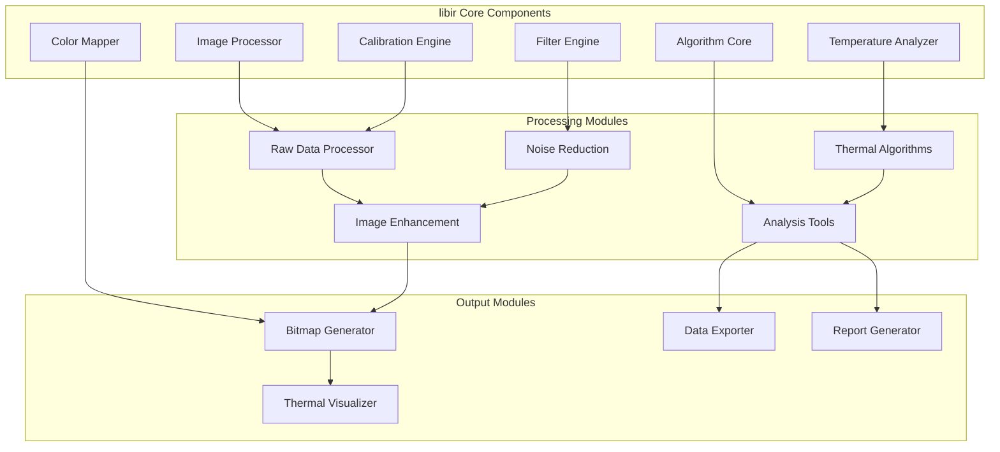

# LibIR - Thermal Image Processing Library Documentation

## Overview

The `libir` library is the core thermal image processing engine of the IRCamera platform. It
provides comprehensive algorithms for thermal data processing, temperature analysis, pseudo-color
mapping, and advanced thermal imaging features.

## Architecture



## Core Components

### ImageProcessor

**Purpose**: Primary thermal image processing coordination
**Responsibilities**:

- Raw thermal data ingestion
- Processing pipeline coordination
- Output format management
- Performance optimization

```kotlin
class ImageProcessor {
    suspend fun processFrame(
        rawData: ByteArray,
        config: ProcessingConfig
    ): ProcessedFrame {
        val calibratedData = calibrationEngine.calibrate(rawData, config.calibration)
        val filteredData = filterEngine.apply(calibratedData, config.filtering)
        val enhancedData = enhancement.enhance(filteredData, config.enhancement)
        
        return ProcessedFrame(
            originalData = rawData,
            processedData = enhancedData,
            metadata = generateMetadata(config)
        )
    }
}
```

### TemperatureAnalyzer

**Purpose**: Advanced temperature measurement and analysis
**Responsibilities**:

- Temperature extraction from thermal data
- Statistical analysis of thermal regions
- Hot/cold spot detection
- Temperature trend analysis

**Key Features**:

- Multi-point temperature measurement
- Region-based analysis
- Temperature distribution calculation
- Thermal pattern recognition

### ColorMapper

**Purpose**: Pseudo-color mapping and thermal visualization
**Responsibilities**:

- False color palette application
- Dynamic range adjustment
- Histogram equalization
- Custom color scheme support

**Supported Palettes**:

- **Iron**: Classic thermal imaging palette
- **Rainbow**: Full spectrum color mapping
- **Grayscale**: Monochrome thermal representation
- **Custom**: User-defined color schemes

### CalibrationEngine

**Purpose**: Device-specific thermal calibration
**Responsibilities**:

- Factory calibration data application
- Environmental compensation
- Linearity correction
- Temperature accuracy optimization

### FilterEngine

**Purpose**: Signal processing and noise reduction
**Responsibilities**:

- Temporal filtering for noise reduction
- Spatial filtering for image enhancement
- Adaptive filtering based on signal characteristics
- Artifact removal

## API Reference

### Core Processing Methods

#### Frame Processing

```kotlin

suspend fun processFrame(
    rawData: ByteArray,
    width: Int,
    height: Int,
    config: ProcessingConfig
): ProcessedFrame

suspend fun processSequence(
    frames: List<RawFrame>,
    config: SequenceProcessingConfig
): ProcessedSequence

fun createRealtimeProcessor(
    config: RealtimeConfig
): RealtimeProcessor
```

#### Temperature Analysis

```kotlin

fun extractTemperature(
    rawData: ByteArray,
    x: Int, y: Int,
    calibration: CalibrationData
): Float

fun analyzeRegion(
    thermalData: FloatArray,
    region: Rectangle,
    analysisType: AnalysisType
): RegionAnalysis

fun calculateStatistics(
    thermalData: FloatArray
): TemperatureStatistics

fun detectFeatures(
    thermalData: FloatArray,
    detectionConfig: FeatureDetectionConfig
): List<ThermalFeature>
```

#### Color Mapping

```kotlin

fun applyColorPalette(
    temperatureData: FloatArray,
    palette: ColorPalette,
    range: TemperatureRange
): IntArray

fun generateColorBitmap(
    temperatureData: FloatArray,
    width: Int, height: Int,
    palette: ColorPalette
): Bitmap

fun createCustomPalette(
    colorPoints: List<ColorPoint>
): ColorPalette

fun adjustDynamicRange(
    temperatureData: FloatArray,
    adjustment: DynamicRangeAdjustment
): FloatArray
```

#### Calibration

```kotlin

fun applyFactoryCalibration(
    rawData: ByteArray,
    calibrationData: FactoryCalibration
): FloatArray

fun performEnvironmentalCalibration(
    thermalData: FloatArray,
    environment: EnvironmentalParameters
): FloatArray

fun calculateCalibrationCorrection(
    referenceTemperature: Float,
    measuredTemperature: Float
): CalibrationCorrection

fun validateCalibration(
    testData: List<CalibrationTestPoint>
): CalibrationValidationResult
```

#### Filtering and Enhancement

```kotlin

fun applyTemporalFilter(
    frameSequence: List<FloatArray>,
    filterConfig: TemporalFilterConfig
): List<FloatArray>

fun applySpatialFilter(
    thermalData: FloatArray,
    width: Int, height: Int,
    filter: SpatialFilter
): FloatArray

fun enhanceImage(
    thermalData: FloatArray,
    enhancement: EnhancementConfig
): FloatArray

fun removeArtifacts(
    thermalData: FloatArray,
    artifactConfig: ArtifactRemovalConfig
): FloatArray
```

## Data Structures

### ProcessedFrame

```kotlin
data class ProcessedFrame(
    val timestamp: Long,
    val width: Int,
    val height: Int,
    val originalData: ByteArray,
    val temperatureData: FloatArray,
    val colorMappedData: IntArray,
    val processingMetadata: ProcessingMetadata,
    val calibrationApplied: CalibrationData,
    val qualityMetrics: QualityMetrics
)
```

### TemperatureStatistics

```kotlin
data class TemperatureStatistics(
    val minTemperature: Float,
    val maxTemperature: Float,
    val meanTemperature: Float,
    val medianTemperature: Float,
    val standardDeviation: Float,
    val temperatureRange: Float,
    val histogram: IntArray,
    val percentiles: Map<Int, Float>
)
```

### RegionAnalysis

```kotlin
data class RegionAnalysis(
    val region: Rectangle,
    val statistics: TemperatureStatistics,
    val hotSpots: List<Point>,
    val coldSpots: List<Point>,
    val temperatureGradient: GradientAnalysis,
    val uniformityIndex: Float,
    val thermalPatterns: List<ThermalPattern>
)
```

### ProcessingConfig

```kotlin
data class ProcessingConfig(
    val calibration: CalibrationConfig,
    val filtering: FilterConfig,
    val enhancement: EnhancementConfig,
    val colorMapping: ColorMappingConfig,
    val analysis: AnalysisConfig,
    val performance: PerformanceConfig
)

data class CalibrationConfig(
    val factoryCalibration: FactoryCalibration,
    val environmentalCompensation: EnvironmentalParameters,
    val linearityCorrection: Boolean,
    val offsetCorrection: Float
)

data class FilterConfig(
    val temporalFilter: TemporalFilterConfig?,
    val spatialFilter: SpatialFilterConfig?,
    val noiseReduction: NoiseReductionConfig,
    val artifactRemoval: ArtifactRemovalConfig
)
```

### ThermalFeature

```kotlin
data class ThermalFeature(
    val type: FeatureType,
    val location: Point,
    val bounds: Rectangle,
    val temperature: Float,
    val confidence: Float,
    val properties: Map<String, Any>
)

enum class FeatureType {
    HOT_SPOT, COLD_SPOT, THERMAL_BRIDGE, 
    TEMPERATURE_GRADIENT, UNIFORM_REGION,
    THERMAL_ANOMALY, REFLECTIVE_SURFACE
}
```

## Algorithm Implementations

### Temperature Extraction Algorithm

```kotlin
class TemperatureExtractor {
    fun extractTemperature(
        rawValue: Int,
        calibration: CalibrationData,
        environment: EnvironmentalParameters
    ): Float {

        val calibratedValue = applyFactoryCalibration(rawValue, calibration)

        val compensatedValue = applyEnvironmentalCompensation(
            calibratedValue, environment
        )

        val linearCorrectedValue = applyLinearityCorrection(
            compensatedValue, calibration.linearityCoefficients
        )

        return calculateTemperature(linearCorrectedValue, calibration.temperatureCoefficients)
    }
    
    private fun calculateTemperature(
        value: Float,
        coefficients: TemperatureCoefficients
    ): Float {
        return coefficients.a * value * value + 
               coefficients.b * value + 
               coefficients.c
    }
}
```

### Adaptive Noise Filter

```kotlin
class AdaptiveNoiseFilter {
    fun applyFilter(
        thermalData: FloatArray,
        width: Int, height: Int,
        config: NoiseFilterConfig
    ): FloatArray {
        val filteredData = FloatArray(thermalData.size)
        
        for (y in 1 until height - 1) {
            for (x in 1 until width - 1) {
                val index = y * width + x

                val localVariance = calculateLocalVariance(thermalData, x, y, width)

                val filterStrength = determineFilterStrength(localVariance, config)

                filteredData[index] = when {
                    filterStrength > 0.8 -> applyStrongFilter(thermalData, x, y, width)
                    filterStrength > 0.4 -> applyMediumFilter(thermalData, x, y, width)
                    else -> applyLightFilter(thermalData, x, y, width)
                }
            }
        }
        
        return filteredData
    }
}
```

### Thermal Pattern Recognition

```kotlin
class ThermalPatternRecognizer {
    fun recognizePatterns(
        thermalData: FloatArray,
        width: Int, height: Int
    ): List<ThermalPattern> {
        val patterns = mutableListOf<ThermalPattern>()

        patterns.addAll(detectTemperatureGradients(thermalData, width, height))

        patterns.addAll(detectUniformRegions(thermalData, width, height))

        patterns.addAll(detectThermalBridges(thermalData, width, height))

        patterns.addAll(detectReflectiveSurfaces(thermalData, width, height))
        
        return patterns
    }
    
    private fun detectTemperatureGradients(
        thermalData: FloatArray,
        width: Int, height: Int
    ): List<ThermalPattern> {
        val gradients = mutableListOf<ThermalPattern>()

        val gradientMagnitude = applySobelOperator(thermalData, width, height)

        for (y in 1 until height - 1) {
            for (x in 1 until width - 1) {
                val index = y * width + x
                if (gradientMagnitude[index] > GRADIENT_THRESHOLD) {
                    gradients.add(createGradientPattern(x, y, gradientMagnitude[index]))
                }
            }
        }
        
        return gradients
    }
}
```

## Performance Optimization

### Multi-threading Support

```kotlin
class ParallelThermalProcessor {
    private val processingExecutor = Executors.newFixedThreadPool(
        Runtime.getRuntime().availableProcessors()
    )
    
    suspend fun processFrameParallel(
        thermalData: FloatArray,
        width: Int, height: Int,
        config: ProcessingConfig
    ): ProcessedFrame = withContext(Dispatchers.Default) {
        val chunkSize = height / Runtime.getRuntime().availableProcessors()
        
        val processedChunks = (0 until height step chunkSize).map { startY ->
            async {
                val endY = minOf(startY + chunkSize, height)
                processChunk(thermalData, width, startY, endY, config)
            }
        }.awaitAll()
        
        combineProcessedChunks(processedChunks, width, height)
    }
}
```

### Memory Optimization

```kotlin
class MemoryEfficientProcessor {
    private val bufferPool = ArrayPool<FloatArray>()
    
    fun processWithMemoryReuse(
        thermalData: FloatArray,
        config: ProcessingConfig
    ): ProcessedFrame {
        val workBuffer = bufferPool.acquire(thermalData.size)
        try {

            System.arraycopy(thermalData, 0, workBuffer, 0, thermalData.size)

            applyFilteringInPlace(workBuffer, config.filtering)
            applyEnhancementInPlace(workBuffer, config.enhancement)

            return createProcessedFrame(workBuffer, config)
        } finally {
            bufferPool.release(workBuffer)
        }
    }
}
```

## Integration Examples

### Basic Thermal Processing

```kotlin
class BasicThermalProcessing {
    private val imageProcessor = ImageProcessor()
    
    suspend fun processBasicThermalFrame(rawData: ByteArray): Bitmap {
        val config = ProcessingConfig(
            calibration = CalibrationConfig.factory(),
            filtering = FilterConfig.standard(),
            enhancement = EnhancementConfig.basic(),
            colorMapping = ColorMappingConfig.iron(),
            analysis = AnalysisConfig.disabled(),
            performance = PerformanceConfig.balanced()
        )
        
        val processedFrame = imageProcessor.processFrame(rawData, 320, 240, config)
        
        return generateColorBitmap(
            processedFrame.temperatureData,
            320, 240,
            ColorPalette.IRON
        )
    }
}
```

### Advanced Thermal Analysis

```kotlin
class AdvancedThermalAnalysis {
    private val temperatureAnalyzer = TemperatureAnalyzer()
    private val patternRecognizer = ThermalPatternRecognizer()
    
    fun performAdvancedAnalysis(
        thermalData: FloatArray,
        width: Int, height: Int
    ): ThermalAnalysisReport {

        val statistics = temperatureAnalyzer.calculateStatistics(thermalData)

        val regions = listOf(
            Rectangle(50, 50, 100, 100),   // Center region
            Rectangle(0, 0, 100, 100),     // Top-left
            Rectangle(220, 140, 100, 100)  // Bottom-right
        )
        
        val regionAnalyses = regions.map { region ->
            temperatureAnalyzer.analyzeRegion(thermalData, region, AnalysisType.COMPREHENSIVE)
        }

        val patterns = patternRecognizer.recognizePatterns(thermalData, width, height)

        val anomalies = detectThermalAnomalies(thermalData, width, height)
        
        return ThermalAnalysisReport(
            globalStatistics = statistics,
            regionAnalyses = regionAnalyses,
            thermalPatterns = patterns,
            anomalies = anomalies,
            analysisTimestamp = System.currentTimeMillis()
        )
    }
}
```

### Real-time Processing Pipeline

```kotlin
class RealtimeThermalPipeline {
    private val realtimeProcessor = createRealtimeProcessor(
        RealtimeConfig(
            targetFrameRate = 9.0, // Hz
            maxProcessingLatency = Duration.ofMillis(50),
            qualityVsSpeed = QualitySpeedBalance.BALANCED,
            enablePredictiveFiltering = true
        )
    )
    
    fun processRealtimeStream(thermalFrameStream: Flow<ByteArray>): Flow<ProcessedFrame> {
        return thermalFrameStream
            .buffer(capacity = 3) // Buffer for smooth processing
            .map { rawFrame ->
                realtimeProcessor.processFrame(rawFrame)
            }
            .flowOn(Dispatchers.Default) // Process on background thread
    }
}
```

## Testing Framework

### Unit Tests

```kotlin
class LibIRTest {
    @Test
    fun `temperature extraction should be accurate within calibration range`() {
        val calibration = createTestCalibration()
        val rawValue = 2048 // Mid-range 12-bit value
        val environment = StandardEnvironmentalConditions()
        
        val temperature = temperatureExtractor.extractTemperature(
            rawValue, calibration, environment
        )

        assert(temperature in 18f..25f)
    }
    
    @Test
    fun `color mapping should produce valid RGB values`() {
        val temperatureData = floatArrayOf(20f, 25f, 30f, 35f, 40f)
        val palette = ColorPalette.IRON
        val range = TemperatureRange(20f, 40f)
        
        val colorData = colorMapper.applyColorPalette(temperatureData, palette, range)

        colorData.forEach { color ->
            assert((color and 0xFF000000.toInt()) != 0) // Alpha channel
            assert((color and 0x00FFFFFF) != 0) // Color channels
        }
    }
    
    @Test
    fun `noise filter should reduce signal noise`() {
        val noisyData = generateNoisyThermalData(100, 100)
        val filterConfig = NoiseFilterConfig.aggressive()
        
        val filteredData = noiseFilter.applyFilter(noisyData, 100, 100, filterConfig)
        
        val originalNoise = calculateNoiseLevel(noisyData)
        val filteredNoise = calculateNoiseLevel(filteredData)
        
        assert(filteredNoise < originalNoise * 0.7) // At least 30% noise reduction
    }
}
```

### Performance Tests

```kotlin
class LibIRPerformanceTest {
    @Test
    fun `processing latency should meet real-time requirements`() = runTest {
        val rawData = generateTestThermalData(320, 240)
        val config = ProcessingConfig.realtime()
        
        val startTime = System.nanoTime()
        val processedFrame = imageProcessor.processFrame(rawData, 320, 240, config)
        val endTime = System.nanoTime()
        
        val latencyMs = (endTime - startTime) / 1_000_000

        assert(latencyMs < 50)
    }
    
    @Test
    fun `memory usage should remain stable during continuous processing`() = runTest {
        val initialMemory = getUsedMemory()
        
        repeat(1000) { iteration ->
            val rawData = generateTestThermalData(320, 240)
            val processedFrame = imageProcessor.processFrame(rawData, 320, 240, ProcessingConfig.default())

            if (iteration % 100 == 0) {
                System.gc()
                delay(10)
            }
        }
        
        val finalMemory = getUsedMemory()
        val memoryIncrease = finalMemory - initialMemory

        assert(memoryIncrease < 10 * 1024 * 1024)
    }
}
```

## Error Handling

### Processing Errors

```kotlin
sealed class LibIRError : Exception() {
    object InvalidDataFormat : LibIRError()
    object CalibrationDataMissing : LibIRError()
    object ProcessingTimeout : LibIRError()
    object InsufficientMemory : LibIRError()
    data class AlgorithmError(val algorithm: String, val cause: Throwable) : LibIRError()
    data class ConfigurationError(val parameter: String) : LibIRError()
}

class LibIRErrorHandler {
    fun handleProcessingError(error: LibIRError): ErrorRecoveryAction {
        return when (error) {
            is LibIRError.InvalidDataFormat -> {
                logError("Invalid thermal data format detected")
                ErrorRecoveryAction.SKIP_FRAME
            }
            is LibIRError.CalibrationDataMissing -> {
                loadDefaultCalibration()
                ErrorRecoveryAction.RETRY_WITH_DEFAULTS
            }
            is LibIRError.ProcessingTimeout -> {
                reduceProcessingComplexity()
                ErrorRecoveryAction.RETRY_SIMPLIFIED
            }
            is LibIRError.InsufficientMemory -> {
                clearBuffers()
                ErrorRecoveryAction.RETRY_AFTER_CLEANUP
            }
            else -> ErrorRecoveryAction.FAIL
        }
    }
}
```

## Configuration and Tuning

### Performance Tuning

```kotlin
data class PerformanceConfig(
    val processingThreads: Int = Runtime.getRuntime().availableProcessors(),
    val memoryPoolSize: Int = 10,
    val enableGPUAcceleration: Boolean = false,
    val qualityVsSpeed: QualitySpeedBalance = QualitySpeedBalance.BALANCED,
    val enablePredictiveProcessing: Boolean = true,
    val maxProcessingLatency: Duration = Duration.ofMillis(50)
)

enum class QualitySpeedBalance {
    QUALITY_PRIORITY, BALANCED, SPEED_PRIORITY
}
```

### Algorithm Parameters

```kotlin
data class AlgorithmConfig(
    val noiseFilterStrength: Float = 0.5f,
    val enhancementLevel: Float = 1.0f,
    val gradientDetectionSensitivity: Float = 0.7f,
    val featureDetectionThreshold: Float = 0.8f,
    val colorMappingMode: ColorMappingMode = ColorMappingMode.ADAPTIVE
)
```

## Dependencies

### Required Libraries

- **Kotlin Standard Library**: Core language features
- **Kotlinx Coroutines**: Asynchronous processing
- **Android Bitmap**: Image generation (Android platform)

### Optional Dependencies

- **OpenCV**: Advanced image processing algorithms
- **CUDA**: GPU acceleration (where available)
- **Intel IPP**: Optimized image processing primitives

### Gradle Configuration

```kotlin
dependencies {
    implementation 'org.jetbrains.kotlin:kotlin-stdlib:1.8.0'
    implementation 'org.jetbrains.kotlinx:kotlinx-coroutines-core:1.6.4'

    implementation 'org.opencv:opencv-android:4.5.0'

    testImplementation 'junit:junit:4.13.2'
    testImplementation 'org.jetbrains.kotlinx:kotlinx-coroutines-test:1.6.4'
}
```

## Future Enhancements

### Planned Features

- **Machine Learning Integration**: AI-powered thermal analysis
- **GPU Acceleration**: CUDA/OpenCL support for faster processing
- **Advanced Algorithms**: Super-resolution and denoising
- **Real-time HDR**: High dynamic range thermal imaging
- **3D Thermal Reconstruction**: Volumetric thermal analysis

### Performance Improvements

- **SIMD Optimization**: Vectorized processing algorithms
- **Hardware-specific Optimization**: Device-specific tuning
- **Predictive Processing**: Frame prediction for smoother output
- **Adaptive Quality**: Dynamic quality adjustment based on performance

---

For more information, see the [Thermal Processing Guide](../THERMAL_PROCESSING.md)
and [Algorithm Reference](../ALGORITHM_REFERENCE.md).
