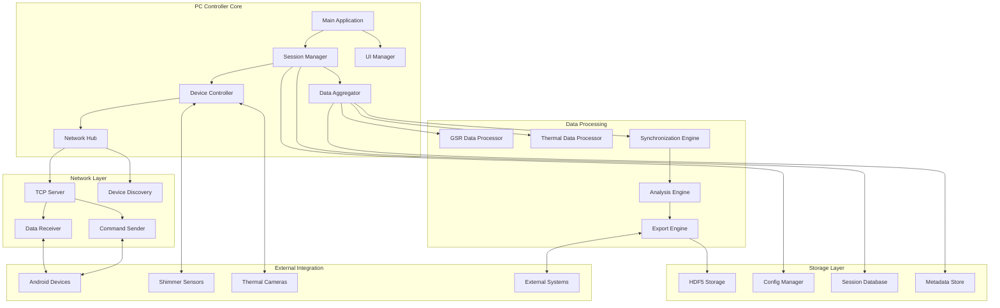

# PC Controller Documentation

## Overview

The PC Controller is the central hub of the IRCamera platform, providing advanced data processing, session management, and device coordination capabilities. Built with Python, it serves as the master controller for synchronized multi-modal data collection.

## Architecture



## Core Components

### Main Application
**Purpose**: Application entry point and lifecycle management
**Responsibilities**:
- Application initialization and shutdown
- Global configuration management
- Module coordination
- Error handling and logging

```python
class PCControllerApp:
    def __init__(self):
        self.session_manager = SessionManager()
        self.device_controller = DeviceController()
        self.network_hub = NetworkHub()
        self.ui_manager = UIManager()
        self.data_aggregator = DataAggregator()
        
    async def start(self):
        """Initialize and start all components"""
        await self.session_manager.initialize()
        await self.device_controller.initialize()
        await self.network_hub.start_server()
        await self.ui_manager.show_main_window()
        
    async def shutdown(self):
        """Graceful shutdown of all components"""
        await self.session_manager.save_state()
        await self.device_controller.disconnect_all()
        await self.network_hub.stop_server()
```

### SessionManager
**Purpose**: Recording session lifecycle management
**Responsibilities**:
- Session creation and configuration
- Multi-device coordination
- Data collection orchestration
- Session metadata management

**Key Features**:
- Multi-modal data synchronization
- Participant management
- Session templates and presets
- Real-time monitoring and control

### DeviceController
**Purpose**: Hardware device integration and management
**Responsibilities**:
- Device discovery and connection
- Hardware-specific communication
- Device status monitoring
- Command distribution

**Supported Devices**:
- **Shimmer3 GSR+**: Direct PC-connected GSR sensors
- **Thermal Cameras**: USB and network thermal cameras
- **Android Devices**: Mobile sensor nodes
- **External Sensors**: Custom sensor integrations

### DataAggregator
**Purpose**: Multi-source data collection and processing
**Responsibilities**:
- Real-time data ingestion
- Data validation and quality control
- Temporal synchronization
- Preprocessing and formatting

### NetworkHub
**Purpose**: Network communication coordination
**Responsibilities**:
- TCP server management
- Device discovery protocols
- Secure communication handling
- Connection pool management

### UIManager
**Purpose**: User interface management and presentation
**Responsibilities**:
- Main dashboard interface
- Real-time data visualization
- Session control interface
- Settings and configuration UI

## Data Processing Pipeline

### GSR Data Processing
```python
class GSRDataProcessor:
    def __init__(self):
        self.calibration_manager = CalibrationManager()
        self.filter_chain = FilterChain()
        self.analysis_engine = PhysiologicalAnalysisEngine()
        
    async def process_gsr_stream(self, gsr_stream: AsyncIterator[GSRDataPoint]) -> AsyncIterator[ProcessedGSRData]:
        """Process incoming GSR data stream"""
        async for data_point in gsr_stream:
            # Apply calibration
            calibrated_data = self.calibration_manager.calibrate(data_point)
            
            # Apply filtering
            filtered_data = await self.filter_chain.apply(calibrated_data)
            
            # Extract physiological features
            features = self.analysis_engine.extract_features(filtered_data)
            
            yield ProcessedGSRData(
                original_data=data_point,
                calibrated_value=calibrated_data,
                filtered_value=filtered_data,
                physiological_features=features,
                processing_timestamp=time.time_ns()
            )
```

### Thermal Data Processing
```python
class ThermalDataProcessor:
    def __init__(self):
        self.thermal_analyzer = ThermalAnalyzer()
        self.image_processor = ImageProcessor()
        self.sync_manager = SynchronizationManager()
        
    async def process_thermal_stream(self, thermal_stream: AsyncIterator[ThermalFrame]) -> AsyncIterator[ProcessedThermalData]:
        """Process incoming thermal data stream"""
        async for thermal_frame in thermal_stream:
            # Synchronize timestamp
            sync_timestamp = self.sync_manager.synchronize_timestamp(thermal_frame.timestamp)
            
            # Process thermal image
            processed_image = await self.image_processor.process_frame(thermal_frame)
            
            # Analyze thermal features
            analysis = self.thermal_analyzer.analyze_frame(processed_image)
            
            yield ProcessedThermalData(
                original_frame=thermal_frame,
                processed_image=processed_image,
                thermal_analysis=analysis,
                synchronized_timestamp=sync_timestamp
            )
```

### Synchronization Engine
```python
class SynchronizationEngine:
    def __init__(self):
        self.time_offset_calculator = TimeOffsetCalculator()
        self.buffer_manager = BufferManager()
        self.alignment_algorithm = TemporalAlignmentAlgorithm()
        
    async def synchronize_multi_modal_data(
        self, 
        gsr_stream: AsyncIterator[ProcessedGSRData],
        thermal_stream: AsyncIterator[ProcessedThermalData]
    ) -> AsyncIterator[SynchronizedDataPoint]:
        """Synchronize multiple data streams"""
        
        async with self.buffer_manager.create_sync_buffers() as buffers:
            gsr_buffer, thermal_buffer = buffers
            
            async for gsr_data, thermal_data in zip_streams(gsr_stream, thermal_stream):
                # Buffer data points
                gsr_buffer.add(gsr_data)
                thermal_buffer.add(thermal_data)
                
                # Attempt synchronization
                if sync_point := self.alignment_algorithm.find_sync_point(gsr_buffer, thermal_buffer):
                    yield SynchronizedDataPoint(
                        gsr_data=sync_point.gsr_data,
                        thermal_data=sync_point.thermal_data,
                        sync_timestamp=sync_point.timestamp,
                        sync_confidence=sync_point.confidence
                    )
```

## API Reference

### Session Management
```python
# Create new recording session
async def create_session(config: SessionConfig) -> Session:
    """Create a new recording session with specified configuration"""

# Start recording session
async def start_session(session_id: str) -> SessionStatus:
    """Start data collection for specified session"""

# Stop recording session
async def stop_session(session_id: str) -> SessionSummary:
    """Stop data collection and finalize session"""

# Get session status
async def get_session_status(session_id: str) -> SessionStatus:
    """Get current status of recording session"""

# List active sessions
async def list_active_sessions() -> List[SessionInfo]:
    """Get list of currently active sessions"""
```

### Device Management
```python
# Discover available devices
async def discover_devices() -> List[DeviceInfo]:
    """Discover all available devices on network"""

# Connect to device
async def connect_device(device_info: DeviceInfo) -> ConnectionResult:
    """Establish connection to specified device"""

# Send command to device
async def send_command(device_id: str, command: Command) -> CommandResult:
    """Send command to connected device"""

# Get device status
async def get_device_status(device_id: str) -> DeviceStatus:
    """Get current status of connected device"""

# Configure device
async def configure_device(device_id: str, config: DeviceConfig) -> ConfigResult:
    """Configure device parameters"""
```

### Data Processing
```python
# Process GSR data
async def process_gsr_data(
    gsr_data: GSRDataPoint, 
    processing_config: GSRProcessingConfig
) -> ProcessedGSRData:
    """Process single GSR data point"""

# Process thermal data
async def process_thermal_data(
    thermal_frame: ThermalFrame,
    processing_config: ThermalProcessingConfig
) -> ProcessedThermalData:
    """Process single thermal frame"""

# Synchronize data streams
async def synchronize_streams(
    streams: Dict[str, AsyncIterator[Any]],
    sync_config: SyncConfig
) -> AsyncIterator[SynchronizedDataPoint]:
    """Synchronize multiple data streams"""

# Export processed data
async def export_data(
    session_id: str,
    export_config: ExportConfig
) -> ExportResult:
    """Export processed session data"""
```

### Real-time Monitoring
```python
# Get real-time GSR data
async def get_realtime_gsr() -> AsyncIterator[GSRDataPoint]:
    """Stream real-time GSR data"""

# Get real-time thermal data
async def get_realtime_thermal() -> AsyncIterator[ThermalFrame]:
    """Stream real-time thermal data"""

# Get system metrics
async def get_system_metrics() -> SystemMetrics:
    """Get current system performance metrics"""

# Get data quality metrics
async def get_data_quality() -> DataQualityMetrics:
    """Get current data quality assessment"""
```

## Data Structures

### SessionConfig
```python
@dataclass
class SessionConfig:
    session_name: str
    participant_id: str
    researcher_id: str
    study_protocol: str
    devices: List[DeviceConfig]
    synchronization: SyncConfig
    data_collection: DataCollectionConfig
    export_settings: ExportConfig
    metadata: Dict[str, Any]
```

### DeviceConfig
```python
@dataclass
class DeviceConfig:
    device_id: str
    device_type: DeviceType
    connection_params: ConnectionParams
    sampling_config: SamplingConfig
    processing_config: ProcessingConfig
    quality_control: QualityControlConfig
```

### ProcessedGSRData
```python
@dataclass
class ProcessedGSRData:
    timestamp: int  # Nanoseconds
    device_id: str
    raw_adc: int
    resistance: float  # Kiloohms
    conductance: float  # Microsiemens
    filtered_value: float
    physiological_features: PhysiologicalFeatures
    quality_metrics: DataQualityMetrics
    processing_metadata: ProcessingMetadata
```

### ProcessedThermalData
```python
@dataclass
class ProcessedThermalData:
    timestamp: int  # Nanoseconds
    device_id: str
    frame_number: int
    temperature_matrix: np.ndarray
    processed_image: np.ndarray
    thermal_analysis: ThermalAnalysis
    quality_metrics: ImageQualityMetrics
    processing_metadata: ProcessingMetadata
```

### SynchronizedDataPoint
```python
@dataclass
class SynchronizedDataPoint:
    sync_timestamp: int  # Nanoseconds
    gsr_data: ProcessedGSRData
    thermal_data: ProcessedThermalData
    sync_confidence: float
    sync_method: SyncMethod
    metadata: Dict[str, Any]
```

## Configuration Management

### Application Configuration
```python
# config/app_config.yaml
application:
  name: "IRCamera PC Controller"
  version: "1.0.0"
  log_level: "INFO"
  max_sessions: 10
  data_retention_days: 30

network:
  server_port: 8080
  discovery_port: 8081
  max_connections: 50
  connection_timeout: 30
  keepalive_interval: 10

processing:
  thread_pool_size: 8
  buffer_size_mb: 100
  sync_tolerance_ms: 5
  quality_threshold: 0.8

storage:
  base_directory: "./data"
  compression: "gzip"
  backup_enabled: true
  backup_interval_hours: 24
```

### Device Configuration Templates
```python
# config/device_templates.yaml
shimmer_gsr:
  device_type: "shimmer3_gsr"
  sampling_rate: 64  # Hz
  gain_setting: 3
  calibration_mode: "automatic"
  quality_control:
    min_signal_quality: 0.7
    max_noise_level: 0.1

thermal_camera:
  device_type: "tc001"
  resolution: [320, 240]
  frame_rate: 9  # Hz
  temperature_range: [-20, 400]  # Celsius
  calibration_mode: "factory"
  quality_control:
    min_image_quality: 0.8
    max_processing_latency_ms: 50

android_device:
  device_type: "android_sensor_node"
  connection_type: "tcp"
  data_compression: true
  sync_protocol: "ntp_like"
  quality_control:
    min_connection_stability: 0.95
    max_sync_error_ms: 2
```

## Integration Examples

### Basic Session Management
```python
class BasicSessionExample:
    def __init__(self):
        self.pc_controller = PCControllerApp()
        
    async def run_basic_session(self):
        """Run a basic multi-modal recording session"""
        
        # Create session configuration
        session_config = SessionConfig(
            session_name="Pilot_Study_001",
            participant_id="P001",
            researcher_id="R001",
            study_protocol="thermal_gsr_sync",
            devices=[
                DeviceConfig.from_template("shimmer_gsr"),
                DeviceConfig.from_template("thermal_camera"),
                DeviceConfig.from_template("android_device")
            ],
            synchronization=SyncConfig(
                target_precision_ms=5,
                sync_method=SyncMethod.NTP_LIKE,
                buffer_duration_s=10
            ),
            data_collection=DataCollectionConfig(
                duration_minutes=30,
                auto_start=False,
                quality_monitoring=True
            ),
            export_settings=ExportConfig(
                format=ExportFormat.HDF5,
                include_raw_data=True,
                compression=True
            )
        )
        
        # Create and start session
        session = await self.pc_controller.create_session(session_config)
        
        print(f"Created session: {session.session_id}")
        
        # Start recording
        await self.pc_controller.start_session(session.session_id)
        print("Recording started...")
        
        # Monitor session progress
        while True:
            status = await self.pc_controller.get_session_status(session.session_id)
            print(f"Session status: {status.state}, Data points: {status.data_points_collected}")
            
            if status.state == SessionState.COMPLETED:
                break
                
            await asyncio.sleep(5)
        
        # Export data
        export_result = await self.pc_controller.export_data(
            session.session_id, 
            session_config.export_settings
        )
        
        print(f"Data exported to: {export_result.file_path}")
```

### Advanced Real-time Processing
```python
class AdvancedProcessingExample:
    def __init__(self):
        self.pc_controller = PCControllerApp()
        self.realtime_analyzer = RealtimeAnalyzer()
        
    async def run_realtime_analysis(self):
        """Run real-time multi-modal analysis"""
        
        # Get real-time data streams
        gsr_stream = self.pc_controller.get_realtime_gsr()
        thermal_stream = self.pc_controller.get_realtime_thermal()
        
        # Create synchronized stream
        sync_stream = self.pc_controller.synchronize_streams(
            {
                "gsr": gsr_stream,
                "thermal": thermal_stream
            },
            SyncConfig(
                target_precision_ms=5,
                sync_method=SyncMethod.INTERPOLATION,
                buffer_duration_s=2
            )
        )
        
        # Process synchronized data
        async for sync_point in sync_stream:
            # Perform real-time analysis
            analysis_result = await self.realtime_analyzer.analyze(
                gsr_data=sync_point.gsr_data,
                thermal_data=sync_point.thermal_data
            )
            
            # Check for significant events
            if analysis_result.significance_score > 0.8:
                await self.handle_significant_event(analysis_result)
            
            # Update real-time visualizations
            await self.update_realtime_display(sync_point, analysis_result)
            
    async def handle_significant_event(self, analysis_result: AnalysisResult):
        """Handle detection of significant physiological event"""
        event = PhysiologicalEvent(
            timestamp=analysis_result.timestamp,
            event_type=analysis_result.event_type,
            magnitude=analysis_result.magnitude,
            confidence=analysis_result.confidence,
            multimodal_features=analysis_result.features
        )
        
        # Log event
        await self.log_physiological_event(event)
        
        # Trigger real-time alerts if needed
        if event.magnitude > HIGH_MAGNITUDE_THRESHOLD:
            await self.send_realtime_alert(event)
```

### Custom Device Integration
```python
class CustomDeviceIntegration:
    def __init__(self):
        self.device_controller = DeviceController()
        
    async def integrate_custom_sensor(self):
        """Integrate a custom sensor device"""
        
        # Define custom device configuration
        custom_device_config = DeviceConfig(
            device_id="custom_ecg_001",
            device_type=DeviceType.CUSTOM,
            connection_params=ConnectionParams(
                protocol="serial",
                port="/dev/ttyUSB0",
                baud_rate=115200,
                timeout=1.0
            ),
            sampling_config=SamplingConfig(
                sampling_rate=250,  # Hz
                buffer_size=1000,
                data_format="int16"
            ),
            processing_config=ProcessingConfig(
                filters=[
                    BandpassFilter(low_freq=0.5, high_freq=40),
                    NotchFilter(freq=50)  # Remove power line noise
                ],
                calibration=CalibrationConfig(
                    gain=1000,
                    offset=0,
                    units="mV"
                )
            ),
            quality_control=QualityControlConfig(
                min_signal_quality=0.8,
                max_noise_level=0.05,
                disconnect_on_quality_loss=True
            )
        )
        
        # Register custom device driver
        custom_driver = CustomECGDriver()
        await self.device_controller.register_driver(custom_driver)
        
        # Connect to custom device
        connection_result = await self.device_controller.connect_device(custom_device_config)
        
        if connection_result.success:
            print(f"Custom device connected: {custom_device_config.device_id}")
            
            # Start data collection
            await self.device_controller.start_data_collection(custom_device_config.device_id)
            
            # Process custom device data
            async for data_point in self.device_controller.get_data_stream(custom_device_config.device_id):
                processed_data = await self.process_custom_data(data_point)
                await self.store_custom_data(processed_data)
```

## Testing Framework

### Unit Tests
```python
class PCControllerTest(unittest.TestCase):
    def setUp(self):
        self.pc_controller = PCControllerApp()
        self.test_session_config = create_test_session_config()
        
    async def test_session_creation(self):
        """Test session creation and initialization"""
        session = await self.pc_controller.create_session(self.test_session_config)
        
        self.assertIsNotNone(session.session_id)
        self.assertEqual(session.config.session_name, self.test_session_config.session_name)
        self.assertEqual(session.state, SessionState.CREATED)
        
    async def test_device_discovery(self):
        """Test device discovery functionality"""
        devices = await self.pc_controller.discover_devices()
        
        self.assertIsInstance(devices, list)
        
        # Check that discovered devices have required fields
        for device in devices:
            self.assertIsNotNone(device.device_id)
            self.assertIsNotNone(device.device_type)
            self.assertIsNotNone(device.connection_info)
            
    async def test_data_synchronization(self):
        """Test multi-modal data synchronization"""
        # Create mock data streams
        mock_gsr_stream = create_mock_gsr_stream()
        mock_thermal_stream = create_mock_thermal_stream()
        
        # Synchronize streams
        sync_stream = self.pc_controller.synchronize_streams(
            {"gsr": mock_gsr_stream, "thermal": mock_thermal_stream},
            SyncConfig(target_precision_ms=5)
        )
        
        # Verify synchronization
        sync_points = []
        async for sync_point in sync_stream:
            sync_points.append(sync_point)
            if len(sync_points) >= 10:
                break
                
        self.assertEqual(len(sync_points), 10)
        
        # Check synchronization quality
        for sync_point in sync_points:
            self.assertGreater(sync_point.sync_confidence, 0.8)
            self.assertLess(
                abs(sync_point.gsr_data.timestamp - sync_point.thermal_data.timestamp),
                5_000_000  # 5ms in nanoseconds
            )
```

### Integration Tests
```python
class PCControllerIntegrationTest(unittest.TestCase):
    async def test_end_to_end_session(self):
        """Test complete session workflow"""
        pc_controller = PCControllerApp()
        
        # Initialize application
        await pc_controller.start()
        
        try:
            # Create session
            session_config = create_integration_test_config()
            session = await pc_controller.create_session(session_config)
            
            # Start recording
            await pc_controller.start_session(session.session_id)
            
            # Let it run for a short time
            await asyncio.sleep(10)
            
            # Stop recording
            summary = await pc_controller.stop_session(session.session_id)
            
            # Verify session results
            self.assertGreater(summary.total_data_points, 0)
            self.assertGreater(summary.duration_seconds, 9)
            self.assertLess(summary.sync_error_ms, 10)
            
            # Export data
            export_result = await pc_controller.export_data(
                session.session_id,
                ExportConfig(format=ExportFormat.HDF5)
            )
            
            self.assertTrue(export_result.success)
            self.assertTrue(os.path.exists(export_result.file_path))
            
        finally:
            await pc_controller.shutdown()
```

## Performance Monitoring

### System Metrics
```python
class PerformanceMonitor:
    def __init__(self):
        self.metrics_collector = MetricsCollector()
        self.alert_manager = AlertManager()
        
    async def monitor_system_performance(self):
        """Monitor system performance metrics"""
        while True:
            metrics = await self.collect_performance_metrics()
            
            # Check for performance issues
            if metrics.cpu_usage > 80:
                await self.alert_manager.send_alert(
                    AlertType.HIGH_CPU_USAGE,
                    f"CPU usage: {metrics.cpu_usage}%"
                )
                
            if metrics.memory_usage > 85:
                await self.alert_manager.send_alert(
                    AlertType.HIGH_MEMORY_USAGE,
                    f"Memory usage: {metrics.memory_usage}%"
                )
                
            if metrics.sync_error_ms > 10:
                await self.alert_manager.send_alert(
                    AlertType.SYNC_DEGRADATION,
                    f"Sync error: {metrics.sync_error_ms}ms"
                )
                
            await asyncio.sleep(5)  # Check every 5 seconds
            
    async def collect_performance_metrics(self) -> SystemMetrics:
        """Collect current system performance metrics"""
        return SystemMetrics(
            timestamp=time.time_ns(),
            cpu_usage=psutil.cpu_percent(),
            memory_usage=psutil.virtual_memory().percent,
            disk_usage=psutil.disk_usage('/').percent,
            network_rx_bytes=psutil.net_io_counters().bytes_recv,
            network_tx_bytes=psutil.net_io_counters().bytes_sent,
            active_sessions=await self.get_active_session_count(),
            connected_devices=await self.get_connected_device_count(),
            data_throughput_mbps=await self.calculate_data_throughput(),
            sync_error_ms=await self.calculate_sync_error()
        )
```

## Error Handling and Recovery

### Error Management
```python
class PCControllerErrorHandler:
    def __init__(self):
        self.error_logger = ErrorLogger()
        self.recovery_manager = RecoveryManager()
        
    async def handle_error(self, error: Exception, context: ErrorContext) -> ErrorHandlingResult:
        """Handle errors with appropriate recovery strategies"""
        
        # Log error with context
        await self.error_logger.log_error(error, context)
        
        # Determine recovery strategy
        recovery_strategy = self.determine_recovery_strategy(error, context)
        
        try:
            if recovery_strategy == RecoveryStrategy.RETRY:
                return await self.retry_operation(context)
            elif recovery_strategy == RecoveryStrategy.RESTART_COMPONENT:
                return await self.restart_component(context.component)
            elif recovery_strategy == RecoveryStrategy.GRACEFUL_DEGRADATION:
                return await self.enable_graceful_degradation(context)
            elif recovery_strategy == RecoveryStrategy.EMERGENCY_STOP:
                return await self.emergency_stop(context)
            else:
                return ErrorHandlingResult.FAILED
                
        except Exception as recovery_error:
            await self.error_logger.log_error(recovery_error, context)
            return ErrorHandlingResult.RECOVERY_FAILED
            
    def determine_recovery_strategy(self, error: Exception, context: ErrorContext) -> RecoveryStrategy:
        """Determine appropriate recovery strategy based on error type and context"""
        
        if isinstance(error, NetworkError):
            if context.severity == ErrorSeverity.LOW:
                return RecoveryStrategy.RETRY
            else:
                return RecoveryStrategy.RESTART_COMPONENT
                
        elif isinstance(error, DataProcessingError):
            return RecoveryStrategy.GRACEFUL_DEGRADATION
            
        elif isinstance(error, CriticalSystemError):
            return RecoveryStrategy.EMERGENCY_STOP
            
        elif isinstance(error, DeviceError):
            return RecoveryStrategy.RESTART_COMPONENT
            
        else:
            return RecoveryStrategy.RETRY
```

## Dependencies

### Required Libraries
```python
# requirements.txt
asyncio>=3.4.3
aiohttp>=3.8.0
numpy>=1.21.0
pandas>=1.3.0
h5py>=3.6.0
psutil>=5.8.0
PyQt6>=6.2.0
pyqtgraph>=0.12.0
zeroconf>=0.47.0
cryptography>=3.4.8
pydantic>=1.9.0
structlog>=21.5.0
pytest>=6.2.0
pytest-asyncio>=0.18.0
```

### Optional Dependencies
```python
# Optional: Enhanced processing
opencv-python>=4.5.0
scikit-learn>=1.0.0
scipy>=1.7.0

# Optional: GPU acceleration
cupy-cuda11x>=9.0.0

# Optional: Advanced analytics
matplotlib>=3.5.0
seaborn>=0.11.0
plotly>=5.5.0
```

## Future Enhancements

### Planned Features
- **Cloud Integration**: Remote data processing and storage
- **Machine Learning Pipeline**: Real-time ML inference
- **Advanced Visualization**: 3D thermal visualization
- **Multi-site Coordination**: Distributed data collection
- **Real-time Collaboration**: Multi-researcher support

### Performance Improvements
- **GPU Acceleration**: CUDA-based processing
- **Distributed Processing**: Multi-machine coordination
- **Optimized Protocols**: Custom binary protocols
- **Predictive Buffering**: AI-powered data buffering

---

For more information, see the [PC Controller Setup Guide](../PC_CONTROLLER_SETUP.md) and [Advanced Configuration](../ADVANCED_CONFIGURATION.md).