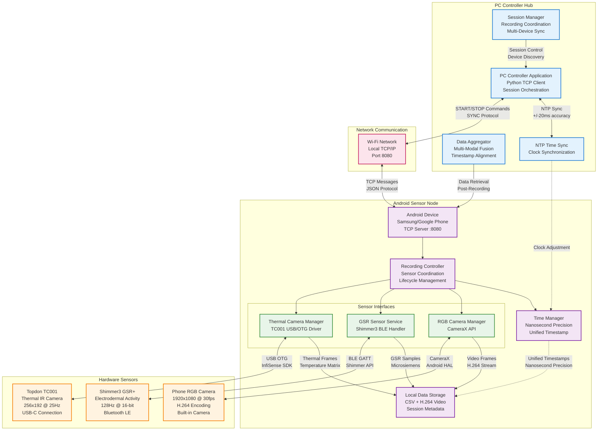

# Chapter 1: Multi-Sensor System Overview

## Figure 1.1: Multi-Sensor System Overview

A high-level diagram illustrating the smartphone-based system with attached sensors (Shimmer3 GSR via Bluetooth, Topdon TC001 thermal via USB, and an RGB camera via CameraX), plus the remote PC controller over Wi-Fi.

## System Architecture Context

This diagram establishes the project's scope and architecture:

- **PC Controller Hub**: Centralized control station running Python application for multi-device orchestration
- **Android Sensor Node**: Smartphone acting as sensor hub with integrated thermal camera, built-in RGB camera, and BLE connection to GSR sensor
- **Hardware Sensors**: Three sensing modalities (thermal IR, electrodermal activity, RGB video)
- **Network Communication**: Wi-Fi-based TCP/IP protocol for command and control
- **Time Synchronization**: NTP-style clock alignment achieving sub-millisecond precision

## Key System Characteristics

- **Modular Architecture**: Each sensor managed by dedicated software component
- **Distributed Computing**: PC coordinates multiple Android devices simultaneously
- **Precise Synchronization**: Unified timestamp system across all modalities
- **Research-Grade Quality**: Hardware specifications suitable for scientific data collection
- **Real-Time Operation**: Live data streaming with minimal latency
