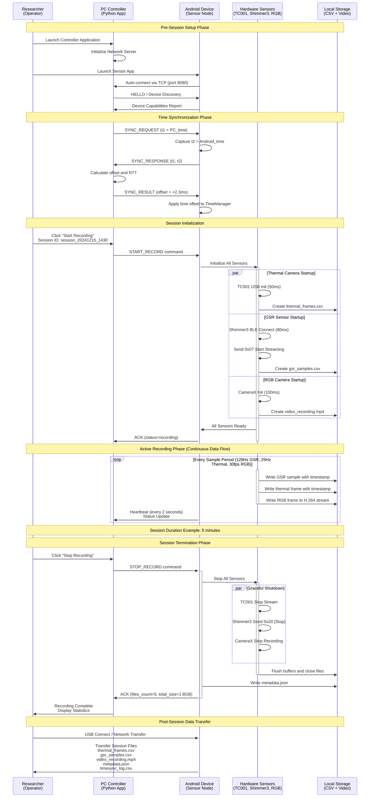

# Chapter 1: Example Use-Case Scenario Timeline

## Figure 1.2: Example Use-Case Scenario Timeline

A simplified timeline diagram showing a typical recording session (PC sends "START", sensors begin logging synchronously, PC sends "STOP").

## Use-Case Context

This timeline demonstrates:

- **Simple Operation**: Researcher clicks "Start" on PC, all sensors begin recording automatically
- **Automatic Synchronization**: Clock alignment happens transparently before recording
- **Parallel Initialization**: All sensors start simultaneously within ~100ms window
- **Continuous Recording**: Data flows to local storage throughout session
- **Clean Shutdown**: Graceful termination ensures all data saved properly
- **Data Accessibility**: Files ready for analysis immediately after session

## Typical Session Characteristics

- **Setup Time**: ~10-15 seconds (connection + sync)
- **Recording Duration**: 1-30 minutes typical
- **Data Volume**: ~360MB per 5-minute session
- **Synchronization Accuracy**: <5ms timestamp alignment
- **Sensors Active**: 3 modalities recording simultaneously
- **Heartbeat Interval**: 2 seconds for status monitoring

## Motivations Addressed

This simple workflow maps the problem context to the solution:

1. **Researcher Need**: Simple interface for multi-modal data collection
2. **Technical Challenge**: Synchronizing diverse sensor streams
3. **Solution**: Automated coordination via PC controller
4. **Outcome**: Time-aligned multi-modal dataset for analysis
