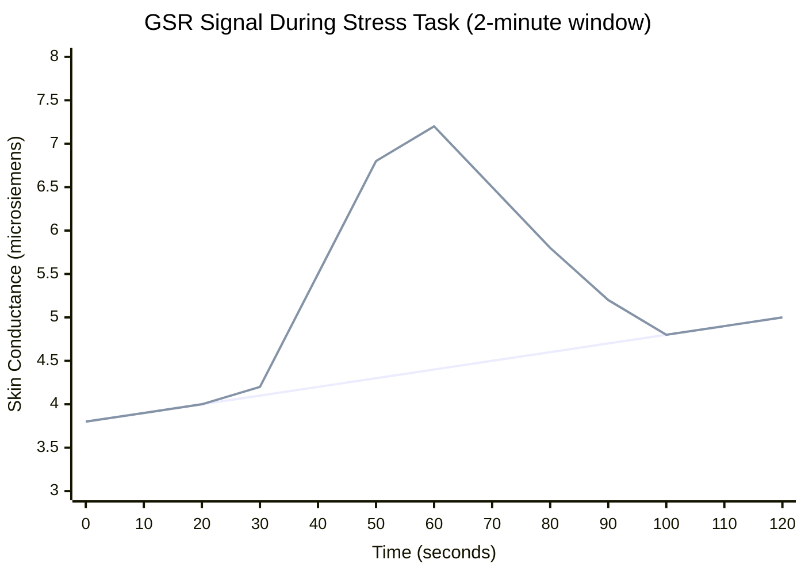
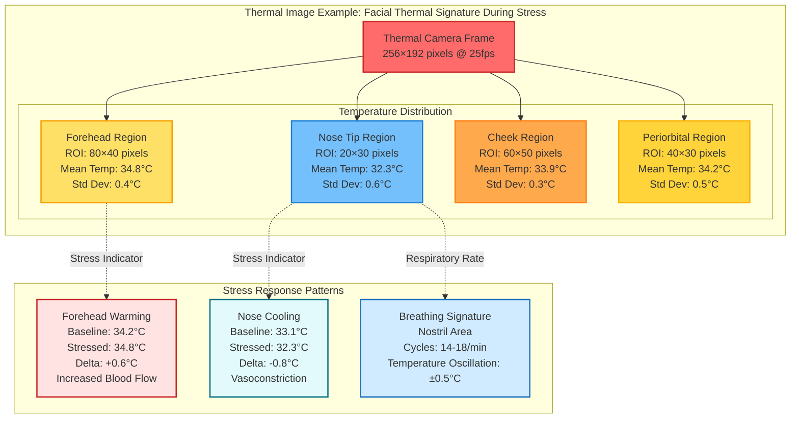

# Chapter 2: Basic GSR and Thermal Data Examples

## Figure 2.1: Basic GSR and Thermal Data Examples

Illustrative examples showing sample GSR signal and thermal image data to help readers unfamiliar with these modalities understand the raw data characteristics.

### Part A: Sample GSR (Electrodermal Activity) Signal



**GSR Signal Characteristics:**

1. **Tonic Component (SCL - Skin Conductance Level)**
   - Slow-varying baseline: 3.8-5.0 μS range
   - Gradual drift over time (baseline shift)
   - Reflects overall arousal state
   - Changes over minutes to hours

2. **Phasic Component (SCR - Skin Conductance Response)**
   - Rapid events: spike at t=30s-50s
   - Peak amplitude: ~3.4 μS above baseline
   - Rise time: 1-3 seconds
   - Recovery time: 5-15 seconds
   - Triggered by stimulus or stress event

3. **Typical Response Pattern**
   - Latency: 1-3 seconds after stimulus
   - Peak: 3-5 seconds after onset
   - Amplitude: 0.1-0.8 μS typical stress response
   - Larger responses: 2-5 μS during intense stress
   - Non-responders: <0.05 μS (5-10% of population)

### Part B: Mermaid Representation of Thermal Image with Temperature Data



### Part C: Thermal-RGB-GSR Timeline Correlation

```mermaid
gantt
    title Synchronized Multi-Modal Stress Response Example (Stroop Task)
    dateFormat X
    axisFormat %S s
    
    section Stimulus
    Task Onset               :milestone, stim1, 0, 0s
    Stroop Word Display      :active, task1, 0, 5000ms
    Response Collection      :active, task2, 5000, 7000ms
    
    section GSR Response
    Baseline SCL (4.2μS)     :crit, gsr1, 0, 3000ms
    SCR Onset (1-2s latency) :milestone, gsr2, 1500, 1500ms
    SCR Rise Phase           :active, gsr3, 1500, 3500ms
    SCR Peak (7.1μS)         :milestone, gsr4, 3500, 3500ms
    SCR Recovery Phase       :active, gsr5, 3500, 12000ms
    Return to Baseline       :milestone, gsr6, 12000, 12000ms
    
    section Thermal Response
    Baseline Nose (33.1°C)   :crit, therm1, 0, 2000ms
    Vasoconstriction Onset   :milestone, therm2, 2000, 2000ms
    Nose Cooling Phase       :active, therm3, 2000, 6000ms
    Minimum Temp (32.3°C)    :milestone, therm4, 6000, 6000ms
    Temperature Recovery     :active, therm5, 6000, 15000ms
    
    section RGB Indicators
    Neutral Expression       :crit, rgb1, 0, 2000ms
    Expression Change        :milestone, rgb2, 2000, 2000ms
    Facial Tension           :active, rgb3, 2000, 7000ms
    rPPG: HR Increase        :active, rgb4, 2000, 10000ms
```

## Data Characteristics Summary

### GSR (Shimmer3 @ 128 Hz)
- **Format**: CSV with timestamp, resistance (kΩ), conductance (μS)
- **Sample Rate**: 128 samples/second
- **Resolution**: 16-bit (76 μΩ resolution)
- **Dynamic Range**: 0.01 - 100 μS
- **Typical File Size**: ~0.1 MB per minute
- **Key Features**: Tonic SCL, phasic SCRs, event markers

### Thermal Data (TC001 @ 25 Hz)
- **Format**: CSV with timestamp, temperature matrix (256×192 values)
- **Frame Rate**: 25 frames/second
- **Temperature Range**: Typically 28-40°C for facial imaging
- **Accuracy**: ±2°C absolute, ±0.1°C differential
- **Typical File Size**: ~30 MB per minute (raw temperature data)
- **Key Features**: ROI temperatures, spatial gradients, breathing cycles

### RGB Video (Phone Camera @ 30 fps)
- **Format**: MP4 (H.264 encoded)
- **Resolution**: 1920×1080 pixels
- **Frame Rate**: 30 frames/second
- **Typical File Size**: ~10 MB per minute (compressed)
- **Key Features**: Facial landmarks, expressions, rPPG, motion

## Why These Data Types Support GSR Prediction Research

### GSR as Ground Truth
- Provides validated measure of sympathetic arousal
- Fast response time (1-3s latency) enables precise correlation
- Continuous signal allows regression models (not just classification)
- Research-grade accuracy from validated Shimmer3 sensor

### Thermal as Contactless Predictor
- Captures involuntary physiological responses (vasoconstriction)
- Cannot be voluntarily controlled (unlike facial expressions)
- Temperature changes (0.3-0.7°C) correlate with GSR peaks
- Works in varying lighting conditions (infrared sensing)
- Provides spatial information (nose vs. forehead patterns)

### RGB as Complementary Context
- Adds behavioral indicators (expressions, movement)
- Remote photoplethysmography (rPPG) for heart rate
- Facial action units for emotion classification
- High spatial resolution for subtle features
- Validates attention and engagement during tasks

## Expected Correlations for ML Training

When synchronized properly, the platform enables training models to predict GSR from thermal/RGB:

1. **GSR SCR Peak** (t=3.5s) → **Nose Cooling** (t=6s, 3-4s lag)
2. **GSR Amplitude** (ΔμS) → **Cooling Magnitude** (Δ°C)
3. **GSR Baseline Drift** → **Mean Facial Temperature Increase**
4. **SCR Frequency** → **Breathing Rate Changes** (thermal nostril cycles)
5. **Combined RGB+Thermal** → **Improved GSR Prediction** over single modality

This figure establishes what raw sensor data looks like, justifying the design choices for sampling rates, data formats, and expected signal characteristics needed for successful multi-modal analysis.
