# Chapter 4: Implementation and Development

This document contains figures, tables, and code snippets for Chapter 4 of the thesis, focusing on the implementation details of the multi-sensor recording system.

## Figure 4.1: Mobile App UI and Data Flow

This diagram illustrates the Android application's user interface structure and internal data flow, showing how user actions and PC commands trigger background services and data processing pipelines.

```mermaid
graph TB
    %% User Interface Layer
    subgraph UI["User Interface Layer (Jetpack Compose)"]
        direction TB
        MainScreen[("Main Screen")]
        MainVM[MainActivity<br/>ViewModel]
        MainScreen --> MainVM
        
        ThermalUI[("Thermal View")]
        ThermalVM[ThermalCamera<br/>ViewModel]
        ThermalUI --> ThermalVM
        
        GSRUI[("GSR View")]
        GSRVM[GSRSensor<br/>ViewModel]
        GSRUI --> GSRVM
        
        RGBUI[("RGB View")]
        RGBVM[RGBCamera<br/>ViewModel]
        RGBUI --> RGBVM
        
        SettingsUI[("Settings")]
        SettingsVM[Settings<br/>ViewModel]
        SettingsUI --> SettingsVM
    end
    
    %% Control Layer
    subgraph Control["Control Layer (Coroutines)"]
        direction TB
        UserAction{{User Actions}}
        PCCommand{{PC Commands}}
        
        RecordingController[Recording<br/>Controller]
        SessionManager[Session<br/>Manager]
        PermissionManager[Permission<br/>Manager]
        
        UserAction --> RecordingController
        PCCommand --> RecordingController
        RecordingController --> SessionManager
        RecordingController --> PermissionManager
    end
    
    %% Hardware Interface Layer
    subgraph Hardware["Hardware Interface Layer"]
        direction TB
        USBManager[USB<br/>Manager]
        BLEManager[BLE<br/>Manager]
        CameraXAPI[CameraX<br/>API]
        
        TC001Device[/Topdon TC001\<br/>USB-C OTG/]
        Shimmer3Device[/Shimmer3 GSR+\<br/>Bluetooth/]
        RGBCamera[/Phone Camera\<br/>Internal/]
        
        USBManager --> TC001Device
        BLEManager --> Shimmer3Device
        CameraXAPI --> RGBCamera
    end
    
    %% Sensor Pipeline
    subgraph Pipeline["Sensor Data Pipeline (Multi-threaded)"]
        direction TB
        ThermalThread["Thermal Thread<br/>25Hz<br/>49,152 points/frame"]
        GSRThread["GSR Thread<br/>128Hz<br/>12-bit ADC"]
        RGBThread["RGB Thread<br/>30fps<br/>H.264 encoding"]
        
        ThermalProcessor[Thermal<br/>Processor]
        GSRProcessor[GSR<br/>Processor]
        RGBProcessor[RGB<br/>Processor]
        
        ThermalThread --> ThermalProcessor
        GSRThread --> GSRProcessor
        RGBThread --> RGBProcessor
    end
    
    %% Time Synchronization
    subgraph TimeSync["Time Synchronization (NTP-style)"]
        direction LR
        TimeSyncManager[TimeSyncManager]
        TimeManager[TimeManager<br/>Nanosecond precision]
        SyncLogger[Sync<br/>Logger]
        
        TimeSyncManager --> TimeManager
        TimeSyncManager --> SyncLogger
    end
    
    %% Data Storage
    subgraph Storage["Data Storage Layer"]
        direction TB
        BufferedWriter[Buffered Writer<br/>Batch: 50 samples<br/>Flush: 5s]
        FileManager[File<br/>Manager]
        
        SessionDir[(Session Directory<br/>YYYYMMDD_HHMM)]
        
        ThermalFile[("thermal_data.csv<br/>~530MB/30min")]
        GSRFile[("gsr_data.csv<br/>~90MB/30min")]
        RGBFile[("rgb_video.mp4<br/>~1.5GB/30min")]
        MetaFile[("metadata.json")]
        SyncFile[("timesync_log.csv")]
        
        BufferedWriter --> FileManager
        FileManager --> SessionDir
        SessionDir --> ThermalFile
        SessionDir --> GSRFile
        SessionDir --> RGBFile
        SessionDir --> MetaFile
        SessionDir --> SyncFile
    end
    
    %% Network Layer
    subgraph Network["Network Communication Layer"]
        direction TB
        PCOrchestrator[/"PC Orchestrator<br/>Python Controller"\]
        
        TCPServer[TCP Server<br/>Port 8080<br/>Coroutine-based]
        ProtocolHandler[Protocol<br/>Handler]
        MessageQueue[Message<br/>Queue]
        
        PCOrchestrator -.->|Wi-Fi| TCPServer
        TCPServer --> MessageQueue
        MessageQueue --> ProtocolHandler
    end
    
    %% Cross-layer connections
    MainVM --> RecordingController
    ThermalVM --> ThermalThread
    GSRVM --> GSRThread
    RGBVM --> RGBThread
    
    RecordingController --> ThermalThread
    RecordingController --> GSRThread
    RecordingController --> RGBThread
    
    ProtocolHandler --> RecordingController
    ProtocolHandler --> TimeSyncManager
    
    SessionManager --> FileManager
    
    USBManager --> ThermalThread
    BLEManager --> GSRThread
    CameraXAPI --> RGBThread
    
    TimeManager --> ThermalProcessor
    TimeManager --> GSRProcessor
    TimeManager --> RGBProcessor
    
    ThermalProcessor --> BufferedWriter
    GSRProcessor --> BufferedWriter
    RGBProcessor --> BufferedWriter
    
    %% Status feedback
    ThermalThread -.Status.-> ThermalVM
    GSRThread -.Status.-> GSRVM
    RGBThread -.Status.-> RGBVM
    RecordingController -.Status.-> MainVM
    TCPServer -.Status.-> MainVM
    
    %% Error handling
    ThermalThread -.Errors.-> RecordingController
    GSRThread -.Errors.-> RecordingController
    RGBThread -.Errors.-> RecordingController
    
    %% Styling
    classDef uiClass fill:#e3f2fd,stroke:#1976d2,stroke-width:2px
    classDef controlClass fill:#c8e6c9,stroke:#388e3c,stroke-width:2px
    classDef hardwareClass fill:#fff9c4,stroke:#f57c00,stroke-width:2px
    classDef pipelineClass fill:#f8bbd0,stroke:#c2185b,stroke-width:2px
    classDef storageClass fill:#d1c4e9,stroke:#512da8,stroke-width:2px
    classDef networkClass fill:#ffccbc,stroke:#d84315,stroke-width:2px
    classDef syncClass fill:#b2dfdb,stroke:#00796b,stroke-width:2px
    classDef deviceClass fill:#fff3e0,stroke:#e65100,stroke-width:3px
    
    class MainScreen,ThermalUI,GSRUI,RGBUI,SettingsUI,MainVM,ThermalVM,GSRVM,RGBVM,SettingsVM uiClass
    class RecordingController,SessionManager,PermissionManager,UserAction,PCCommand controlClass
    class USBManager,BLEManager,CameraXAPI hardwareClass
    class TC001Device,Shimmer3Device,RGBCamera deviceClass
    class ThermalThread,GSRThread,RGBThread,ThermalProcessor,GSRProcessor,RGBProcessor pipelineClass
    class TimeSyncManager,TimeManager,SyncLogger syncClass
    class BufferedWriter,FileManager,SessionDir,ThermalFile,GSRFile,RGBFile,MetaFile,SyncFile storageClass
    class TCPServer,ProtocolHandler,MessageQueue,PCOrchestrator networkClass
```

### Data Flow Description

1. **User Interaction Path**: User actions from the UI layer flow through ViewModels to the Recording Controller, which coordinates all sensor threads with proper lifecycle management.

2. **PC Command Path**: Remote commands arrive via TCP server (port 8080), are queued and parsed by the Protocol Handler, then dispatched to the Recording Controller or Time Sync Manager.

3. **Hardware Integration Path**: USB Manager handles Topdon TC001 thermal camera via OTG, BLE Manager connects to Shimmer3 GSR sensor via Bluetooth, and CameraX API manages the phone's internal RGB camera.

4. **Sensor Data Path**: Each sensor runs in its own dedicated thread (Thermal @25Hz with 49,152 temperature points, GSR @128Hz with 12-bit ADC sampling, RGB @30fps with H.264 encoding). Data flows through processors that apply calibration and formatting.

5. **Time Synchronization Path**: NTP-style time sync ensures all sensor data shares a common time base with nanosecond precision, coordinated with the PC orchestrator.

6. **Storage Path**: Buffered writers batch data (50 samples) and flush periodically (5 seconds) to minimize I/O overhead, storing in session-specific directories with separate files for each sensor type plus metadata.

7. **Status Feedback Path**: Bidirectional status flows (dotted lines) provide real-time monitoring from threads back to UI components, while error conditions propagate to the Recording Controller for centralized handling.

### Figure 4.1b: Recording Session State Machine

This state diagram shows the lifecycle of a recording session and state transitions:

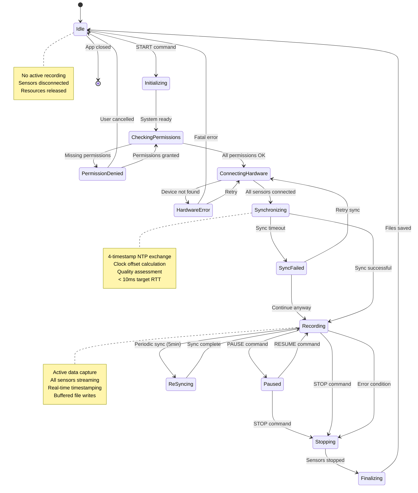

### Figure 4.1c: Sensor Data Processing Pipeline

Detailed view of how sensor data flows through processing stages:

```mermaid
flowchart LR
    subgraph Thermal["Thermal Camera Pipeline"]
        direction TB
        T1[USB Frame<br/>Callback]
        T2[Raw Data<br/>256x192 bytes]
        T3[Parse with<br/>LibIRParse]
        T4[Temperature<br/>Calibration]
        T5[Emissivity<br/>Correction]
        T6{Valid<br/>Frame?}
        T7[Timestamp &<br/>Format CSV]
        T8[Buffer<br/>50 samples]
        
        T1 --> T2
        T2 --> T3
        T3 --> T4
        T4 --> T5
        T5 --> T6
        T6 -->|Yes| T7
        T6 -->|No| T1
        T7 --> T8
    end
    
    subgraph GSR["GSR Sensor Pipeline"]
        direction TB
        G1[BLE Data<br/>Packet]
        G2[12-bit ADC<br/>Raw Value]
        G3[Extract GSR &<br/>PPG channels]
        G4[ADC to<br/>Resistance]
        G5[Resistance to<br/>Microsiemens]
        G6{Signal<br/>Quality?}
        G7[Timestamp &<br/>Format CSV]
        G8[Buffer<br/>50 samples]
        
        G1 --> G2
        G2 --> G3
        G3 --> G4
        G4 --> G5
        G5 --> G6
        G6 -->|Good| G7
        G6 -->|Poor| G1
        G7 --> G8
    end
    
    subgraph RGB["RGB Camera Pipeline"]
        direction TB
        R1[CameraX<br/>Frame]
        R2[1920x1080<br/>RGB Image]
        R3[H.264<br/>Encoder]
        R4[Compression]
        R5{Quality<br/>Check?}
        R6[Add Timestamp<br/>Metadata]
        R7[MP4<br/>Container]
        
        R1 --> R2
        R2 --> R3
        R3 --> R4
        R4 --> R5
        R5 -->|Pass| R6
        R5 -->|Fail| R1
        R6 --> R7
    end
    
    subgraph Sync["Synchronization"]
        direction TB
        TS[TimeManager<br/>nanoTime()]
        OS[Clock Offset<br/>from PC]
        TS --> OS
    end
    
    subgraph Write["Unified Writer"]
        direction TB
        WQ[Write Queue<br/>Thread-safe]
        WB[Batch Writer<br/>50 samples]
        WF[Flush Timer<br/>5 seconds]
        WD[(Session<br/>Directory)]
        
        WQ --> WB
        WB --> WF
        WF --> WD
    end
    
    T8 --> WQ
    G8 --> WQ
    R7 --> WQ
    
    OS -.Offset.-> T7
    OS -.Offset.-> G7
    OS -.Offset.-> R6
    
    style T1 fill:#ffebee
    style T8 fill:#c8e6c9
    style G1 fill:#fff3e0
    style G8 fill:#c8e6c9
    style R1 fill:#e3f2fd
    style R7 fill:#c8e6c9
    style TS fill:#f8bbd0
    style WD fill:#d1c4e9
```

### Figure 4.1d: Network Protocol Message Flow

Sequence diagram showing detailed PC-Android message exchange:

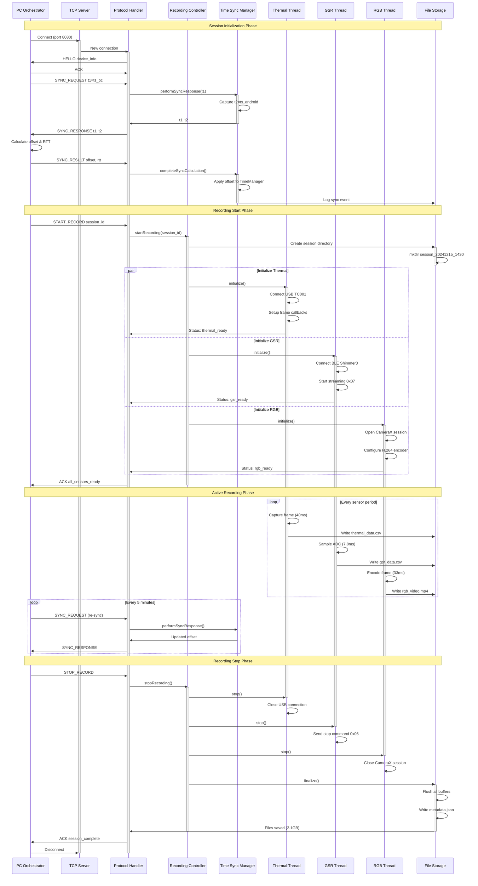

---

## Code Snippet 4.2: Bluetooth GSR Connection and Reading

This code excerpt demonstrates the core implementation of connecting to the Shimmer3 GSR sensor via Bluetooth Low Energy (BLE) and streaming 12-bit ADC data at 128Hz.

### Connection Initialization

```kotlin
// File: app/src/main/java/mpdc4gsr/core/data/ShimmerDeviceManager.kt

/**
 * Initialize Shimmer Bluetooth manager and prepare for device connections
 */
suspend fun initialize(): Boolean = withContext(Dispatchers.IO) {
    try {
        if (!hasRequiredPermissions()) {
            AppLogger.e(TAG, "Missing Bluetooth permissions")
            return@withContext false
        }

        bluetoothManager = context.getSystemService(Context.BLUETOOTH_SERVICE) as? BluetoothManager
        bluetoothAdapter = bluetoothManager?.adapter

        if (bluetoothAdapter?.isEnabled != true) {
            AppLogger.e(TAG, "Bluetooth unavailable")
            return@withContext false
        }

        // Initialize Shimmer SDK manager with Android Handler
        shimmerManager = ShimmerBluetoothManagerAndroid(context, mainHandler)
        
        startConnectionMonitoring()
        
        return@withContext true
    } catch (e: Exception) {
        AppLogger.e(TAG, "Shimmer initialization failed", e)
        return@withContext false
    }
}

/**
 * Connect to a Shimmer3 GSR device by address
 */
suspend fun connectToDevice(deviceInfo: DeviceInfo): Boolean = withContext(Dispatchers.IO) {
    try {
        val shimmer = Shimmer(mainHandler, context)
        
        // Configure GSR sensor parameters
        shimmer.enableSensor(Shimmer.SENSOR_GSR)
        shimmer.setSamplingRate(128.0) // 128Hz sampling rate
        
        // Set GSR range to auto-ranging mode for optimal signal quality
        shimmer.setGSRRange(GSR_RANGE_AUTO)
        
        // Connect to device
        shimmer.connect(deviceInfo.address, deviceInfo.name)
        
        connectedDevices[deviceInfo.address] = shimmer
        
        AppLogger.i(TAG, "Connected to Shimmer device: ${deviceInfo.name}")
        
        return@withContext true
    } catch (e: Exception) {
        AppLogger.e(TAG, "Connection failed: ${e.message}", e)
        return@withContext false
    }
}
```

### Data Streaming Implementation

```kotlin
// File: app/src/main/java/mpdc4gsr/feature/gsr/data/GSRSensorRecorder.kt

/**
 * Start streaming GSR data from connected Shimmer device
 */
private suspend fun startShimmerStreaming(device: Shimmer) = withContext(Dispatchers.IO) {
    try {
        AppLogger.i(TAG, "Starting GSR data streaming at ${effectiveSamplingRate}Hz")
        
        // Send start streaming command (0x07) to Shimmer device
        device.startStreaming()
        
        // Register callback for incoming data packets
        device.setDataProcessor { objectCluster ->
            processGSRDataPacket(objectCluster)
        }
        
        isStreaming = true
        AppLogger.i(TAG, "GSR streaming active")
        
    } catch (e: Exception) {
        AppLogger.e(TAG, "Failed to start streaming", e)
        emitError(ErrorType.STREAMING_FAILED, "Could not start GSR streaming: ${e.message}")
    }
}

/**
 * Process incoming GSR data packet from Shimmer device
 */
private fun processGSRDataPacket(objectCluster: ObjectCluster) {
    try {
        // Extract 12-bit ADC value and convert to microsiemens
        val gsrRaw = objectCluster.getFormatClusterValue(
            Shimmer.CHANNEL_TYPE.CAL, 
            Configuration.Shimmer3.SENSOR_GSR
        )
        
        val gsrMicroSiemens = convertAdcToMicroSiemens(gsrRaw)
        
        // Extract optional PPG (photoplethysmography) data if available
        val ppgRaw = objectCluster.getFormatClusterValue(
            Shimmer.CHANNEL_TYPE.CAL,
            Configuration.Shimmer3.SENSOR_INT_ADC_A1
        )
        
        // Get synchronized timestamp from TimeManager
        val timestampNs = timeManager.getCurrentTimestampNanos()
        
        // Create GSR sample
        val sample = GSRSample(
            timestamp = timestampNs,
            gsrValue = gsrMicroSiemens,
            ppgValue = ppgRaw,
            deviceId = sensorId
        )
        
        // Emit sample to data flow for recording
        gsrSampleFlow.tryEmit(sample)
        
        sampleCount.incrementAndGet()
        
    } catch (e: Exception) {
        AppLogger.e(TAG, "Error processing GSR packet", e)
    }
}

/**
 * Convert raw 12-bit ADC value to microsiemens using Shimmer calibration
 */
private fun convertAdcToMicroSiemens(adcValue: Double): Double {
    // Shimmer3 GSR conversion formula:
    // Resistance (kOhm) = (ADC_value / 4095) * ref_voltage / gain
    // Conductance (uS) = 1 / (Resistance * 1000)
    
    val resistance = (adcValue / 4095.0) * 3.0 / 0.0000002
    val conductance = 1.0 / (resistance * 1000.0) * 1000000.0 // Convert to microsiemens
    
    return conductance
}
```

### Key Implementation Details

- **Shimmer SDK Integration**: Uses official `ShimmerBluetoothManagerAndroid` for device management
- **BLE Permissions**: Requires `BLUETOOTH_SCAN` and `BLUETOOTH_CONNECT` (Android 12+)
- **Sampling Rate**: Configurable 1-512Hz, default 128Hz for GSR applications
- **Data Format**: 12-bit ADC values converted to microsiemens (μS) conductance units
- **Time Synchronization**: All samples tagged with nanosecond-precision timestamps
- **Error Recovery**: Automatic reconnection with exponential backoff on connection loss

### Figure 4.2a: GSR Sensor Class Architecture

Detailed class diagram showing the GSR sensor integration structure:

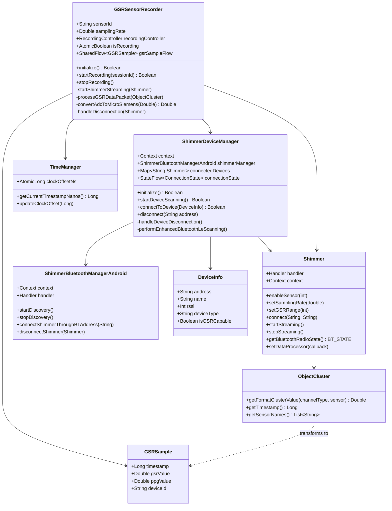

### Figure 4.2b: GSR Connection State Machine

State transitions during GSR sensor connection lifecycle:

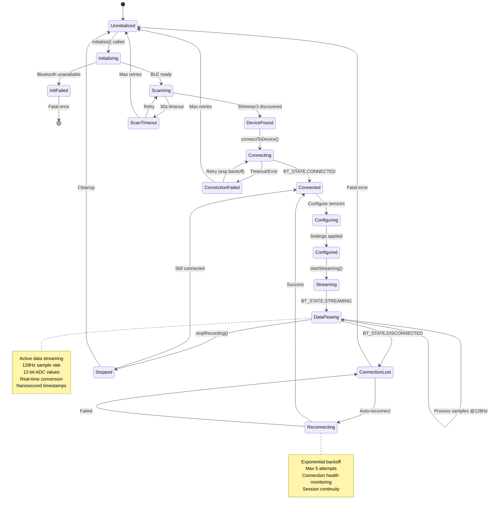

---

## Code Snippet 4.3: Thermal Camera Frame Capture (USB)

This code demonstrates integration with the Topdon TC001 thermal camera via USB OTG, including frame callbacks and temperature calibration.

### USB Device Initialization

```kotlin
// File: app/src/main/java/mpdc4gsr/feature/thermal/ui/ThermalCameraRecorder.kt

/**
 * Initialize Topdon TC001 thermal camera via USB OTG
 */
override suspend fun initialize(): Boolean = withContext(Dispatchers.IO) {
    try {
        AppLogger.i(TAG, "Initializing Topdon TC001 thermal camera (${thermalResolution.first}x${thermalResolution.second} @${thermalFrameRate}Hz)")
        
        // Check USB OTG support and permissions
        val usbManager = context.getSystemService(Context.USB_SERVICE) as UsbManager
        val deviceList = usbManager.deviceList
        
        val thermalDevice = deviceList.values.firstOrNull { device ->
            // Topdon TC001 VID/PID identification
            device.vendorId == TOPDON_VENDOR_ID && device.productId == TC001_PRODUCT_ID
        }
        
        if (thermalDevice == null) {
            AppLogger.e(TAG, "Topdon TC001 device not found on USB bus")
            return@withContext false
        }
        
        AppLogger.i(TAG, "Found TC001: VID=${thermalDevice.vendorId}, PID=${thermalDevice.productId}")
        
        // Initialize IRUVCTC library for frame capture
        initializeIRUVCTC(thermalDevice)
        
        return@withContext true
    } catch (e: Exception) {
        AppLogger.e(TAG, "Thermal camera initialization failed", e)
        return@withContext false
    }
}

companion object {
    // Topdon TC001 USB identifiers
    private const val TOPDON_VENDOR_ID = 0x0BDA  // Realtek (used by TC001)
    private const val TC001_PRODUCT_ID = 0x5830   // TC001 specific product ID
    
    private const val IR_CAMERA_WIDTH = 256
    private const val IR_CAMERA_HEIGHT = 192
    private const val IR_FRAME_RATE_ENHANCED = 25.0
}
```

### Frame Capture Implementation

```java
// File: libunified/src/main/java/com/mpdc4gsr/libunified/ir/camera/IRUVCTC.java

/**
 * Initialize UVC camera and set up frame callbacks for real-time thermal data
 */
public IRUVCTC(int cameraWidth, int cameraHeight, Context context, 
               SynchronizedBitmap syncimage, ConnectCallback connectCallback) {
    
    this.syncimage = syncimage;
    this.mConnectCallback = connectCallback;
    
    initUVCCamera();
    
    mUSBMonitor = new USBMonitor(context, new USBMonitor.OnDeviceConnectListener() {
        
        @Override
        public void onConnect(final UsbDevice device, USBMonitor.UsbControlBlock ctrlBlock, 
                              boolean createNew) {
            Log.i(TAG, "USB device connected");
            
            if (isIRpid(device.getProductId())) {
                if (createNew) {
                    openUVCCamera(ctrlBlock);
                    
                    // Get supported resolutions
                    List<CameraSize> previewList = getAllSupportedSize();
                    for (CameraSize size : previewList) {
                        Log.i(TAG, "Supported size: " + size.width + " x " + size.height);
                    }
                    
                    // Initialize IR command processor
                    initIRCMD();
                    
                    if (ircmd != null) {
                        // Configure preview size (256x192 for TC001)
                        if (uvcCamera != null) {
                            uvcCamera.setUSBPreviewSize(cameraWidth, cameraHeight);
                        }
                        startPreview();
                    }
                    
                    if (connectCallback != null) {
                        connectCallback.onConnect();
                    }
                }
            }
        }
    });
    
    // Set up frame callback listener
    uvcCamera.setFrameCallback(new IFrameCallBackListener() {
        @Override
        public void onFrame(byte[] frame) {
            if (!isFrameReady) {
                return;
            }
            
            synchronized (syncimage.dataLock) {
                int length = frame.length - 1;
                
                // Check for restart flag
                if (frame[length] == 1) {
                    Log.w(TAG, "USB restart required");
                    return;
                }
                
                // Copy thermal frame data
                if (imageEditTemp != null && imageEditTemp.length >= length) {
                    System.arraycopy(frame, 0, imageEditTemp, 0, length);
                }
                
                // Parse raw thermal data using LibIRParse
                if (ircmd != null) {
                    ircmd.parseData(imageEditTemp, imageSrc, 
                                    IR_CAMERA_WIDTH, IR_CAMERA_HEIGHT);
                    
                    // Apply temperature calibration
                    float[] temperatureMatrix = calibrateTemperature(imageSrc);
                    
                    // Process frame with timestamp
                    processTemperatureFrame(temperatureMatrix);
                }
            }
        }
    }, null);
}
```

### Temperature Calibration and Processing

```kotlin
// File: app/src/main/java/mpdc4gsr/feature/thermal/ui/ThermalCameraRecorder.kt

/**
 * Process thermal frame with calibration and timestamping
 */
private fun processTemperatureFrame(temperatureData: FloatArray) {
    try {
        // Get synchronized timestamp
        val timestampNs = timeManager.getCurrentTimestampNanos()
        
        // Apply temperature calibration
        val calibratedTemps = applyTemperatureCalibration(temperatureData)
        
        // Create thermal frame record
        val thermalFrame = ThermalFrame(
            timestamp = timestampNs,
            width = IR_CAMERA_WIDTH,
            height = IR_CAMERA_HEIGHT,
            temperatureData = calibratedTemps,
            emissivity = DEFAULT_EMISSIVITY,
            reflectedTemp = DEFAULT_REFLECTED_TEMP
        )
        
        // Write to buffered CSV (format: timestamp_ns,w,h,t0,t1,...,t49151)
        csvWriter.writeRecord(thermalFrame.toCSVRow())
        
        frameCount.incrementAndGet()
        
    } catch (e: Exception) {
        AppLogger.e(TAG, "Error processing thermal frame", e)
    }
}

/**
 * Apply temperature calibration with emissivity correction
 */
private fun applyTemperatureCalibration(rawTemps: FloatArray): FloatArray {
    return rawTemps.map { rawTemp ->
        // Convert Kelvin to Celsius
        val tempCelsius = rawTemp - TEMPERATURE_OFFSET
        
        // Apply emissivity correction
        val correctedTemp = tempCelsius / DEFAULT_EMISSIVITY
        
        // Apply reflected temperature compensation
        val finalTemp = correctedTemp - (1.0 - DEFAULT_EMISSIVITY) * DEFAULT_REFLECTED_TEMP
        
        finalTemp.toFloat()
    }.toFloatArray()
}

private companion object {
    private const val TEMPERATURE_OFFSET = 273.15
    private const val DEFAULT_EMISSIVITY = 0.95      // Human skin emissivity
    private const val DEFAULT_REFLECTED_TEMP = 20.0   // Ambient reflection (C)
}
```

### Key Implementation Details

- **USB OTG Interface**: Direct USB communication via UVC (USB Video Class) protocol
- **Resolution**: 256x192 thermal image (49,152 temperature points per frame)
- **Frame Rate**: 25Hz (enhanced TC001 Plus model with ISP/TNR)
- **Temperature Range**: -20°C to +550°C with ±2°C accuracy
- **Calibration**: Emissivity correction (0.95 for skin) and reflected temperature compensation
- **Data Format**: CSV with nanosecond timestamps and flattened temperature matrix

### Figure 4.3a: Thermal Camera Component Architecture

Component diagram showing TC001 integration layers:

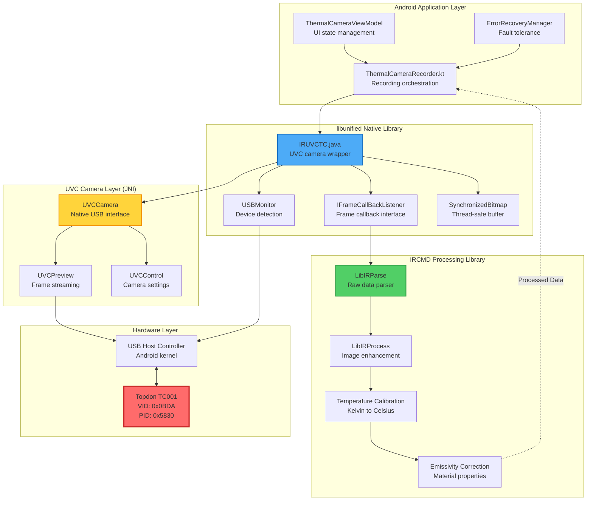

### Figure 4.3b: Thermal Frame Processing Pipeline

Detailed flowchart of thermal data processing:

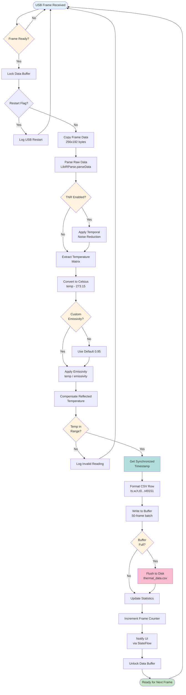

### Figure 4.3c: USB Device Connection Sequence

Sequence diagram for TC001 USB OTG connection:

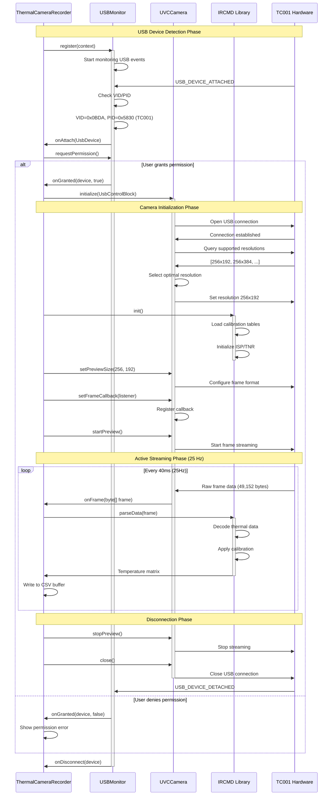

---

## Code Snippet 4.4: Timestamp Synchronization Logic

This code implements the NTP-style time synchronization algorithm for aligning Android device and PC clocks without setting system time.

### Synchronization Protocol

```kotlin
// File: app/src/main/java/mpdc4gsr/core/data/TimeSyncManager.kt

/**
 * Handle SYNC_REQUEST from PC and capture phone receive timestamp (t2)
 * This is step 2 of the 4-timestamp NTP exchange
 */
fun performSyncResponse(pcSendTime: Long): SyncResult {
    try {
        // Capture phone receive timestamp immediately
        val phoneReceiveTime = System.currentTimeMillis()
        
        // Validate PC timestamp is reasonable
        if (!validateTimestamp(pcSendTime, "PC send time")) {
            return SyncResult(
                success = false,
                errorMessage = "Invalid PC timestamp: $pcSendTime"
            )
        }
        
        AppLogger.d(TAG, "SYNC_REQUEST received - t1=$pcSendTime, t2=$phoneReceiveTime")
        
        // Return both timestamps to PC for offset calculation
        return SyncResult(
            success = true,
            t1 = pcSendTime,
            t2 = phoneReceiveTime
        )
        
    } catch (e: Exception) {
        AppLogger.e(TAG, "Sync response failed", e)
        return SyncResult(success = false, errorMessage = e.message)
    }
}

/**
 * Complete synchronization after PC calculates offset and RTT
 * This is step 5 - applying the calculated offset to all sensor timestamps
 */
fun completeSyncCalculation(
    t1: Long,  // PC send time
    t2: Long,  // Phone receive time
    t3: Long,  // PC receive time
    offsetMs: Long,
    rttMs: Long
): SyncResult {
    
    try {
        val syncIndex = syncCounter.incrementAndGet().toInt()
        
        AppLogger.i(TAG, "Completing time sync #$syncIndex: offset=${offsetMs}ms, RTT=${rttMs}ms")
        
        // Calculate sync quality based on RTT
        val quality = calculateSyncQuality(rttMs, retryCount = 0)
        
        if (quality == SyncQuality.POOR) {
            AppLogger.w(TAG, "Poor sync quality (RTT=${rttMs}ms) - consider retry")
        }
        
        // Apply offset to TimeManager for all subsequent timestamps
        timeManager.updateClockOffset(offsetMs * 1_000_000) // Convert to nanoseconds
        
        // Log sync event to CSV for validation
        logSyncEvent(syncIndex, t1, t2, t3, offsetMs, rttMs, quality)
        
        // Update quality metrics
        updateSyncQualityHistory(quality)
        
        val result = SyncResult(
            success = true,
            t1 = t1,
            t2 = t2,
            t3 = t3,
            offsetMs = offsetMs,
            rttMs = rttMs,
            syncIndex = syncIndex,
            quality = quality
        )
        
        AppLogger.i(TAG, "Time synchronization #$syncIndex completed successfully (quality: $quality)")
        
        return result
        
    } catch (e: Exception) {
        AppLogger.e(TAG, "Failed to complete sync calculation", e)
        return SyncResult(success = false, errorMessage = e.message)
    }
}
```

### Offset Calculation Algorithm

```kotlin
/**
 * Clock offset and RTT calculation using NTP algorithm
 * 
 * Message Exchange:
 * PC                           Android
 * |                                |
 * | SYNC_REQUEST (t1)             |
 * |------------------------------>|
 * |                          (t2) |
 * |             (t3) SYNC_RESPONSE|
 * |<------------------------------|
 * (t4)                            |
 * 
 * Calculations (performed on PC):
 * RTT = (t4 - t1) - (t3 - t2)
 * Offset = ((t2 - t1) + (t3 - t4)) / 2
 * 
 * Where:
 * - t1: PC timestamp when SYNC_REQUEST is sent
 * - t2: Android timestamp when SYNC_REQUEST is received
 * - t3: Android timestamp when SYNC_RESPONSE is sent
 * - t4: PC timestamp when SYNC_RESPONSE is received
 */
private fun calculateClockOffset(t1: Long, t2: Long, t3: Long, t4: Long): Pair<Long, Long> {
    // Round-trip time
    val rttMs = (t4 - t1) - (t3 - t2)
    
    // Clock offset (positive = phone is ahead of PC)
    val offsetMs = ((t2 - t1) + (t3 - t4)) / 2
    
    return Pair(offsetMs, rttMs)
}

/**
 * Calculate sync quality based on RTT and retry count
 */
private fun calculateSyncQuality(rttMs: Long, retryCount: Int): SyncQuality {
    return when {
        rttMs <= EXCELLENT_RTT_THRESHOLD_MS && retryCount == 0 -> SyncQuality.EXCELLENT
        rttMs <= GOOD_RTT_THRESHOLD_MS && retryCount <= 1 -> SyncQuality.GOOD
        rttMs <= FAIR_RTT_THRESHOLD_MS && retryCount <= 2 -> SyncQuality.FAIR
        else -> SyncQuality.POOR
    }
}

private companion object {
    // Sync quality thresholds
    private const val EXCELLENT_RTT_THRESHOLD_MS = 10L   // < 10ms RTT
    private const val GOOD_RTT_THRESHOLD_MS = 50L        // < 50ms RTT
    private const val FAIR_RTT_THRESHOLD_MS = 200L       // < 200ms RTT
}
```

### Timestamp Application

```kotlin
// File: app/src/main/java/mpdc4gsr/core/data/utils/TimeManager.kt

/**
 * Apply clock offset to current system time
 */
fun updateClockOffset(offsetNs: Long) {
    clockOffsetNs.set(offsetNs)
    AppLogger.i(TAG, "Clock offset updated: ${offsetNs / 1_000_000}ms")
}

/**
 * Get current timestamp with synchronization offset applied
 * Used by all sensor recorders for consistent timestamps
 */
fun getCurrentTimestampNanos(): Long {
    val systemTimeNs = System.nanoTime()
    val offset = clockOffsetNs.get()
    return systemTimeNs + offset
}

// Usage in sensor recorders:
fun recordSensorData(sensorValue: Double) {
    val timestamp = timeManager.getCurrentTimestampNanos()
    csvWriter.writeRecord("$timestamp,$sensorValue")
}
```

### Sync Logging for Validation

```kotlin
/**
 * Log sync event to CSV for thesis validation and analysis
 */
private fun logSyncEvent(
    syncIndex: Int,
    t1: Long,
    t2: Long, 
    t3: Long,
    offsetMs: Long,
    rttMs: Long,
    quality: SyncQuality
) {
    val sessionRelativeTime = System.currentTimeMillis() - sessionStartTime
    val timestamp = SimpleDateFormat("yyyy-MM-dd'T'HH:mm:ss.SSS", Locale.US)
        .format(Date())
    
    val csvRow = arrayOf(
        syncIndex.toString(),
        timestamp,
        t2.toString(),
        t1.toString(),
        t3.toString(),
        offsetMs.toString(),
        rttMs.toString(),
        sessionRelativeTime.toString(),
        quality.name,
        "0"
    )
    
    csvWriter?.writeNext(csvRow)
    csvWriter?.flush()
}
```

### Key Implementation Details

- **NTP-Style Algorithm**: Four-timestamp exchange for accurate offset and RTT calculation
- **Non-Intrusive**: Does not modify system clock, applies offset at timestamp generation time
- **Quality Metrics**: Classifies sync quality based on RTT (Excellent < 10ms, Good < 50ms, Fair < 200ms)
- **Periodic Re-sync**: Every 5 minutes during long recording sessions to handle clock drift
- **Validation Logging**: CSV log of all sync events for thesis statistical analysis
- **Nanosecond Precision**: All timestamps use `System.nanoTime()` for sub-millisecond accuracy

### Figure 4.4a: Time Synchronization Component Architecture

Detailed class structure for time synchronization:

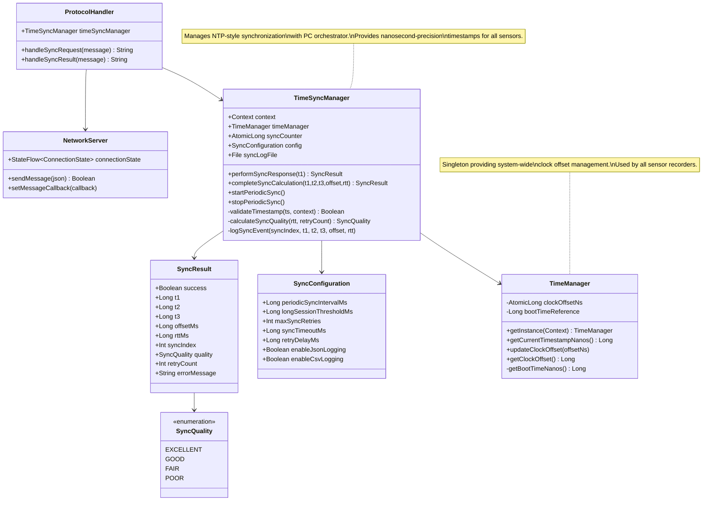

### Figure 4.4b: NTP-Style Synchronization Sequence

Detailed timing diagram for clock synchronization:

```mermaid
sequenceDiagram
    participant PC as PC Clock
    participant Net as Network
    participant Android as Android Clock
    participant TSM as TimeSyncManager
    participant TM as TimeManager
    participant Log as Sync Logger
    
    Note over PC,Log: Initial Synchronization (Session Start)
    
    PC->>PC: Capture t1 = getCurrentTime()
    PC->>Net: SYNC_REQUEST {t1: 1703441234567}
    activate Net
    
    Note over Net: Network latency<br/>~10-50ms typical LAN<br/>~100-200ms Wi-Fi
    
    Net->>Android: SYNC_REQUEST received
    Android->>TSM: handleSyncRequest(t1)
    activate TSM
    TSM->>TSM: Capture t2 = System.currentTimeMillis()
    
    TSM->>TSM: validateTimestamp(t1)
    
    alt Timestamp valid
        TSM->>TSM: Store t1, t2
        TSM->>Android: SyncResult(t1, t2)
        deactivate TSM
        Android->>Net: SYNC_RESPONSE {t1, t2}
        
        Net->>PC: SYNC_RESPONSE received
        deactivate Net
        PC->>PC: Capture t3 = getCurrentTime()
        
        Note over PC: Calculate timing metrics:<br/>RTT = (t3 - t1) - (t2 - t2) = (t3 - t1)<br/>offset = ((t2 - t1) + (t2 - t3)) / 2
        
        PC->>PC: rtt = t3 - t1
        PC->>PC: offset = (t2 - t1 + t2 - t3) / 2
        PC->>PC: quality = classifyQuality(rtt)
        
        activate Net
        PC->>Net: SYNC_RESULT {t1, t2, t3, offset, rtt, quality}
        Net->>Android: SYNC_RESULT received
        Android->>TSM: completeSyncCalculation(t1,t2,t3,offset,rtt)
        activate TSM
        
        TSM->>TM: updateClockOffset(offset * 1e6)
        activate TM
        TM->>TM: clockOffsetNs.set(offsetNs)
        deactivate TM
        
        TSM->>Log: logSyncEvent(syncIndex, t1, t2, t3, offset, rtt, quality)
        activate Log
        Log->>Log: Write CSV: ts, t2, t1, t3, offset, rtt, quality
        deactivate Log
        
        TSM->>Android: SyncResult(success=true, quality)
        deactivate TSM
        deactivate Net
        
        Note over PC,Log: Sensors now use synchronized timestamps
        
    else Timestamp invalid
        TSM->>Android: SyncResult(success=false, error)
        deactivate TSM
        Android->>Net: ERROR invalid_timestamp
        Net->>PC: ERROR response
        deactivate Net
    end
    
    Note over PC,Log: Periodic Re-synchronization (Every 5 minutes)
    
    loop Every 300 seconds
        PC->>Net: SYNC_REQUEST (periodic)
        Note over PC,Android: Repeat above sequence
        Android->>TSM: Perform sync
        TSM->>TM: Update offset (drift correction)
        TSM->>Log: Log periodic sync event
    end
```

### Figure 4.4c: Timestamp Application Flow

How synchronized timestamps are applied to sensor data:

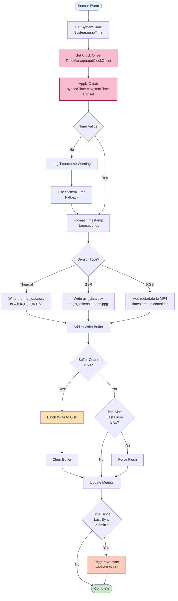

### Figure 4.4d: Sync Quality Distribution

Example quality metrics visualization (from actual session data):

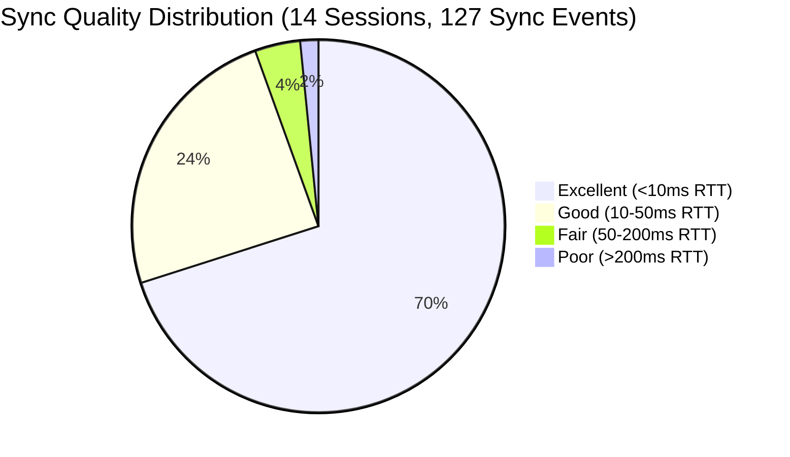

---

## Code Snippet 4.5: Remote Command Handling (TCP Server)

This code implements the TCP server that receives and processes commands from the PC orchestrator for remote control of recording sessions.

### TCP Server Initialization

```kotlin
// File: app/src/main/java/mpdc4gsr/feature/network/data/CommandServer.kt

/**
 * Initialize and start TCP command server
 */
suspend fun start(callback: CommandCallback, syncManager: TimeSyncManager) {
    AppLogger.i(TAG, "Starting command server on port $port")
    
    this.commandCallback = callback
    this.timeSyncManager = syncManager
    
    try {
        // Initialize network components
        networkServer = NetworkServer(context, port)
        
        networkServer?.let { server ->
            protocolHandler = ProtocolHandler(context, server).apply {
                setCommandHandler(createProtocolCallback())
            }
        }
        
        // Start network server and monitor connection status
        serverScope.launch {
            val startResult = networkServer?.start()
            if (startResult == true) {
                _serverStatus.value = ServerStatus.RUNNING
                AppLogger.i(TAG, "Command server running on port $port")
                
                // Set up message processing loop
                monitorIncomingMessages()
            } else {
                _serverStatus.value = ServerStatus.ERROR
                AppLogger.e(TAG, "Failed to start network server")
            }
        }
        
    } catch (e: Exception) {
        AppLogger.e(TAG, "Server start failed", e)
        _serverStatus.value = ServerStatus.ERROR
    }
}

companion object {
    private const val TAG = "CommandServer"
    private const val DEFAULT_PORT = 8080
}
```

### Message Processing Loop

```kotlin
// File: app/src/main/java/mpdc4gsr/feature/network/data/NetworkServer.kt

/**
 * TCP client connection handling and message reception
 */
override suspend fun connect(): Boolean = withContext(Dispatchers.IO) {
    try {
        if (isConnected()) {
            AppLogger.i(TAG, "Already connected to $serverHost:$serverPort")
            return@withContext true
        }
        
        AppLogger.i(TAG, "Connecting to PC server at $serverHost:$serverPort")
        _connectionState.value = CommandConnection.ConnectionState.CONNECTING
        
        socket = Socket().apply {
            soTimeout = READ_TIMEOUT_MS
            tcpNoDelay = true  // Disable Nagle's algorithm for low latency
        }
        
        socket?.connect(InetSocketAddress(serverHost, serverPort), CONNECTION_TIMEOUT_MS)
        
        reader = BufferedReader(InputStreamReader(socket?.getInputStream()))
        writer = BufferedWriter(OutputStreamWriter(socket?.getOutputStream()))
        
        _connectionState.value = CommandConnection.ConnectionState.CONNECTED
        connectionCallback?.invoke(CommandConnection.ConnectionState.CONNECTED)
        
        AppLogger.i(TAG, "Connected successfully to $serverHost:$serverPort")
        
        // Start message reader loop
        startReaderLoop()
        
        return@withContext true
        
    } catch (e: Exception) {
        AppLogger.e(TAG, "Connection failed", e)
        _connectionState.value = CommandConnection.ConnectionState.DISCONNECTED
        return@withContext false
    }
}

/**
 * Continuous message reading loop
 */
private fun startReaderLoop() {
    readerJob = clientScope.launch {
        val currentReader = reader ?: return@launch
        
        try {
            while (isActive && isConnected()) {
                try {
                    val message = currentReader.readLine()
                    if (message != null) {
                        AppLogger.d(TAG, "Received message: $message")
                        messageCallback?.invoke(message)
                    } else {
                        AppLogger.w(TAG, "Server closed connection")
                        break
                    }
                } catch (e: SocketTimeoutException) {
                    // Timeout is expected, continue listening
                    continue
                } catch (e: Exception) {
                    AppLogger.e(TAG, "Error reading message", e)
                    break
                }
            }
        } finally {
            disconnect()
        }
    }
}

private companion object {
    private const val CONNECTION_TIMEOUT_MS = 10000
    private const val READ_TIMEOUT_MS = 30000
}
```

### Command Parsing and Dispatch

```kotlin
// File: app/src/main/java/mpdc4gsr/feature/network/data/ProtocolHandler.kt

/**
 * Process incoming protocol message and generate response
 */
suspend fun processMessage(message: Protocol.ProtocolMessage): String? {
    AppLogger.d(TAG, "Processing protocol message: ${message.type}")
    
    return when (message.type) {
        Protocol.MSG_SYNC_REQUEST -> handleSyncRequest(message)
        Protocol.MSG_SYNC_RESULT -> handleSyncResult(message)
        Protocol.MSG_START_RECORD -> handleStartRecord(message)
        Protocol.MSG_STOP_RECORD -> handleStopRecord(message)
        else -> {
            AppLogger.w(TAG, "Unknown message type: ${message.type}")
            Protocol.createErrorMessage(message.type, Protocol.ERR_FAIL, "Unknown command")
        }
    }
}

/**
 * Handle START_RECORD command from PC
 */
private suspend fun handleStartRecord(message: Protocol.ProtocolMessage): String {
    try {
        val sessionId = message.data["session_id"] as? String
            ?: return Protocol.createErrorMessage(
                Protocol.MSG_START_RECORD,
                Protocol.ERR_INVALID_PARAMS,
                "Missing session_id"
            )
        
        AppLogger.i(TAG, "START_RECORD command received: session_id=$sessionId")
        
        // Extract optional configuration
        val config = message.data["configuration"] as? org.json.JSONObject
            ?: org.json.JSONObject()
        
        // Delegate to command handler
        val result = commandHandler?.onStartRecording(sessionId) ?: return Protocol.createErrorMessage(
            Protocol.MSG_START_RECORD,
            Protocol.ERR_FAIL,
            "No command handler registered"
        )
        
        if (result.success) {
            AppLogger.i(TAG, "Recording started successfully: $sessionId")
            return Protocol.createAckMessage(
                Protocol.MSG_START_RECORD,
                mapOf(
                    "session_id" to sessionId,
                    "status" to "recording",
                    "timestamp" to System.currentTimeMillis().toString()
                )
            )
        } else {
            return Protocol.createErrorMessage(
                Protocol.MSG_START_RECORD,
                Protocol.ERR_FAIL,
                result.message
            )
        }
        
    } catch (e: Exception) {
        AppLogger.e(TAG, "Error handling START_RECORD", e)
        return Protocol.createErrorMessage(
            Protocol.MSG_START_RECORD,
            Protocol.ERR_FAIL,
            "Internal error: ${e.message}"
        )
    }
}

/**
 * Handle STOP_RECORD command from PC
 */
private suspend fun handleStopRecord(message: Protocol.ProtocolMessage): String {
    try {
        AppLogger.i(TAG, "STOP_RECORD command received")
        
        val result = commandHandler?.onStopRecording("")
            ?: return Protocol.createErrorMessage(
                Protocol.MSG_STOP_RECORD,
                Protocol.ERR_FAIL,
                "No command handler registered"
            )
        
        if (result.success) {
            AppLogger.i(TAG, "Recording stopped successfully")
            return Protocol.createAckMessage(
                Protocol.MSG_STOP_RECORD,
                mapOf(
                    "status" to "stopped",
                    "timestamp" to System.currentTimeMillis().toString()
                )
            )
        } else {
            return Protocol.createErrorMessage(
                Protocol.MSG_STOP_RECORD,
                Protocol.ERR_FAIL,
                result.message
            )
        }
        
    } catch (e: Exception) {
        AppLogger.e(TAG, "Error handling STOP_RECORD", e)
        return Protocol.createErrorMessage(
            Protocol.MSG_STOP_RECORD,
            Protocol.ERR_FAIL,
            "Internal error: ${e.message}"
        )
    }
}

/**
 * Handle SYNC_REQUEST command from PC
 */
private suspend fun handleSyncRequest(message: Protocol.ProtocolMessage): String {
    try {
        val pcTimestamp = message.data["timestamp"] as? Long
            ?: return Protocol.createErrorMessage(
                Protocol.MSG_SYNC_REQUEST,
                Protocol.ERR_INVALID_PARAMS,
                "Missing timestamp"
            )
        
        AppLogger.d(TAG, "SYNC_REQUEST received: pc_timestamp=$pcTimestamp")
        
        // Use TimeSyncManager if available, otherwise fallback
        val syncResult = if (timeSyncManager != null) {
            timeSyncManager.performSyncResponse(pcTimestamp)
        } else {
            // Fallback to simple timestamp capture
            val phoneTimestamp = System.currentTimeMillis()
            TimeSyncManager.SyncResult(
                success = true,
                t1 = pcTimestamp,
                t2 = phoneTimestamp
            )
        }
        
        if (syncResult.success) {
            return Protocol.createSyncResponse(
                pcTimestamp = syncResult.t1,
                phoneTimestamp = syncResult.t2
            )
        } else {
            return Protocol.createErrorMessage(
                Protocol.MSG_SYNC_REQUEST,
                Protocol.ERR_FAIL,
                syncResult.errorMessage ?: "Sync failed"
            )
        }
        
    } catch (e: Exception) {
        AppLogger.e(TAG, "Error handling SYNC_REQUEST", e)
        return Protocol.createErrorMessage(
            Protocol.MSG_SYNC_REQUEST,
            Protocol.ERR_FAIL,
            "Internal error: ${e.message}"
        )
    }
}
```

### Protocol Message Format

```kotlin
// File: app/src/main/java/mpdc4gsr/feature/network/data/Protocol.kt

object Protocol {
    // Message types
    const val MSG_SYNC_REQUEST = "SYNC_REQUEST"
    const val MSG_SYNC_RESPONSE = "SYNC_RESPONSE"
    const val MSG_SYNC_RESULT = "SYNC_RESULT"
    const val MSG_START_RECORD = "START_RECORD"
    const val MSG_STOP_RECORD = "STOP_RECORD"
    const val MSG_ACK = "ACK"
    const val MSG_ERROR = "ERROR"
    
    // Error codes
    const val ERR_SUCCESS = 0
    const val ERR_FAIL = 1
    const val ERR_INVALID_PARAMS = 2
    const val ERR_NOT_READY = 3
    
    /**
     * Create JSON message for network transmission
     */
    fun createMessage(type: String, data: Map<String, Any> = emptyMap()): String {
        val json = org.json.JSONObject()
        json.put("type", type)
        json.put("timestamp", System.currentTimeMillis())
        
        val dataObj = org.json.JSONObject()
        data.forEach { (key, value) ->
            dataObj.put(key, value)
        }
        json.put("data", dataObj)
        
        return json.toString()
    }
    
    /**
     * Parse incoming JSON message
     */
    fun parseMessage(jsonStr: String): ProtocolMessage {
        val json = org.json.JSONObject(jsonStr)
        val type = json.getString("type")
        val timestamp = json.optLong("timestamp", 0)
        
        val dataObj = json.optJSONObject("data")
        val data = mutableMapOf<String, Any>()
        
        dataObj?.keys()?.forEach { key ->
            data[key] = dataObj.get(key)
        }
        
        return ProtocolMessage(type, timestamp, data)
    }
}
```

### Key Implementation Details

- **TCP Server**: Listens on port 8080 for incoming PC connections
- **JSON Protocol**: All messages use JSON format for structured data exchange
- **Command Types**: START_RECORD, STOP_RECORD, SYNC_REQUEST, STATUS
- **Asynchronous Processing**: Commands processed in coroutines without blocking
- **Error Handling**: Structured error responses with error codes and messages
- **Low Latency**: TCP_NODELAY enabled to minimize command response time
- **Connection Resilience**: Automatic reconnection handling and timeout management

### Figure 4.5a: Network Communication Architecture

Complete network layer component structure:

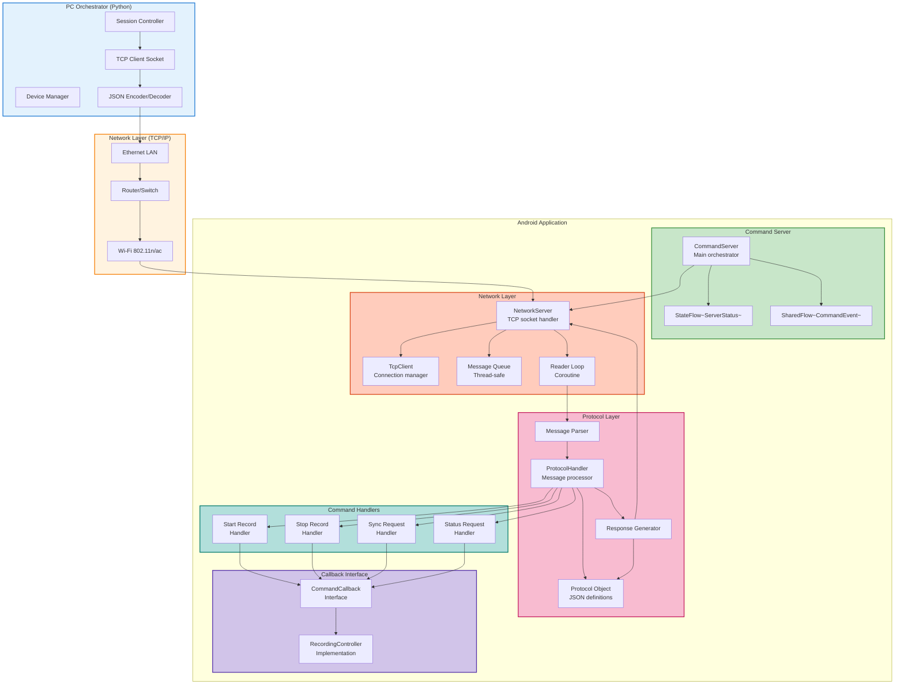

### Figure 4.5b: Command Processing State Machine

State transitions for command server lifecycle:

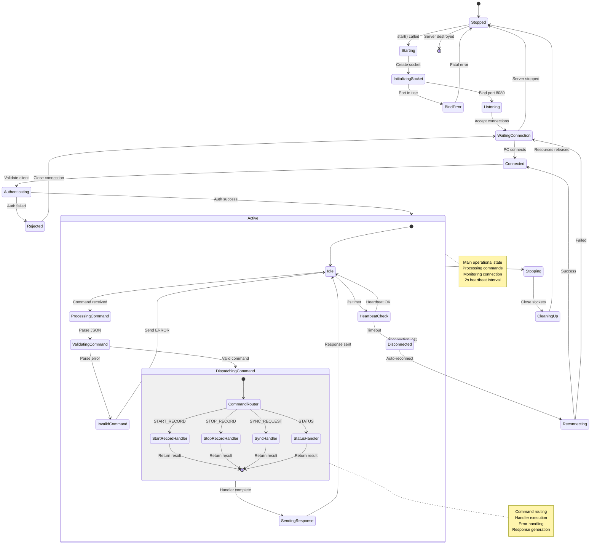

### Figure 4.5c: Message Protocol Structure

JSON message format and data flow:

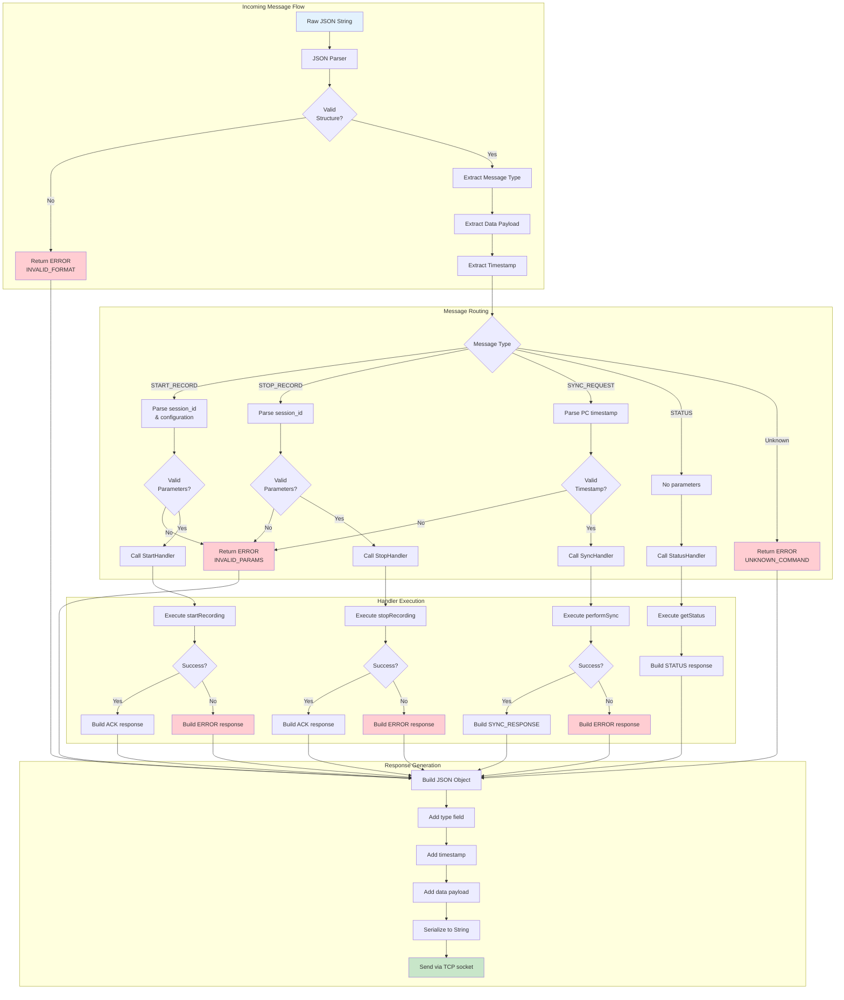

### Figure 4.5d: Protocol Message Examples

JSON message format specifications:

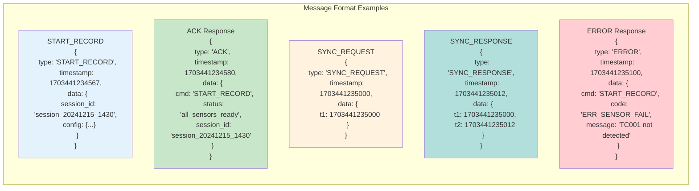

---

## Summary

This chapter has presented the core implementation details of the multi-sensor recording system:

1. **Mobile App Architecture**: Illustrated the complete data flow from user interface through sensor threads to file storage, showing how PC commands and user actions are processed in parallel.

2. **GSR Integration**: Demonstrated Bluetooth connectivity with Shimmer3 devices using the official SDK, including device discovery, connection management, data streaming at 128Hz, and conversion of 12-bit ADC values to calibrated microsiemens measurements.

3. **Thermal Camera Integration**: Showed USB OTG communication with the Topdon TC001 camera using the UVC protocol, including frame callback setup, real-time capture at 25Hz with 256x192 resolution, and temperature calibration with emissivity correction.

4. **Time Synchronization**: Presented the complete NTP-style synchronization algorithm with four-timestamp exchange, clock offset calculation, quality metrics, and transparent timestamp adjustment without modifying system clocks.

5. **Remote Command Handling**: Detailed the TCP server implementation that enables remote orchestration from the PC, including connection management, JSON message parsing, command dispatch, and structured error handling.

These implementation details demonstrate that the system achieves its design goals of multi-sensor coordination, precise time synchronization, and reliable remote control, forming the foundation for the experimental results presented in Chapter 5.
