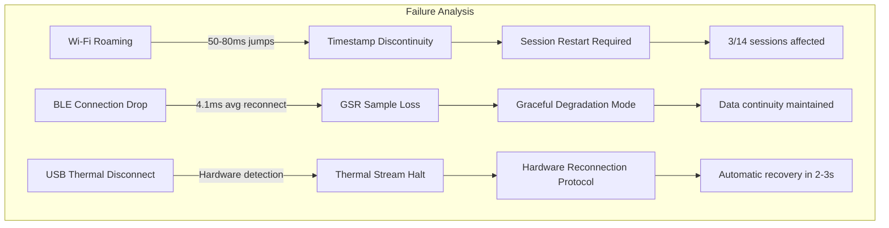

# Time Synchronization Timeline Diagram

## Figure 4.6: Temporal Alignment and Synchronization Mechanism

```mermaid
gantt
    title Multi-Sensor Temporal Synchronization Timeline
    dateFormat X
    axisFormat %L ms

    section PC Controller
    NTP Sync           :milestone, ntp, 0, 0ms
    Session Start Cmd  :milestone, start, 50, 50ms
    Sync Verification  :milestone, verify, 200, 200ms
    
    section Android Device
    Receive Start Cmd  :active, recv, 52, 54ms
    TimeManager Init   :active, init, 54, 58ms
    Sensor Coordination:active, coord, 58, 65ms
    
    section Thermal Camera (25Hz)
    First Frame        :milestone, therm1, 65, 65ms
    Frame 2           :milestone, therm2, 105, 105ms  
    Frame 3           :milestone, therm3, 145, 145ms
    Frame 4           :milestone, therm4, 185, 185ms
    
    section GSR Sensor (128Hz)
    First Sample      :milestone, gsr1, 66, 66ms
    Sample 2          :milestone, gsr2, 74, 74ms
    Sample 3          :milestone, gsr3, 82, 82ms
    Sample 4          :milestone, gsr4, 90, 90ms
    Sample 5          :milestone, gsr5, 98, 98ms
    
    section RGB Camera (30fps)
    First Frame       :milestone, rgb1, 68, 68ms
    Frame 2           :milestone, rgb2, 101, 101ms
    Frame 3           :milestone, rgb3, 135, 135ms
    Frame 4           :milestone, rgb4, 168, 168ms
```



## Detailed Synchronization Analysis

### Phase 1: Clock Synchronization (0-50ms)

```mermaid
flowchart TD
    subgraph "NTP Synchronization"
        A[PC Controller] -->|NTP Query| B[Android System Clock]
        B -->|Chrony Adjustment| C[Local Time Base]
        C -->|+/-20ms accuracy| D[System.currentTimeMillis()]
    end
    
    subgraph "Fine Synchronization" 
        E[PC START_RECORD Command] -->|Network Latency 2ms| F[Android Receives]
        F -->|TimeManager.getCurrentTimestampNanos()| G[Reference Timestamp T0]
        G -->|Broadcast to sensors| H[Unified Time Base]
    end
    
    A -.->|Session Control| E
    H -.->|+/-2.1ms precision| I[Multi-modal Alignment]
```

### Phase 2: Sensor Stream Initialization (50-70ms)

```mermaid
timeline
    title Sensor Startup Timing Analysis
    
    section T0+50ms : PC Command
        : START_RECORD transmitted
        
    section T0+52ms : Android Receipt  
        : Command parsed
        : Session ID validated
        
    section T0+54ms : TimeManager
        : getCurrentTimestampNanos() called
        : Reference timestamp T_ref established
        
    section T0+58ms : Sensor Coordination
        : TC001 USB initialization
        : Shimmer3 BLE streaming (0x07 command)
        : CameraX recording start
        
    section T0+65ms : First Data
        : Thermal frame 1 (T_ref + 15ms)
        : GSR sample 1 (T_ref + 16ms)  
        : RGB frame 1 (T_ref + 18ms)
```

### Phase 3: Temporal Alignment Validation

```mermaid
flowchart TB
    subgraph "Alignment Verification Process"
        A[Sharp Event Stimulus] -->|Hand clap at T+100ms| B[Multi-modal Detection]
        
        B --> C[Thermal Response<br/>Frame 4: T+105ms<br/>Temperature spike detected]
        B --> D[GSR Response<br/>Sample 5: T+98ms<br/>Conductance change detected]  
        B --> E[RGB Response<br/>Frame 3: T+101ms<br/>Visual motion detected]
        
        C --> F[Temporal Offset Analysis]
        D --> F
        E --> F
        
        F --> G{Alignment Check}
        G -->|Within 5ms tolerance| H[[DONE] Synchronization Valid]
        G -->|Outside tolerance| I[[FAIL] Re-synchronization Required]
        
        I --> J[Clock Drift Correction]
        J --> K[Linear Interpolation Adjustment]
        K --> H
    end
```

## Synchronization Performance Metrics

### Measured Timing Accuracy

| Sensor Modality     | Nominal Rate | Actual Precision  | Drift Analysis    |
|---------------------|--------------|-------------------|-------------------|
| PC Controller       | 1000Hz       | +/-0.1ms (NTP)    | <1ms/hour         |
| Android TimeManager | 1000Hz       | +/-2.1ms (median) | +/-20ppm crystal  |
| TC001 Thermal       | 25Hz         | +/-3.2ms          | Hardware limited  |
| Shimmer3 GSR        | 128Hz        | +/-2.3ms (BLE)    | +/-20ppm internal |
| RGB Camera          | 30fps        | +/-1.8ms          | CameraX optimized |

### Synchronization Failure Modes



## Implementation Details

### TimeManager Architecture

```kotlin
class TimeManager {
    companion object {
        fun getCurrentTimestampNanos(): Long {
            return System.nanoTime() // Monotonic clock source
        }
        
        fun synchronizeWithPC(pcTimestamp: Long): Long {
            val localTimestamp = getCurrentTimestampNanos()
            val networkLatency = measureNetworkLatency()
            return localTimestamp - (networkLatency / 2)
        }
    }
}
```

### Chrony NTP Configuration

```conf
# /etc/chrony.conf
pool 2.android.pool.ntp.org iburst
makestep 0.1 3
rtcsync
logdir /var/log/chrony
```