# Software State Machine for Recording Control

## Figure 3.2: State Machine - Android Recording Application

This state diagram depicts the states of the Android recording app (Idle, Ready, Recording, Syncing, Stopped) and
transitions triggered by events such as START or STOP commands from the PC, or sensor connection events.

```mermaid
stateDiagram-v2
    [*] --> Disconnected: App Launch
    
    state "Disconnected State" as Disconnected {
        [*] --> NoConnection: Entry
        NoConnection --> ScanningNetwork: Auto-discovery enabled
        ScanningNetwork --> NoConnection: No PC found (30s timeout)
        NoConnection --> [*]: User initiates manual connect
    }
    
    Disconnected --> Connecting: TCP Connect Initiated<br/>User action / mDNS discovery
    
    state "Connecting State" as Connecting {
        [*] --> SocketOpening: Open TCP socket
        SocketOpening --> Handshaking: Socket connected
        Handshaking --> SendingHello: Send HELLO message
        SendingHello --> AwaitingHelloAck: Waiting for PC ACK
        AwaitingHelloAck --> [*]: ACK received
        
        SocketOpening --> ConnectFailed: Timeout (30s)
        Handshaking --> ConnectFailed: Protocol error
        SendingHello --> ConnectFailed: Network error
        AwaitingHelloAck --> ConnectFailed: Timeout (5s)
    }
    
    Connecting --> Disconnected: Connection Failed<br/>Timeout / Network error
    Connecting --> Idle: Connection Established<br/>HELLO + ACK complete
    
    state "Idle State" as Idle {
        [*] --> WaitingCommands: Entry
        WaitingCommands --> SendingHeartbeat: Every 2 seconds
        SendingHeartbeat --> WaitingCommands: Heartbeat sent
        WaitingCommands --> ProcessingCommand: Command received
        ProcessingCommand --> WaitingCommands: Command processed
    }
    
    Idle --> Initializing: START_RECORD<br/>from PC
    Idle --> Disconnected: DISCONNECT<br/>Network lost
    
    state "Initializing Sensors" as Initializing {
        [*] --> CheckingPrerequisites
        CheckingPrerequisites --> CheckingStorage: Storage available
        CheckingStorage --> CheckingBattery: Storage OK (>1GB)
        CheckingBattery --> CheckingPermissions: Battery OK (>15%)
        CheckingPermissions --> StartingSensors: Permissions granted
        
        CheckingStorage --> InitFailed: Storage full
        CheckingBattery --> InitFailed: Battery critical
        CheckingPermissions --> InitFailed: Permission denied
        
        state StartingSensors {
            [*] --> fork_sensors
            fork_sensors --> InitThermal
            fork_sensors --> InitGSR  
            fork_sensors --> InitRGB
            
            state "Thermal Init" as InitThermal {
                [*] --> DetectUSB: Check USB device
                DetectUSB --> VerifyVID: Device found
                VerifyVID --> InitSDK: VID/PID match<br/>0x0525/0xa4a2
                InitSDK --> ConfigParams: SDK loaded
                ConfigParams --> StartStream: Set emissivity,<br/>temp range
                StartStream --> ThermalOK: First frame received
                
                DetectUSB --> ThermalError: No device
                VerifyVID --> ThermalError: Wrong device
                InitSDK --> ThermalError: SDK init failed
                StartStream --> ThermalError: Stream timeout
            }
            
            state "GSR Init" as InitGSR {
                [*] --> ScanBLE: BLE scan
                ScanBLE --> FilterDevices: Devices found
                FilterDevices --> ConnectGATT: Shimmer3 detected
                ConnectGATT --> DiscoverServices: Connection OK
                DiscoverServices --> EnableNotifications: GSR service found
                EnableNotifications --> StartSampling: Notifications enabled
                StartSampling --> GSRReady: First sample<br/>received @128Hz
                
                ScanBLE --> GSRError: Scan timeout (10s)
                FilterDevices --> GSRError: No Shimmer3
                ConnectGATT --> GSRError: Connection failed
                DiscoverServices --> GSRError: Service not found
                StartSampling --> GSRError: Sampling failed
            }
            
            state "RGB Init" as InitRGB {
                [*] --> RequestPermission: Camera permission
                RequestPermission --> OpenCamera: Permission OK
                OpenCamera --> ConfigSession: Camera opened
                ConfigSession --> SetupEncoder: Session configured<br/>1920x1080@30fps
                SetupEncoder --> StartPreview: H.264 encoder ready
                StartPreview --> RGBReady: Preview active
                
                RequestPermission --> RGBError: Permission denied
                OpenCamera --> RGBError: Camera unavailable
                ConfigSession --> RGBError: Config failed
                SetupEncoder --> RGBError: Encoder error
            }
            
            InitThermal --> join_sensors
            InitGSR --> join_sensors
            InitRGB --> join_sensors
            join_sensors --> [*]: All sensors ready
            
            ThermalError --> [*]: Error
            GSRError --> [*]: Error (optional sensor)
            RGBError --> [*]: Error
        }
        
        StartingSensors --> AllReady: Success
        StartingSensors --> InitFailed: Critical error
    }
    
    Initializing --> Ready: All Sensors<br/>Initialized
    Initializing --> Error: Init Failed<br/>Critical sensor
    
    state "Ready State" as Ready {
        [*] --> PreviewMode: Show sensor previews
        PreviewMode --> BuffersAllocated: Allocate write buffers
        BuffersAllocated --> WaitingStart: Send READY to PC
        WaitingStart --> FinalSync: BEGIN_RECORDING received
        FinalSync --> [*]: Sync complete
    }
    
    Ready --> Recording: BEGIN_RECORDING<br/>Final sync done
    Ready --> Error: Timeout (10s)<br/>No start command
    
    state "Active Recording" as Recording {
        [*] --> fork_recording
        
        fork_recording --> ThermalCapture
        fork_recording --> GSRCapture
        fork_recording --> RGBCapture
        fork_recording --> HeartbeatTask
        fork_recording --> QualityMonitor
        
        state "Thermal Capture Loop" as ThermalCapture {
            [*] --> WaitFrame: 40ms interval
            WaitFrame --> ProcessFrame: Frame callback
            ProcessFrame --> Calibrate: Apply temp calibration
            Calibrate --> Timestamp: getCurrentTimestampNanos
            Timestamp --> WriteCSV: Format: ts,w,h,t0...t49151
            WriteCSV --> WaitFrame: Buffer flush
        }
        
        state "GSR Capture Loop" as GSRCapture {
            [*] --> WaitSample: 7.8ms interval
            WaitSample --> ConvertADC: 12-bit sample
            ConvertADC --> CalcMicrosiemens: ADC to μS
            CalcMicrosiemens --> TimestampGSR: getCurrentTimestampNanos
            TimestampGSR --> WriteGSRCSV: Format: ts,gsr,ppg
            WriteGSRCSV --> WaitSample: Buffer flush
        }
        
        state "RGB Capture Loop" as RGBCapture {
            [*] --> WaitVideoFrame: 33ms interval
            WaitVideoFrame --> EncodeH264: Frame to encoder
            EncodeH264 --> WriteMP4: Write to file
            WriteMP4 --> TimestampMeta: Store frame timestamp
            TimestampMeta --> WaitVideoFrame: Next frame
        }
        
        state "Heartbeat Task" as HeartbeatTask {
            [*] --> Wait2s: 2 second timer
            Wait2s --> GatherStats: Collect metrics
            GatherStats --> SendHeartbeat: HEARTBEAT to PC
            SendHeartbeat --> Wait2s: Loop
        }
        
        state "Quality Monitor" as QualityMonitor {
            [*] --> CheckThermal: Every 1s
            CheckThermal --> CheckGSR: Validate thermal frames
            CheckGSR --> CheckRGB: Validate GSR samples
            CheckRGB --> CheckStorage: Validate RGB frames
            CheckStorage --> CheckThermal: Check free space
        }
        
        ThermalCapture --> join_recording
        GSRCapture --> join_recording
        RGBCapture --> join_recording
        HeartbeatTask --> join_recording
        QualityMonitor --> join_recording
        join_recording --> [*]
    }
    
    Recording --> Syncing: SYNC_REQUEST<br/>from PC
    Recording --> Stopping: STOP_RECORD<br/>from PC
    Recording --> Pausing: PAUSE_RECORD<br/>from PC
    Recording --> Error: Critical Failure<br/>Sensor / Storage
    
    state "Pausing State" as Pausing {
        [*] --> SuspendCapture: Stop sensor reads
        SuspendCapture --> FlushBuffers: Write pending data
        FlushBuffers --> WaitResume: PAUSED status to PC
        WaitResume --> [*]: RESUME received
    }
    
    Pausing --> Recording: RESUME_RECORD
    Pausing --> Stopping: STOP_RECORD
    
    state "Time Sync State" as Syncing {
        [*] --> RecordT2: Receive SYNC_REQUEST
        RecordT2 --> CalculateOffset: Record t2, prepare t3
        CalculateOffset --> SendResponse: SYNC_RESPONSE
        SendResponse --> ApplyCorrection: Apply drift correction
        ApplyCorrection --> [*]: Resume recording
    }
    
    Syncing --> Recording: Sync Complete<br/>Drift < 5ms
    Syncing --> Error: Sync Failed<br/>Drift > 5ms
    
    state "Stopping State" as Stopping {
        [*] --> SignalStop: Broadcast stop to sensors
        SignalStop --> WaitSensorStop: Wait for sensor ACKs
        WaitSensorStop --> FlushAll: All stopped (timeout 5s)
        FlushAll --> CloseStreams: Flush write buffers
        CloseStreams --> [*]: Streams closed
        
        WaitSensorStop --> ForceStop: Timeout exceeded
        ForceStop --> [*]: Force close
    }
    
    Stopping --> Finalizing: Graceful Stop<br/>Complete
    Stopping --> Error: Force Stop<br/>Sensor hang
    
    state "Finalizing State" as Finalizing {
        [*] --> CloseCSV: Close thermal CSV
        CloseCSV --> CloseGSRCSV: Close GSR CSV
        CloseGSRCSV --> FinalizeVideo: Close MP4 file
        FinalizeVideo --> GenerateMeta: Create metadata.json
        GenerateMeta --> CalculateChecksums: File integrity check
        CalculateChecksums --> [*]: Finalization complete
    }
    
    Finalizing --> Transferring: Files Ready<br/>Start transfer
    
    state "File Transfer State" as Transferring {
        [*] --> SendManifest: File list + sizes
        SendManifest --> WaitRequest: PC requests files
        
        state WaitRequest {
            [*] --> ReceiveFileReq
            ReceiveFileReq --> ReadChunk: Read 1MB chunk
            ReadChunk --> SendChunk: Send to PC
            SendChunk --> ReceiveFileReq: Wait next request
            SendChunk --> FileComplete: All chunks sent
            FileComplete --> [*]: PC ACK received
        }
        
        WaitRequest --> AllTransferred: All files done
        AllTransferred --> [*]: Transfer complete
    }
    
    Transferring --> Idle: Transfer<br/>Complete
    Transferring --> Error: Transfer Failed<br/>Network lost
    
    state "Error State" as Error {
        [*] --> ClassifyError: Determine error type
        ClassifyError --> LogError: Log to file
        LogError --> EmergencySave: Save buffered data
        EmergencySave --> NotifyPC: Send ERROR message
        NotifyPC --> WaitAction: Await recovery
        
        state "Error Classification" as WaitAction {
            NetworkError
            SensorError
            StorageError
            SyncError
            CriticalError
        }
    }
    
    Error --> Recovering: Auto Recovery<br/>Attempt
    Error --> Idle: Manual Reset<br/>USER_RESET
    Error --> Disconnected: Fatal Error<br/>Force disconnect
    
    state "Recovery State" as Recovering {
        [*] --> DetermineStrategy: Error type analysis
        DetermineStrategy --> ReconnectNetwork: Network error
        DetermineStrategy --> ReinitSensor: Sensor error
        DetermineStrategy --> ClearStorage: Storage error
        DetermineStrategy --> Resync: Sync error
        
        ReconnectNetwork --> TestConnection: Exponential backoff
        ReinitSensor --> TestSensor: Retry sensor init
        ClearStorage --> TestStorage: Free space
        Resync --> TestSync: Re-synchronize
        
        TestConnection --> RecoverySuccess: Connected
        TestSensor --> RecoverySuccess: Sensor OK
        TestStorage --> RecoverySuccess: Space OK
        TestSync --> RecoverySuccess: Synced
        
        TestConnection --> RecoveryFailed: Max retries (3)
        TestSensor --> RecoveryFailed: Init failed
        TestStorage --> RecoveryFailed: Cannot free space
        TestSync --> RecoveryFailed: Sync failed
        
        RecoverySuccess --> [*]: Recovery complete
        RecoveryFailed --> [*]: Recovery failed
    }
    
    Recovering --> Idle: Recovery Success<br/>No session active
    Recovering --> Recording: Recovery Success<br/>Session resumed
    Recovering --> Error: Recovery Failed<br/>Max retries
    
    note right of Disconnected
        Entry: Clear all state
        No TCP connection
        UI: "Connect" button enabled
        Network scanner: inactive
        Exit: None
    end note
    
    note right of Idle
        Entry: Start heartbeat timer
        TCP: Connected to PC
        Protocol: HELLO exchanged
        Status: Waiting for commands
        Heartbeat: Every 2 seconds
        Exit: Stop heartbeat
    end note
    
    note right of Ready
        Entry: Send READY message
        Sensors: All initialized
        Storage: Buffers allocated
        Preview: Streams active
        Waiting: BEGIN_RECORDING
        Timeout: 10 seconds
        Exit: None
    end note
    
    note right of Recording
        Entry: Broadcast START
        Thermal: 25 Hz → CSV
        GSR: 128 Hz → CSV
        RGB: 30 fps → MP4
        Quality: Monitored
        Heartbeat: Active
        Exit: Stop all captures
    end note
    
    note right of Error
        Entry: Classify error
        Action: Emergency data save
        Logging: Error details
        Notification: PC + User
        Recovery: Automatic attempt
        Manual: Reset available
        Exit: Clear error state
    end note
    
    note right of Recovering
        Strategy: Exponential backoff
        Delays: 500ms, 1s, 2s, 4s, 8s
        Max retries: 3 attempts
        Types: Network, Sensor,
               Storage, Sync
        Success: Resume operation
        Failure: Return to Error
    end note
```

## State Definitions

### Disconnected

- **Description**: No active connection to PC orchestrator
- **Entry Actions**: Clear device state, stop all sensors
- **Exit Actions**: None
- **Transitions**: User initiates connection → Connecting

### Connecting

- **Description**: TCP connection establishment in progress
- **Entry Actions**: Open socket to PC:8080, send connection request
- **Invariants**: Connection timeout = 30 seconds
- **Exit Actions**: If successful, register device with PC
- **Transitions**:
    - Success → Idle
    - Failure/Timeout → Disconnected

### Idle

- **Description**: Connected to PC, awaiting commands
- **Entry Actions**: Send HELLO message with device capabilities
- **Invariants**: Heartbeat every 2 seconds, maintain TCP connection
- **Exit Actions**: None
- **Transitions**:
    - START_RECORD command → Initializing
    - Connection lost → Disconnected

### Initializing

- **Description**: Sensor initialization in parallel
- **Entry Actions**:
    - Request runtime permissions (CAMERA, BLUETOOTH, STORAGE)
    - Create session directory
    - Initialize TimeManager with PC clock offset
- **Substates**: Thermal, GSR, RGB initialization (parallel)
- **Timeout**: 10 seconds per sensor
- **Exit Actions**: Send ACK messages for each ready sensor
- **Transitions**:
    - All critical sensors ready → Ready
    - Any critical sensor fails → Error

### Ready

- **Description**: All sensors initialized, waiting for final sync
- **Entry Actions**: Allocate storage buffers, start preview streams
- **Invariants**: All sensors in standby mode
- **Exit Actions**: None
- **Transitions**:
    - Final sync complete → Recording
    - Timeout (10s) → Error

### Recording

- **Description**: Active multi-modal data capture
- **Entry Actions**:
    - Start all sensor streams
    - Open CSV files (thermal, GSR)
    - Start video recording (RGB)
    - Begin quality monitoring
- **Invariants**:
    - Data logged continuously
    - Heartbeat to PC every 2s
    - File size monitored
    - Battery level checked
- **Active Operations**:
    - Thermal: 25 Hz → CSV (timestamp_ns, 256x192 matrix)
    - GSR: 128 Hz → CSV (timestamp_ns, microsiemens)
    - RGB: 30 fps → MP4 (H.264 encoded)
- **Exit Actions**: None (cleanup in next state)
- **Transitions**:
    - SYNC_REQUEST → Syncing (temporary)
    - STOP_RECORD → Stopping
    - Critical failure → Error

### Syncing

- **Description**: Time synchronization in progress (doesn't stop recording)
- **Entry Actions**: Record t2 (receive timestamp), prepare t3 (send timestamp)
- **Invariants**: Recording continues in background
- **Exit Actions**: Apply clock drift correction if needed
- **Transitions**:
    - SYNC_RESPONSE sent → Recording
    - Sync failed (drift > 5ms) → Error

### Stopping

- **Description**: Graceful sensor shutdown
- **Entry Actions**:
    - Send stop command to all sensors
    - Flush data buffers
    - Final timestamp sync
- **Timeout**: 5 seconds
- **Exit Actions**: Log final statistics
- **Transitions**:
    - All stopped → Finalizing
    - Timeout → Error (force cleanup)

### Finalizing

- **Description**: File completion and metadata generation
- **Entry Actions**:
    - Close CSV files
    - Finalize MP4 video
    - Generate metadata.json (session_id, timestamps, file sizes)
    - Calculate integrity checksums
- **Invariants**: No new data written
- **Exit Actions**: Mark files ready for transfer
- **Transitions**:
    - Files ready → Transferring
    - Validation failed → Error

### Transferring

- **Description**: Bulk file transfer to PC
- **Entry Actions**:
    - Open transfer socket
    - Send file manifest
    - Begin chunked transfer
- **Invariants**:
    - Progress updates every 10%
    - Network timeout = 60s
- **Exit Actions**: Verify PC acknowledgment
- **Transitions**:
    - Transfer complete → Idle
    - Network failure → Error

### Error

- **Description**: Error condition with recovery attempts
- **Entry Actions**:
    - Log error details
    - Emergency save of buffered data
    - Notify PC of error
- **Error Types**:
    - SENSOR_DISCONNECT: Shimmer3 BLE lost
    - STORAGE_FULL: Insufficient space
    - NETWORK_LOST: TCP connection dropped
    - SYNC_DRIFT: Clock drift > 5ms
    - CRITICAL_FAILURE: Unrecoverable error
- **Recovery Strategy**: Exponential backoff (500ms, 1s, 2s, 4s, 8s max)
- **Exit Actions**: Clear error state if recovered
- **Transitions**:
    - Auto-recovery attempt → Recovering
    - Manual reset → Idle
    - Fatal error → Disconnected

### Recovering

- **Description**: Automatic recovery procedures
- **Entry Actions**:
    - Attempt reconnection (if network error)
    - Reinitialize sensors (if sensor error)
    - Restore session state
- **Max Retries**: 3 attempts
- **Exit Actions**: Send recovery status to PC
- **Transitions**:
    - Success (no session) → Idle
    - Success (session active) → Recording
    - Failed → Error

## State Transition Events

### Commands (from PC)

- `START_RECORD session_id=<id>`: Initiate recording session
- `STOP_RECORD`: End current recording
- `SYNC_REQUEST ts=<timestamp>`: Clock synchronization
- `DISCONNECT`: Graceful disconnect

### Hardware Events

- `USB_DEVICE_ATTACHED`: TC001 thermal camera connected
- `USB_DEVICE_DETACHED`: TC001 disconnected
- `BLE_DEVICE_DISCOVERED`: Shimmer3 found
- `BLE_CONNECTED`: Shimmer3 paired and ready
- `BLE_DISCONNECTED`: Shimmer3 connection lost

### System Events

- `NETWORK_AVAILABLE`: Wi-Fi/TCP connection established
- `NETWORK_LOST`: Connection to PC lost
- `STORAGE_LOW`: < 10% free space
- `BATTERY_LOW`: < 15% remaining

## Fault Handling

### Sensor Disconnection During Recording

If a sensor disconnects (e.g., Shimmer3 BLE lost):

1. Log warning to PC
2. Continue recording with remaining sensors
3. Mark affected data stream as incomplete
4. Attempt auto-reconnection in background

### Network Loss During Recording

If TCP connection to PC is lost:

1. Transition to Error state
2. Continue local recording
3. Queue commands and status updates
4. Attempt reconnection (exponential backoff)
5. When reconnected, sync state and flush queue

### Storage Full

If storage becomes full during recording:

1. Immediate transition to Error state
2. Gracefully stop all sensors
3. Finalize existing files
4. Notify PC of partial session
5. Require manual intervention

This state machine ensures robust operation with clear boundaries, comprehensive error handling, and automatic recovery
suitable for long-duration research recording sessions.

