# System Architecture Diagram

## Figure 3.1: System Architecture - Multi-Modal Physiological Monitoring Platform

This diagram shows the complete system architecture including the Android device with internal modules for GSR, thermal,
and RGB data acquisition, the PC orchestrator, and communication links.

```mermaid
flowchart TB
    subgraph PC["PC Orchestrator (Python)"]
        direction TB
        
        subgraph UI["User Interface Layer"]
            GUI[("PyQt6 GUI<br/>━━━━━━━<br/>🖥️ Control Panel<br/>📊 Real-time Monitoring<br/>📈 Status Dashboard<br/>⚙️ Configuration")]
            UserInput{{"User<br/>Actions"}}
            StatusDisplay[("Status<br/>Display<br/>━━━━━━━<br/>Device List<br/>Recording Stats<br/>Error Alerts")]
        end
        
        subgraph CoreCoord["Core Coordination Layer"]
            SessionMgr[["Session Manager<br/>━━━━━━━<br/>📁 Lifecycle Control<br/>📝 Metadata Management<br/>🔄 State Tracking"]]
            DeviceMgr[["Device Manager<br/>━━━━━━━<br/>📱 Connection Tracking<br/>🔌 Multi-device Orchestration<br/>💓 Health Monitoring"]]
            TimeSyncSvc[["Time Sync Service<br/>━━━━━━━<br/>⏱️ NTP-like Protocol<br/>🕐 Clock Synchronization<br/>📏 Drift Correction"]]
            CommandQueue[(Command<br/>Queue)]
        end
        
        subgraph NetData["Network & Data Layer"]
            NetServer[["Network Server<br/>━━━━━━━<br/>🌐 TCP Server :8080<br/>📡 Command Dispatch<br/>🔐 Connection Auth"]]
            ProtocolEngine{{"Protocol<br/>Engine<br/>━━━━━━━<br/>Parse<br/>Validate<br/>Route"}}
            DataAggregator[["Data Aggregator<br/>━━━━━━━<br/>🔗 Multi-modal Fusion<br/>💾 Session Storage<br/>📊 Data Indexing"]]
            FileReceiver[["File Transfer Manager<br/>━━━━━━━<br/>📥 Bulk Data Reception<br/>✓ Integrity Validation<br/>🔄 Resume Capability"]]
            DataCache[(Data<br/>Cache<br/>━━━━━━━<br/>Incoming<br/>Buffers)]
        end
        
        subgraph SensorPC["Sensor Integration (PC-side)"]
            ShimmerMgr[["Shimmer Manager<br/>━━━━━━━<br/>📡 Direct BLE Connection<br/>🔗 Device Pairing<br/>⚡ Command Interface"]]
            DataLogger[["Data Logger<br/>━━━━━━━<br/>📝 Real-time CSV Writer<br/>⏱️ 128 Hz Logging<br/>🔄 Buffer Management"]]
            SampleBuffer[(Sample<br/>Buffer<br/>━━━━━━━<br/>Ring Buffer<br/>1000 samples)]
        end
        
        UserInput --> GUI
        GUI --> SessionMgr
        GUI --> StatusDisplay
        SessionMgr --> DeviceMgr
        SessionMgr --> CommandQueue
        CommandQueue --> NetServer
        DeviceMgr --> NetServer
        DeviceMgr --> TimeSyncSvc
        NetServer --> ProtocolEngine
        ProtocolEngine --> FileReceiver
        FileReceiver --> DataCache
        DataCache --> DataAggregator
        ShimmerMgr --> SampleBuffer
        SampleBuffer --> DataLogger
        DataLogger --> DataAggregator
        DataAggregator --> StatusDisplay
    end
    
    subgraph Network["Network Layer (Wi-Fi)"]
        direction LR
        TCPConnection{{"TCP/IP<br/>Connection<br/>━━━━━━━<br/>Port 8080<br/>JSON Protocol"}}
        SyncChannel{{"Sync<br/>Channel<br/>━━━━━━━<br/>Time<br/>Exchange"}}
        DataChannel{{"Data<br/>Channel<br/>━━━━━━━<br/>File<br/>Transfer"}}
    end
    
    subgraph Android["Android Sensor Node (Kotlin/Java)"]
        direction TB
        
        subgraph AppControl["Application Control Layer"]
            MainActivity[["MainActivity<br/>━━━━━━━<br/>🎯 UI Controller<br/>📱 Session Management<br/>🔔 Notifications"]]
            RecordingService[["Recording Service<br/>━━━━━━━<br/>⚙️ Background Operation<br/>🔄 Lifecycle Management<br/>💾 State Persistence"]]
            RecordingController{{"Recording<br/>Controller<br/>━━━━━━━<br/>Coordinate<br/>Command<br/>Monitor"}}
            StateManager[(State<br/>Manager<br/>━━━━━━━<br/>Current State<br/>Transitions)]
        end
        
        subgraph NetComm["Network Communication Layer"]
            NetClient[["Network Client<br/>━━━━━━━<br/>🌐 TCP Client<br/>📡 Command Handler<br/>💓 Heartbeat (2s)"]]
            ProtocolHandler{{"Protocol<br/>Handler<br/>━━━━━━━<br/>Parse JSON<br/>Dispatch<br/>Serialize"}}
            SyncClient[["Sync Manager<br/>━━━━━━━<br/>⏱️ Clock Calibration<br/>📏 Drift Correction<br/>🔄 Periodic Sync"]]
            MessageQueue[(Message<br/>Queue<br/>━━━━━━━<br/>Outgoing<br/>Commands)]
        end
        
        subgraph SensorDriver["Sensor Driver Layer"]
            ThermalDriver[["Thermal Camera Driver<br/>━━━━━━━<br/>📷 TC001 SDK Integration<br/>🔌 USB/OTG Interface<br/>📊 LibIRParse<br/>🌡️ Temperature Mapping"]]
            GSRDriver[["GSR Sensor Driver<br/>━━━━━━━<br/>📡 Shimmer3 BLE<br/>📊 ShimmerAndroidAPI<br/>🔢 12-bit ADC<br/>⚡ Streaming Mode"]]
            CameraDriver[["RGB Camera Driver<br/>━━━━━━━<br/>📹 CameraX API<br/>🎥 Camera2 Backend<br/>🎬 H.264 Encoder<br/>🔧 Preview Pipeline"]]
            DriverCoord{{"Driver<br/>Coordinator<br/>━━━━━━━<br/>Init<br/>Start<br/>Stop"}}
        end
        
        subgraph DataProc["Data Processing Layer"]
            ThermalProc[["Temperature Processor<br/>━━━━━━━<br/>🌡️ Calibration ±2°C<br/>📐 256x192@25Hz<br/>🔥 Heat Map Generation<br/>📊 Statistics"]]
            GSRProc[["GSR Processor<br/>━━━━━━━<br/>⚡ Microsiemens Conversion<br/>📈 128 Hz Sampling<br/>📉 Signal Filtering<br/>📊 Quality Metrics"]]
            VideoProc[["Video Processor<br/>━━━━━━━<br/>🎥 1920x1080@30fps<br/>🎬 MediaRecorder<br/>💾 H.264 Encoding<br/>⏱️ Frame Timestamping"]]
            ProcPipeline{{"Processing<br/>Pipeline<br/>━━━━━━━<br/>Transform<br/>Validate<br/>Timestamp"}}
        end
        
        subgraph Storage["Storage & Sync Layer"]
            TimeManager[["Time Manager<br/>━━━━━━━<br/>⏱️ Nanosecond Timestamps<br/>🕐 getCurrentTimestampNanos<br/>🔄 Offset Application<br/>📊 Drift Monitoring"]]
            StorageMgr[["Storage Manager<br/>━━━━━━━<br/>📁 Session Directory<br/>💾 File System<br/>🗂️ Path Management<br/>📦 Space Monitoring"]]
            DataWriter{{"Data<br/>Writer<br/>━━━━━━━<br/>CSV Logger<br/>Video Handler<br/>Metadata"}}
            FileBuffer[(File<br/>Buffers<br/>━━━━━━━<br/>Write Cache<br/>Pending I/O)]
        end
        
        subgraph HWAccess["Hardware Access Layer"]
            USBManager[["USB Manager<br/>━━━━━━━<br/>🔌 OTG Detection<br/>🔍 VID/PID: 0x0525/0xa4a2<br/>⚡ Device Enumeration<br/>🔐 Permission Handling"]]
            BLEManager[["BLE Manager<br/>━━━━━━━<br/>📡 Device Discovery<br/>🔗 GATT Communication<br/>📊 Service Discovery<br/>🔋 Connection Mgmt"]]
            PermissionMgr[["Permission Manager<br/>━━━━━━━<br/>🔐 Runtime Permissions<br/>📱 Hardware Access<br/>✓ Status Tracking<br/>🔄 Request Flow"]]
            HWValidator{{"Hardware<br/>Validator<br/>━━━━━━━<br/>Check<br/>Availability<br/>Compatibility"}}
        end
        
        MainActivity --> RecordingService
        RecordingService --> StateManager
        StateManager --> RecordingController
        NetClient --> ProtocolHandler
        ProtocolHandler --> RecordingController
        ProtocolHandler --> MessageQueue
        MessageQueue --> NetClient
        SyncClient --> TimeManager
        
        RecordingController --> DriverCoord
        DriverCoord --> ThermalDriver
        DriverCoord --> GSRDriver
        DriverCoord --> CameraDriver
        
        ThermalDriver --> HWValidator
        GSRDriver --> HWValidator
        CameraDriver --> HWValidator
        HWValidator --> USBManager
        HWValidator --> BLEManager
        HWValidator --> PermissionMgr
        
        ThermalDriver --> ProcPipeline
        GSRDriver --> ProcPipeline
        CameraDriver --> ProcPipeline
        ProcPipeline --> ThermalProc
        ProcPipeline --> GSRProc
        ProcPipeline --> VideoProc
        
        ThermalProc --> TimeManager
        GSRProc --> TimeManager
        VideoProc --> TimeManager
        TimeManager --> DataWriter
        DataWriter --> FileBuffer
        FileBuffer --> StorageMgr
    end
    
    subgraph HW["Hardware Sensors & Interfaces"]
        direction TB
        TC001[("🌡️ Topdon TC001<br/>━━━━━━━<br/>Thermal IR Camera<br/>256x192 Resolution<br/>25 FPS<br/>-20°C to +550°C<br/>USB-C/OTG")]
        Shimmer3[("⚡ Shimmer3 GSR+<br/>━━━━━━━<br/>Galvanic Skin Response<br/>12-bit ADC<br/>51.2-512 Hz<br/>0-50 μS Range<br/>BLE 4.0")]
        PhoneCamera[("📹 Phone RGB Camera<br/>━━━━━━━<br/>1920x1080 or Higher<br/>30 FPS<br/>Auto-focus<br/>Camera2 API")]
        USBPort{{"USB-C<br/>OTG Port"}}
        BLERadio{{"Bluetooth<br/>LE 4.0<br/>Radio"}}
        CameraHW{{"Camera<br/>Hardware<br/>Module"}}
    end
    
    %% PC to Network
    ProtocolEngine -.->|"Commands<br/>START/STOP/SYNC"| TCPConnection
    TimeSyncSvc -.->|"Sync Protocol<br/>t1,t2,t3,t4"| SyncChannel
    FileReceiver -.->|"File Requests<br/>Chunks"| DataChannel
    
    %% Network to Android
    TCPConnection -.->|"JSON Messages<br/>Port 8080"| ProtocolHandler
    SyncChannel -.->|"Timestamps<br/>Offset Calc"| SyncClient
    DataChannel -.->|"File Transfer<br/>Metadata"| StorageMgr
    
    %% Android to Network (Reverse)
    MessageQueue -.->|"ACK/Status<br/>Heartbeat"| TCPConnection
    SyncClient -.->|"SYNC_RESPONSE<br/>Clock Info"| SyncChannel
    StorageMgr -.->|"Files<br/>Checksums"| DataChannel
    
    %% Hardware Connections
    TC001 --> USBPort
    USBPort ==>|"UVC Protocol<br/>Raw Thermal Data<br/>256x192x16bit"| USBManager
    USBManager ==> ThermalDriver
    
    Shimmer3 --> BLERadio
    BLERadio ==>|"GATT Protocol<br/>12-bit ADC Samples<br/>Characteristic UUID"| BLEManager
    BLEManager ==> GSRDriver
    
    PhoneCamera --> CameraHW
    CameraHW ==>|"Camera2 API<br/>YUV_420_888<br/>Image Stream"| PermissionMgr
    PermissionMgr ==> CameraDriver
    
    %% PC Direct Sensor (Alternative)
    Shimmer3 -.->|"Direct BLE<br/>(Alternative Path)"| ShimmerMgr
    
    %% Styling
    classDef pcClass fill:#e1f5fe,stroke:#01579b,stroke-width:3px,color:#000
    classDef androidClass fill:#f3e5f5,stroke:#4a148c,stroke-width:3px,color:#000
    classDef hardwareClass fill:#fff3e0,stroke:#e65100,stroke-width:3px,color:#000
    classDef networkClass fill:#e8f5e9,stroke:#1b5e20,stroke-width:3px,color:#000
    classDef storageClass fill:#fce4ec,stroke:#880e4f,stroke-width:2px,color:#000
    classDef processClass fill:#fff9c4,stroke:#f57f17,stroke-width:2px,color:#000
    classDef decisionClass fill:#ffccbc,stroke:#bf360c,stroke-width:2px,color:#000
    
    class GUI,SessionMgr,DeviceMgr,TimeSyncSvc,NetServer,DataAggregator,FileReceiver,ShimmerMgr,DataLogger,StatusDisplay,UserInput pcClass
    class MainActivity,RecordingService,RecordingController,NetClient,SyncClient,StateManager androidClass
    class ThermalProc,GSRProc,VideoProc,TimeManager,DataWriter,ProcPipeline processClass
    class ThermalDriver,GSRDriver,CameraDriver,USBManager,BLEManager,PermissionMgr,StorageMgr,DriverCoord,HWValidator storageClass
    class TC001,Shimmer3,PhoneCamera,USBPort,BLERadio,CameraHW hardwareClass
    class TCPConnection,SyncChannel,DataChannel,ProtocolEngine,ProtocolHandler networkClass
    class CommandQueue,DataCache,SampleBuffer,MessageQueue,FileBuffer decisionClass
```

## Architecture Description

### PC Orchestrator Component

The PC acts as the central coordination hub with the following responsibilities:

1. **Session Management**: Creates and manages recording sessions with unique IDs, maintains metadata, and controls
   session lifecycle
2. **Device Coordination**: Tracks multiple Android devices, manages connections, monitors health status
3. **Time Synchronization**: Provides NTP-like time service to align clocks across all devices within 5ms accuracy
4. **Network Server**: Runs TCP server on port 8080, handles JSON-based command protocol
5. **Data Aggregation**: Collects and consolidates multi-modal data from all sources
6. **User Interface**: PyQt6-based GUI for real-time monitoring and control

### Android Sensor Node Component

Each Android device operates as an autonomous sensor node:

1. **Application Control**: Manages UI, background services, and recording lifecycle
2. **Network Communication**: Maintains TCP connection to PC, handles commands, sends status updates
3. **Sensor Drivers**: Integrates with hardware via USB/OTG (thermal), BLE (GSR), and Camera2 API (RGB)
4. **Data Processing**: Real-time temperature calibration, GSR conversion, video encoding
5. **Time Synchronization**: Maintains synchronized clock, applies drift correction
6. **Local Storage**: Writes CSV files and video to session directory with nanosecond-precision timestamps

### Communication Links

1. **TCP/IP (PC to Android)**: Port 8080, JSON protocol, commands (START_RECORD, STOP_RECORD, SYNC_REQUEST),
   acknowledgments, status updates
2. **Bluetooth LE (Shimmer to Android/PC)**: GATT protocol, 12-bit ADC data at 128 Hz
3. **USB/OTG (Topdon to Android)**: UVC protocol via TC001 SDK, 256x192 thermal frames at 25 Hz
4. **Camera2 API (Internal)**: YUV frames from phone camera, H.264 encoding at 30 fps

### Data Flow

1. **Recording Start**: PC broadcasts START_RECORD → Android devices initialize sensors → Each sensor begins streaming
2. **Continuous Capture**: Thermal (25 Hz), GSR (128 Hz), RGB (30 fps) data timestamped locally
3. **Local Storage**: Android writes CSV (thermal, GSR) and MP4 (RGB) to session directory
4. **PC Direct Capture**: If Shimmer connected to PC, data logged directly to CSV
5. **Recording Stop**: PC sends STOP_RECORD → Sensors gracefully shutdown → Files finalized
6. **Data Transfer**: Android devices transfer files to PC via TCP → PC stores in centralized session folder

### Key Design Principles

1. **Modular Architecture**: Independent components with clear interfaces, enabling sensor additions/modifications
2. **Distributed Recording**: Android devices record locally to avoid network bottlenecks
3. **Centralized Coordination**: PC manages session state, timing, and aggregation
4. **Temporal Precision**: Nanosecond timestamps with sub-5ms synchronization accuracy
5. **Fault Tolerance**: Devices continue recording if network drops, auto-reconnect and sync when restored

