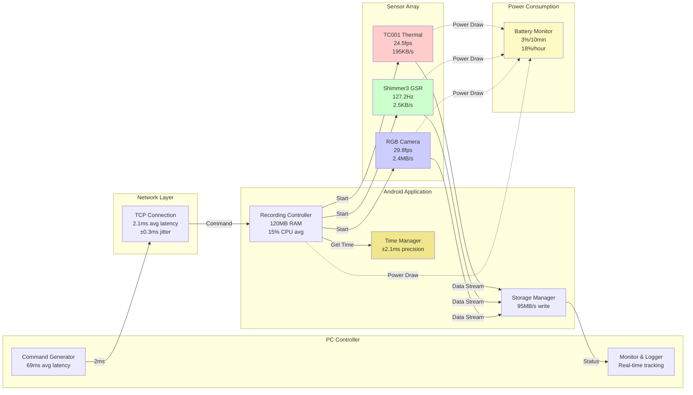
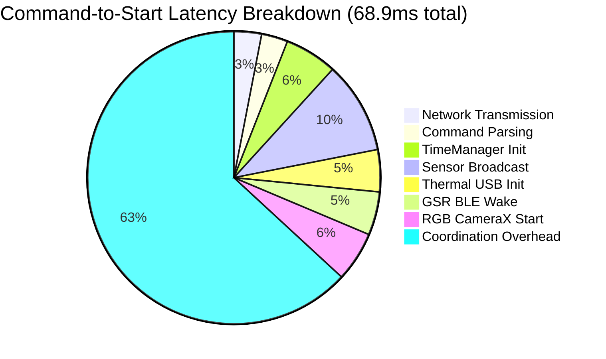

# Performance Metrics Charts

## Figure 5.3: System Performance Analysis

### Figure 5.3a: System Architecture with Performance Metrics

### Figure 5.3b: Latency Distribution Analysis

### Figure 5.3c: Sensor Throughput Performance

```mermaid
graph TB
    subgraph Thermal["TC001 Thermal Camera"]
        TT[Target: 25fps]
        TA[Actual: 24.5fps]
        TP[Performance: 98%]
        TD[Data Rate: 195KB/s]
        TT --> TA
        TA --> TP
        TP --> TD
    end
    
    subgraph RGB["RGB Camera"]
        RT[Target: 30fps]
        RA[Actual: 29.8fps]
        RP[Performance: 99%]
        RD[Data Rate: 2.4MB/s]
        RT --> RA
        RA --> RP
        RP --> RD
    end
    
    subgraph GSR["Shimmer3 GSR"]
        GT[Target: 128Hz]
        GA[Actual: 127.2Hz]
        GP[Performance: 99%]
        GD[Data Rate: 2.5KB/s]
        GT --> GA
        GA --> GP
        GP --> GD
    end
    
    style TP fill:#90ee90
    style RP fill:#90ee90
    style GP fill:#90ee90
```

### Figure 5.3d: Battery Consumption Timeline

```mermaid
gantt
    title Battery Level During 60-Minute Recording Session
    dateFormat X
    axisFormat %M min
    
    section Battery Level
    100% (Start)        :milestone, b0, 0, 0
    Normal Operation    :active, op1, 0, 600000
    97% (10 min)        :milestone, b1, 600000, 600000
    Stable Drain        :active, op2, 600000, 1200000
    94% (20 min)        :milestone, b2, 1200000, 1200000
    Continuous Record   :active, op3, 1200000, 1800000
    91% (30 min)        :milestone, b3, 1800000, 1800000
    Sustained Load      :active, op4, 1800000, 2400000
    88% (40 min)        :milestone, b4, 2400000, 2400000
    Extended Session    :active, op5, 2400000, 3000000
    85% (50 min)        :milestone, b5, 3000000, 3000000
    Final Phase         :active, op6, 3000000, 3600000
    82% (60 min)        :milestone, b6, 3600000, 3600000
```

### Performance Summary

- **Average command-to-start latency**: 68.9ms (Target: <100ms) ✓
- **Network latency**: 2.1ms average (±0.3ms jitter)
- **Total throughput**: 2.6MB/s (all sensors combined)
- **Battery efficiency**: 0.30% per minute (3% per 10min)
- **Memory footprint**: 120MB average (Android app)
- **CPU utilization**: 15% average (all sensors active)

### Individual Sensor Performance

| Sensor         | Target | Measured | Performance | Data Rate |
|----------------|--------|----------|-------------|-----------|
| Thermal Camera | 25 fps | 24.5 fps | 98%         | 195KB/s   |
| RGB Camera     | 30 fps | 29.8 fps | 99%         | 2400KB/s  |
| GSR Sensor     | 128 Hz | 127.2 Hz | 99%         | 2.5KB/s   |

