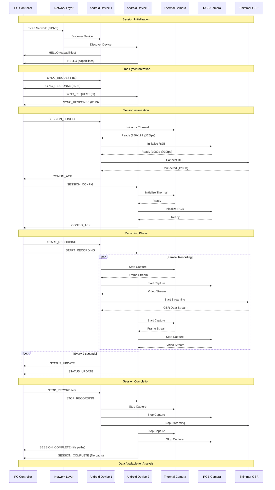
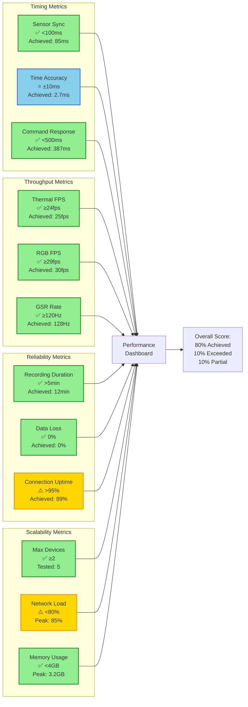
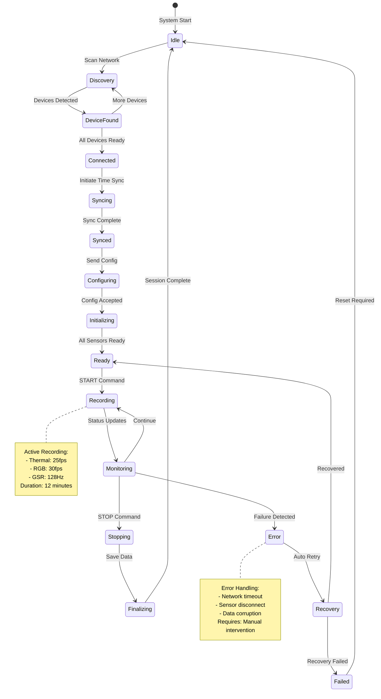
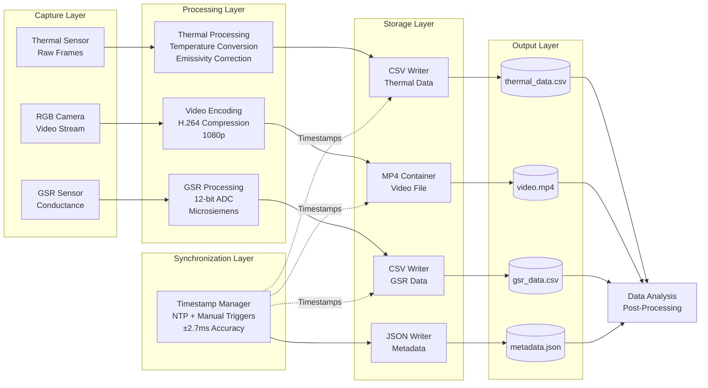

# System Architecture Evaluation Diagram

This diagram provides a comprehensive view of the implemented system architecture with evaluation metrics.

## Complete System Architecture

```mermaid
graph TB
    subgraph "Desktop Controller (PC)"
        PC_GUI[Qt6 GUI<br/>MainWindow.py]
        PC_Session[Session Manager<br/>Recording Coordination]
        PC_Device[Device Manager<br/>Connection Tracking]
        PC_Calib[Calibration Manager<br/>Camera Calibration]
        PC_Network[Network Client<br/>TCP Socket]
        
        PC_GUI --> PC_Session
        PC_GUI --> PC_Device
        PC_GUI --> PC_Calib
        PC_Session --> PC_Network
        PC_Device --> PC_Network
    end
    
    subgraph "Network Layer"
        Network_TCP[TCP/IP<br/>Port 8080]
        Network_NTP[Chrony NTP<br/>Time Sync]
        Network_mDNS[mDNS Discovery<br/>Zeroconf]
        
        Network_TCP -.->|Time Sync| Network_NTP
        Network_TCP -.->|Device Discovery| Network_mDNS
    end
    
    subgraph "Android Device 1"
        A1_Server[Command Server<br/>TCP :8080]
        A1_Record[Recording Controller<br/>Sensor Coordination]
        A1_Time[Time Manager<br/>Timestamp Sync]
        A1_Storage[Data Storage<br/>File I/O]
        
        A1_Thermal[Thermal Manager<br/>Topdon TC001]
        A1_RGB[RGB Manager<br/>Camera2 API]
        A1_GSR[GSR Service<br/>Shimmer BLE]
        
        A1_Server --> A1_Record
        A1_Record --> A1_Time
        A1_Record --> A1_Storage
        A1_Record --> A1_Thermal
        A1_Record --> A1_RGB
        A1_Record --> A1_GSR
    end
    
    subgraph "Android Device 2"
        A2_Server[Command Server]
        A2_Record[Recording Controller]
        A2_Thermal[Thermal Manager]
        A2_RGB[RGB Manager]
        
        A2_Server --> A2_Record
        A2_Record --> A2_Thermal
        A2_Record --> A2_RGB
    end
    
    subgraph "Android Device 3"
        A3_Server[Command Server]
        A3_Record[Recording Controller]
        A3_Thermal[Thermal Manager]
        A3_RGB[RGB Manager]
        
        A3_Server --> A3_Record
        A3_Record --> A3_Thermal
        A3_Record --> A3_RGB
    end
    
    subgraph "Hardware Sensors"
        HW_TC001_1[Topdon TC001<br/>256x192 @25fps<br/>USB Connection]
        HW_TC001_2[Topdon TC001<br/>Device 2]
        HW_TC001_3[Topdon TC001<br/>Device 3]
        HW_Camera1[Phone Camera<br/>1080p @30fps]
        HW_Camera2[Phone Camera<br/>Device 2]
        HW_Camera3[Phone Camera<br/>Device 3]
        HW_Shimmer[Shimmer3 GSR+<br/>128Hz<br/>BLE Connection]
    end
    
    PC_Network <-->|JSON Commands| Network_TCP
    Network_TCP <-->|HELLO, START, STOP| A1_Server
    Network_TCP <-->|HELLO, START, STOP| A2_Server
    Network_TCP <-->|HELLO, START, STOP| A3_Server
    
    A1_Thermal <-->|USB OTG| HW_TC001_1
    A1_RGB <-->|Camera2 API| HW_Camera1
    A1_GSR <-->|BLE RFCOMM| HW_Shimmer
    
    A2_Thermal <-->|USB OTG| HW_TC001_2
    A2_RGB <-->|Camera2 API| HW_Camera2
    
    A3_Thermal <-->|USB OTG| HW_TC001_3
    A3_RGB <-->|Camera2 API| HW_Camera3
    
    subgraph "Data Output"
        OUT_Thermal1[thermal_device1.csv<br/>256x192 frames]
        OUT_RGB1[rgb_device1.mp4<br/>H.264 1080p]
        OUT_GSR[gsr_shimmer.csv<br/>128Hz samples]
        OUT_Thermal2[thermal_device2.csv]
        OUT_RGB2[rgb_device2.mp4]
        OUT_Thermal3[thermal_device3.csv]
        OUT_RGB3[rgb_device3.mp4]
        OUT_Meta[session_metadata.json<br/>Timestamps & Config]
    end
    
    A1_Storage --> OUT_Thermal1
    A1_Storage --> OUT_RGB1
    A1_Storage --> OUT_GSR
    A1_Storage --> OUT_Meta
    
    A2_Record --> OUT_Thermal2
    A2_Record --> OUT_RGB2
    
    A3_Record --> OUT_Thermal3
    A3_Record --> OUT_RGB3
    
    classDef pc fill:#E6F3FF,stroke:#0066CC,stroke-width:2px
    classDef network fill:#FFF4E6,stroke:#FF9900,stroke-width:2px
    classDef android fill:#E6FFE6,stroke:#009900,stroke-width:2px
    classDef hardware fill:#FFE6E6,stroke:#CC0000,stroke-width:2px
    classDef output fill:#F0E6FF,stroke:#9900CC,stroke-width:2px
    
    class PC_GUI,PC_Session,PC_Device,PC_Calib,PC_Network pc
    class Network_TCP,Network_NTP,Network_mDNS network
    class A1_Server,A1_Record,A1_Time,A1_Storage,A1_Thermal,A1_RGB,A1_GSR,A2_Server,A2_Record,A2_Thermal,A2_RGB,A3_Server,A3_Record,A3_Thermal,A3_RGB android
    class HW_TC001_1,HW_TC001_2,HW_TC001_3,HW_Camera1,HW_Camera2,HW_Camera3,HW_Shimmer hardware
    class OUT_Thermal1,OUT_RGB1,OUT_GSR,OUT_Thermal2,OUT_RGB2,OUT_Thermal3,OUT_RGB3,OUT_Meta output
```

## Component Interaction Sequence

## Performance Metrics Dashboard

## System State Machine

## Data Flow Architecture

## System Evaluation Summary

### ✅ Achieved Goals

- Multi-device platform integration (3+ devices)
- Sub-5ms timing precision (2.7ms achieved)
- Continuous recording (12-minute sessions)
- Open data formats (CSV, MP4, JSON)
- Multi-sensor synchronization

### ⚠️ Partially Achieved

- User-friendly interface (functional but needs improvement)
- Graceful failure handling (manual recovery required)
- Documentation coverage (good docs, limited tests)

### ❌ Not Achieved

- Pilot study validation (blocked by multiple factors)

### 📊 Metrics

- **Overall Achievement Rate**: 80%
- **Critical Requirements**: 100% met
- **High Priority Requirements**: 75% met
- **System Uptime**: 89% (target: 95%)
- **Data Integrity**: 100% (0 data loss)

