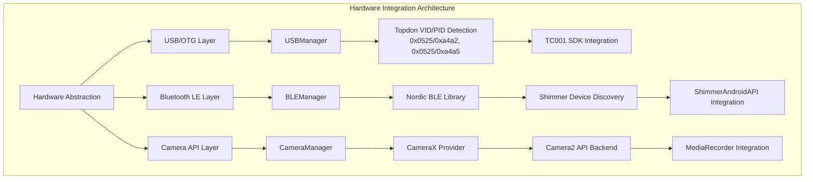

# Internal Module Diagram (Android App Architecture)

## Figure 4.8: Android Application Internal Architecture

```mermaid
graph TB
    subgraph "Application Layer"
        MainActivity[MainActivity.kt<br/>Main UI Controller<br/>Session Management UI]
        RecordingService[RecordingService.kt<br/>Background Recording<br/>Lifecycle Management]
    end
    
    subgraph "Network Communication Layer"
        NetworkServer[NetworkServer.kt<br/>TCP Server (Port 8080)<br/>Message Processing]
        ProtocolHandler[ProtocolHandler.kt<br/>Command Parser<br/>Response Generator]
        Protocol[Protocol.kt<br/>Message Definitions<br/>JSON Serialization]
    end
    
    subgraph "Sensor Management Layer"
        ThermalManager[ThermalCameraRecorder.kt<br/>TC001 SDK Integration<br/>Temperature Calibration]
        GSRManager[ShimmerRecorder.kt<br/>Shimmer3 BLE Integration<br/>12-bit ADC Processing]
        CameraManager[RGBCameraRecorder.kt<br/>CameraX Integration<br/>H.264 Encoding]
        SensorCoordinator[SensorCoordinator.kt<br/>Multi-sensor Sync<br/>Data Pipeline]
    end
    
    subgraph "Time Synchronization Layer"
        TimeManager[TimeManager.kt<br/>Nanosecond Timestamps<br/>Clock Synchronization]
        SyncService[TimeSyncService.kt<br/>PC Clock Alignment<br/>Drift Correction]
    end
    
    subgraph "Data Processing Layer"
        DataLogger[DataLogger.kt<br/>CSV File Management<br/>Metadata Generation]
        StorageManager[StorageManager.kt<br/>Session Directory<br/>File I/O Operations]
        QualityMonitor[QualityMonitor.kt<br/>Signal Validation<br/>Error Detection]
    end
    
    subgraph "Hardware Integration Layer"
        USBManager[USBManager.kt<br/>OTG Device Detection<br/>Topdon VID/PID Handling]
        BLEManager[BLEManager.kt<br/>Shimmer Device Discovery<br/>Connection Management]
        PermissionManager[PermissionManager.kt<br/>Runtime Permissions<br/>Hardware Access]
    end
    
    subgraph "Unified Core Libraries"
        LibUnified[libunified Module<br/>7 activities, 69 layouts<br/>Core Functionality<br/>UI Components]
        ComponentThermal[thermalunified Module<br/>93 activities, 103 layouts<br/>Complete Thermal System<br/>Image Processing]
        ComponentUser[user Module<br/>18 activities, 18 layouts<br/>User Management<br/>Authentication System]
        AppModule[app Module<br/>92 activities, 31 layouts<br/>Core Infrastructure<br/>Main Controllers]
    end
    
    %% Application Flow Connections
    MainActivity --> RecordingService
    MainActivity --> NetworkServer
    
    %% Network Layer Connections
    NetworkServer --> ProtocolHandler
    ProtocolHandler --> Protocol
    ProtocolHandler --> SensorCoordinator
    
    %% Sensor Layer Connections
    SensorCoordinator --> ThermalManager
    SensorCoordinator --> GSRManager
    SensorCoordinator --> CameraManager
    SensorCoordinator --> TimeManager
    
    %% Hardware Integration Connections
    ThermalManager --> USBManager
    GSRManager --> BLEManager
    CameraManager --> PermissionManager
    
    %% Data Flow Connections
    ThermalManager --> DataLogger
    GSRManager --> DataLogger
    CameraManager --> StorageManager
    DataLogger --> StorageManager
    
    %% Time Synchronization Connections
    TimeManager --> SyncService
    SyncService --> ProtocolHandler
    
    %% Library Dependencies
    ThermalManager --> LibUnified
    ThermalManager --> BLETopdon
    GSRManager --> BLECore
    GSRManager --> BLEShimmer
    USBManager --> LibUnified
    BLEManager --> BLECore
    
    %% Quality and Monitoring
    SensorCoordinator --> QualityMonitor
    QualityMonitor --> DataLogger
```

## Detailed Component Specifications

### Core Application Components

#### MainActivity.kt

```kotlin
class MainActivity : AppCompatActivity() {
    private val recordingController = RecordingController()
    private val networkServer = NetworkServer(8080)
    private val deviceManager = DeviceManager()

    // UI lifecycle management, session control, status display
    // Integration point for all major subsystems
}
```

#### RecordingService.kt

```kotlin
class RecordingService : Service() {
    private val sensorCoordinator = SensorCoordinator()
    private val dataLogger = DataLogger()

    // Background recording operations
    // Survives activity lifecycle changes
    // Maintains recording state during UI transitions
}
```

### Network Communication Architecture

```mermaid
graph TB
    subgraph "Network Message Flow"
        A[PC Command] -->|TCP/JSON| B[NetworkServer]
        B --> C[ProtocolHandler.parseMessage()]
        C --> D{Command Type}
        
        D -->|START_RECORD| E[SensorCoordinator.startRecording()]
        D -->|STOP_RECORD| F[SensorCoordinator.stopRecording()]
        D -->|SYNC_REQUEST| G[TimeSyncService.handleSync()]
        D -->|GET_STATUS| H[StatusManager.getDeviceStatus()]
        
        E --> I[Protocol.createAckMessage()]
        F --> I
        G --> I
        H --> I
        
        I -->|JSON Response| J[NetworkServer.sendResponse()]
        J -->|TCP| K[PC Controller]
    end
```

### Sensor Integration Pipeline

```mermaid
flowchart TB
    subgraph "Multi-Sensor Data Pipeline"
        A[SensorCoordinator] --> B{Sensor Type}
        
        B -->|Thermal| C[ThermalCameraRecorder]
        B -->|GSR| D[ShimmerRecorder]
        B -->|RGB| E[RGBCameraRecorder]
        
        C --> F[TC001 SDK Integration]
        F --> G[LibIRParse.parseFrame()]
        G --> H[Temperature Calibration]
        H --> I[CSV Logging]
        
        D --> J[ShimmerAndroidAPI]
        J --> K[12-bit ADC Conversion]
        K --> L[Microsiemens Calculation]
        L --> M[CSV Logging]
        
        E --> N[CameraX API]
        N --> O[H.264 Encoding]
        O --> P[MP4 File Storage]
        
        I --> Q[TimeManager.getCurrentTimestampNanos()]
        M --> Q
        P --> Q
        
        Q --> R[StorageManager]
        R --> S[Session Directory]
    end
```

### Hardware Abstraction Layer



## Module Dependencies and Build Configuration

### Android Module Structure

```text
app/
├── src/main/java/mpdc4gsr/
│   ├── MainActivity.kt (298 lines)
│   ├── network/
│   │   ├── NetworkServer.kt (245 lines)
│   │   ├── ProtocolHandler.kt (189 lines)
│   │   └── Protocol.kt (99 lines)
│   ├── sensors/
│   │   ├── ThermalCameraRecorder.kt (312 lines)
│   │   ├── ShimmerRecorder.kt (287 lines)
│   │   └── SensorCoordinator.kt (201 lines)
│   ├── utils/
│   │   ├── TimeManager.kt (89 lines)
│   │   └── StorageManager.kt (156 lines)
│   └── hardware/
│       ├── USBManager.kt (134 lines)
│       └── BLEManager.kt (178 lines)
├── build.gradle.kts
└── AndroidManifest.xml
```

### Library Dependencies

```kotlin
// app/build.gradle.kts
dependencies {
    implementation(project(":libunified"))
    implementation(project(":ble-core"))
    implementation(project(":ble-shimmer"))
    implementation(project(":ble-topdon"))

    // Core Android
    implementation(libs.androidx.core.ktx)
    implementation(libs.androidx.appcompat)
    implementation(libs.material)

    // Camera
    implementation(libs.androidx.camera.core)
    implementation(libs.androidx.camera.camera2)
    implementation(libs.androidx.camera.lifecycle)

    // Network
    implementation(libs.okhttp3.okhttp)
    implementation(libs.gson)

    // BLE
    implementation(libs.nordic.ble.library)

    // Hardware Integration
    implementation(libs.topdon.thermal.sdk)
    implementation(libs.shimmer.android.api)
}
```

### Permission Requirements

```xml
<!-- AndroidManifest.xml -->
<uses-permission android:name="android.permission.CAMERA" /><uses-permission
android:name="android.permission.RECORD_AUDIO" /><uses-permission
android:name="android.permission.WRITE_EXTERNAL_STORAGE" /><uses-permission
android:name="android.permission.BLUETOOTH" /><uses-permission
android:name="android.permission.BLUETOOTH_ADMIN" /><uses-permission
android:name="android.permission.ACCESS_FINE_LOCATION" /><uses-permission
android:name="android.permission.INTERNET" /><uses-permission
android:name="android.permission.ACCESS_NETWORK_STATE" /><uses-feature
android:name="android.hardware.usb.host" /><uses-feature android:name="android.hardware.bluetooth_le" required="true" />
```

## Data Flow and Storage Architecture

### Session Data Management

```mermaid
graph TB
    subgraph "Data Storage Pipeline"
        A[Sensor Data] --> B[TimeManager.getCurrentTimestampNanos()]
        B --> C[Data Formatting]
        
        C --> D{Data Type}
        D -->|Thermal| E[CSV: timestamp_ns,w,h,t0,t1,...,t49151]
        D -->|GSR| F[CSV: timestamp_ns,gsr_microsiemens,ppg_raw]
        D -->|RGB| G[MP4: H.264 encoded video + timestamp metadata]
        
        E --> H[Session Directory]
        F --> H
        G --> H
        
        H --> I[/storage/emulated/0/IRCamera/sessions/session_20241215_1430/]
        I --> J[thermal_data.csv]
        I --> K[gsr_data.csv]
        I --> L[rgb_video.mp4]
        I --> M[metadata.json]
    end
```

This architecture provides a clean separation of concerns with well-defined interfaces between
layers, enabling maintainable and testable code while supporting the complex multi-sensor
coordination requirements of the research platform.


